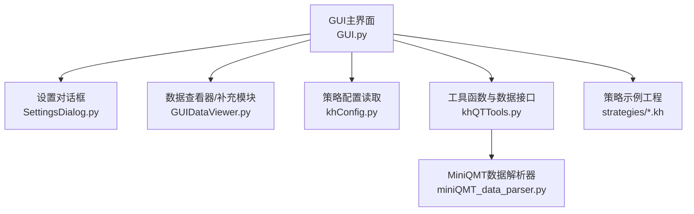
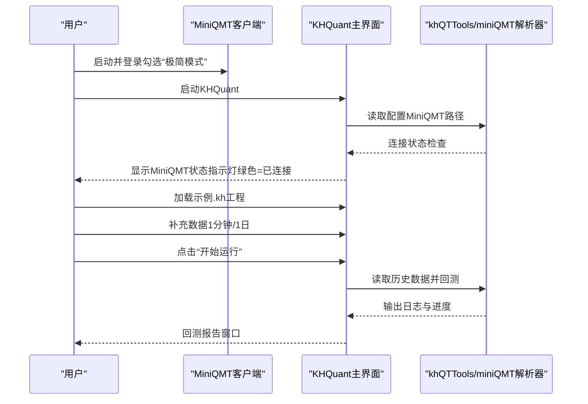
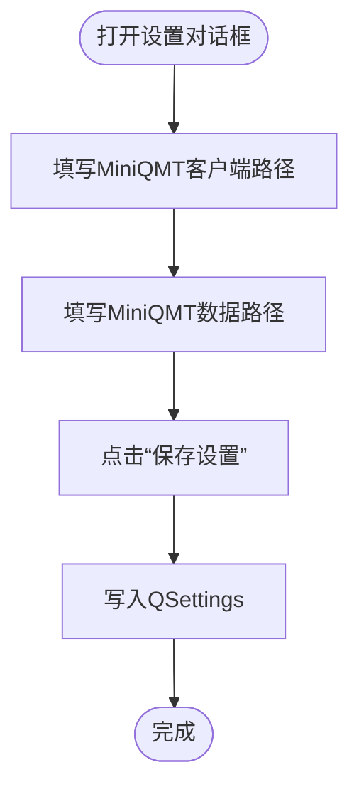
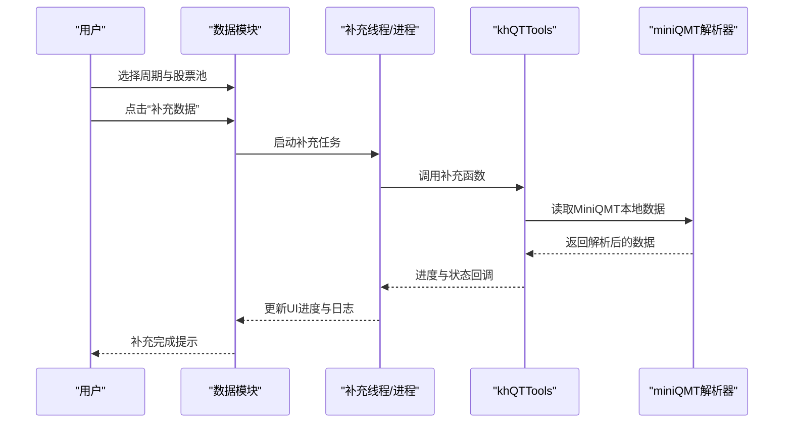
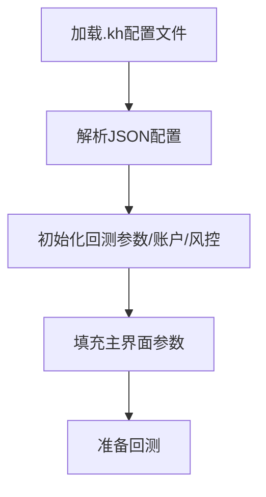
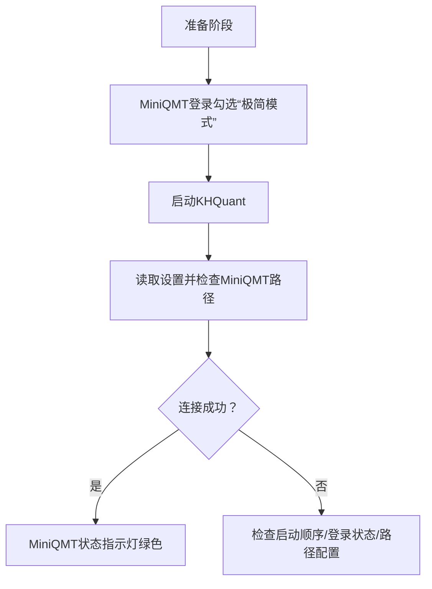
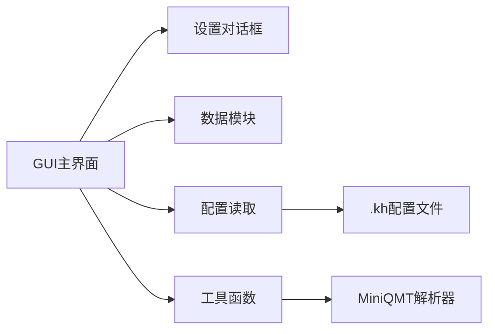

# 快速入门

<cite>
**本文引用的文件**
- [README.md](file://README.md)
- [GUI.py](file://GUI.py)
- [SettingsDialog.py](file://SettingsDialog.py)
- [GUIDataViewer.py](file://GUIDataViewer.py)
- [khQTTools.py](file://khQTTools.py)
- [miniQMT_data_parser.py](file://miniQMT_data_parser.py)
- [khConfig.py](file://khConfig.py)
- [RSI策略.kh](file://strategies/RSI策略.kh)
</cite>

## 目录
1. [简介](#简介)
2. [项目结构](#项目结构)
3. [核心组件](#核心组件)
4. [架构总览](#架构总览)
5. [详细组件分析](#详细组件分析)
6. [依赖关系分析](#依赖关系分析)
7. [性能与使用建议](#性能与使用建议)
8. [故障排查指南](#故障排查指南)
9. [结论](#结论)
10. [附录](#附录)

## 简介
本章节面向首次接触“看海量化交易系统（KHQuant）”的用户，依据官方文档第三章“安装与初次配置”和第四章“快速上手”的要求，提供从环境准备、安装部署、首次启动、加载示例工程、补充数据到启动回测的完整操作指南。文档严格基于仓库中的实现与说明，确保每一步都可追溯到实际代码与界面交互。

## 项目结构
- GUI主界面与工具模块集中在顶层文件中，包含设置对话框、数据查看器、策略配置读取等。
- 策略示例工程以.kh配置文件形式提供，便于快速加载与运行。
- 数据接口与MiniQMT集成通过khQTTools与miniQMT_data_parser实现。

图表来源
- [GUI.py](file://GUI.py#L1-L120)
- [SettingsDialog.py](file://SettingsDialog.py#L1-L120)
- [GUIDataViewer.py](file://GUIDataViewer.py#L1-L120)
- [khConfig.py](file://khConfig.py#L1-L60)
- [khQTTools.py](file://khQTTools.py#L1-L120)
- [miniQMT_data_parser.py](file://miniQMT_data_parser.py#L1-L60)
- [RSI策略.kh](file://strategies/RSI策略.kh#L1-L40)

章节来源
- [GUI.py](file://GUI.py#L1-L120)
- [README.md](file://README.md#L293-L438)

## 核心组件
- 运行环境与依赖
  - Windows 10或更高版本（64位）。
  - MiniQMT客户端（必须先安装并登录，且勾选“极简模式”）。
  - Microsoft Visual C++ Redistributable (x64)。
- 安装与首次启动
  - 从官网下载安装包，按提示完成安装。
  - 首次启动后打开“设置”，在“客户端设置”中配置MiniQMT客户端路径与MiniQMT数据路径。
  - 启动顺序：先启动MiniQMT并登录（勾选“极简模式”），再启动KHQuant。
- 工程加载与策略文件管理
  - 通过“加载配置”选择示例.kh工程文件。
  - 策略文件路径建议放置在用户策略目录，避免升级丢失。
- 数据补充
  - 在“数据”模块中补充所需周期（如1分钟、1日）的历史数据。
- 启动回测
  - 点击“开始运行”，观察右侧系统日志与底部状态栏进度。

章节来源
- [README.md](file://README.md#L293-L438)
- [README.md](file://README.md#L440-L626)
- [SettingsDialog.py](file://SettingsDialog.py#L345-L446)
- [GUIDataViewer.py](file://GUIDataViewer.py#L140-L220)

## 架构总览
KHQuant与MiniQMT的关系：KHQuant作为接口调用方，依赖MiniQMT提供的数据与交易接口。启动顺序必须先登录MiniQMT，再启动KHQuant。

图表来源
- [README.md](file://README.md#L391-L438)
- [SettingsDialog.py](file://SettingsDialog.py#L345-L446)
- [khQTTools.py](file://khQTTools.py#L1-L120)
- [miniQMT_data_parser.py](file://miniQMT_data_parser.py#L1-L60)

## 详细组件分析

### 组件A：设置对话框（配置MiniQMT路径）
- 功能：提供“miniQMT客户端路径”和“miniQMT数据路径”的配置入口，保存到QSettings。
- 关键点：
  - “miniQMT客户端路径”指向MiniQMT主程序文件（如XtItClient.exe）。
  - “miniQMT数据路径”指向userdata_mini目录。
  - 保存设置后，KHQuant后续读取配置并与MiniQMT建立连接。

图表来源
- [SettingsDialog.py](file://SettingsDialog.py#L345-L446)
- [SettingsDialog.py](file://SettingsDialog.py#L561-L620)

章节来源
- [SettingsDialog.py](file://SettingsDialog.py#L345-L446)
- [SettingsDialog.py](file://SettingsDialog.py#L561-L620)

### 组件B：数据补充模块（补充历史数据）
- 功能：在“数据”模块中，按周期（1分钟、1日等）补充所需的历史数据。
- 关键点：
  - 使用多进程+线程的补充流程，避免阻塞UI。
  - 支持进度回调与状态日志，便于观察补充过程。
  - 补充完成后，回测可直接读取本地数据。

图表来源
- [GUIDataViewer.py](file://GUIDataViewer.py#L140-L220)
- [GUIDataViewer.py](file://GUIDataViewer.py#L300-L420)
- [khQTTools.py](file://khQTTools.py#L1-L120)
- [miniQMT_data_parser.py](file://miniQMT_data_parser.py#L1-L120)

章节来源
- [GUIDataViewer.py](file://GUIDataViewer.py#L140-L220)
- [GUIDataViewer.py](file://GUIDataViewer.py#L300-L420)
- [khQTTools.py](file://khQTTools.py#L1-L120)
- [miniQMT_data_parser.py](file://miniQMT_data_parser.py#L1-L120)

### 组件C：策略配置读取（.kh文件）
- 功能：读取.kh配置文件，初始化回测参数、账户、风控等。
- 关键点：
  - 配置文件包含system、run_mode、account、strategy_file、backtest、data、market_callback、risk等字段。
  - KHQuant在加载.kh后，会自动填充主界面参数。

图表来源
- [khConfig.py](file://khConfig.py#L1-L60)
- [RSI策略.kh](file://strategies/RSI策略.kh#L1-L71)

章节来源
- [khConfig.py](file://khConfig.py#L1-L60)
- [RSI策略.kh](file://strategies/RSI策略.kh#L1-L71)

### 组件D：启动与连接流程
- 功能：确保MiniQMT先登录（勾选“极简模式”），再启动KHQuant；KHQuant通过设置中的MiniQMT路径连接MiniQMT。
- 关键点：
  - 状态指示灯显示连接状态（绿色=成功）。
  - 若连接失败，按提示检查启动顺序、登录状态与路径配置。

图表来源
- [README.md](file://README.md#L391-L438)
- [SettingsDialog.py](file://SettingsDialog.py#L345-L446)

章节来源
- [README.md](file://README.md#L391-L438)
- [SettingsDialog.py](file://SettingsDialog.py#L345-L446)

## 依赖关系分析
- GUI主界面依赖设置对话框、数据查看器、配置读取与工具函数。
- 工具函数与解析器依赖xtquant接口与MiniQMT本地数据。
- 配置读取依赖.kh文件的结构化字段。

图表来源
- [GUI.py](file://GUI.py#L1-L120)
- [SettingsDialog.py](file://SettingsDialog.py#L1-L120)
- [GUIDataViewer.py](file://GUIDataViewer.py#L1-L120)
- [khConfig.py](file://khConfig.py#L1-L60)
- [khQTTools.py](file://khQTTools.py#L1-L120)
- [miniQMT_data_parser.py](file://miniQMT_data_parser.py#L1-L60)
- [RSI策略.kh](file://strategies/RSI策略.kh#L1-L40)

章节来源
- [GUI.py](file://GUI.py#L1-L120)
- [khConfig.py](file://khConfig.py#L1-L60)
- [khQTTools.py](file://khQTTools.py#L1-L120)
- [miniQMT_data_parser.py](file://miniQMT_data_parser.py#L1-L120)
- [RSI策略.kh](file://strategies/RSI策略.kh#L1-L40)

## 性能与使用建议
- 策略文件与.kh配置建议保存在用户策略目录，避免升级覆盖。
- 数据补充采用多进程+线程，尽量在补全后再启动回测，减少回测时IO压力。
- 使用“延迟显示日志”可减少UI负担，提升运行性能。

章节来源
- [README.md](file://README.md#L440-L626)
- [SettingsDialog.py](file://SettingsDialog.py#L120-L205)

## 故障排查指南
- 连接失败（MiniQMT状态指示灯红色）
  - 检查MiniQMT是否已登录且勾选“极简模式”。
  - 检查设置中的“miniQMT客户端路径”和“miniQMT数据路径”是否正确。
  - 重启MiniQMT与KHQuant，按“先登录MiniQMT，再启动KHQuant”的顺序重新尝试。
- 数据补充无响应或卡住
  - 确认MiniQMT已登录并提供数据接口。
  - 检查补充线程的进度与日志，必要时终止并重试。
- 策略文件路径错误
  - 重新选择策略文件，建议使用用户策略目录，避免升级丢失。

章节来源
- [README.md](file://README.md#L410-L438)
- [SettingsDialog.py](file://SettingsDialog.py#L561-L620)
- [GUIDataViewer.py](file://GUIDataViewer.py#L300-L420)

## 结论
通过遵循“先启动MiniQMT并登录（勾选“极简模式”），再启动KHQuant”的流程，并在设置中正确配置MiniQMT路径，即可完成系统连接。加载示例.kh工程后，补充所需周期的历史数据，即可启动回测并查看报告。建议将策略文件与.kh配置保存在用户策略目录，避免升级丢失。

## 附录
- 操作截图指引
  - 首次启动设置界面截图：见“设置”对话框中“客户端设置”区域。
  - MiniQMT状态指示灯截图：见主界面右上角状态指示灯。
  - 数据补充模块截图：见“数据”模块的周期选择与补充按钮。
  - 回测报告窗口截图：见回测完成后弹出的报告窗口。
- 常见问题
  - 连接失败：检查MiniQMT登录状态与路径配置。
  - 数据不足：确认已补充所需周期数据。
  - 策略文件丢失：迁移到用户策略目录并备份。

章节来源
- [README.md](file://README.md#L410-L626)
- [SettingsDialog.py](file://SettingsDialog.py#L345-L446)
- [GUIDataViewer.py](file://GUIDataViewer.py#L140-L220)