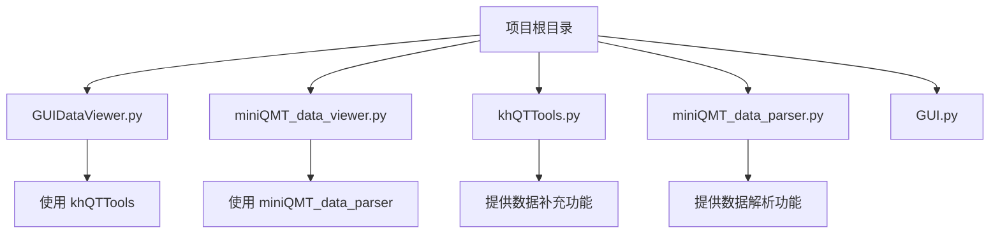
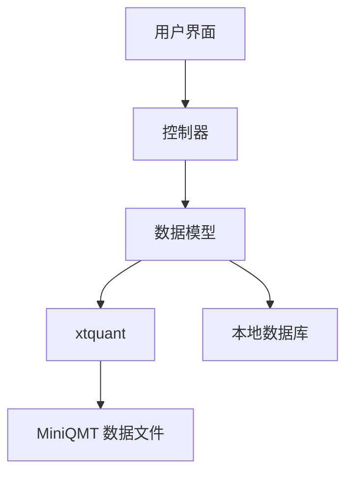
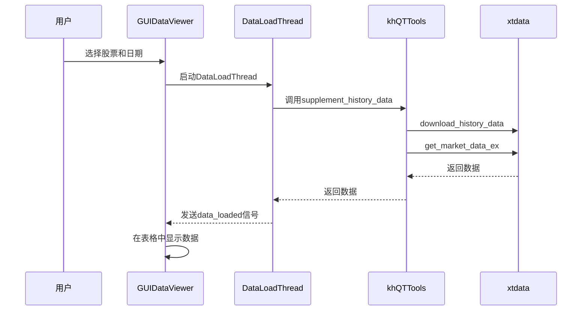
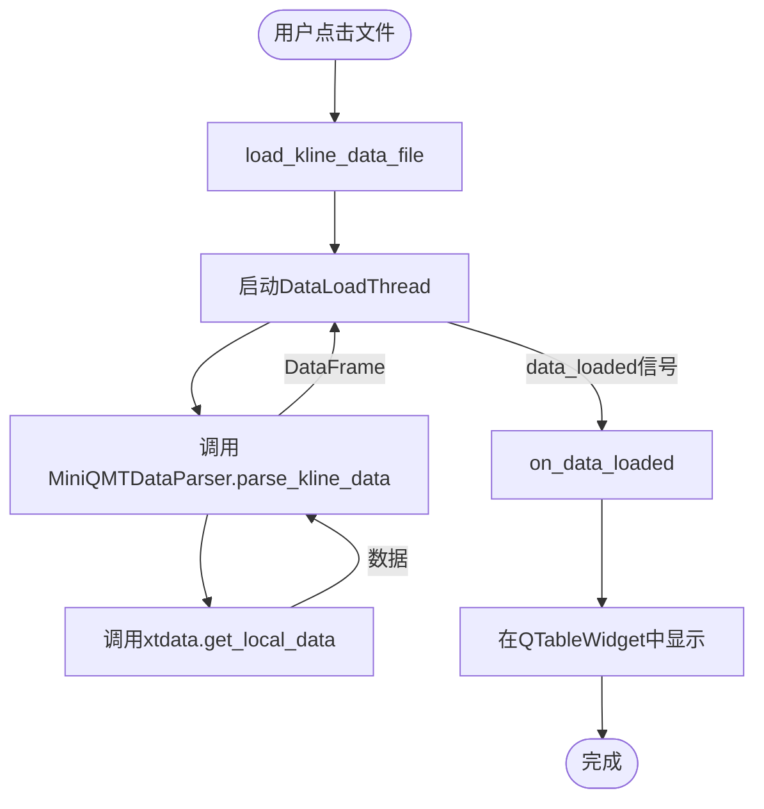
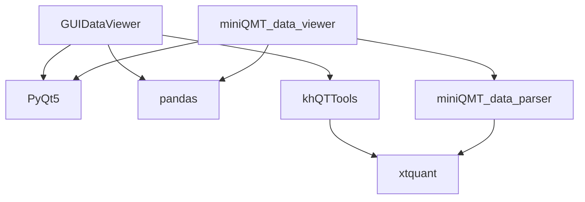

# 数据查看与管理

<cite>
**本文档引用的文件**   
- [GUIDataViewer.py](file://GUIDataViewer.py)
- [miniQMT_data_viewer.py](file://miniQMT_data_viewer.py)
- [khQTTools.py](file://khQTTools.py)
- [miniQMT_data_parser.py](file://miniQMT_data_parser.py)
</cite>

## 目录
1. [简介](#简介)
2. [项目结构](#项目结构)
3. [核心组件](#核心组件)
4. [架构概述](#架构概述)
5. [详细组件分析](#详细组件分析)
6. [依赖分析](#依赖分析)
7. [性能考虑](#性能考虑)
8. [故障排除指南](#故障排除指南)
9. [结论](#结论)

## 简介
`GUIDataViewer.py` 和 `miniQMT_data_viewer.py` 是看海量化交易系统中的两个核心数据可视化与管理工具。`GUIDataViewer.py` 提供了一个图形化界面，允许用户浏览已补充到本地数据库的股票历史数据，支持按代码、日期范围筛选，并可查看开盘价、收盘价、成交量等字段的原始记录。`miniQMT_data_viewer.py` 则专注于解析和展示 MiniQMT 客户端原始数据文件的结构，帮助高级用户验证数据源的准确性。这两个模块都使用 pandas 进行数据查询与格式化展示，并提供了丰富的界面操作功能，如导出选中数据为 CSV、检查数据连续性、识别异常值等，是进行数据质量审计的重要工具。

## 项目结构
项目结构清晰地组织了各个功能模块。`GUIDataViewer.py` 和 `miniQMT_data_viewer.py` 位于项目根目录下，与主程序 `GUI.py` 并列。`khQTTools.py` 提供了核心的数据补充和查询功能，而 `miniQMT_data_parser.py` 则专门负责解析 MiniQMT 的原始数据文件。这些工具共同构成了一个完整的本地数据管理与验证体系。

**Diagram sources**
- [GUIDataViewer.py](file://GUIDataViewer.py#L1-L50)
- [miniQMT_data_viewer.py](file://miniQMT_data_viewer.py#L1-L50)
- [khQTTools.py](file://khQTTools.py#L1-L50)
- [miniQMT_data_parser.py](file://miniQMT_data_parser.py#L1-L50)

**Section sources**
- [project_structure](file://project_structure#L1-L20)

## 核心组件
`GUIDataViewer.py` 的核心是 `GUIDataViewer` 类，它继承自 `QMainWindow`，构建了一个复杂的用户界面，包含数据补充工具、树形数据结构和表格数据展示区。`miniQMT_data_viewer.py` 的核心是 `MiniQMTDataViewer` 类，其设计与 `GUIDataViewer` 类似，但专注于展示 MiniQMT 的原始数据文件。两个模块都通过 `DataLoadThread` 线程在后台加载数据，避免阻塞主界面。

**Section sources**
- [GUIDataViewer.py](file://GUIDataViewer.py#L460-L489)
- [miniQMT_data_viewer.py](file://miniQMT_data_viewer.py#L245-L267)

## 架构概述
这两个工具的架构都遵循了典型的 MVC（Model-View-Controller）模式。`DataLoadThread` 和 `SupplementThread` 作为控制器，负责与 `khQTTools` 和 `miniQMT_data_parser` 模块（模型）交互，获取数据。`QTreeWidget` 和 `QTableWidget` 作为视图，负责展示数据。主窗口类作为协调者，连接视图和控制器。

**Diagram sources**
- [GUIDataViewer.py](file://GUIDataViewer.py#L460-L489)
- [miniQMT_data_viewer.py](file://miniQMT_data_viewer.py#L245-L267)
- [khQTTools.py](file://khQTTools.py#L2301-L2454)
- [miniQMT_data_parser.py](file://miniQMT_data_parser.py#L23-L200)

## 详细组件分析

### GUIDataViewer 分析
`GUIDataViewer` 模块的核心功能是数据补充和查询。用户可以通过勾选股票列表文件（如沪深A股、创业板等）来选择需要补充数据的股票。数据补充功能通过调用 `khQTTools.py` 中的 `supplement_history_data` 函数实现，该函数使用 `xtdata.download_history_data` 下载数据，并使用 `xtdata.get_market_data_ex` 获取数据。

#### 数据查询接口
数据查询接口通过 `load_kline_data_file` 方法实现。该方法接收文件路径、周期类型和股票代码，然后在后台线程中加载数据。

**Diagram sources**
- [GUIDataViewer.py](file://GUIDataViewer.py#L2451-L2472)
- [khQTTools.py](file://khQTTools.py#L2301-L2454)

**Section sources**
- [GUIDataViewer.py](file://GUIDataViewer.py#L2451-L2472)

### miniQMT_data_viewer 分析
`miniQMT_data_viewer` 模块的核心功能是解析和展示 MiniQMT 的原始数据文件。它通过 `miniQMT_data_parser.py` 中的 `MiniQMTDataParser` 类来解析数据。该类使用 `xtdata.get_local_data` 函数从本地文件中读取数据。

#### 数据解析流程
数据解析流程从用户点击树形结构中的一个数据文件开始，触发 `load_kline_data_file` 方法。

**Diagram sources**
- [miniQMT_data_viewer.py](file://miniQMT_data_viewer.py#L1734-L1773)
- [miniQMT_data_parser.py](file://miniQMT_data_parser.py#L30-L200)

**Section sources**
- [miniQMT_data_viewer.py](file://miniQMT_data_viewer.py#L1734-L1773)

## 依赖分析
`GUIDataViewer.py` 和 `miniQMT_data_viewer.py` 都依赖于 `PyQt5` 进行 GUI 构建，依赖于 `pandas` 进行数据处理，依赖于 `xtquant` 进行数据获取。`GUIDataViewer.py` 依赖于 `khQTTools.py` 提供数据补充功能，而 `miniQMT_data_viewer.py` 依赖于 `miniQMT_data_parser.py` 提供数据解析功能。`khQTTools.py` 和 `miniQMT_data_parser.py` 都直接调用 `xtquant` 库。

**Diagram sources**
- [GUIDataViewer.py](file://GUIDataViewer.py#L5-L12)
- [miniQMT_data_viewer.py](file://miniQMT_data_viewer.py#L5-L12)
- [khQTTools.py](file://khQTTools.py#L24)
- [miniQMT_data_parser.py](file://miniQMT_data_parser.py#L16)

## 性能考虑
为了保证界面的响应性，两个模块都使用了多线程技术。数据加载和补充操作都在后台线程中进行，避免阻塞主界面。此外，`GUIDataViewer.py` 还使用了多进程技术来执行数据补充，以避免 Python 的 GIL（全局解释器锁）限制，从而提高 CPU 密集型任务的性能。

## 故障排除指南
如果数据加载失败，首先检查 `miniQMT` 路径是否正确设置。其次，检查 `xtquant` 库是否安装正确。如果数据补充失败，检查网络连接是否正常。如果界面显示异常，尝试重启程序。

**Section sources**
- [miniQMT_data_viewer.py](file://miniQMT_data_viewer.py#L822-L829)
- [GUIDataViewer.py](file://GUIDataViewer.py#L158-L173)

## 结论
`GUIDataViewer.py` 和 `miniQMT_data_viewer.py` 是两个功能强大且互补的工具。前者侧重于数据的补充和管理，后者侧重于原始数据的解析和验证。它们共同为用户提供了一个完整的本地数据可视化与管理解决方案，是进行数据质量审计不可或缺的工具。