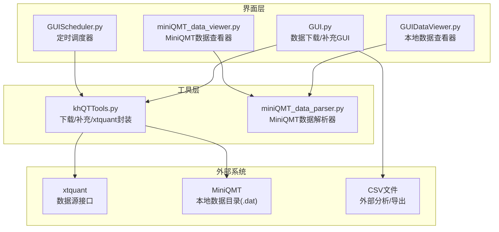
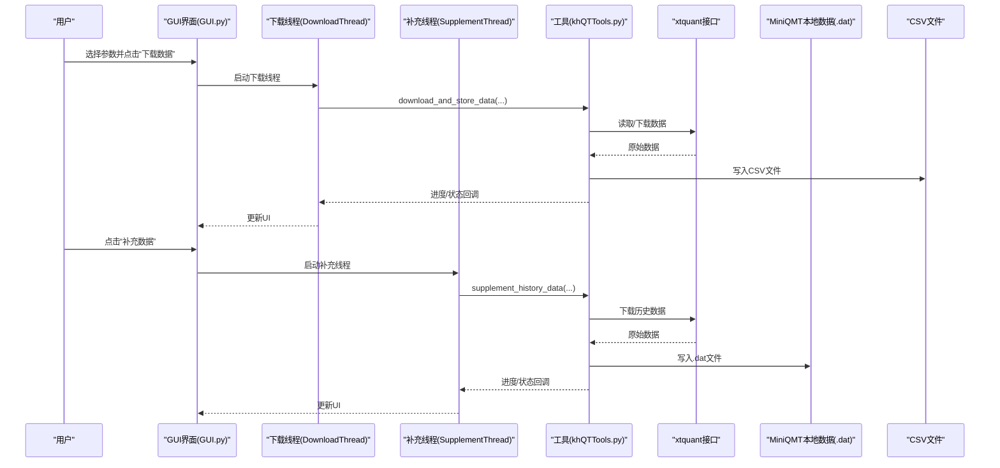
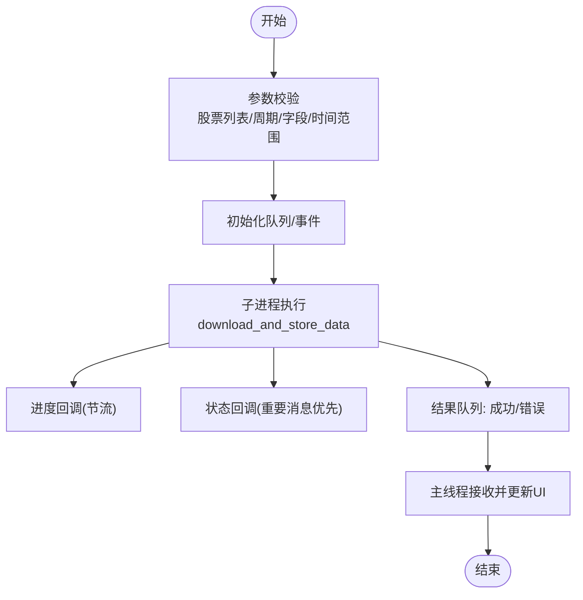
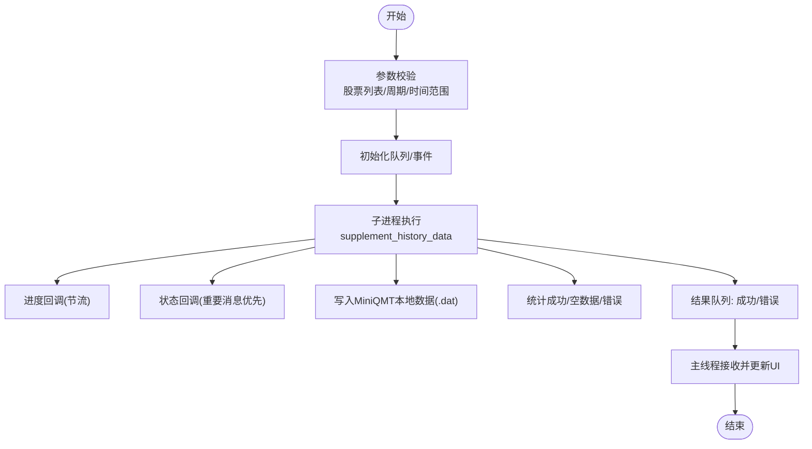
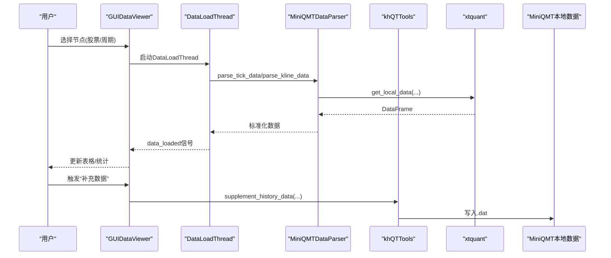
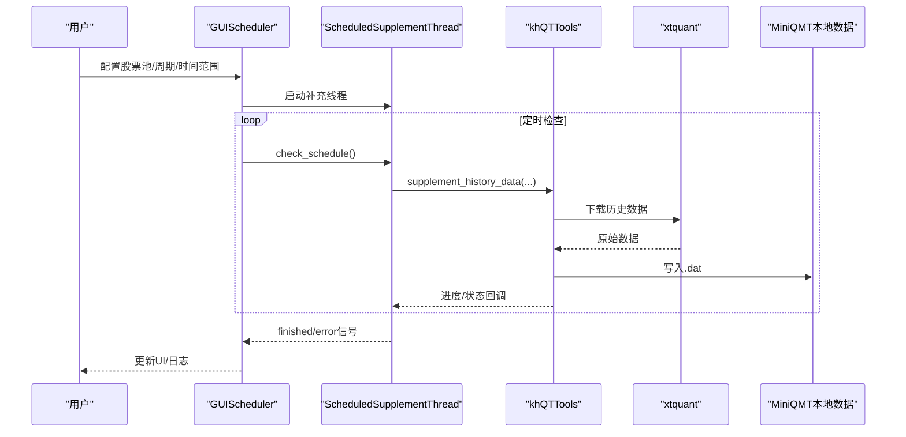
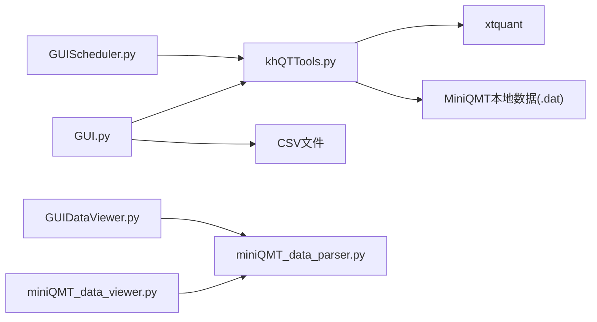

# 数据管理

<cite>
**本文引用的文件**
- [GUI.py](file://GUI.py)
- [GUIDataViewer.py](file://GUIDataViewer.py)
- [miniQMT_data_parser.py](file://miniQMT_data_parser.py)
- [miniQMT_data_viewer.py](file://miniQMT_data_viewer.py)
- [GUIScheduler.py](file://GUIScheduler.py)
- [khQTTools.py](file://khQTTools.py)
- [README.md](file://README.md)
</cite>

## 目录
1. [简介](#简介)
2. [项目结构](#项目结构)
3. [核心组件](#核心组件)
4. [架构总览](#架构总览)
5. [详细组件分析](#详细组件分析)
6. [依赖关系分析](#依赖关系分析)
7. [性能考量](#性能考量)
8. [故障排查指南](#故障排查指南)
9. [结论](#结论)
10. [附录](#附录)

## 简介
本章节围绕看海量化交易系统的“数据管理”能力，系统阐述两类数据操作的差异与用途：
- 数据下载：将数据导出为独立的CSV文件，便于外部工具分析与集成。
- 数据补充：将历史数据写入MiniQMT内部数据目录（.dat二进制），供回测引擎高速读取，提升回测效率与稳定性。

同时，本文将介绍通过GUI进行批量下载与预处理的流程，本地数据查看与管理工具（GUIDataViewer、miniQMT_data_viewer）如何帮助用户浏览、检查与导出数据，miniQMT数据解析器如何解析MiniQMT专有格式，以及定时任务调度器如何实现数据的自动化更新。最后给出确保回测前数据完整补充的最佳实践建议。

## 项目结构
围绕数据管理的关键文件与职责如下：
- GUI.py：提供图形界面，封装数据下载与数据补充的多进程/多线程执行流程，支持进度与状态回调、中断控制。
- GUIDataViewer.py：本地数据查看与管理工具，支持树形结构浏览、加载与显示数据、补充数据等。
- miniQMT_data_parser.py：解析MiniQMT本地数据（xtquant接口），支持tick/K线数据解析与字段标准化。
- miniQMT_data_viewer.py：MiniQMT数据查看器，支持树形浏览、加载与显示、补充数据、导出等。
- GUIScheduler.py：定时任务调度器，支持按配置周期自动执行数据补充任务。
- khQTTools.py：底层工具集，包含download_and_store_data（CSV下载）、supplement_history_data（数据补充）等核心函数，以及xtquant接口封装。



图表来源
- [GUI.py](file://GUI.py#L1-L300)
- [GUIDataViewer.py](file://GUIDataViewer.py#L1-L200)
- [miniQMT_data_viewer.py](file://miniQMT_data_viewer.py#L1-L200)
- [GUIScheduler.py](file://GUIScheduler.py#L1-L200)
- [khQTTools.py](file://khQTTools.py#L825-L1106)
- [miniQMT_data_parser.py](file://miniQMT_data_parser.py#L1-L120)

章节来源
- [GUI.py](file://GUI.py#L1-L300)
- [GUIDataViewer.py](file://GUIDataViewer.py#L1-L200)
- [miniQMT_data_viewer.py](file://miniQMT_data_viewer.py#L1-L200)
- [GUIScheduler.py](file://GUIScheduler.py#L1-L200)
- [khQTTools.py](file://khQTTools.py#L825-L1106)
- [miniQMT_data_parser.py](file://miniQMT_data_parser.py#L1-L120)

## 核心组件
- 数据下载（CSV导出）
  - 由GUI.py中的DownloadThread与download_and_store_data协作完成，支持多进程执行、进度/状态回调、中断控制、CSV命名规则与字段筛选。
- 数据补充（MiniQMT内部）
  - 由GUI.py中的SupplementThread与supplement_history_data协作完成，将数据写入MiniQMT本地数据目录（.dat），供回测引擎高速读取。
- 本地数据查看与管理
  - GUIDataViewer与miniQMT_data_viewer提供树形浏览、加载显示、补充数据、导出等能力。
- MiniQMT数据解析
  - miniQMT_data_parser通过xtquant接口解析tick/K线数据，标准化字段与时间格式。
- 定时任务调度
  - GUIScheduler通过ScheduledSupplementThread与定时器周期触发数据补充任务。

章节来源
- [GUI.py](file://GUI.py#L120-L260)
- [khQTTools.py](file://khQTTools.py#L825-L1106)
- [khQTTools.py](file://khQTTools.py#L2302-L2371)
- [GUIDataViewer.py](file://GUIDataViewer.py#L1-L200)
- [miniQMT_data_viewer.py](file://miniQMT_data_viewer.py#L1-L200)
- [miniQMT_data_parser.py](file://miniQMT_data_parser.py#L1-L120)
- [GUIScheduler.py](file://GUIScheduler.py#L1-L200)

## 架构总览
数据管理的整体流程如下：
- 用户在GUI界面选择股票范围、周期、字段、时间范围等参数；
- 点击“下载数据”触发download_and_store_data，将数据以CSV形式保存到指定目录；
- 点击“补充数据”触发supplement_history_data，将数据写入MiniQMT本地数据目录；
- 本地查看器通过miniQMT_data_parser读取xtquant本地数据，支持tick/K线解析与显示；
- 定时调度器按配置周期自动执行补充任务，保障数据新鲜度。



图表来源
- [GUI.py](file://GUI.py#L120-L260)
- [khQTTools.py](file://khQTTools.py#L825-L1106)
- [khQTTools.py](file://khQTTools.py#L2302-L2371)

章节来源
- [GUI.py](file://GUI.py#L120-L260)
- [khQTTools.py](file://khQTTools.py#L825-L1106)
- [khQTTools.py](file://khQTTools.py#L2302-L2371)

## 详细组件分析

### 数据下载（CSV导出）
- 功能要点
  - 多进程执行download_and_store_data，避免界面阻塞；
  - 支持tick/1m/5m/1d周期，字段可选；
  - 支持“全天/指定时间段”，并按约定命名规则生成CSV文件；
  - 进度与状态通过回调上报，支持中断。
- 关键流程
  - 参数校验与队列初始化；
  - 进度/状态回调节流；
  - 调用download_and_store_data；
  - 结果队列通知完成或错误。



图表来源
- [GUI.py](file://GUI.py#L120-L260)
- [khQTTools.py](file://khQTTools.py#L825-L1106)

章节来源
- [GUI.py](file://GUI.py#L120-L260)
- [khQTTools.py](file://khQTTools.py#L825-L1106)

### 数据补充（MiniQMT内部）
- 功能要点
  - 多进程执行supplement_history_data，写入MiniQMT本地数据目录（.dat）；
  - 支持增量下载，避免重复下载；
  - 统计成功/空数据/错误数量，汇总完成消息；
  - 支持中断与异常处理。
- 关键流程
  - 参数校验；
  - 进度/状态回调节流；
  - 调用xtquant.download_history_data；
  - 统计与汇总，发送完成信号。



图表来源
- [GUI.py](file://GUI.py#L380-L540)
- [khQTTools.py](file://khQTTools.py#L2302-L2371)

章节来源
- [GUI.py](file://GUI.py#L380-L540)
- [khQTTools.py](file://khQTTools.py#L2302-L2371)

### 本地数据查看与管理（GUIDataViewer）
- 功能要点
  - 树形结构浏览MiniQMT本地数据；
  - 支持加载tick/K线数据，解析与显示；
  - 支持数据补充（多进程）；
  - 支持加载对话框与进度提示。
- 关键流程
  - 构建树结构；
  - 选择节点触发DataLoadThread解析；
  - 解析成功后更新表格与统计信息；
  - 支持补充数据任务。



图表来源
- [GUIDataViewer.py](file://GUIDataViewer.py#L1-L200)
- [miniQMT_data_parser.py](file://miniQMT_data_parser.py#L1-L120)
- [khQTTools.py](file://khQTTools.py#L2302-L2371)

章节来源
- [GUIDataViewer.py](file://GUIDataViewer.py#L1-L200)
- [miniQMT_data_parser.py](file://miniQMT_data_parser.py#L1-L120)
- [khQTTools.py](file://khQTTools.py#L2302-L2371)

### MiniQMT数据解析器
- 功能要点
  - 通过xtquant.get_local_data读取本地tick/K线数据；
  - 解析时间戳、字段标准化（OHLC/量能/买卖盘口等）；
  - 支持不同数据格式与字段组合；
  - 错误处理与空数据返回。
- 关键流程
  - 从路径提取股票代码与日期；
  - 调用get_local_data获取DataFrame；
  - 标准化字段与时间格式；
  - 返回解析后的数据列表。

```mermaid
flowchart TD
Start(["开始"]) --> Extract["从路径提取股票代码/日期"]
Extract --> Call["调用xtquant.get_local_data"]
Call --> DF{"返回数据结构?"}
DF --> |字典(stock->DF)| Proc1["处理字典格式"]
DF --> |字典(field->DF)| Proc2["重组字段格式"]
Proc1 --> Normalize["标准化字段/时间"]
Proc2 --> Normalize
Normalize --> Out["返回解析数据"]
Out --> End(["结束"])
```

图表来源
- [miniQMT_data_parser.py](file://miniQMT_data_parser.py#L1-L120)
- [miniQMT_data_parser.py](file://miniQMT_data_parser.py#L549-L800)

章节来源
- [miniQMT_data_parser.py](file://miniQMT_data_parser.py#L1-L120)
- [miniQMT_data_parser.py](file://miniQMT_data_parser.py#L549-L800)

### 定时任务调度器
- 功能要点
  - 配置股票池、周期、时间范围；
  - 周期性触发数据补充任务；
  - 进度与状态通过回调上报；
  - 支持停止与异常处理。
- 关键流程
  - 初始化界面与样式；
  - 校验配置；
  - 启动ScheduledSupplementThread；
  - 定时器触发检查；
  - 执行补充任务并更新UI。



图表来源
- [GUIScheduler.py](file://GUIScheduler.py#L1-L200)
- [GUIScheduler.py](file://GUIScheduler.py#L19-L116)
- [GUIScheduler.py](file://GUIScheduler.py#L118-L242)
- [khQTTools.py](file://khQTTools.py#L2302-L2371)

章节来源
- [GUIScheduler.py](file://GUIScheduler.py#L1-L200)
- [GUIScheduler.py](file://GUIScheduler.py#L19-L116)
- [GUIScheduler.py](file://GUIScheduler.py#L118-L242)
- [khQTTools.py](file://khQTTools.py#L2302-L2371)

## 依赖关系分析
- GUI.py依赖khQTTools.py中的download_and_store_data与supplement_history_data，通过多进程与队列实现非阻塞执行与进度/状态上报。
- GUIDataViewer与miniQMT_data_viewer依赖miniQMT_data_parser解析xtquant本地数据。
- GUIScheduler依赖khQTTools的supplement_history_data，通过定时器周期触发补充任务。
- khQTTools.py封装xtquant接口，提供CSV下载与数据补充两大核心能力。



图表来源
- [GUI.py](file://GUI.py#L1-L300)
- [GUIDataViewer.py](file://GUIDataViewer.py#L1-L200)
- [miniQMT_data_viewer.py](file://miniQMT_data_viewer.py#L1-L200)
- [GUIScheduler.py](file://GUIScheduler.py#L1-L200)
- [khQTTools.py](file://khQTTools.py#L825-L1106)
- [miniQMT_data_parser.py](file://miniQMT_data_parser.py#L1-L120)

章节来源
- [GUI.py](file://GUI.py#L1-L300)
- [GUIDataViewer.py](file://GUIDataViewer.py#L1-L200)
- [miniQMT_data_viewer.py](file://miniQMT_data_viewer.py#L1-L200)
- [GUIScheduler.py](file://GUIScheduler.py#L1-L200)
- [khQTTools.py](file://khQTTools.py#L825-L1106)
- [miniQMT_data_parser.py](file://miniQMT_data_parser.py#L1-L120)

## 性能考量
- 多线程/多进程解耦
  - GUI与查看器均采用QThread与multiprocessing.Process，避免GIL限制与界面阻塞。
- 进度与状态节流
  - 通过时间间隔控制进度/状态回调频率，减少UI压力。
- 数据补充写入本地二进制
  - MiniQMT本地数据采用.dat二进制格式，回测读取更快，减少I/O开销。
- 定时调度
  - 通过schedule与定时器，按配置周期自动补充，降低人工维护成本。

章节来源
- [GUI.py](file://GUI.py#L120-L260)
- [GUIScheduler.py](file://GUIScheduler.py#L1-L200)
- [README.md](file://README.md#L1240-L1253)

## 故障排查指南
- 数据下载失败
  - 检查网络与xtquant可用性；确认参数（股票列表、周期、字段、时间范围）合法；查看状态栏日志与错误信号。
  - 参考路径：[GUI.py](file://GUI.py#L120-L260)、[khQTTools.py](file://khQTTools.py#L825-L1106)
- 数据补充失败
  - 检查MiniQMT路径与权限；确认股票列表有效；查看补充统计与错误消息。
  - 参考路径：[GUI.py](file://GUI.py#L380-L540)、[khQTTools.py](file://khQTTools.py#L2302-L2371)
- 本地查看器解析异常
  - 确认xtquant安装与可用；检查路径与文件格式；查看解析器日志。
  - 参考路径：[GUIDataViewer.py](file://GUIDataViewer.py#L1-L200)、[miniQMT_data_parser.py](file://miniQMT_data_parser.py#L1-L120)
- 定时任务未执行
  - 检查配置项（股票池/周期/时间范围）；确认定时器是否启动；查看日志与错误信号。
  - 参考路径：[GUIScheduler.py](file://GUIScheduler.py#L1-L200)

章节来源
- [GUI.py](file://GUI.py#L120-L260)
- [GUI.py](file://GUI.py#L380-L540)
- [GUIDataViewer.py](file://GUIDataViewer.py#L1-L200)
- [miniQMT_data_parser.py](file://miniQMT_data_parser.py#L1-L120)
- [GUIScheduler.py](file://GUIScheduler.py#L1-L200)
- [khQTTools.py](file://khQTTools.py#L825-L1106)
- [khQTTools.py](file://khQTTools.py#L2302-L2371)

## 结论
- 数据下载与数据补充分别面向“外部分析/导出”和“内部回测加速”的不同场景，二者互补。
- GUI与查看器通过多线程/多进程与回调机制，保证界面流畅与可观测性。
- 定时调度器可自动化维持数据新鲜度，降低维护成本。
- 为确保回测结果准确，应在回测前完成数据补充并验证数据完整性。

## 附录

### 数据下载与数据补充的区别
- 数据下载（CSV）
  - 输出为独立CSV文件，便于外部工具分析与集成。
  - 支持复权方式选择（前复权/后复权等）。
  - 文件命名规则明确，便于检索与管理。
- 数据补充（MiniQMT内部）
  - 直接写入MiniQMT本地数据目录（.dat），供回测引擎高速读取。
  - 不受通用存储路径影响，始终写入QMT安装路径下的userdata_mini\datadir。
  - 适合回测场景，避免重复下载与I/O瓶颈。

章节来源
- [README.md](file://README.md#L1193-L1208)
- [README.md](file://README.md#L1209-L1238)

### 通过GUI进行批量下载与预处理
- 步骤概览
  - 选择股票范围（预设板块/自选清单/自定义列表）；
  - 配置周期、字段、时间范围；
  - 点击“下载数据”，等待进度与状态更新；
  - 如需清洗，使用右侧“数据清洗”模块对CSV文件进行处理。
- 关键实现参考
  - [GUI.py](file://GUI.py#L2576-L2604)
  - [khQTTools.py](file://khQTTools.py#L825-L1106)

章节来源
- [GUI.py](file://GUI.py#L2576-L2604)
- [khQTTools.py](file://khQTTools.py#L825-L1106)

### 本地数据查看与管理工具
- GUIDataViewer
  - 树形浏览MiniQMT本地数据；
  - 支持加载tick/K线数据并显示；
  - 支持补充数据任务。
  - 参考：[GUIDataViewer.py](file://GUIDataViewer.py#L1-L200)
- miniQMT_data_viewer
  - 树形浏览、加载显示、补充数据、导出；
  - 参考：[miniQMT_data_viewer.py](file://miniQMT_data_viewer.py#L1-L200)

章节来源
- [GUIDataViewer.py](file://GUIDataViewer.py#L1-L200)
- [miniQMT_data_viewer.py](file://miniQMT_data_viewer.py#L1-L200)

### MiniQMT数据解析器
- 支持tick/K线解析，标准化字段与时间格式；
- 处理不同数据结构与字段组合；
- 错误处理与空数据返回。
- 参考：[miniQMT_data_parser.py](file://miniQMT_data_parser.py#L1-L120)

章节来源
- [miniQMT_data_parser.py](file://miniQMT_data_parser.py#L1-L120)

### 定时任务调度功能
- 配置股票池、周期、时间范围；
- 周期触发数据补充；
- 进度/状态回调与异常处理。
- 参考：[GUIScheduler.py](file://GUIScheduler.py#L1-L200)

章节来源
- [GUIScheduler.py](file://GUIScheduler.py#L1-L200)

### 确保回测前数据完整补充的最佳实践
- 在回测前至少执行一次“数据补充”，确保MiniQMT本地数据目录包含所需周期与时间范围的数据；
- 使用“数据补充”而非“数据下载”作为回测数据来源，避免重复下载与I/O开销；
- 定期启用“定时数据补充工具”，按配置周期自动更新；
- 若发现缺失或空数据，检查股票列表、时间范围与日志，必要时手动补充；
- 对于外部分析，使用“数据下载”导出CSV文件，结合复权方式满足分析需求。

章节来源
- [README.md](file://README.md#L1209-L1238)
- [GUIScheduler.py](file://GUIScheduler.py#L1-L200)
- [GUI.py](file://GUI.py#L380-L540)