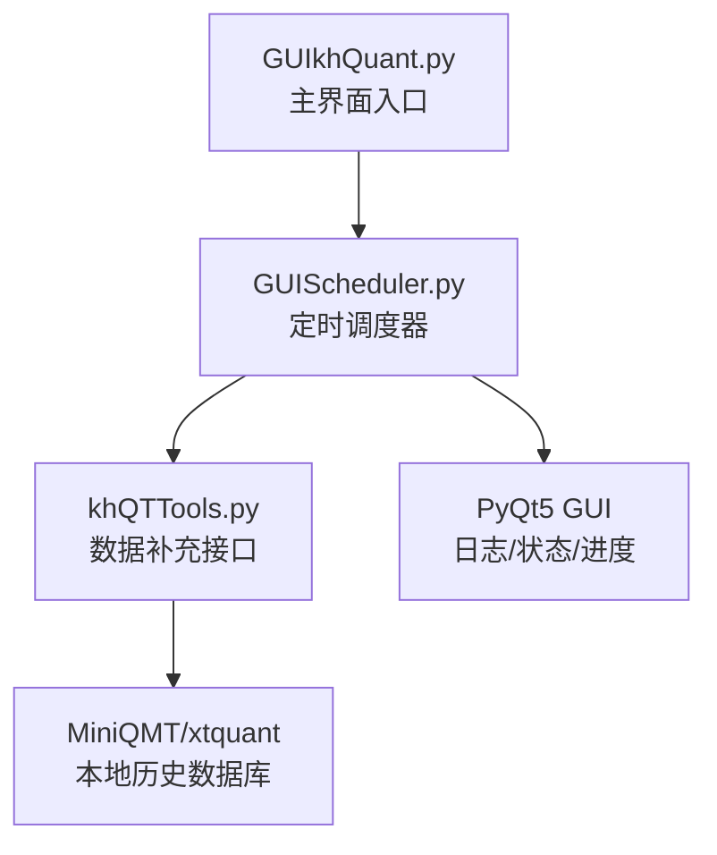
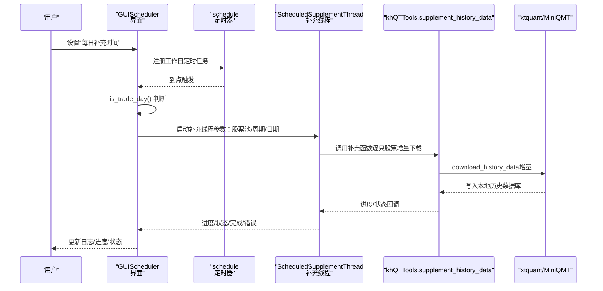
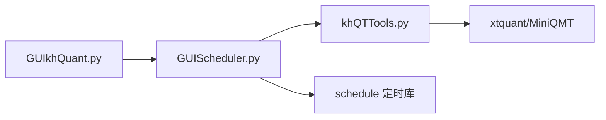

# 数据自动化

<cite>
**本文引用的文件**
- [GUIScheduler.py](file://GUIScheduler.py)
- [khQTTools.py](file://khQTTools.py)
- [GUIkhQuant.py](file://GUIkhQuant.py)
- [README.md](file://README.md)
</cite>

## 目录
1. [简介](#简介)
2. [项目结构](#项目结构)
3. [核心组件](#核心组件)
4. [架构总览](#架构总览)
5. [组件详细分析](#组件详细分析)
6. [依赖关系分析](#依赖关系分析)
7. [性能与可靠性](#性能与可靠性)
8. [故障排查与告警](#故障排查与告警)
9. [结论](#结论)
10. [附录](#附录)

## 简介
本文件面向“数据自动化”主题，系统性阐述 GUIScheduler.py 提供的定时任务调度能力，如何通过图形界面配置每日定时任务，自动补充本地 MiniQMT 历史数据库，确保回测与策略运行所需的行情数据保持最新。文档覆盖以下关键点：
- 基于 Python 定时任务框架（schedule）的每日定时触发机制
- 图形界面配置项：启用/禁用任务、设定执行时间、选择更新范围（全市场或自选股）
- 后台任务执行流程：如何调用 khQTTools 的数据补充接口，处理网络异常与中断，记录日志
- 监控与历史记录：状态栏、日志面板、下次运行时间显示
- 配置示例与最佳实践：避开交易高峰期、合理设置超时阈值、失败告警与重试策略

## 项目结构
GUIScheduler.py 作为独立的定时任务调度器，与 khQTTools.py 的数据补充接口紧密耦合，同时通过 GUIkhQuant.py 的入口在主界面中打开该工具。

图表来源
- [GUIkhQuant.py](file://GUIkhQuant.py#L4075-L4101)
- [GUIScheduler.py](file://GUIScheduler.py#L1410-L1517)
- [khQTTools.py](file://khQTTools.py#L2302-L2453)

章节来源
- [GUIkhQuant.py](file://GUIkhQuant.py#L4075-L4101)
- [GUIScheduler.py](file://GUIScheduler.py#L1410-L1517)
- [khQTTools.py](file://khQTTools.py#L2302-L2453)

## 核心组件
- 定时调度器（GUIScheduler）：提供图形界面配置、定时任务注册、执行状态监控与日志输出。
- 数据补充线程（ScheduledSupplementThread）：封装多进程数据补充任务，负责进度、状态与错误信号的传递。
- 数据补充函数（supplement_history_data）：调用 xtquant 接口，按周期与日期增量补充本地历史数据。
- 交易日判断工具（khQTTools.is_trade_day）：确保仅在交易日执行补充，避免无效请求。

章节来源
- [GUIScheduler.py](file://GUIScheduler.py#L118-L241)
- [GUIScheduler.py](file://GUIScheduler.py#L1410-L1517)
- [GUIScheduler.py](file://GUIScheduler.py#L1599-L1786)
- [khQTTools.py](file://khQTTools.py#L296-L376)

## 架构总览
定时任务的执行链路如下：
- 用户在界面设置“每日补充时间”，启动定时任务
- 每到设定时间，调度器检查是否为交易日，是则触发执行
- 执行时根据选择的股票池与周期，构造参数并启动数据补充线程
- 线程在独立进程中调用 supplement_history_data，逐只股票增量补充历史数据
- 进度与状态通过信号回调到主线程，更新 GUI 与日志

图表来源
- [GUIScheduler.py](file://GUIScheduler.py#L1410-L1517)
- [GUIScheduler.py](file://GUIScheduler.py#L1599-L1786)
- [khQTTools.py](file://khQTTools.py#L2302-L2453)

## 组件详细分析

### 定时调度器（GUIScheduler）
- 界面配置
  - 股票池选择：支持全市场板块（沪深A股、创业板、科创板、中证500、沪深300、上证50、常用指数、沪深转债）与自定义股票池
  - 周期类型：Tick、1分钟、5分钟、日线
  - 定时设置：每日补充时间（仅工作日触发）
  - 控制按钮：开始/停止定时补充、立即执行一次
- 定时机制
  - 使用 schedule 库注册工作日（周一至周五）的每日定时任务
  - 每秒检查一次 pending 任务，确保按时触发
  - 执行前再次调用 is_trade_day() 校验交易日
- 执行流程
  - 收集选中的股票池文件与周期列表
  - 为每个周期创建参数并启动补充线程
  - 依次处理多个周期，完成后汇总日志
- 监控与日志
  - 状态栏显示“状态/下次运行时间”
  - 日志面板滚动输出补充进度与状态
  - 进度条显示当前周期补充进度

章节来源
- [GUIScheduler.py](file://GUIScheduler.py#L745-L944)
- [GUIScheduler.py](file://GUIScheduler.py#L999-L1048)
- [GUIScheduler.py](file://GUIScheduler.py#L1049-L1102)
- [GUIScheduler.py](file://GUIScheduler.py#L1103-L1173)
- [GUIScheduler.py](file://GUIScheduler.py#L1410-L1517)
- [GUIScheduler.py](file://GUIScheduler.py#L1599-L1786)

### 数据补充线程（ScheduledSupplementThread）
- 多进程隔离
  - 在独立进程中运行补充逻辑，避免 GIL 限制与 GUI 干扰
  - 使用队列与 Event 实现进程间通信与中断控制
- 信号与回调
  - progress：进度百分比
  - status_update：状态消息
  - finished/error：完成/错误
- 中断与清理
  - stop() 通过 Event 标记中断，必要时终止/杀死子进程
  - 线程退出后清理对象引用

章节来源
- [GUIScheduler.py](file://GUIScheduler.py#L118-L241)
- [GUIScheduler.py](file://GUIScheduler.py#L1718-L1755)

### 数据补充接口（supplement_history_data）
- 输入参数
  - stock_files：股票池文件路径列表
  - field_list：要补充的字段（默认 open/high/low/close/volume/amount）
  - period_type：周期（tick/1m/5m/1d）
  - start_date/end_date：日期范围（YYYYMMDD）
  - dividend_type/time_range：复权方式与交易时段
  - progress_callback/log_callback/check_interrupt：进度/日志/中断回调
- 执行逻辑
  - 读取股票池文件，逐只股票调用 xtdata.download_history_data（增量）
  - 通过 xtdata.get_market_data_ex 获取补充后的数据，统计行数/列数与时间跨度
  - 通过回调输出详细日志，支持中断
- 多进程保护
  - 在子进程中设置 QT_QPA_PLATFORM=offscreen，避免意外启动 GUI

章节来源
- [khQTTools.py](file://khQTTools.py#L2302-L2453)

### 交易日判断（khQTTools.is_trade_day）
- 基于节假日库与周末判断，支持多种日期格式
- 用于定时任务与立即执行时的日期合法性校验

章节来源
- [khQTTools.py](file://khQTTools.py#L296-L376)

### 界面入口（GUIkhQuant.open_scheduler）
- 主界面工具栏中打开“数据定时补充模块”，最大化显示
- 若窗口已存在则激活，否则新建并绑定关闭事件清理引用

章节来源
- [GUIkhQuant.py](file://GUIkhQuant.py#L4075-L4101)

## 依赖关系分析
- GUIScheduler 依赖 khQTTools 的数据补充接口与交易日判断
- GUIScheduler 依赖 schedule 库进行定时任务管理
- khQTTools 依赖 xtquant/MiniQMT 进行数据下载与本地数据库写入
- GUIkhQuant 作为入口，负责打开 GUIScheduler 窗口

图表来源
- [GUIkhQuant.py](file://GUIkhQuant.py#L4075-L4101)
- [GUIScheduler.py](file://GUIScheduler.py#L1410-L1517)
- [khQTTools.py](file://khQTTools.py#L2302-L2453)

章节来源
- [GUIkhQuant.py](file://GUIkhQuant.py#L4075-L4101)
- [GUIScheduler.py](file://GUIScheduler.py#L1410-L1517)
- [khQTTools.py](file://khQTTools.py#L2302-L2453)

## 性能与可靠性
- 多进程执行：补充线程在独立进程中运行，避免阻塞 GUI，提升吞吐
- 进度与日志节流：对进度与状态回调设置最小更新间隔，降低 UI 压力
- 交易日过滤：仅在交易日执行，避免无效请求与空数据
- 中断与清理：stop() 支持优雅终止，必要时强制终止并清理资源
- 日志聚合：统一输出到日志面板与控制台，便于审计与排障

章节来源
- [GUIScheduler.py](file://GUIScheduler.py#L118-L241)
- [GUIScheduler.py](file://GUIScheduler.py#L1599-L1786)
- [khQTTools.py](file://khQTTools.py#L2302-L2453)

## 故障排查与告警
- 常见问题
  - 未选择股票池或周期：启动定时任务前会弹窗提示
  - 非交易日：定时任务会跳过执行并在日志中标注
  - 网络异常/中断：补充线程会捕获异常并通过 error 信号上报
  - 子进程异常退出：线程监控到退出码非 0 会发出错误提示
- 建议排查步骤
  - 检查 MiniQMT 客户端是否已登录并处于运行状态
  - 查看日志面板中的详细错误信息与时间戳
  - 确认“每日补充时间”设置在交易时间段之外，避免与交易高峰冲突
  - 如需立即执行，使用“立即执行一次”，系统会自动选择最近交易日
- 告警与通知
  - 日志面板滚动输出关键状态与错误
  - 状态栏显示“状态/下次运行时间”，便于监控
  - 窗口关闭时如定时任务正在运行，会弹窗确认退出

章节来源
- [GUIScheduler.py](file://GUIScheduler.py#L1489-L1517)
- [GUIScheduler.py](file://GUIScheduler.py#L1518-L1540)
- [GUIScheduler.py](file://GUIScheduler.py#L1767-L1786)
- [GUIScheduler.py](file://GUIScheduler.py#L1807-L1824)

## 结论
GUIScheduler.py 通过简洁的图形界面与可靠的后台执行机制，实现了“每日定时补充本地历史数据”的自动化。其核心优势包括：
- 易用的配置界面：一键启用/禁用、设定时间、选择范围
- 稳健的任务执行：多进程隔离、中断控制、日志可观测
- 与 MiniQMT/xtquant 的无缝集成：增量下载、本地数据库写入
- 完善的监控与告警：状态栏、日志面板、下次运行时间

## 附录

### 配置示例与最佳实践
- 配置示例
  - 股票池：沪深A股 + 自定义股票池
  - 周期：日线
  - 每日补充时间：22:30（避开交易高峰）
- 最佳实践
  - 避开交易高峰期（9:30-11:30、13:00-15:00）运行定时任务
  - 设置合理的超时阈值：在补充函数中可根据网络状况适当放宽等待时间
  - 失败告警：关注日志面板中的错误信息，必要时人工干预或调整参数
  - 周期选择：回测策略需要日线与分钟线时，建议分批执行或按需补充

章节来源
- [GUIScheduler.py](file://GUIScheduler.py#L1410-L1517)
- [README.md](file://README.md#L1209-L1225)