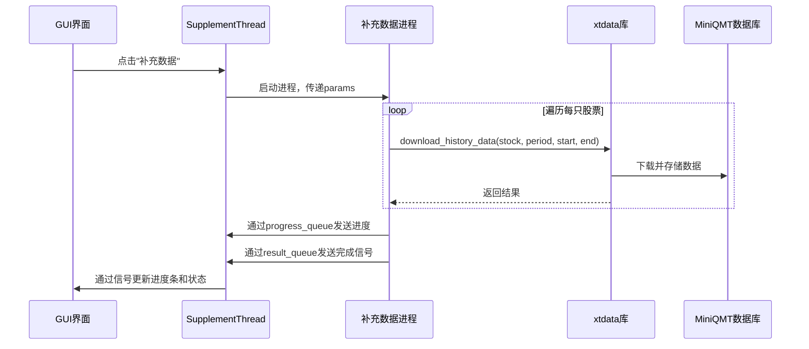

# 数据补充与下载

<cite>
**本文档引用的文件**
- [GUI.py](file://GUI.py)
- [GUIplotLoadData.py](file://GUIplotLoadData.py)
- [khQTTools.py](file://khQTTools.py)
- [README.md](file://README.md)
</cite>

## 目录
1. [引言](#引言)
2. [核心区别与使用场景](#核心区别与使用场景)
3. [用户交互路径：通过GUI触发数据补充](#用户交互路径通过gui触发数据补充)
4. [数据请求的封装与处理](#数据请求的封装与处理)
5. [异常处理与进度反馈](#异常处理与进度反馈)
6. [数据完整性验证](#数据完整性验证)
7. [常见问题排查](#常见问题排查)

## 引言

看海量化系统为用户提供了一套完整的数据管理方案，其中“数据补充”与“数据下载”是两个核心但功能迥异的操作。理解它们的区别对于高效使用系统进行回测和外部分析至关重要。本文档旨在深入剖析这两项功能，详细说明其工作原理、使用场景及操作流程。

**Section sources**
- [README.md](file://README.md#L565-L569)

## 核心区别与使用场景

“数据补充”与“数据下载”虽然都涉及从数据源获取历史K线数据，但它们的设计目标、数据流向和最终用途完全不同。

**数据补充 (Data Supplement)** 的核心目标是为**系统内部的回测引擎**做准备。它通过调用 `xtquant` 库的 `download_history_data` 函数，将指定的股票历史数据预先加载并存储到 MiniQMT 客户端的本地数据库中。当进行回测时，策略引擎会通过 `get_market_data_ex` 或 `get_local_data` 等高速接口从这个本地数据库读取数据。这种方式避免了在回测过程中因网络延迟或实时请求而导致的性能瓶颈和结果偏差，确保了回测的高效性和可重复性。简而言之，数据补充是为回测“预热”本地数据库。

**数据下载 (Data Download)** 的核心目标是为**系统外部的分析工具**提供数据。它将指定股票的历史K线数据以独立的 `.csv` 文件形式，从 MiniQMT 客户端下载并保存到用户指定的本地文件夹中。这些CSV文件是独立的、可移植的数据文件，用户可以将其导入 Excel、Python、R 或其他第三方数据分析软件中，进行更深入的统计建模、可视化或与看海量化系统无关的其他研究。

| 特性 | 数据补充 | 数据下载 |
| :--- | :--- | :--- |
| **主要目的** | 为本地回测引擎准备数据 | 为外部工具导出数据 |
| **数据存储位置** | MiniQMT客户端的内部数据库 | 用户指定的本地文件夹 |
| **数据格式** | 内部二进制/专有格式 | 标准CSV文件 |
| **主要用途** | 确保回测时数据可快速访问 | 供外部分析或第三方工具使用 |
| **调用的底层函数** | `xtdata.download_history_data` | `xtdata.get_market_data_ex` / `xtdata.get_local_data` |
| **触发方式** | 通过GUI的“数据”模块 | 通过GUI的“数据”模块 |

**Section sources**
- [README.md](file://README.md#L565-L569)

## 用户交互路径：通过GUI触发数据补充

用户通过 `GUI.py` 中的图形界面来触发数据补充流程。具体路径如下：

1.  **打开数据中心**：用户启动看海量化系统，确保 MiniQMT 已登录。在主界面的顶部工具栏，点击“数据”按钮，打开“数据中心”模块。
2.  **选择股票池**：在数据中心的“股票列表”区域，用户可以通过多种方式选择股票：
    *   **常用指数**：勾选“沪深300”、“中证500”等主要指数，系统会自动获取其成分股。
    *   **自选清单**：在文本框中输入股票代码（如 `002945.SZ`），并点击“勾选”按钮。
    *   **手动管理**：在下方的表格中直接添加或删除股票代码。
3.  **设置时间范围**：在“日期范围”部分，用户通过 `QDateEdit` 组件选择数据的“开始日期”和“结束日期”。
4.  **选择数据频率**：在“周期类型”部分，用户勾选所需的数据频率，如“1分钟”、“5分钟”或“1日”。
5.  **启动补充**：配置好所有参数后，用户点击“补充数据”按钮。此操作会触发 `GUI.py` 中定义的 `supplement_data` 方法。

```mermaid
flowchart TD
A[用户点击"数据"按钮] --> B[打开数据中心]
B --> C[选择股票池]
C --> D[设置时间范围]
D --> E[选择数据频率]
E --> F[点击"补充数据"按钮]
F --> G[触发supplement_data方法]
G --> H[启动SupplementThread线程]
H --> I[调用supplement_history_data]
I --> J[数据存入MiniQMT本地数据库]
```

**Diagram sources**
- [GUI.py](file://GUI.py#L380-L535)
- [GUI.py](file://GUI.py#L544-L656)

**Section sources**
- [GUI.py](file://GUI.py#L380-L656)
- [README.md](file://README.md#L543-L555)

## 数据请求的封装与处理

当用户点击“补充数据”后，系统会启动一个名为 `SupplementThread` 的多线程进程来处理请求，以避免阻塞主GUI界面。

1.  **参数收集**：`GUI.py` 中的 `supplement_data` 方法会收集用户在界面上设置的所有参数，包括 `stock_files` (股票代码列表)、`field_list` (字段列表)、`period_type` (周期类型)、`start_date` 和 `end_date` (日期范围)等，并将它们打包成一个字典 `params`。
2.  **线程启动**：`SupplementThread` 线程被创建并启动，它接收 `params` 作为参数。
3.  **多进程执行**：为了进一步提升性能并避免Python的GIL限制，`SupplementThread` 会创建一个独立的 `multiprocessing.Process`。该进程的目标函数是 `supplement_data_worker`，它会接收 `params` 以及用于进程间通信的 `progress_queue` 和 `result_queue`。
4.  **核心处理**：在 `supplement_data_worker` 进程中，会调用 `khQTTools.py` 中的 `supplement_history_data` 函数。该函数会遍历 `params['stock_files']` 中的每一只股票，调用 `xtdata.download_history_data` 函数，将指定周期、指定时间范围的历史数据下载到 MiniQMT 的本地数据库中。



**Diagram sources**
- [GUI.py](file://GUI.py#L380-L656)
- [khQTTools.py](file://khQTTools.py#L1643-L1664)

**Section sources**
- [GUI.py](file://GUI.py#L380-L656)
- [khQTTools.py](file://khQTTools.py#L1643-L1664)

## 异常处理与进度反馈

系统在数据补充过程中实现了完善的异常处理和实时进度反馈机制。

*   **异常处理**：
    *   在 `supplement_data_worker` 进程中，所有操作都被 `try...except` 块包裹。如果在下载或处理过程中发生任何异常（如网络错误、数据为空等），会捕获异常并将其通过 `result_queue` 发送回主线程。
    *   主线程中的 `SupplementThread` 会监听 `result_queue`，一旦收到错误信号，就会通过 `error` 信号通知GUI，弹出错误对话框提示用户。
    *   用户可以随时点击“停止”按钮，这会设置一个 `stop_event`，`supplement_data_worker` 进程会定期检查该事件，一旦发现被设置，就会抛出 `InterruptedError` 异常，优雅地终止下载。

*   **进度反馈**：
    *   `supplement_data_worker` 进程会通过 `progress_callback` 函数定期计算并发送当前的完成百分比。
    *   该回调函数会将进度值放入 `progress_queue`。
    *   `SupplementThread` 线程会监听 `progress_queue`，并发出 `progress` 信号。
    *   GUI界面接收到 `progress` 信号后，会更新进度条的显示，让用户实时了解任务的执行进度。

**Section sources**
- [GUI.py](file://GUI.py#L380-L656)
- [GUI.py](file://GUI.py#L210-L317)

## 数据完整性验证

在回测开始前，验证数据补充的完整性至关重要。系统本身不提供自动化的数据完整性校验功能，因此需要用户手动验证：

1.  **检查日志**：在“系统日志”面板中，仔细查看“补充数据”操作的输出。成功的日志会显示“补充 XXX 数据成功”，而失败或数据为空的股票会显示“补充 XXX 数据成功，但数据为空”或“补充 XXX 数据时出错”。这是最直接的验证方式。
2.  **检查回测结果**：运行回测后，如果回测报告中的交易记录异常稀少或完全为空，这很可能是由于关键数据缺失导致的。应返回数据中心，检查相关股票的数据补充状态。
3.  **检查数据文件**：虽然“数据补充”不直接生成CSV文件，但“数据下载”功能会。用户可以使用“数据下载”功能，将相同股票、相同周期的数据导出为CSV文件，然后用Excel或文本编辑器打开，直观地检查数据的起止日期、行数和内容是否完整。

**Section sources**
- [README.md](file://README.md#L532-L542)

## 常见问题排查

*   **问题：数据补充后，回测结果不准确或没有交易。**
    *   **排查方法**：首先检查“系统日志”。如果日志中出现“数据为空”的提示，说明该股票在指定时间段内没有数据。这可能是因为该股票在该时间段内停牌或上市时间晚于起始日期。尝试调整时间范围或更换股票。

*   **问题：数据补充失败，提示“无法导入数据补充模块”或“下载进程异常退出”。**
    *   **排查方法**：这通常是由于Python环境或依赖库问题导致的。首先确认 `khQTTools.py` 文件是否存在且路径正确。其次，检查 `xtquant` 库是否已正确安装。可以尝试重启看海量化系统和 MiniQMT 客户端。

*   **问题：进度条卡住或长时间无响应。**
    *   **排查方法**：网络连接不稳定或数据量过大可能导致此问题。可以尝试点击“停止”按钮，然后分批补充数据（例如，一次只补充10只股票）。同时，检查网络连接是否正常。

*   **问题：下载的CSV文件内容为空。**
    *   **排查方法**：这与“数据补充”失败的原因类似。检查日志中是否有“数据为空”的记录。此外，确认选择的“时间段”是否正确，例如，为日线数据选择了“09:30-11:30”这样的分钟级时间段，会导致数据被过滤为空。

**Section sources**
- [README.md](file://README.md#L532-L542)
- [GUI.py](file://GUI.py#L380-L656)