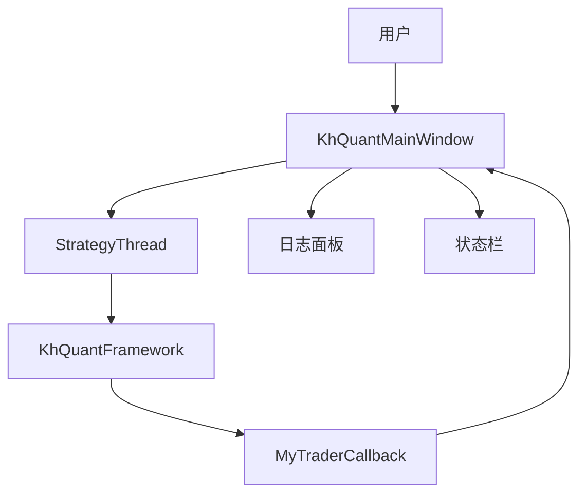
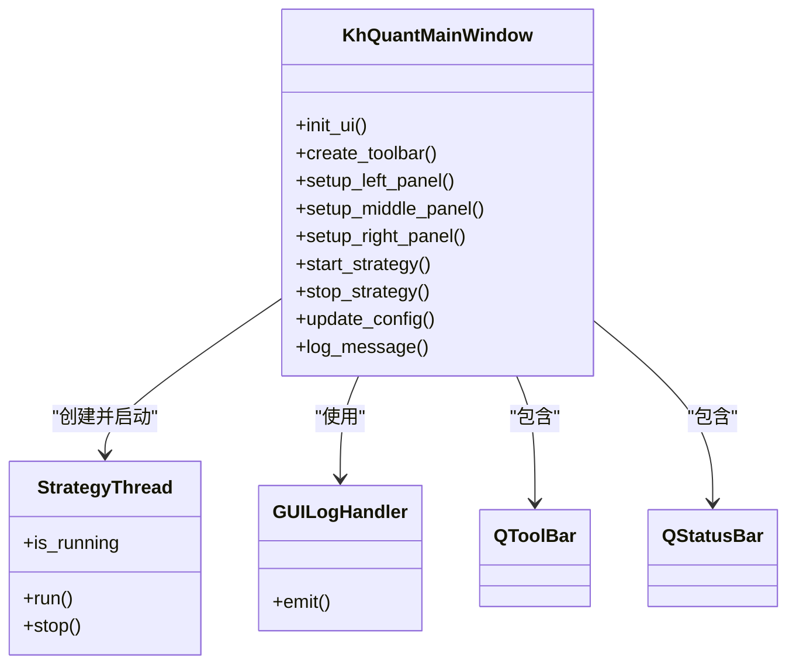
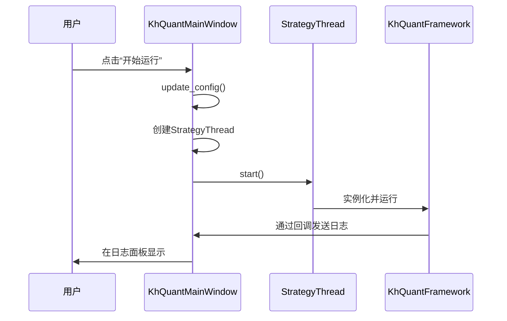
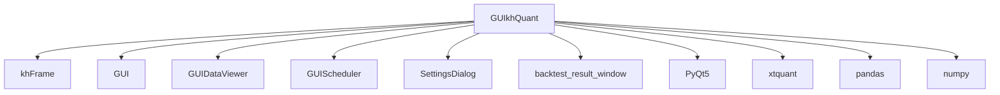

# GUI模块

<cite>
**本文档引用的文件**
- [GUIkhQuant.py](file://GUIkhQuant.py)
- [khFrame.py](file://khFrame.py)
- [GUI.py](file://GUI.py)
- [GUIDataViewer.py](file://GUIDataViewer.py)
- [GUIScheduler.py](file://GUIScheduler.py)
- [SettingsDialog.py](file://SettingsDialog.py)
- [backtest_result_window.py](file://backtest_result_window.py)
</cite>

## 目录
1. [引言](#引言)
2. [项目结构](#项目结构)
3. [核心组件](#核心组件)
4. [架构概述](#架构概述)
5. [详细组件分析](#详细组件分析)
6. [依赖分析](#依赖分析)
7. [性能考虑](#性能考虑)
8. [故障排除指南](#故障排除指南)
9. [结论](#结论)

## 引言
GUI模块是看海量化交易平台的核心用户交互界面，以`GUIkhQuant.py`文件中的`KhQuantMainWindow`类作为主控制器。该模块为用户提供了一个功能全面的图形化环境，用于配置、执行和监控量化策略的回测过程。作为用户与量化交易系统交互的主要入口，它集成了策略管理、回测控制、账户配置、数据监控和日志分析等关键功能。本文档将深入剖析该模块的架构与实现，详细解释其各功能组件的设计与交互。

## 项目结构
GUI模块的代码结构清晰，各文件职责分明。主控制器`GUIkhQuant.py`负责整体界面的构建与核心业务逻辑的调度。`khFrame.py`作为底层量化框架，被GUI模块调用以执行实际的回测任务。`GUI.py`、`GUIDataViewer.py`和`GUIScheduler.py`等文件则分别实现了数据下载、数据查看和定时补充等辅助功能，共同构成了一个完整的量化交易工作流。

## 核心组件
`GUIkhQuant.py`文件中的`KhQuantMainWindow`类是GUI模块的核心，它继承自`QMainWindow`，并整合了多个子组件。该类负责初始化整个用户界面，包括顶部工具栏、左侧配置面板、中间驱动面板、右侧日志面板和底部状态栏。其核心职责是作为用户操作的中枢，将用户的配置和指令（如加载策略、开始回测）传递给底层的`khFrame`框架，并将框架的执行结果（如日志、状态）实时反馈给用户。

**Section sources**
- [GUIkhQuant.py](file://GUIkhQuant.py#L198-L2305)

## 架构概述
GUI模块采用分层架构设计，上层为用户界面，下层为业务逻辑。`KhQuantMainWindow`作为顶层控制器，通过信号与槽机制与各个UI组件进行通信。当用户触发“开始回测”等操作时，GUI模块会创建一个`StrategyThread`线程来执行耗时的回测任务，从而保证主界面的响应性。该线程会实例化`khFrame.py`中的`KhQuantFramework`，并将用户配置的参数传递给它。`KhQuantFramework`执行回测后，通过`MyTraderCallback`回调类将日志和状态信息发送回GUI模块，最终在日志面板中显示。

**Diagram sources**
- [GUIkhQuant.py](file://GUIkhQuant.py#L132-L2305)
- [khFrame.py](file://khFrame.py#L495-L2696)

## 详细组件分析

### 主窗口类分析
`KhQuantMainWindow`类是GUI模块的主控制器，其职责是协调所有UI组件并处理用户交互。它通过`init_ui`方法构建整个界面布局，并通过`create_toolbar`方法创建顶部工具栏。该类还定义了多个核心方法，如`start_strategy`和`stop_strategy`，用于控制回测的生命周期。

#### 主窗口类图

**Diagram sources**
- [GUIkhQuant.py](file://GUIkhQuant.py#L198-L2305)

### 界面布局分析
GUI模块的界面布局遵循清晰的三栏式设计，旨在提供高效的工作流。

#### 顶部工具栏
顶部工具栏提供了最常用功能的快捷入口。通过`create_toolbar`方法创建，包含“加载配置”、“保存配置”、“开始运行”、“停止运行”以及“本地数据管理”等按钮。这些按钮通过信号与槽机制连接到相应的处理函数，例如`start_strategy`和`stop_strategy`。

**Section sources**
- [GUIkhQuant.py](file://GUIkhQuant.py#L1050-L1240)

#### 左侧配置面板
左侧配置面板位于一个可滚动的区域中，包含“策略配置”、“回测参数”和“股票池设置”等分组框。用户在此面板中选择策略文件、设置回测时间范围、配置交易成本和选择股票池。该面板的布局由`setup_left_panel`方法构建。

**Section sources**
- [GUIkhQuant.py](file://GUIkhQuant.py#L1333-L1655)

#### 中间驱动面板
中间驱动面板包含“触发方式设置”、“实盘数据获取”和“账户信息”等组。用户可以在此选择策略的触发方式（如Tick触发、K线触发），配置初始资金和最小交易量。该面板的布局由`setup_middle_panel`方法构建。

**Section sources**
- [GUIkhQuant.py](file://GUIkhQuant.py#L1657-L1860)

#### 右侧日志面板
右侧日志面板是用户监控系统运行状态的关键区域。它由`setup_right_panel`方法创建，核心组件是一个`QTextEdit`，用于显示系统日志。面板还提供了日志类型过滤复选框（DEBUG, INFO, WARNING, ERROR, TRADE），允许用户根据级别筛选日志。日志消息通过`GUILogHandler`处理器从Python的`logging`模块捕获，并根据级别进行颜色编码后显示。

**Section sources**
- [GUIkhQuant.py](file://GUIkhQuant.py#L1861-L1944)

#### 底部状态栏
底部状态栏显示了系统的实时状态。它包含一个状态标签（如“就绪”、“回测进行中...”）、一个用于显示回测进度的进度条，以及一个指示MiniQMT软件连接状态的指示灯。状态栏的更新由`update_status`和`update_progress_bar`等方法控制。

**Section sources**
- [GUIkhQuant.py](file://GUIkhQuant.py#L936-L985)

### 关键业务逻辑分析
GUI模块实现了多项关键业务逻辑，确保了回测流程的顺畅。

#### 策略文件加载与验证
用户通过“选择策略文件”按钮加载`.py`文件。`select_strategy_file`方法会弹出文件选择对话框，并对所选路径进行验证。如果文件位于不建议的`_internal`目录，会弹出警告；如果文件不在用户策略目录中，会给出提示，以防止软件升级时文件丢失。

**Section sources**
- [GUIkhQuant.py](file://GUIkhQuant.py#L1945-L1983)

#### 回测执行控制
回测的启动和停止由`start_strategy`和`stop_strategy`方法控制。`start_strategy`方法首先更新配置，然后创建一个`StrategyThread`线程来运行回测。该线程会实例化`KhQuantFramework`并开始执行。`stop_strategy`方法则会调用线程的`stop`方法，安全地中止回测过程。

**Diagram sources**
- [GUIkhQuant.py](file://GUIkhQuant.py#L2220-L2398)

#### .kh配置文件的保存与加载
GUI模块支持将当前配置保存为`.kh`文件，并能从`.kh`文件加载配置。`save_config`和`load_config`方法负责序列化和反序列化配置字典。配置信息包括策略路径、回测参数、交易成本、股票池等，确保了工作环境的可复用性。

**Section sources**
- [GUIkhQuant.py](file://GUIkhQuant.py#L2399-L2450)

### 后台回测实现
为了保证界面的响应性，回测任务在后台线程中执行。`StrategyThread`继承自`QThread`，其`run`方法会创建`KhQuantFramework`实例并调用其`run`方法。通过`pyqtSignal`，后台线程可以安全地向主线程发送信号，如`error_signal`、`status_signal`和`finished_signal`，从而实现跨线程的UI更新。

**Section sources**
- [GUIkhQuant.py](file://GUIkhQuant.py#L132-L183)

### 与khFrame.py框架的交互
GUI模块与`khFrame.py`框架的交互是通过`MyTraderCallback`类实现的。当GUI启动回测时，会创建一个`MyTraderCallback`实例并将其传递给`KhQuantFramework`。在回测过程中，框架会调用回调类的方法（如`on_stock_order`、`on_stock_trade`）来报告交易事件。这些方法会通过`gui.log_message`将信息发送回GUI，最终在日志面板中显示。

**Section sources**
- [GUIkhQuant.py](file://GUIkhQuant.py#L2224-L2225)
- [khFrame.py](file://khFrame.py#L277-L423)

### 性能优化实践
GUI模块采用了多种性能优化技术。

#### 日志批量更新
为了减少频繁的UI刷新，GUI模块实现了日志的延迟显示机制。当策略正在运行时，日志消息会被暂存到`delayed_logs`列表中，而不是立即显示。只有当策略运行结束后，才会通过`display_delayed_logs`方法批量更新到日志面板，这极大地提升了回测过程中的界面流畅度。

**Section sources**
- [GUIkhQuant.py](file://GUIkhQuant.py#L215-L217)

#### 内存管理
GUI模块通过`flush_logs`方法定期刷新日志缓冲区，确保日志能及时写入文件。同时，在`stop_strategy`和`on_strategy_finished`方法中，会清理`StrategyThread`等对象，防止内存泄漏。对于临时配置文件，也会在策略结束后进行清理。

**Section sources**
- [GUIkhQuant.py](file://GUIkhQuant.py#L833-L842)

## 依赖分析
GUI模块依赖于多个内部和外部组件。它直接依赖`khFrame.py`来执行回测逻辑，并依赖`GUI.py`、`GUIDataViewer.py`和`GUIScheduler.py`等模块来提供数据管理功能。外部依赖包括`PyQt5`用于构建GUI，`xtquant`用于与交易接口通信，以及`pandas`、`numpy`等用于数据处理。

**Diagram sources**
- [GUIkhQuant.py](file://GUIkhQuant.py#L1-L36)
- [GUI.py](file://GUI.py#L1-L20)
- [GUIDataViewer.py](file://GUIDataViewer.py#L1-L19)
- [GUIScheduler.py](file://GUIScheduler.py#L1-L16)

## 性能考虑
GUI模块在设计时充分考虑了性能问题。通过将耗时的回测任务移至后台线程，保证了主界面的流畅。日志的延迟显示和批量更新机制避免了在回测过程中因频繁刷新UI而导致的卡顿。此外，通过`QSettings`持久化用户偏好，并在程序启动时异步检查更新，避免了阻塞主流程。

## 故障排除指南
当遇到问题时，应首先检查日志面板。红色的`ERROR`日志通常指明了问题的根源。如果回测无法启动，请检查策略文件路径是否正确，以及配置参数（如时间范围）是否有效。如果MiniQMT状态指示灯为红色，表示软件未启动，需要手动打开。对于复杂的错误，可以查看`logs/app.log`文件获取更详细的堆栈信息。

**Section sources**
- [GUIkhQuant.py](file://GUIkhQuant.py#L826-L831)

## 结论
GUI模块作为看海量化交易平台的用户交互核心，其设计精良，功能完备。通过`KhQuantMainWindow`主控制器，它成功地将复杂的量化回测流程封装在一个直观的图形界面中。模块采用分层和模块化的设计，通过后台线程和信号槽机制保证了良好的用户体验。其与`khFrame`框架的松耦合交互，以及对日志、配置和数据管理的细致处理，体现了其作为专业量化工具的成熟与稳健。