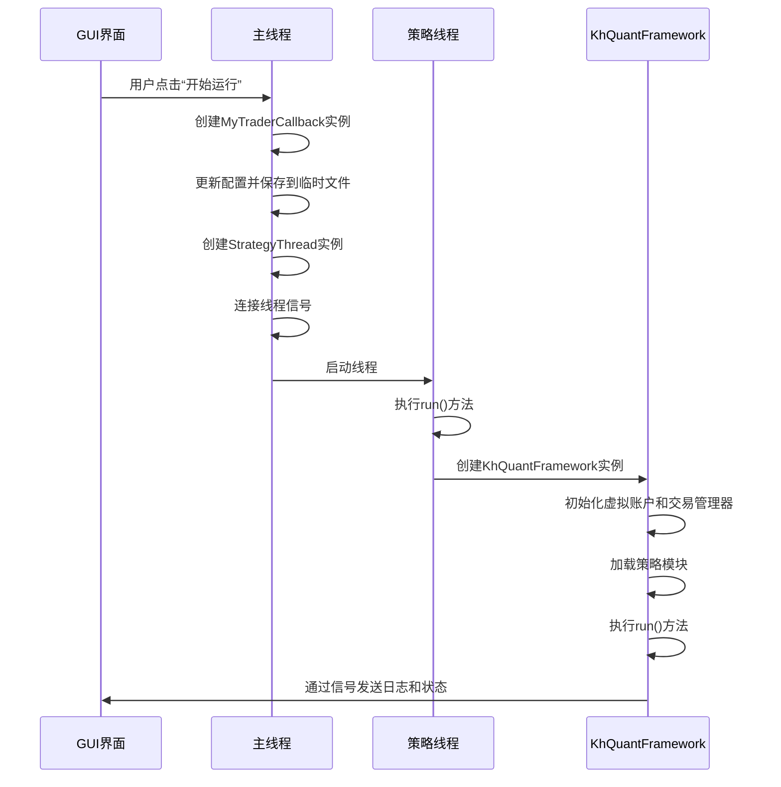
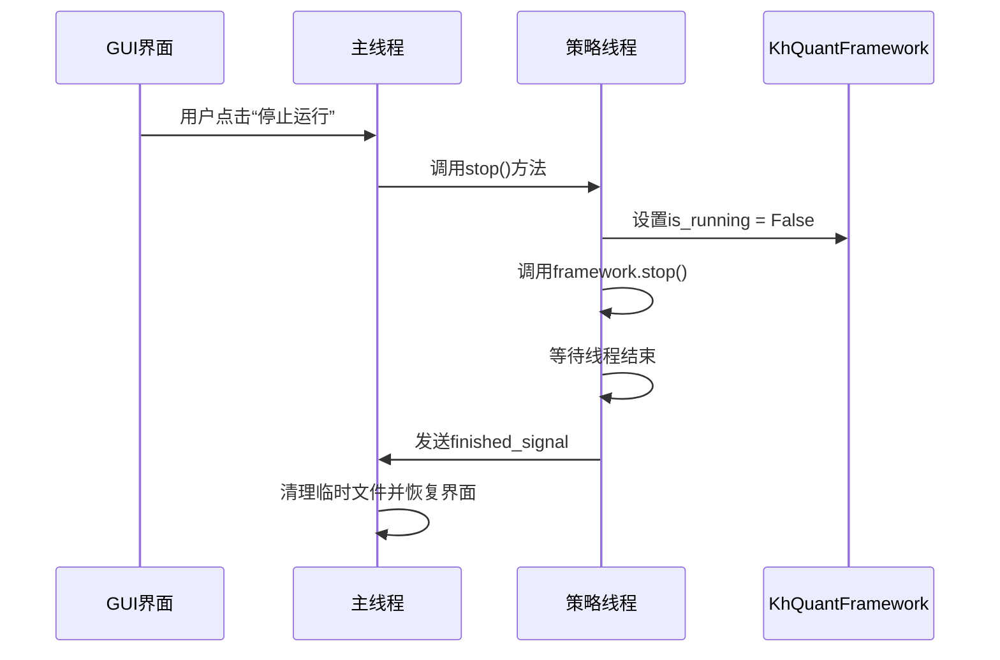
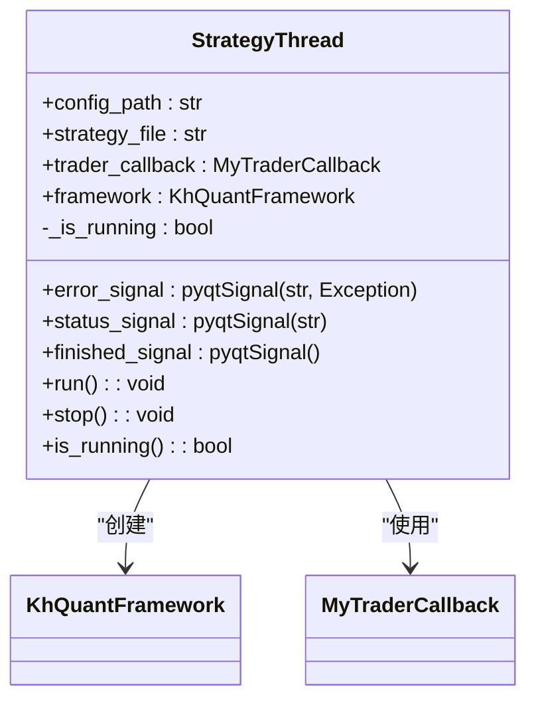

# 回测控制

<cite>
**本文档引用的文件**   
- [GUIkhQuant.py](file://GUIkhQuant.py)
- [khFrame.py](file://khFrame.py)
- [khQuantImport.py](file://khQuantImport.py)
</cite>

## 目录
1. [引言](#引言)
2. [回测控制核心逻辑](#回测控制核心逻辑)
3. [StrategyThread线程管理](#strategythread线程管理)
4. [后台回测与线程通信机制](#后台回测与线程通信机制)
5. [回测完整生命周期](#回测完整生命周期)
6. [性能优化建议](#性能优化建议)
7. [结论](#结论)

## 引言
本文档详细剖析了看海量化系统中回测控制的核心逻辑，重点分析了`GUIkhQuant.py`文件中`start_backtest`和`stop_backtest`方法的实现。文档深入探讨了`StrategyThread`的创建、启动和停止过程，阐明了如何通过QThread实现后台回测以保证主界面的响应性，以及线程间通过pyqtSignal进行通信的机制。同时，文档详细说明了从参数验证、框架初始化、线程启动到结果处理的完整回测生命周期，并提供了性能优化建议。

**Section sources**
- [GUIkhQuant.py](file://GUIkhQuant.py#L2219-L2399)
- [khFrame.py](file://khFrame.py#L911-L1098)

## 回测控制核心逻辑

### start_strategy方法实现
`start_strategy`方法是启动回测的核心入口，它负责验证参数、初始化框架并启动后台线程。该方法首先创建`MyTraderCallback`实例用于处理交易回调，然后将当前配置更新并保存到一个临时的JSON配置文件中，确保回测过程使用最新的参数。



**Diagram sources**
- [GUIkhQuant.py](file://GUIkhQuant.py#L2219-L2297)
- [khFrame.py](file://khFrame.py#L498-L650)

**Section sources**
- [GUIkhQuant.py](file://GUIkhQuant.py#L2219-L2297)

### stop_strategy方法实现
`stop_strategy`方法负责安全地停止正在运行的回测。它首先检查`strategy_thread`是否存在且正在运行，然后通过调用线程的`stop()`方法来触发停止逻辑。该方法会设置框架的`is_running`标志为`False`，并等待线程完全结束，最后清理临时配置文件并恢复界面状态。



**Diagram sources**
- [GUIkhQuant.py](file://GUIkhQuant.py#L2361-L2398)
- [khFrame.py](file://khFrame.py#L174-L182)

**Section sources**
- [GUIkhQuant.py](file://GUIkhQuant.py#L2361-L2398)

## StrategyThread线程管理

### StrategyThread类定义
`StrategyThread`继承自`QThread`，是执行回测任务的核心后台线程。它定义了三个关键的`pyqtSignal`信号：`error_signal`用于报告错误，`status_signal`用于发送状态更新，`finished_signal`用于通知回测完成。



**Diagram sources**
- [GUIkhQuant.py](file://GUIkhQuant.py#L132-L182)

**Section sources**
- [GUIkhQuant.py](file://GUIkhQuant.py#L132-L182)

### 线程的创建与启动
`StrategyThread`的创建发生在`start_strategy`方法中，通过传入配置文件路径、策略文件路径和交易回调实例来初始化。线程启动后，其`run()`方法会被调用，该方法会创建`KhQuantFramework`实例并调用其`run()`方法来执行回测逻辑。

### 线程的停止过程
`stop()`方法是线程安全的停止机制。它首先将`_is_running`标志设置为`False`，然后检查`framework`实例是否存在，如果存在则调用其`stop()`方法。`is_running`属性是一个只读的`@property`，用于外部查询线程的运行状态。

## 后台回测与线程通信机制

### QThread实现后台回测
系统通过继承`QThread`创建`StrategyThread`来实现后台回测。这种设计将耗时的回测计算任务从主线程中分离出来，确保了GUI界面的流畅响应。主线程可以继续处理用户输入和界面更新，而回测逻辑在独立的后台线程中执行。

### pyqtSignal通信机制
线程间通信通过`pyqtSignal`信号实现，这是一种线程安全的机制。`StrategyThread`在执行过程中会发射各种信号，而`KhQuantGUI`主窗口通过`connect()`方法将这些信号连接到相应的槽函数（slot）。

| 信号名称 | 发射位置 | 连接的槽函数 | 用途 |
| :--- | :--- | :--- | :--- |
| `error_signal` | StrategyThread.run() | on_strategy_error | 处理回测过程中的异常 |
| `status_signal` | StrategyThread.run() | update_status | 更新状态栏信息 |
| `finished_signal` | StrategyThread.run() | on_strategy_finished | 处理回测完成后的逻辑 |
| `log_signal` | GUILogHandler.emit() | _log_message | 将日志消息显示在GUI上 |
| `progress_signal` | KhQuantFramework._run_backtest() | update_progress_bar | 更新回测进度条 |

**Section sources**
- [GUIkhQuant.py](file://GUIkhQuant.py#L135-L137)
- [GUIkhQuant.py](file://GUIkhQuant.py#L200-L203)
- [GUIkhQuant.py](file://GUIkhQuant.py#L2267-L2269)
- [GUIkhQuant.py](file://GUIkhQuant.py#L3171-L3195)
- [GUIkhQuant.py](file://GUIkhQuant.py#L4326-L4356)

## 回测完整生命周期

### 回测流程概述
回测的完整生命周期始于用户点击“开始运行”按钮，终于回测结果的生成和展示。整个流程可以分为参数验证、框架初始化、线程启动和结果处理四个主要阶段。

```mermaid
flowchart TD
A[用户点击开始] --> B[参数验证]
B --> C[保存配置到临时文件]
C --> D[创建StrategyThread]
D --> E[连接信号与槽]
E --> F[启动线程]
F --> G[线程执行run()]
G --> H[创建KhQuantFramework]
H --> I[初始化虚拟账户]
I --> J[加载策略模块]
J --> K[执行framework.run()]
K --> L[执行回测逻辑]
L --> M[保存回测结果]
M --> N[发射finished_signal]
N --> O[GUI处理完成回调]
O --> P[显示回测结果]
```

**Diagram sources**
- [GUIkhQuant.py](file://GUIkhQuant.py#L2219-L2297)
- [khFrame.py](file://khFrame.py#L911-L1098)

**Section sources**
- [GUIkhQuant.py](file://GUIkhQuant.py#L2219-L2399)
- [khFrame.py](file://khFrame.py#L911-L1098)

### 参数验证与框架初始化
在`start_strategy`方法中，系统首先验证用户输入的参数，然后将当前配置（包括策略文件路径、回测参数等）写入一个临时的`.kh`配置文件。这确保了回测过程使用的是最新且一致的配置。随后，`KhQuantFramework`被初始化，它会加载策略文件、创建虚拟账户并初始化交易管理器。

### 线程启动与回测执行
`StrategyThread`启动后，其`run()`方法会创建`KhQuantFramework`实例并调用`framework.run()`。`run()`方法包含了回测的核心逻辑，包括初始化数据、加载股票列表、判断T+0模式、调用策略的`init()`函数，最后执行`_run_backtest()`进行回测。

### 结果处理与展示
回测完成后，`KhQuantFramework`会调用`record_results()`方法将交易记录、每日统计和汇总指标保存到`backtest_results`目录下的CSV文件中。同时，它会通过`pyqtSignal`通知GUI，触发`on_strategy_finished`槽函数，该函数会清理临时文件、更新界面状态，并最终调用`show_backtest_result`来展示回测结果。

## 性能优化建议

### 避免线程阻塞
为避免线程阻塞，系统采用了异步信号通信机制。所有耗时操作（如日志记录、进度更新）都通过`QueuedConnection`模式的信号发送，确保不会阻塞主线程。此外，`StrategyThread`内部的`run()`方法也应避免长时间的同步操作。

### 处理长时间运行的回测
对于长时间运行的回测，系统提供了进度条和预计剩余时间功能。`KhQuantFramework`在回测过程中会定期计算并发送进度百分比，`update_progress_bar`槽函数会根据已用时间和完成百分比估算剩余时间，为用户提供良好的等待体验。

### 代码示例
以下代码展示了如何连接信号以实现线程安全的日志记录：

```python
# 在GUI初始化时连接信号
self.strategy_thread.log_signal.connect(self._log_message, Qt.QueuedConnection)

# 自定义日志处理器，将日志发送到GUI信号
class GUILogHandler(logging.Handler):
    def emit(self, record):
        try:
            msg = self.format(record)
            self.gui.log_signal.emit(msg, record.levelname)  # 发射信号
        except Exception:
            self.handleError(record)
```

**Section sources**
- [GUIkhQuant.py](file://GUIkhQuant.py#L2267-L2269)
- [GUIkhQuant.py](file://GUIkhQuant.py#L184-L197)
- [GUIkhQuant.py](file://GUIkhQuant.py#L4326-L4356)

## 结论
本文档详细分析了看海量化系统的回测控制机制。系统通过`QThread`实现了后台回测，保证了主界面的响应性。`StrategyThread`作为核心线程，通过`pyqtSignal`与主GUI进行安全通信，实现了错误、状态、日志和进度的实时传递。完整的回测生命周期从参数验证开始，经过框架初始化和线程启动，最终完成结果处理和展示。通过合理的线程管理和信号通信，系统能够高效、稳定地执行长时间的回测任务。