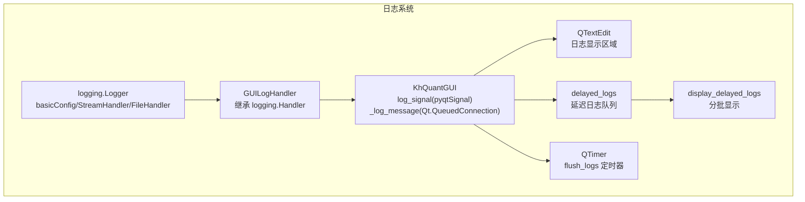
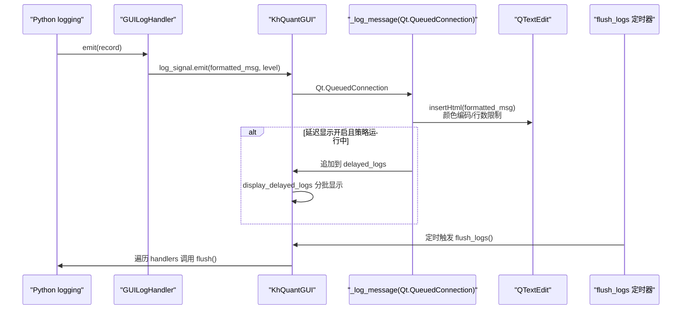
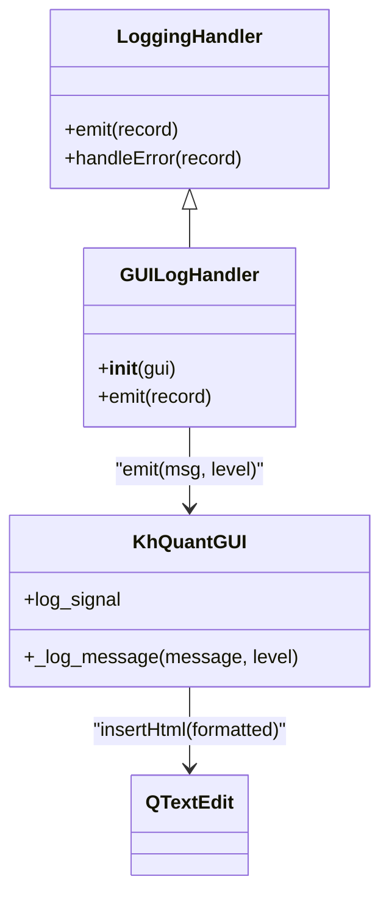
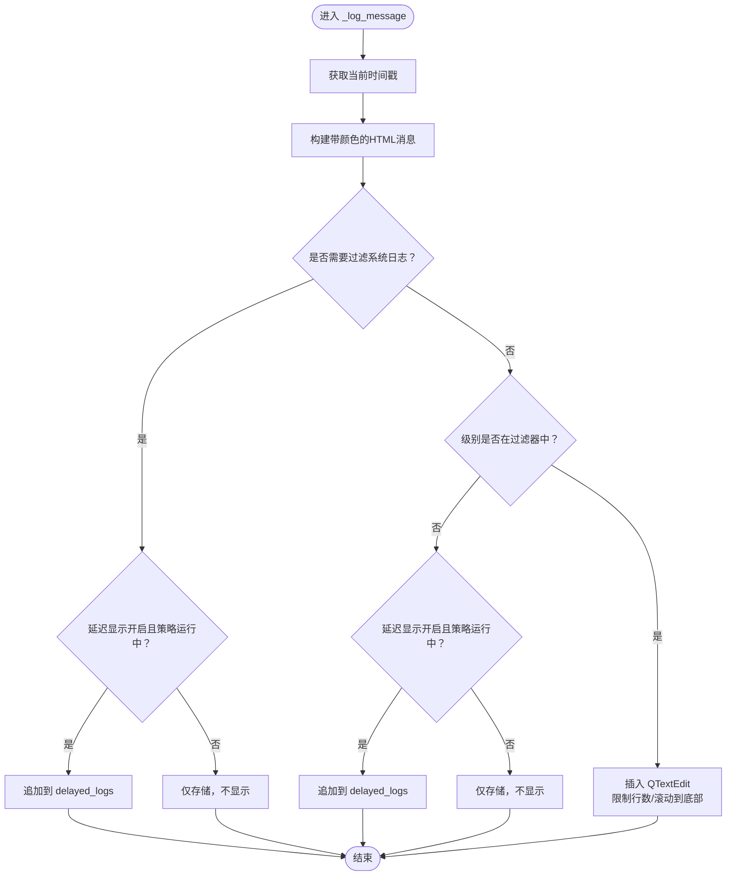
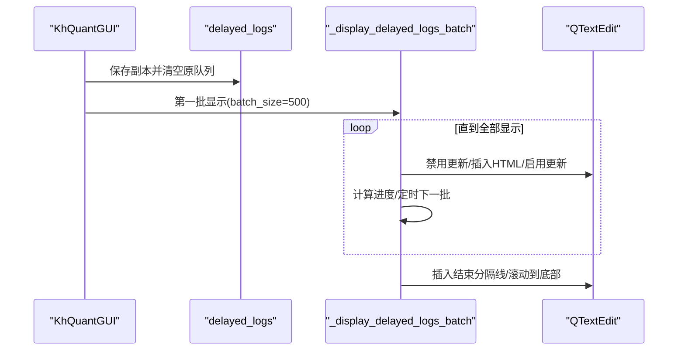
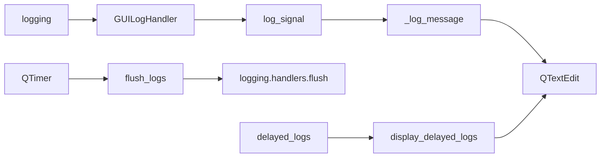

# 日志系统

<cite>
**本文引用的文件**
- [GUIkhQuant.py](file://GUIkhQuant.py)
</cite>

## 目录
1. [简介](#简介)
2. [项目结构](#项目结构)
3. [核心组件](#核心组件)
4. [架构总览](#架构总览)
5. [详细组件分析](#详细组件分析)
6. [依赖关系分析](#依赖关系分析)
7. [性能考量](#性能考量)
8. [故障排查指南](#故障排查指南)
9. [结论](#结论)
10. [附录](#附录)

## 简介
本文件面向“看海量化回测系统”的日志系统，聚焦于 GUI 层的日志实现，特别是自定义日志处理器 GUILogHandler 如何将 Python logging 的日志记录转发到 PyQt5 的 GUI 界面；详细解释 log_signal 的使用、_log_message 槽函数如何安全地更新 QTextEdit 中的日志显示；说明多级过滤（INFO、DEBUG、WARNING、ERROR、TRADE）的实现机制与颜色编码样式；阐述延迟日志显示与批量更新策略（delayed_logs 与 display_delayed_logs 的分批加载）；并提供在不同模块中记录日志的方法与最佳实践。

## 项目结构
日志系统位于 GUIkhQuant.py 中，围绕以下关键点展开：
- 自定义日志处理器 GUILogHandler：继承 logging.Handler，负责将日志格式化后通过 PyQt 信号发送到 GUI。
- GUI 类 KhQuantGUI：定义 log_signal 信号、_log_message 槽函数、日志过滤与颜色映射、延迟日志队列与定时刷新。
- 日志刷新定时器：周期性调用 flush_logs，确保日志及时写入文件。
- 交易日志：update_trade_log 将交易信息以“TRADE”级别输出，便于区分与样式化。

图表来源
- [GUIkhQuant.py](file://GUIkhQuant.py#L183-L200)
- [GUIkhQuant.py](file://GUIkhQuant.py#L266-L276)
- [GUIkhQuant.py](file://GUIkhQuant.py#L823-L842)
- [GUIkhQuant.py](file://GUIkhQuant.py#L3171-L3307)
- [GUIkhQuant.py](file://GUIkhQuant.py#L4570-L4696)

章节来源
- [GUIkhQuant.py](file://GUIkhQuant.py#L183-L200)
- [GUIkhQuant.py](file://GUIkhQuant.py#L266-L276)
- [GUIkhQuant.py](file://GUIkhQuant.py#L823-L842)
- [GUIkhQuant.py](file://GUIkhQuant.py#L3171-L3307)
- [GUIkhQuant.py](file://GUIkhQuant.py#L4570-L4696)

## 核心组件
- GUILogHandler：自定义日志处理器，将日志记录通过 PyQt 信号发送到 GUI。
- KhQuantGUI.log_signal：PyQt 信号，携带消息文本与级别字符串。
- _log_message：GUI 线程槽函数，负责将 HTML 格式的日志插入 QTextEdit 并进行颜色编码与行数限制。
- delayed_logs：延迟日志队列，策略运行期间收集日志，结束后再批量显示。
- display_delayed_logs：分批显示延迟日志，避免界面卡顿。
- flush_logs：定时刷新日志缓冲区，确保文件日志及时落盘。

章节来源
- [GUIkhQuant.py](file://GUIkhQuant.py#L183-L200)
- [GUIkhQuant.py](file://GUIkhQuant.py#L266-L276)
- [GUIkhQuant.py](file://GUIkhQuant.py#L3171-L3307)
- [GUIkhQuant.py](file://GUIkhQuant.py#L4570-L4696)
- [GUIkhQuant.py](file://GUIkhQuant.py#L823-L842)

## 架构总览
日志从 Python logging 流入，经由 GUILogHandler 格式化后通过 log_signal 发送到 GUI 线程的 _log_message 槽函数。_log_message 根据级别设置颜色并插入 QTextEdit；若启用延迟显示且策略正在运行，则将日志条目追加到 delayed_logs 队列，稍后由 display_delayed_logs 分批加载显示。同时，系统还配置了文件与控制台日志处理器，并通过定时器周期性调用 flush_logs 以确保日志写入文件。

图表来源
- [GUIkhQuant.py](file://GUIkhQuant.py#L183-L200)
- [GUIkhQuant.py](file://GUIkhQuant.py#L266-L276)
- [GUIkhQuant.py](file://GUIkhQuant.py#L3171-L3307)
- [GUIkhQuant.py](file://GUIkhQuant.py#L4570-L4696)
- [GUIkhQuant.py](file://GUIkhQuant.py#L823-L842)

## 详细组件分析

### 自定义日志处理器 GUILogHandler
- 继承 logging.Handler，重写 emit(record)。
- 在 emit 中格式化日志，然后通过 self.gui.log_signal.emit(msg, record.levelname) 将消息与级别发送到 GUI。
- 通过 handleError(record) 处理 emit 过程中的异常，避免影响日志记录流程。

图表来源
- [GUIkhQuant.py](file://GUIkhQuant.py#L183-L200)
- [GUIkhQuant.py](file://GUIkhQuant.py#L266-L276)
- [GUIkhQuant.py](file://GUIkhQuant.py#L3171-L3307)

章节来源
- [GUIkhQuant.py](file://GUIkhQuant.py#L183-L200)
- [GUIkhQuant.py](file://GUIkhQuant.py#L266-L276)

### PyQt 信号与槽：log_signal 与 _log_message
- 在 KhQuantGUI 中定义 log_signal = pyqtSignal(str, str)，用于传递格式化后的消息与级别。
- 在 __init__ 中通过 self.log_signal.connect(self._log_message, Qt.QueuedConnection) 将信号连接到槽函数，确保跨线程安全。
- _log_message 是 Qt.QueuedConnection 的槽函数，负责：
  - 提取当前时间戳，构建带颜色的 HTML 格式消息。
  - 过滤系统与更新相关的噪声日志（如“加载进度”、“检查更新”等），避免刷屏。
  - 若启用延迟显示且策略正在运行，则将日志条目追加到 delayed_logs，不立即显示。
  - 若未被过滤，则插入 QTextEdit 并限制最大行数，最后滚动到底部。

图表来源
- [GUIkhQuant.py](file://GUIkhQuant.py#L3171-L3307)

章节来源
- [GUIkhQuant.py](file://GUIkhQuant.py#L266-L276)
- [GUIkhQuant.py](file://GUIkhQuant.py#L3171-L3307)

### 日志级别与颜色编码
- 支持的级别：DEBUG、INFO、WARNING、ERROR、TRADE。
- 颜色映射：
  - DEBUG：浅紫色
  - INFO：白色
  - WARNING：橙色
  - ERROR：红色
  - TRADE：蓝色
- _log_message 中根据级别选择对应颜色，并以 HTML 格式插入 QTextEdit，便于区分不同级别的日志。

章节来源
- [GUIkhQuant.py](file://GUIkhQuant.py#L3171-L3307)

### 多级过滤与系统日志过滤
- 过滤器设置：KhQuantGUI 在初始化时维护 filter_log_levels，包含 {"INFO": True, "DEBUG": True, "WARNING": True, "ERROR": True}。
- 系统日志关键字过滤：_log_message 中对常见系统与更新相关日志进行跳过，避免刷屏；但“软件准备就绪”例外，仍允许显示。
- 实际显示与否取决于级别是否在过滤器中被勾选。

章节来源
- [GUIkhQuant.py](file://GUIkhQuant.py#L232-L236)
- [GUIkhQuant.py](file://GUIkhQuant.py#L3171-L3307)

### 延迟日志显示与分批加载
- 延迟日志队列：delayed_logs 用于在策略运行期间收集日志，避免高频日志造成界面卡顿。
- 分批显示：display_delayed_logs 会统计各级别日志数量，显示开始与统计信息；随后将日志复制到临时队列并清空原队列，按批大小（默认 500）分批插入 QTextEdit，并禁用更新以提升性能；使用 QTimer.singleShot 间隔继续下一批，直到全部显示完毕。
- 完成后添加结束分隔线并滚动到底部，清理临时变量。

图表来源
- [GUIkhQuant.py](file://GUIkhQuant.py#L4570-L4696)

章节来源
- [GUIkhQuant.py](file://GUIkhQuant.py#L4570-L4696)

### 日志刷新与定时器
- flush_logs：遍历 logging.getLogger().handlers，对具备 flush 方法的处理器调用 flush，确保日志及时写入文件。
- 定时器：在 __init__ 中创建 log_flush_timer，每 5 秒触发一次 flush_logs，避免日志长时间滞留在缓冲区。

章节来源
- [GUIkhQuant.py](file://GUIkhQuant.py#L823-L842)
- [GUIkhQuant.py](file://GUIkhQuant.py#L273-L276)

### 交易日志（TRADE）
- update_trade_log：将交易信息（代码、方向、价格、数量、状态）格式化为消息，并以“TRADE”级别输出。
- _log_message 中对“TRADE”级别使用蓝色样式，便于识别交易事件。

章节来源
- [GUIkhQuant.py](file://GUIkhQuant.py#L3121-L3170)
- [GUIkhQuant.py](file://GUIkhQuant.py#L3171-L3307)

## 依赖关系分析
- 日志系统依赖：
  - logging：Python 标准库日志模块，负责日志记录与处理器注册。
  - PyQt5：提供 pyqtSignal、pyqtSlot、QTimer、QTextEdit 等组件。
  - logging.Handler：自定义处理器基类，GUILogHandler 继承其实现 emit。
- 关键依赖链：
  - logging.basicConfig/StreamHandler/FileHandler → GUILogHandler → log_signal → _log_message → QTextEdit。
  - QTimer → flush_logs → logging.handlers.flush。
  - delayed_logs → display_delayed_logs → QTextEdit。

图表来源
- [GUIkhQuant.py](file://GUIkhQuant.py#L183-L200)
- [GUIkhQuant.py](file://GUIkhQuant.py#L266-L276)
- [GUIkhQuant.py](file://GUIkhQuant.py#L823-L842)
- [GUIkhQuant.py](file://GUIkhQuant.py#L4570-L4696)

章节来源
- [GUIkhQuant.py](file://GUIkhQuant.py#L183-L200)
- [GUIkhQuant.py](file://GUIkhQuant.py#L266-L276)
- [GUIkhQuant.py](file://GUIkhQuant.py#L823-L842)
- [GUIkhQuant.py](file://GUIkhQuant.py#L4570-L4696)

## 性能考量
- 批量删除与行数限制：_trim_log_lines 使用计数器与缓冲区策略，每 100 条日志检查一次，超过阈值时一次性删除多余行，降低频繁删除带来的性能损耗。
- 分批显示延迟日志：display_delayed_logs 采用 500 条/批的分批策略，并在插入前禁用 QTextEdit 更新，插入后恢复，避免界面卡顿。
- 定时刷新：5 秒一次的 flush_logs 定时器平衡了性能与可靠性，避免频繁刷新造成的开销。
- 过滤噪声日志：对系统与更新相关日志进行跳过，减少界面渲染压力。

章节来源
- [GUIkhQuant.py](file://GUIkhQuant.py#L3308-L3353)
- [GUIkhQuant.py](file://GUIkhQuant.py#L4570-L4696)
- [GUIkhQuant.py](file://GUIkhQuant.py#L273-L276)

## 故障排查指南
- 日志未显示：
  - 检查 log_signal 是否已连接到 _log_message（Qt.QueuedConnection）。
  - 检查级别过滤器是否勾选相应级别。
  - 检查是否启用了延迟显示且策略仍在运行，此时日志会被收集到 delayed_logs。
- 界面卡顿：
  - 确认是否启用了延迟显示；若未启用，高频日志会直接插入 QTextEdit，建议启用延迟显示或降低日志频率。
  - 检查最大日志行数设置是否过大，适当降低以减少渲染压力。
- 日志未落盘：
  - 检查 flush_logs 定时器是否运行；确认 logging.handlers 是否包含具备 flush 方法的处理器。
- 交易日志未显示：
  - 确认 update_trade_log 是否被调用，级别是否为“TRADE”。

章节来源
- [GUIkhQuant.py](file://GUIkhQuant.py#L266-L276)
- [GUIkhQuant.py](file://GUIkhQuant.py#L3171-L3307)
- [GUIkhQuant.py](file://GUIkhQuant.py#L4570-L4696)
- [GUIkhQuant.py](file://GUIkhQuant.py#L823-L842)

## 结论
本日志系统通过 GUILogHandler 将 Python logging 与 PyQt5 无缝集成，借助 Qt 的信号槽机制实现跨线程安全的日志显示；通过延迟日志与分批加载策略有效应对高频率日志场景；通过颜色编码与多级过滤提升可读性与可控性；通过定时刷新确保日志可靠落盘。整体设计兼顾性能、用户体验与可维护性。

## 附录

### 如何在不同模块中记录日志
- 在任意模块中使用标准 logging：
  - 输出普通信息：logging.info("消息")
  - 输出调试信息：logging.debug("消息")
  - 输出警告：logging.warning("消息")
  - 输出错误：logging.error("消息")
  - 输出交易信息：logging.log(25, "消息")（级别 25 对应 TRADE）
- GUI 中统一入口：
  - 使用 KhQuantGUI.log_message(message, level) 发送日志信号，由 _log_message 统一处理。
  - 使用 KhQuantGUI.log_error(error_msg, error) 记录错误并打印堆栈。

章节来源
- [GUIkhQuant.py](file://GUIkhQuant.py#L822-L832)
- [GUIkhQuant.py](file://GUIkhQuant.py#L3121-L3170)

### 如何配置日志级别与过滤器
- 日志级别：
  - 在 GUI 初始化中设置 GUILogHandler 的级别（例如 logging.INFO）。
  - 在 GUI 中维护 filter_log_levels，控制哪些级别显示在界面。
- 过滤器：
  - 系统日志关键字过滤在 _log_message 中实现，可根据需要调整关键字列表。
  - TRADE 级别在颜色映射中单独定义，便于识别交易事件。

章节来源
- [GUIkhQuant.py](file://GUIkhQuant.py#L256-L260)
- [GUIkhQuant.py](file://GUIkhQuant.py#L232-L236)
- [GUIkhQuant.py](file://GUIkhQuant.py#L3171-L3307)

### 处理高频率日志的最佳实践
- 启用延迟显示：在策略运行期间将日志收集到 delayed_logs，结束后再分批显示。
- 降低日志频率：合并同类事件，减少细粒度日志输出。
- 使用合适的级别：仅在必要时输出 DEBUG/TRADE，避免 INFO/ERROR 过多。
- 控制最大行数：根据屏幕尺寸与性能选择合适的 max_log_lines。
- 使用分批刷新：依赖 flush_logs 定时器，避免手动频繁刷新。

章节来源
- [GUIkhQuant.py](file://GUIkhQuant.py#L214-L219)
- [GUIkhQuant.py](file://GUIkhQuant.py#L4570-L4696)
- [GUIkhQuant.py](file://GUIkhQuant.py#L823-L842)