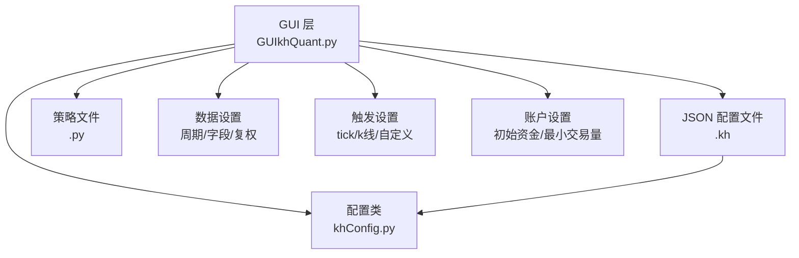
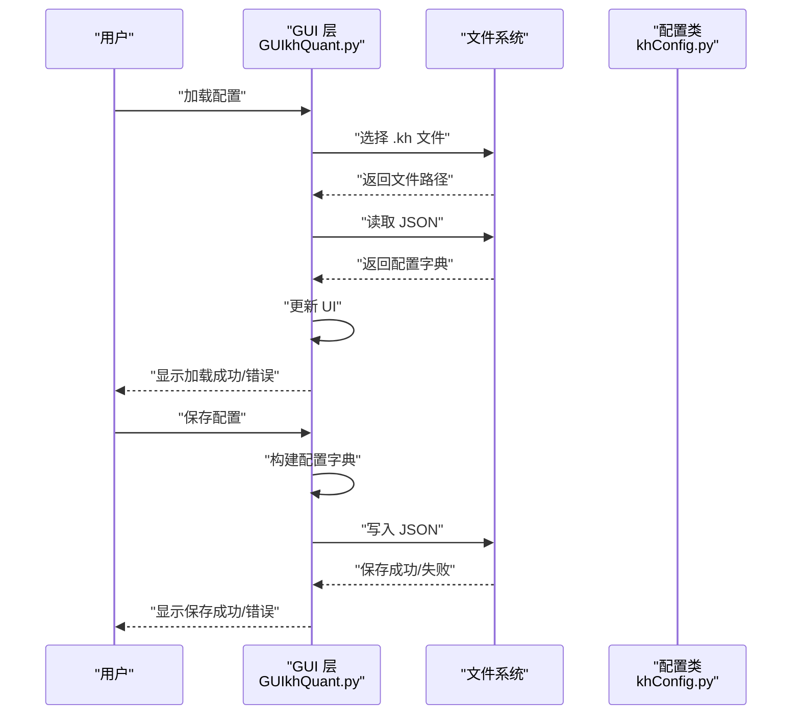
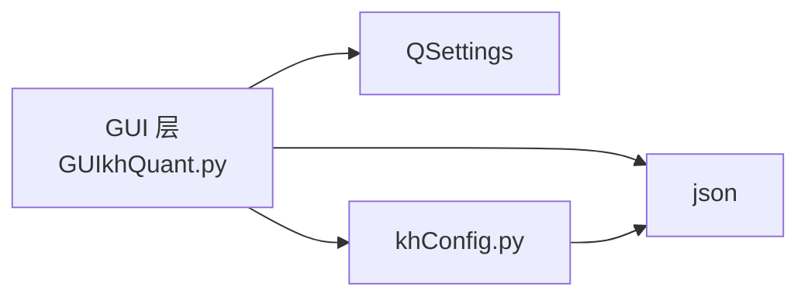

# 配置管理

<cite>
**本文引用的文件**
- [GUIkhQuant.py](file://GUIkhQuant.py)
- [khConfig.py](file://khConfig.py)
- [RSI策略.kh](file://strategies/RSI策略.kh)
- [GUIkhQuant.md](file://modules/GUIkhQuant.md)
</cite>

## 目录
1. [简介](#简介)
2. [项目结构](#项目结构)
3. [核心组件](#核心组件)
4. [架构总览](#架构总览)
5. [详细组件分析](#详细组件分析)
6. [依赖分析](#依赖分析)
7. [性能考虑](#性能考虑)
8. [故障排除指南](#故障排除指南)
9. [结论](#结论)
10. [附录](#附录)

## 简介
本文件聚焦于“配置管理”的实现与使用，围绕 GUI 层的配置加载、保存与验证展开，重点解释 .kh 配置文件的 JSON 结构（策略、回测、数据、股票池、触发、账户等核心配置项），并详细说明 GUIkhQuant.py 中 load_configuration 与 save_configuration 的实现逻辑，包括文件选择、JSON 序列化/反序列化、错误处理与用户反馈。同时，文档阐述配置管理与 khConfig.py 模块的交互方式，以及如何处理配置变更事件；最后给出版本兼容性与最佳实践建议。

## 项目结构
- GUI 层负责图形界面与用户交互，提供加载/保存配置的入口与 UI 更新逻辑。
- khConfig.py 提供配置读取、默认值解析与保存能力，便于在框架层直接消费配置字典。
- 示例 .kh 配置文件展示了完整的 JSON 结构，便于对照理解字段含义与层级。

图表来源
- [GUIkhQuant.py](file://GUIkhQuant.py#L2482-L2719)
- [khConfig.py](file://khConfig.py#L1-L105)
- [RSI策略.kh](file://strategies/RSI策略.kh#L1-L71)

章节来源
- [GUIkhQuant.py](file://GUIkhQuant.py#L2482-L2719)
- [khConfig.py](file://khConfig.py#L1-L105)
- [RSI策略.kh](file://strategies/RSI策略.kh#L1-L71)

## 核心组件
- GUI 层配置管理
  - 加载配置：通过文件对话框选择 .kh 文件，读取 JSON 并更新 UI。
  - 保存配置：将当前 UI 状态写回 JSON，覆盖或另存为 .kh 文件。
  - 验证与提示：对危险路径（安装目录）进行警告，对滑点类型与数值进行校验。
- khConfig 配置类
  - 从 .kh 文件加载配置字典，解析运行模式、账户、回测、数据、风控等字段。
  - 提供更新股票池、保存配置等方法，便于框架层直接使用。

章节来源
- [GUIkhQuant.py](file://GUIkhQuant.py#L2482-L2719)
- [khConfig.py](file://khConfig.py#L1-L105)

## 架构总览
GUI 层与 khConfig 的交互关系如下：

图表来源
- [GUIkhQuant.py](file://GUIkhQuant.py#L2482-L2719)
- [khConfig.py](file://khConfig.py#L1-L105)

## 详细组件分析

### GUI 层配置加载与保存（GUIkhQuant.py）
- 加载配置（load_config）
  - 文件选择：使用文件对话框选择 .kh 文件，支持上次打开路径记忆。
  - JSON 反序列化：读取文件并解析为字典，保存到实例变量，更新当前配置文件路径。
  - UI 更新：调用 update_ui_from_config，将配置映射到界面控件。
  - 用户反馈：记录日志并弹出错误对话框（异常时）。
- 保存配置（save_config/save_config_as）
  - 覆盖保存：若已加载配置文件，弹出确认对话框后覆盖写入。
  - 另存为：若未加载配置文件，弹出保存对话框，选择路径后写入。
  - JSON 序列化：将 UI 状态写入字典并以 JSON 写入文件，设置缩进与编码。
  - 用户反馈：记录日志并弹出成功/错误对话框。
- UI 更新（update_ui_from_config）
  - 策略文件路径、运行模式（固定为回测）、数据模式、回测时间、初始资金、最小交易量、基准、触发类型与时间、滑点类型与值、盘前盘后回调、数据周期/复权/字段、股票池列表等。
  - 兼容性处理：支持从 stock_list 与 stock_list_file 读取股票池。
  - 实盘数据获取模式：根据 data_mode 设置相应 UI 元素。
- 配置变更事件
  - 当用户在界面更改参数时，GUI 层会同步更新 self.config 字典并在保存时写回文件。
  - 通过 QSettings 记录 last_config_path 等用户偏好。

章节来源
- [GUIkhQuant.py](file://GUIkhQuant.py#L2482-L2719)
- [GUIkhQuant.py](file://GUIkhQuant.py#L4436-L4558)

### khConfig 配置类（khConfig.py）
- 初始化与字段解析
  - 从配置文件路径加载 JSON，解析 run_mode、userdata_path、session_id、check_interval。
  - 账户：account_id、account_type。
  - 回测：start_time、end_time、init_capital。
  - 数据：kline_period、stock_pool（兼容 stock_list 与 stock_pool）。
  - 风控：position_limit、order_limit、loss_limit。
- 更新与保存
  - update_stock_list：更新 data.stock_list 并同步内存中的 stock_pool，移除旧字段。
  - save_config：将 config_dict 写回文件。
  - update_config：更新任意键值并保存。

章节来源
- [khConfig.py](file://khConfig.py#L1-L105)

### .kh 配置文件结构（示例：RSI策略.kh）
- 根级字段
  - system：userdata_path 等系统路径。
  - run_mode：运行模式（回测）。
  - account：账户 id 与类型。
  - strategy_file：策略文件路径。
- backtest：回测参数
  - start_time、end_time、init_capital、min_volume、benchmark。
  - trade_cost：最小佣金、佣金率、印花税率、流量费、slippage（按跳数或比例）。
  - trigger：触发类型（tick/1m/5m/1d/custom）、自定义时间点、起止时间、间隔。
- data：数据设置
  - kline_period、dividend_type、fields、stock_list。
- market_callback：盘前盘后回调开关与时间。
- risk：风控参数（position_limit、order_limit、loss_limit）。

章节来源
- [RSI策略.kh](file://strategies/RSI策略.kh#L1-L71)

### 配置管理与 khConfig 的交互
- GUI 层负责 UI 与文件 IO，khConfig 负责配置字典的解析与持久化。
- khConfig 适合在框架层直接消费配置，GUI 层负责将界面状态映射到配置字典并保存。
- 若需在框架层读取配置，可直接传入 .kh 文件路径给 khConfig，由其解析并提供字段访问。

章节来源
- [GUIkhQuant.py](file://GUIkhQuant.py#L2482-L2719)
- [khConfig.py](file://khConfig.py#L1-L105)

### 配置变更事件处理
- GUI 层通过控件事件（如滑点类型切换、日期变更、股票池增删）更新 self.config。
- 保存时将 self.config 写回 .kh 文件，实现配置变更事件的持久化。
- 对于危险路径（安装目录）的检测与提示，GUI 层在加载/保存后弹出警告对话框，提醒用户迁移到安全位置。

章节来源
- [GUIkhQuant.py](file://GUIkhQuant.py#L2060-L2136)
- [GUIkhQuant.py](file://GUIkhQuant.py#L4720-L4759)

## 依赖分析
- GUI 层依赖
  - PyQt5 文件对话框、消息框、设置存储（QSettings）。
  - JSON 解析与序列化。
  - khConfig 配置类（在框架层使用）。
- khConfig 依赖
  - 标准库 json。
  - time（生成 session_id）。

图表来源
- [GUIkhQuant.py](file://GUIkhQuant.py#L2482-L2719)
- [khConfig.py](file://khConfig.py#L1-L105)

章节来源
- [GUIkhQuant.py](file://GUIkhQuant.py#L2482-L2719)
- [khConfig.py](file://khConfig.py#L1-L105)

## 性能考虑
- JSON 读写采用 UTF-8 编码与缩进格式，便于人类可读与版本控制。
- GUI 层在保存配置时进行覆盖确认，避免误覆盖。
- 日志延迟显示与分批渲染策略，减少大量日志对 UI 的影响（与配置管理相关联）。

章节来源
- [GUIkhQuant.py](file://GUIkhQuant.py#L4436-L4558)
- [GUIkhQuant.py](file://GUIkhQuant.py#L4570-L4701)

## 故障排除指南
- 加载失败
  - 检查 .kh 文件是否为有效 JSON。
  - 确认策略文件路径是否存在且可访问。
  - 查看日志面板中的错误信息。
- 保存失败
  - 检查目标路径权限与磁盘空间。
  - 确认未选择安装目录（出现安全警告时请迁移文件）。
- 危险路径警告
  - 若检测到配置文件或策略文件位于安装目录，GUI 会弹出警告并建议迁移到用户目录或桌面等安全位置。
- 滑点类型与数值
  - 切换滑点类型时，GUI 会设置合适的输入验证器与占位符，确保输入合法。

章节来源
- [GUIkhQuant.py](file://GUIkhQuant.py#L2482-L2719)
- [GUIkhQuant.py](file://GUIkhQuant.py#L4720-L4759)

## 结论
本文件系统性梳理了 GUI 层的配置管理实现，明确了 .kh 配置文件的 JSON 结构与字段语义，解释了 load_configuration 与 save_configuration 的实现细节与用户反馈机制，并阐明了与 khConfig 的交互方式与配置变更事件处理。通过遵循本文的最佳实践与兼容性建议，可在保证用户体验的同时，确保配置文件的可读性、可维护性与安全性。

## 附录

### .kh 配置文件字段说明（策略、回测、数据、股票池、触发、账户）
- 策略
  - strategy_file：策略文件路径。
  - run_mode：运行模式（回测）。
- 回测
  - backtest.start_time/end_time：回测起止日期。
  - backtest.init_capital：初始资金。
  - backtest.min_volume：最小交易量。
  - backtest.benchmark：基准合约。
  - backtest.trade_cost：交易成本（最小佣金、佣金率、印花税率、流量费、滑点）。
  - backtest.trigger：触发类型、自定义时间点、起止时间、间隔。
- 数据
  - data.kline_period：K线周期。
  - data.dividend_type：复权类型。
  - data.fields：数据字段集合。
  - data.stock_list：股票池列表。
- 市场回调
  - market_callback.pre_market_enabled/post_market_enabled：盘前/盘后回调开关。
  - market_callback.pre_market_time/post_market_time：盘前/盘后回调时间。
- 风控
  - risk.position_limit：仓位限制。
  - risk.order_limit：订单限制。
  - risk.loss_limit：最大回撤限制。
- 账户
  - account.account_id：账户 id。
  - account.account_type：账户类型。

章节来源
- [RSI策略.kh](file://strategies/RSI策略.kh#L1-L71)

### 代码示例（路径指引）
- 加载配置（GUI 层）
  - [load_config](file://GUIkhQuant.py#L2482-L2521)
  - [update_ui_from_config](file://GUIkhQuant.py#L2531-L2678)
- 保存配置（GUI 层）
  - [save_config](file://GUIkhQuant.py#L4463-L4558)
  - [save_config_as](file://GUIkhQuant.py#L4436-L4462)
- 配置类（khConfig）
  - [KhConfig.__init__](file://khConfig.py#L9-L26)
  - [KhConfig.update_stock_list](file://khConfig.py#L63-L80)
  - [KhConfig.save_config](file://khConfig.py#L89-L96)
- 配置文件结构（示例）
  - [.kh 示例](file://strategies/RSI策略.kh#L1-L71)