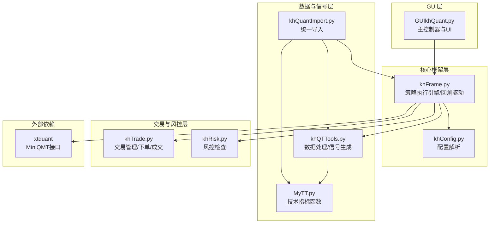
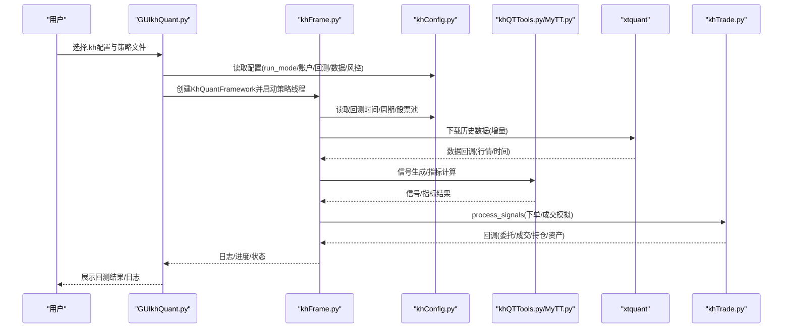
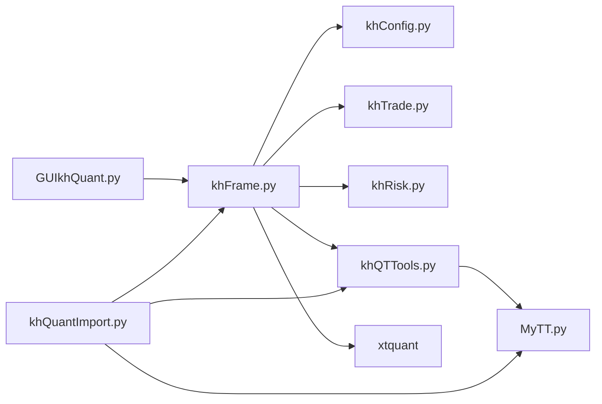
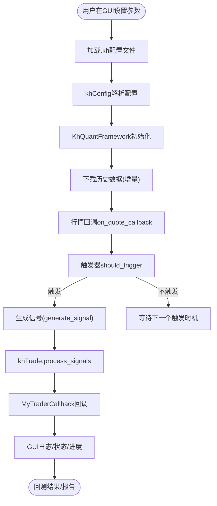

# 核心架构

<cite>
**本文引用的文件**
- [GUIkhQuant.py](file://GUIkhQuant.py)
- [khFrame.py](file://khFrame.py)
- [khConfig.py](file://khConfig.py)
- [khQTTools.py](file://khQTTools.py)
- [MyTT.py](file://MyTT.py)
- [khTrade.py](file://khTrade.py)
- [khRisk.py](file://khRisk.py)
- [khQuantImport.py](file://khQuantImport.py)
- [RSI策略.kh](file://strategies/RSI策略.kh)
- [RSI策略.py](file://strategies/RSI策略.py)
- [双均线多股票_使用MA函数.kh](file://strategies/双均线多股票_使用MA函数.kh)
- [README.md](file://README.md)
</cite>

## 目录
1. [简介](#简介)
2. [项目结构](#项目结构)
3. [核心组件](#核心组件)
4. [架构总览](#架构总览)
5. [详细组件分析](#详细组件分析)
6. [依赖关系分析](#依赖关系分析)
7. [性能考量](#性能考量)
8. [故障排查指南](#故障排查指南)
9. [结论](#结论)
10. [附录](#附录)

## 简介
本架构文档面向“看海量化交易系统”（KHQuant），系统采用“模块低耦合、策略高内聚”的设计原则，将GUI模块、核心框架、数据与策略工具、交易与风控模块解耦，通过明确定义的接口协同工作。用户通过GUI设置参数并加载.kh工程配置文件，核心框架驱动回测流程，xtquant库提供MiniQMT数据与交易接口，khQTTools与MyTT提供数据处理与信号生成，khTrade负责订单与持仓处理，khRisk提供风控检查。

## 项目结构
系统采用按职责分层的模块化组织：
- GUI层：GUIkhQuant.py作为主控制器与用户交互入口，负责参数配置、策略线程调度、日志与状态展示。
- 核心框架层：khFrame.py提供策略执行引擎、回测驱动、触发器机制、交易回调桥接。
- 配置管理：khConfig.py解析.kh配置文件，统一提供运行模式、账户、回测、数据、风控等参数。
- 数据与信号：khQTTools.py提供交易日/时间判断、价格精度、T+0支持、信号生成、交易成本计算等；MyTT.py提供常用技术指标函数。
- 交易与风控：khTrade.py负责交易成本、滑点、下单与成交模拟；khRisk.py提供风控检查接口。
- 统一导入：khQuantImport.py聚合xtquant、khQTTools、MyTT、KhQuantFramework等，提供策略侧统一入口。

图表来源
- [GUIkhQuant.py](file://GUIkhQuant.py#L1-L120)
- [khFrame.py](file://khFrame.py#L1-L120)
- [khConfig.py](file://khConfig.py#L1-L105)
- [khQTTools.py](file://khQTTools.py#L1-L120)
- [MyTT.py](file://MyTT.py#L1-L120)
- [khTrade.py](file://khTrade.py#L1-L120)
- [khRisk.py](file://khRisk.py#L1-L51)
- [khQuantImport.py](file://khQuantImport.py#L1-L120)

章节来源
- [README.md](file://README.md#L56-L108)

## 核心组件
- GUI模块（GUIkhQuant.py）
  - 负责UI初始化、参数配置、策略线程管理、日志与状态展示、与核心框架的信号槽交互。
  - 关键点：StrategyThread封装策略运行线程；KhQuantGUI承载界面与业务逻辑；日志通过GUILogHandler桥接到UI。
- 核心框架（khFrame.py）
  - 提供KhQuantFramework作为策略执行引擎，负责加载策略、初始化交易与账户、数据下载、行情回调、触发器驱动、交易回调桥接。
  - 关键点：TriggerBase/TriggerFactory/Trigger实现Tick/K线/自定义定时触发；MyTraderCallback桥接xtquant交易回调；SimpleGUI/Stub用于非GUI模式。
- 配置管理（khConfig.py）
  - 解析.kh配置文件，提供run_mode、账户、回测、数据、风控等参数访问接口。
  - 关键点：支持从根或system层级读取run_mode；提供get_stock_list/update_stock_list/save_config等。
- 数据与信号（khQTTools.py、MyTT.py）
  - khQTTools：交易日/时间判断、价格精度、T+0支持、信号生成、交易成本计算、历史数据获取等。
  - MyTT：提供MA、RSI、BOLL等常用技术指标函数，支持日线字段映射与滚动窗口计算。
- 交易与风控（khTrade.py、khRisk.py）
  - khTrade：交易成本/滑点/佣金/印花税/过户费/流量费计算；下单与成交模拟；T+0/T+1模式；回调桥接。
  - khRisk：提供风控检查接口（占位，可扩展）。
- 统一导入（khQuantImport.py）
  - 聚合xtquant、khQTTools、MyTT、KhQuantFramework等，策略侧通过from khQuantImport import *即可使用统一API。

章节来源
- [GUIkhQuant.py](file://GUIkhQuant.py#L120-L320)
- [khFrame.py](file://khFrame.py#L1-L120)
- [khConfig.py](file://khConfig.py#L1-L105)
- [khQTTools.py](file://khQTTools.py#L1-L200)
- [MyTT.py](file://MyTT.py#L1-L120)
- [khTrade.py](file://khTrade.py#L1-L120)
- [khRisk.py](file://khRisk.py#L1-L51)
- [khQuantImport.py](file://khQuantImport.py#L1-L120)

## 架构总览
系统遵循“UI低耦合、策略高内聚”的设计，通过清晰的接口与事件驱动实现模块间协作。GUI负责参数与流程控制，核心框架负责策略生命周期与数据驱动，数据与信号模块提供工具与指标，交易与风控模块提供执行与约束。

图表来源
- [GUIkhQuant.py](file://GUIkhQuant.py#L120-L320)
- [khFrame.py](file://khFrame.py#L650-L820)
- [khConfig.py](file://khConfig.py#L1-L105)
- [khQTTools.py](file://khQTTools.py#L540-L740)
- [MyTT.py](file://MyTT.py#L190-L320)
- [khTrade.py](file://khTrade.py#L198-L370)

## 详细组件分析

### GUI模块（GUIkhQuant.py）
- 职责
  - UI初始化与样式适配（分辨率自适应）
  - 参数配置与.kh文件加载
  - 策略线程StrategyThread封装KhQuantFramework.run()
  - 日志系统：GUILogHandler桥接logging到UI表格
  - 与核心框架通过信号槽通信（log_signal/update_status_signal/progress_signal/show_backtest_result_signal）
- 关键接口
  - StrategyThread.run()创建框架实例并调用run()
  - GUI.log_signal.emit()用于跨线程日志显示
  - GUI.update_status_signal/progress_signal用于状态与进度更新
- 设计权衡
  - 采用PyQt5构建GUI，界面友好且易于扩展；通过QThread与信号槽实现线程安全与UI响应。
  - 日志延迟显示与最大行数限制，兼顾性能与可读性。

章节来源
- [GUIkhQuant.py](file://GUIkhQuant.py#L120-L320)
- [GUIkhQuant.py](file://GUIkhQuant.py#L320-L520)
- [GUIkhQuant.py](file://GUIkhQuant.py#L520-L800)

### 核心框架（khFrame.py）
- 职责
  - 加载策略模块（importlib.spec_from_file_location/exec_module）
  - 初始化交易与账户（虚拟账户/交易回调）
  - 数据下载与增量下载（xtdata.download_history_data2）
  - 行情回调与触发器驱动（Tick/K线/自定义定时）
  - 交易回调桥接（MyTraderCallback）
- 关键类与接口
  - TriggerBase/TriggerFactory/Trigger实现触发机制
  - KhQuantFramework.__init__/run/init_trader_and_account/init_data/on_quote_callback
  - MyTraderCallback.on_stock_order/on_stock_trade/on_order_error/on_stock_position等
- 设计权衡
  - 将策略执行与UI分离，支持非GUI模式（SimpleGUI/DummySignal）
  - 触发器抽象化，支持tick/K线/自定义定时三种模式，便于策略适配

章节来源
- [khFrame.py](file://khFrame.py#L1-L120)
- [khFrame.py](file://khFrame.py#L495-L760)
- [khFrame.py](file://khFrame.py#L760-L900)

### 配置管理（khConfig.py）
- 职责
  - 解析.kh配置文件为config_dict
  - 提供run_mode/account/backtest/data/risk等参数访问
  - 提供get_stock_list/update_stock_list/save_config/update_config
- 设计权衡
  - 兼容根级别与system层级的run_mode读取
  - 将股票池兼容stock_pool与stock_list，便于迁移

章节来源
- [khConfig.py](file://khConfig.py#L1-L105)

### 数据与信号（khQTTools.py、MyTT.py）
- 职责
  - khQTTools：交易日/时间判断、价格精度、T+0支持、信号生成、交易成本计算、历史数据获取
  - MyTT：MA、RSI、BOLL等指标函数，支持滚动窗口与日线字段映射
- 关键接口
  - khQTTools.generate_signal/generate_signal/calculate_max_buy_volume
  - khQTTools.is_trade_day/is_trade_time/get_trade_days_count
  - MyTT.MA/RSI/BOLL等
- 设计权衡
  - 价格精度与ETF/T+0支持，确保回测与实盘一致性
  - 指标函数基于pandas/numpy，性能与易用性兼顾

章节来源
- [khQTTools.py](file://khQTTools.py#L1-L200)
- [khQTTools.py](file://khQTTools.py#L540-L740)
- [MyTT.py](file://MyTT.py#L190-L320)

### 交易与风控（khTrade.py、khRisk.py）
- 职责
  - khTrade：交易成本/滑点/佣金/印花税/过户费/流量费计算；下单与成交模拟；T+0/T+1模式；回调桥接
  - khRisk：提供风控检查接口（占位，可扩展）
- 关键接口
  - khTrade.calculate_trade_cost/calculate_slippage/calculate_commission/calculate_stamp_tax/calculate_transfer_fee
  - khTrade.process_signals/place_order/_place_order_backtest
  - khRisk.check_risk/_check_position/_check_order/_check_loss
- 设计权衡
  - 滑点支持tick/ratio两种模式，兼顾不同策略需求
  - T+0模式通过can_use_volume控制当日可卖，模拟真实交易规则

章节来源
- [khTrade.py](file://khTrade.py#L1-L120)
- [khTrade.py](file://khTrade.py#L198-L370)
- [khRisk.py](file://khRisk.py#L1-L51)

### 统一导入（khQuantImport.py）
- 职责
  - 聚合xtquant、khQTTools、MyTT、KhQuantFramework等，策略侧通过from khQuantImport import *即可使用统一API
  - 提供TimeInfo/StockDataParser/PositionParser/StockPoolParser/StrategyContext等便捷工具
- 设计权衡
  - 统一入口简化策略开发，减少import分散；同时保留khQTTools/MyTT的独立函数版本

章节来源
- [khQuantImport.py](file://khQuantImport.py#L1-L120)
- [khQuantImport.py](file://khQuantImport.py#L340-L572)

## 依赖关系分析
- 模块耦合与内聚
  - GUI与核心框架通过信号槽解耦，核心框架与数据/信号模块通过函数调用解耦，交易与风控模块通过回调与配置注入解耦。
  - 策略高内聚：策略文件仅依赖khQuantImport提供的统一API，不直接依赖GUI或框架内部细节。
- 外部依赖
  - xtquant：MiniQMT接口，提供行情下载与交易回调
  - PyQt5：GUI框架
  - pandas/numpy：数据处理与指标计算
- 潜在循环依赖
  - khFrame.py依赖khTrade.py/khRisk.py/khQTTools.py/khConfig.py，但未见反向依赖，整体无循环依赖风险

图表来源
- [GUIkhQuant.py](file://GUIkhQuant.py#L120-L320)
- [khFrame.py](file://khFrame.py#L1-L120)
- [khConfig.py](file://khConfig.py#L1-L105)
- [khQTTools.py](file://khQTTools.py#L1-L120)
- [MyTT.py](file://MyTT.py#L1-L120)
- [khTrade.py](file://khTrade.py#L1-L120)
- [khRisk.py](file://khRisk.py#L1-L51)
- [khQuantImport.py](file://khQuantImport.py#L1-L120)

## 性能考量
- 数据下载与缓存
  - 增量下载历史数据，避免重复下载；日线价格缓存与基准指数收盘价缓存减少重复查询。
- 触发器与回测节奏
  - 支持tick/K线/自定义定时触发，策略可根据需要选择较低的触发频率以降低计算压力。
- 价格精度与滑点
  - 动态价格精度与滑点计算，避免不必要的浮点运算开销。
- GUI线程与日志
  - 日志延迟刷新与最大行数限制，避免UI卡顿；跨线程日志通过信号槽传输。

[本节为通用指导，不直接分析具体文件]

## 故障排查指南
- GUI日志
  - 使用GUILogHandler将logging输出桥接到UI表格；可通过过滤级别查看DEBUG/INFO/WARNING/ERROR/TRADE。
- 回测异常
  - StrategyThread捕获异常并通过error_signal传递；框架内部通过SimpleGUI或trader_callback.gui.log_message输出。
- 交易错误
  - MyTraderCallback.on_order_error/on_cancel_error/on_disconnected等回调输出详细错误信息；khTrade在下单失败时触发on_order_error。
- 配置问题
  - khConfig加载失败或参数缺失时抛出异常；建议检查.kh文件字段完整性与路径正确性。

章节来源
- [GUIkhQuant.py](file://GUIkhQuant.py#L180-L260)
- [khFrame.py](file://khFrame.py#L270-L470)
- [khTrade.py](file://khTrade.py#L290-L370)

## 结论
系统通过“模块低耦合、策略高内聚”的架构实现了GUI与策略执行的解耦，配合xtquant接口与统一工具库，提供了清晰的回测流程与可扩展的策略开发环境。GUI负责参数与流程控制，核心框架负责策略生命周期与数据驱动，数据与信号模块提供工具与指标，交易与风控模块提供执行与约束。该架构既保证了策略开发的灵活性，又确保了回测执行的稳定性与可维护性。

[本节为总结性内容，不直接分析具体文件]

## 附录

### 数据流与交互流程（从GUI到回测）

图表来源
- [GUIkhQuant.py](file://GUIkhQuant.py#L120-L320)
- [khFrame.py](file://khFrame.py#L700-L820)
- [khQTTools.py](file://khQTTools.py#L600-L740)
- [khTrade.py](file://khTrade.py#L198-L370)

### 策略示例与.kh配置
- RSI策略.kh与RSI策略.py展示了.kh配置与策略文件的典型用法：回测时间、初始资金、交易成本、触发方式、股票池、指标计算与信号生成。
- 双均线多股票_使用MA函数.kh展示了多股票、日线周期与字段选择的配置方式。

章节来源
- [RSI策略.kh](file://strategies/RSI策略.kh#L1-L71)
- [RSI策略.py](file://strategies/RSI策略.py#L1-L26)
- [双均线多股票_使用MA函数.kh](file://strategies/双均线多股票_使用MA函数.kh#L1-L71)