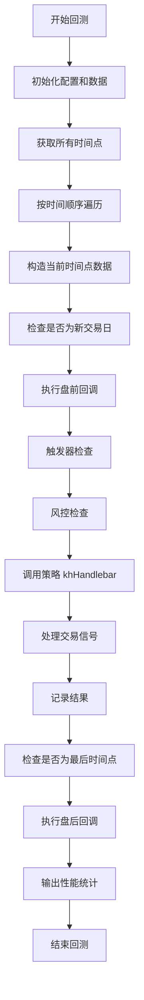
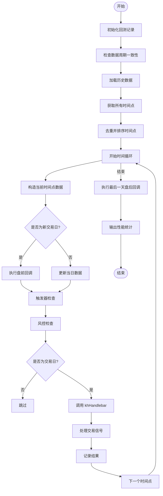
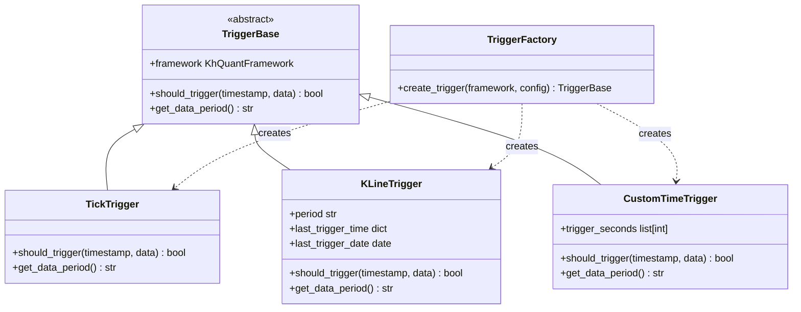
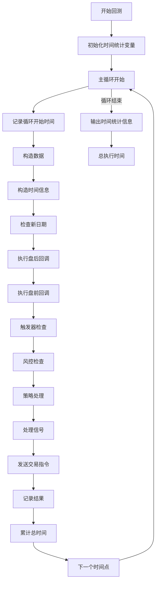
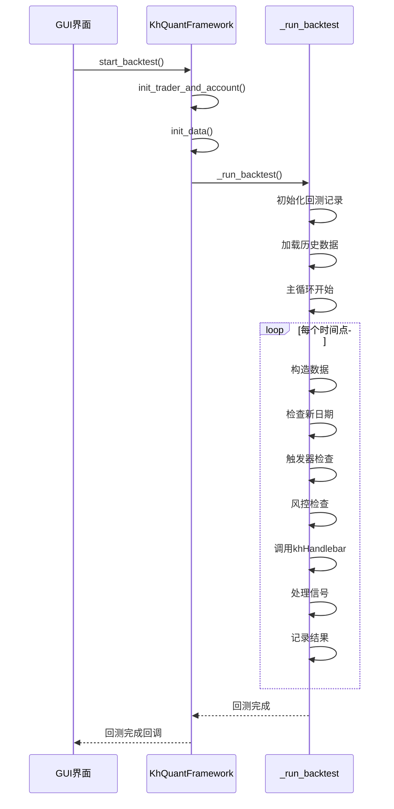
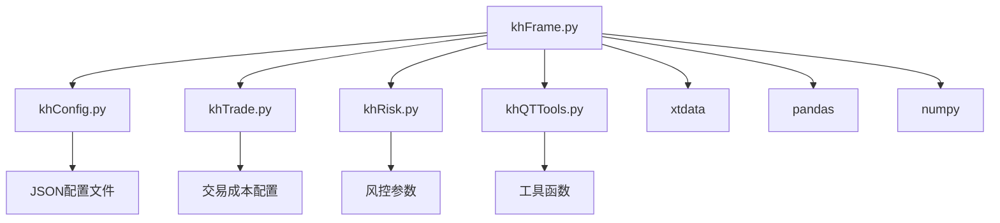

# 回测引擎

<cite>
**本文档引用的文件**   
- [khFrame.py](file://khFrame.py)
- [khConfig.py](file://khConfig.py)
- [khQuantImport.py](file://khQuantImport.py)
- [khTrade.py](file://khTrade.py)
</cite>

## 目录
1. [引言](#引言)
2. [项目结构](#项目结构)
3. 核心组件
4. [架构概述](#架构概述)
5. [详细组件分析](#详细组件分析)
6. [依赖分析](#依赖分析)
7. [性能考虑](#性能考虑)
8. [故障排除指南](#故障排除指南)
9. [结论](#结论)
10. [附录](#附录)（如有必要）

## 引言
本文档旨在深入分析回测引擎的内部实现，特别是`_run_backtest`私有方法。该方法是整个回测流程的核心，负责驱动策略在历史数据上的执行。文档将详细阐述回测主循环的逻辑，包括如何根据配置的触发模式（Tick、1m、5m、1d）驱动策略执行，以及回测过程中的性能监控机制。

## 项目结构
项目结构清晰地划分了不同功能模块。核心的回测引擎逻辑位于`khFrame.py`文件中，而配置管理、交易执行和工具函数则分别位于`khConfig.py`、`khTrade.py`和`khQuantImport.py`中。策略文件位于`strategies/`目录下，GUI相关代码位于项目根目录。

## 核心组件
`_run_backtest`方法是回测引擎的核心，它协调了数据加载、时间循环、策略执行和结果记录等关键步骤。该方法通过`TriggerFactory`创建的触发器来决定`khHandlebar`的调用频率，并处理交易日的判断和非交易日的跳过逻辑。

**Section sources**
- [khFrame.py](file://khFrame.py#L1247-L1775)
- [khFrame.py](file://khFrame.py#L1775-L2172)

## 架构概述
回测引擎采用事件驱动架构，通过一个主循环遍历所有历史数据的时间点。在每个时间点，引擎会检查是否满足触发条件，如果满足，则调用策略的`khHandlebar`方法。整个流程包括数据准备、时间循环、策略执行、信号处理和结果记录。

**Diagram sources **
- [khFrame.py](file://khFrame.py#L1247-L2172)

## 详细组件分析

### `_run_backtest` 方法分析
`_run_backtest`方法是回测引擎的主入口，它实现了完整的回测流程。

#### 回测主循环逻辑

**Diagram sources **
- [khFrame.py](file://khFrame.py#L1247-L2172)

#### 触发模式与策略执行
回测引擎支持多种触发模式，通过`TriggerFactory`创建相应的触发器实例。触发器决定了`khHandlebar`的调用频率。

**Diagram sources **
- [khFrame.py](file://khFrame.py#L87-L244)

**Section sources**
- [khFrame.py](file://khFrame.py#L87-L244)
- [khFrame.py](file://khFrame.py#L1247-L2172)

### 回测性能监控机制
回测引擎内置了详细的性能监控机制，用于分析回测过程中的时间消耗。

**Diagram sources **
- [khFrame.py](file://khFrame.py#L1783-L2172)

**Section sources**
- [khFrame.py](file://khFrame.py#L1783-L2172)

### `run` 方法上下文
`_run_backtest`方法通常在`run`方法中被调用，作为回测模式的执行入口。

**Diagram sources **
- [khFrame.py](file://khFrame.py#L1247-L2172)
- [GUIkhQuant.py](file://GUIkhQuant.py#L514-L532)

**Section sources**
- [khFrame.py](file://khFrame.py#L1247-L2172)
- [GUIkhQuant.py](file://GUIkhQuant.py#L514-L532)

## 依赖分析
回测引擎依赖于多个核心组件，包括配置管理、交易管理、风险管理等。

**Diagram sources **
- [khFrame.py](file://khFrame.py#L18-L20)
- [khConfig.py](file://khConfig.py#L6-L105)
- [khTrade.py](file://khTrade.py#L9-L17)
- [khRisk.py](file://khRisk.py#L1-L10)

**Section sources**
- [khFrame.py](file://khFrame.py#L18-L20)
- [khConfig.py](file://khConfig.py#L6-L105)
- [khTrade.py](file://khTrade.py#L9-L17)
- [khRisk.py](file://khRisk.py#L1-L10)

## 性能考虑
回测引擎在设计时充分考虑了性能优化，包括数据缓存、进度显示优化和日志输出控制。

**Section sources**
- [khFrame.py](file://khFrame.py#L1711-L1742)
- [khFrame.py](file://khFrame.py#L1809-L1825)

## 故障排除指南
当回测出现问题时，可以检查以下常见问题：
- 确认配置文件中的股票列表是否正确
- 检查历史数据是否已成功下载
- 验证策略文件路径是否正确
- 确认触发模式配置是否符合预期

**Section sources**
- [khFrame.py](file://khFrame.py#L1280-L1282)
- [khFrame.py](file://khFrame.py#L1493-L1495)
- [khFrame.py](file://khFrame.py#L1635-L1636)

## 结论
`_run_backtest`方法是回测引擎的核心，它通过一个高效的时间循环驱动策略在历史数据上的执行。该方法支持多种触发模式，具有完善的性能监控和错误处理机制，为量化策略的回测提供了可靠的基础。