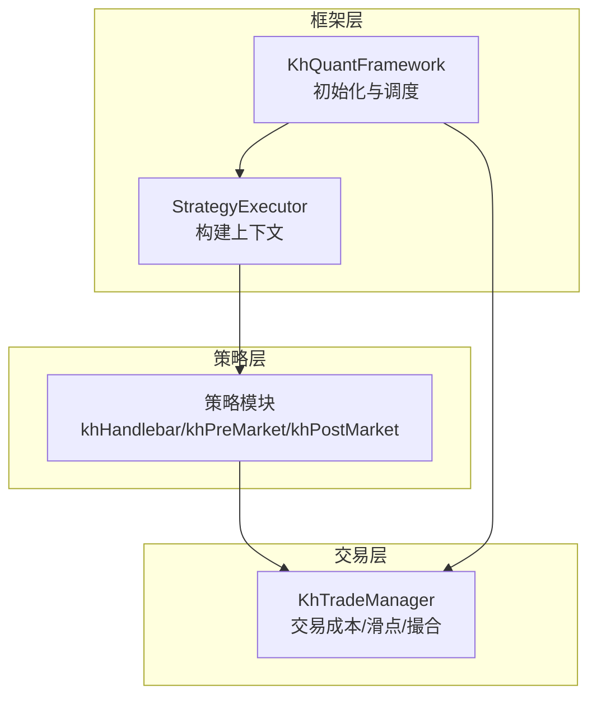
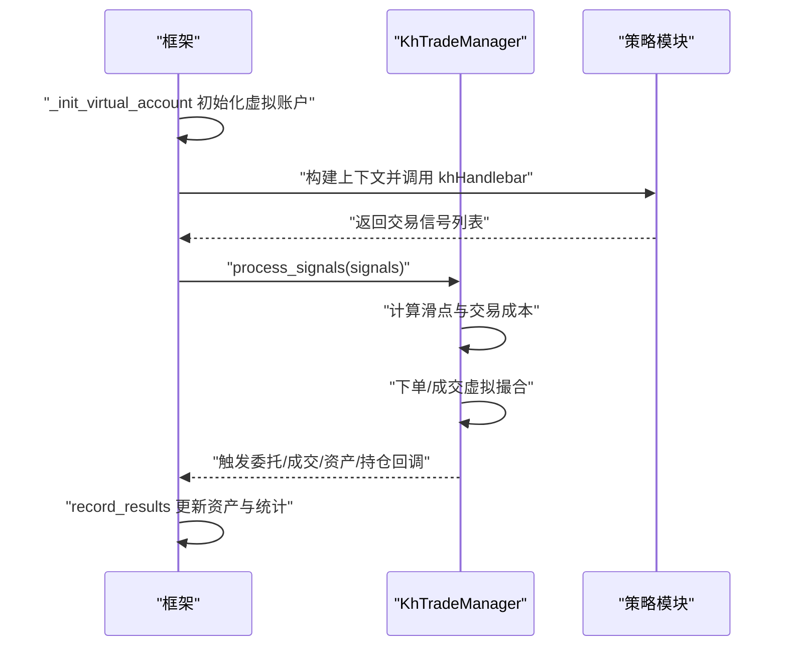
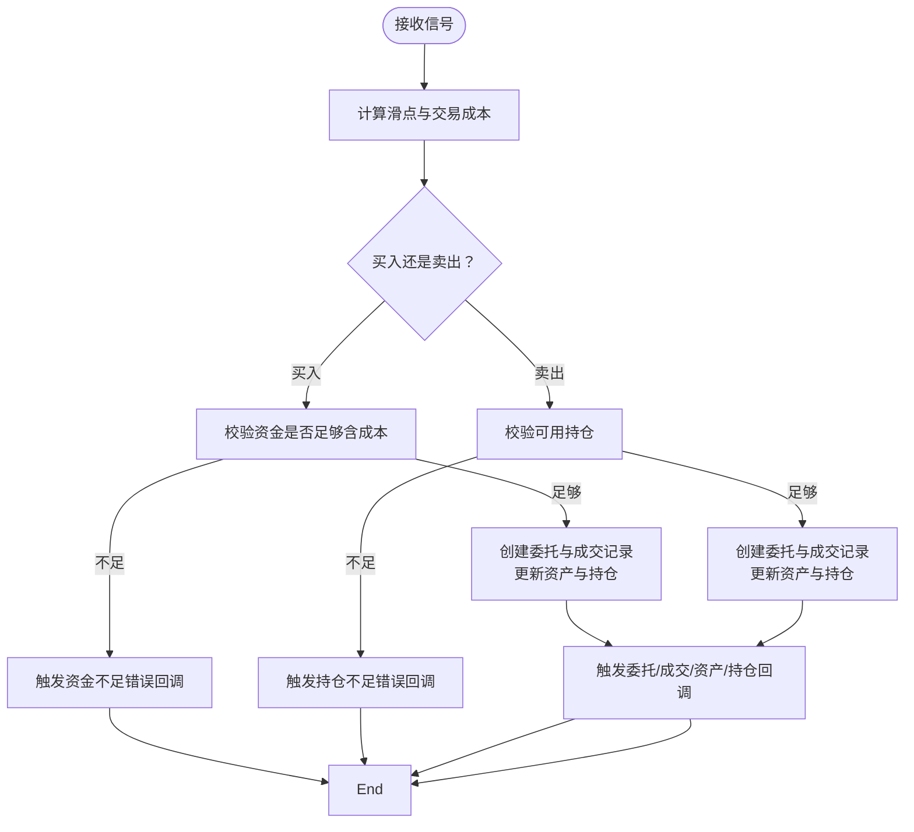
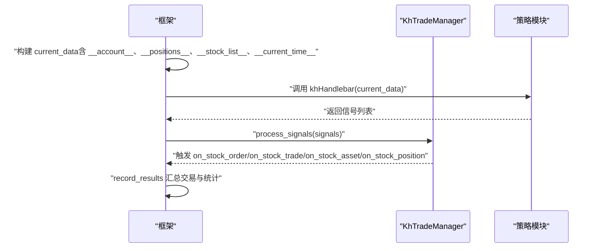
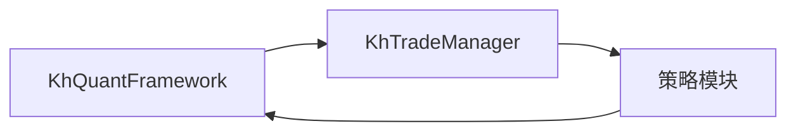

# 投资组合管理

<cite>
**本文引用的文件**
- [khTrade.py](file://khTrade.py)
- [khFrame.py](file://khFrame.py)
- [README.md](file://README.md)
- [modules/khFrame.md](file://modules/khFrame.md)
</cite>

## 目录
1. [简介](#简介)
2. [项目结构](#项目结构)
3. [核心组件](#核心组件)
4. [架构总览](#架构总览)
5. [详细组件分析](#详细组件分析)
6. [依赖关系分析](#依赖关系分析)
7. [性能考量](#性能考量)
8. [故障排查指南](#故障排查指南)
9. [结论](#结论)
10. [附录](#附录)

## 简介
本文件系统化阐述框架如何与 khTrade.py 模块协同进行投资组合管理，重点覆盖以下方面：
- 虚拟账户初始化：_init_virtual_account 如何依据回测配置创建虚拟账户，初始化资产（cash、total_asset）、持仓、委托和成交等数据结构。
- 交易管理器：KhTradeManager 如何接收来自策略的交易信号，执行虚拟撮合，更新投资组合状态。
- 运行流程：run 方法（在 khFrame.py 中）如何将账户、持仓和股票池信息注入到传递给策略的 data_with_time 字典中，实现投资组合状态的实时反馈。
- 职责边界：框架与交易管理器的职责划分，以及与策略交互的契约。
- 数据结构示例：资产与持仓 JSON 示例，便于理解与对接。

## 项目结构
围绕投资组合管理的关键文件与职责：
- khTrade.py：交易管理器 KhTradeManager，负责交易成本计算、滑点模拟、下单与成交虚拟撮合、资产与持仓更新、回调触发。
- khFrame.py：框架主流程，负责初始化虚拟账户、构建策略上下文（注入账户与持仓）、调度策略执行、处理交易信号、记录回测结果。
- README.md：策略上下文结构与交易信号规范说明，明确 __account__、__positions__ 等键的含义。
- modules/khFrame.md：策略执行器 StrategyExecutor 的上下文构建逻辑，展示如何将账户与持仓注入到策略上下文中。



图表来源
- [khFrame.py](file://khFrame.py#L1734-L2149)
- [khTrade.py](file://khTrade.py#L197-L595)

章节来源
- [khFrame.py](file://khFrame.py#L1734-L2149)
- [khTrade.py](file://khTrade.py#L197-L595)
- [README.md](file://README.md#L1677-L1817)

## 核心组件
- KhTradeManager（khTrade.py）
  - 负责交易成本计算（佣金、印花税、过户费、流量费）、滑点模拟（tick/ratio）、下单与成交虚拟撮合、资产与持仓更新、委托与成交字典维护、错误与回调处理。
- KhQuantFramework（khFrame.py）
  - 负责初始化虚拟账户（资产、持仓、委托、成交字典）、构建策略上下文（注入 __account__、__positions__、__stock_list__、__current_time__）、调度策略执行、处理交易信号、记录回测结果。

章节来源
- [khTrade.py](file://khTrade.py#L1-L120)
- [khFrame.py](file://khFrame.py#L658-L703)

## 架构总览
框架与交易管理器的协作流程：
- 初始化阶段：框架调用 _init_virtual_account，创建虚拟账户并初始化交易管理器的资产、持仓、委托、成交字典。
- 运行阶段：框架按时间推进，构建包含 __account__、__positions__、__stock_list__、__current_time__ 的上下文，调用策略的 khHandlebar，策略返回交易信号；框架将信号交给交易管理器，交易管理器执行虚拟撮合并更新资产与持仓。
- 结果阶段：框架在 record_results 中汇总交易明细、每日统计与基准数据，并在必要时触发资产回调。



图表来源
- [khFrame.py](file://khFrame.py#L658-L703)
- [khFrame.py](file://khFrame.py#L1950-L2149)
- [khTrade.py](file://khTrade.py#L197-L595)

## 详细组件分析

### 虚拟账户初始化：_init_virtual_account
- 初始化步骤
  - 创建虚拟账户对象（StockAccount），设置基准合约（benchmark）。
  - 从回测配置读取初始资金 init_capital，初始化交易管理器的 assets 字典（包含 account_type、account_id、cash、frozen_cash、market_value、total_asset、benchmark）。
  - 初始化 positions、orders、trades 字典为空。
- 资产与基准
  - assets["cash"] 与 assets["total_asset"] 初始值相等，均为 init_capital。
  - benchmark 由配置中的 backtest.benchmark 转换而来（如 sh.000300 -> 000300.SH）。

章节来源
- [khFrame.py](file://khFrame.py#L658-L703)

### 交易管理器：KhTradeManager
- 交易成本与滑点
  - 支持最低佣金、佣金比例、印花税率、流量费、滑点（tick 与 ratio 两种模式）。
  - calculate_trade_cost 统一计算实际成交价格与总成本。
- 下单与撮合（回测）
  - process_signals 接收信号列表，为每条信号计算交易成本与实际成交价格，并调用 place_order。
  - _place_order_backtest 执行虚拟撮合：
    - 买入：校验资金是否足够（含成本），扣减 required_cash，更新资产 cash；创建或更新持仓，设置 can_use_volume 取决于 T+0/T+1 模式。
    - 卖出：校验可用持仓，计算 cash 增加（成交金额 - 成本），更新持仓与可用数量。
  - 触发回调：on_stock_order、on_stock_trade、on_stock_asset、on_stock_position。
- 错误处理
  - 资金不足、持仓不足、下单异常均通过 on_order_error 回调上报。



图表来源
- [khTrade.py](file://khTrade.py#L197-L595)

章节来源
- [khTrade.py](file://khTrade.py#L1-L120)
- [khTrade.py](file://khTrade.py#L197-L595)

### 运行流程：上下文注入与实时反馈
- 上下文构建
  - 框架在每次时间推进时，将 __current_time__、__account__、__positions__、__stock_list__ 注入到 current_data，再传入策略的 khHandlebar。
  - __account__ 来源于 trade_mgr.assets，__positions__ 来源于 trade_mgr.positions。
- 策略执行与信号处理
  - 策略返回信号列表，框架统一处理价格精度与时间戳，然后调用 trade_mgr.process_signals 执行虚拟撮合。
- 结果记录
  - record_results 会汇总交易明细、每日统计与基准数据，并在资产显著变化时触发资产回调。



图表来源
- [khFrame.py](file://khFrame.py#L1950-L2149)
- [khFrame.py](file://khFrame.py#L2600-L2799)
- [khTrade.py](file://khTrade.py#L197-L595)

章节来源
- [khFrame.py](file://khFrame.py#L1950-L2149)
- [khFrame.py](file://khFrame.py#L2600-L2799)
- [README.md](file://README.md#L1677-L1817)

### 职责边界
- 框架职责
  - 初始化虚拟账户与数据环境，构建策略上下文，调度策略执行，处理交易信号，记录回测结果。
- 交易管理器职责
  - 完成交易成本与滑点计算、下单与成交虚拟撮合、资产与持仓更新、错误与回调处理。
- 策略职责
  - 基于上下文生成交易信号，遵循信号字段规范（code、action、price、volume 等）。

章节来源
- [khFrame.py](file://khFrame.py#L658-L703)
- [khTrade.py](file://khTrade.py#L197-L595)
- [README.md](file://README.md#L1677-L1817)

### 数据结构与示例

#### 资产（assets）JSON 示例
- 字段说明
  - account_type：账户类型
  - account_id：账户ID
  - cash：当前可用资金
  - frozen_cash：冻结资金
  - market_value：持仓市值
  - total_asset：总资产（cash + market_value）
  - benchmark：基准指数代码

```json
{
  "account_type": "SECURITY_ACCOUNT",
  "account_id": "账户ID",
  "cash": 1000000.00,
  "frozen_cash": 0.00,
  "market_value": 0.00,
  "total_asset": 1000000.00,
  "benchmark": "000300.SH"
}
```

章节来源
- [khFrame.py](file://khFrame.py#L658-L703)
- [README.md](file://README.md#L1780-L1817)

#### 持仓（positions）JSON 示例
- 字段说明
  - account_type：账户类型
  - account_id：账户ID
  - stock_code：股票代码
  - volume：持仓数量
  - can_use_volume：可用数量（可卖出数量）
  - open_price：当日开盘价
  - market_value：持仓市值
  - frozen_volume：冻结数量
  - on_road_volume：在途数量
  - yesterday_volume：昨日持仓数量
  - avg_price：持仓成本价
  - current_price：当前市价
  - direction：持仓方向
  - profit：浮动盈亏
  - profit_ratio：浮动盈亏率

```json
{
  "000001.SZ": {
    "account_type": "SECURITY_ACCOUNT",
    "account_id": "账户ID",
    "stock_code": "000001.SZ",
    "volume": 1000,
    "can_use_volume": 0,
    "open_price": 10.00,
    "market_value": 10000.00,
    "frozen_volume": 0,
    "on_road_volume": 0,
    "yesterday_volume": 0,
    "avg_price": 10.00,
    "current_price": 10.00,
    "direction": 1,
    "profit": 0.00,
    "profit_ratio": 0.00
  }
}
```

章节来源
- [README.md](file://README.md#L1677-L1817)

## 依赖关系分析
- 框架对交易管理器的依赖
  - 初始化：框架创建 KhTradeManager 并注入配置与回调。
  - 运行：框架将信号交由交易管理器处理，交易管理器更新资产与持仓并触发回调。
- 交易管理器对框架的依赖
  - 通过回调对象触发委托、成交、资产与持仓变更通知。
- 策略对框架与交易管理器的依赖
  - 通过上下文中的 __account__、__positions__ 获取实时投资组合状态。



图表来源
- [khFrame.py](file://khFrame.py#L557-L703)
- [khTrade.py](file://khTrade.py#L197-L595)

章节来源
- [khFrame.py](file://khFrame.py#L557-L703)
- [khTrade.py](file://khTrade.py#L197-L595)

## 性能考量
- 交易成本与滑点计算
  - 在回测下单时提前计算滑点与交易成本，避免重复计算。
- 市值与总资产更新
  - 在 record_results 中按交易日批量计算持仓市值与总资产，减少不必要的回调触发。
- 信号处理优化
  - 使用列表推导式批量生成交易记录，降低 append 次数。
- T+0/T+1 模式
  - 通过 set_t0_mode 控制可用数量规则，影响卖出可用性与回测逻辑分支。

章节来源
- [khTrade.py](file://khTrade.py#L197-L595)
- [khFrame.py](file://khFrame.py#L2600-L2799)

## 故障排查指南
- 资金不足
  - 现象：买入时提示所需资金大于可用资金。
  - 处理：检查交易成本配置（佣金、印花税、过户费、流量费）与滑点设置；确认策略下单量与价格是否合理。
- 持仓不足
  - 现象：卖出时提示可用持仓不足。
  - 处理：确认 T+0/T+1 模式与可用数量；检查策略是否正确跟踪持仓。
- 下单异常
  - 现象：下单执行异常，触发通用错误回调。
  - 处理：查看日志与错误消息，核对信号字段与价格精度。

章节来源
- [khTrade.py](file://khTrade.py#L287-L327)
- [khTrade.py](file://khTrade.py#L496-L507)

## 结论
- 框架通过 _init_virtual_account 初始化虚拟账户，确保资产、持仓、委托、成交字典的初始状态与回测配置一致。
- 交易管理器 KhTradeManager 负责交易成本与滑点计算、下单与成交虚拟撮合，并通过回调将资产与持仓变化反馈给框架。
- 框架在运行过程中将账户与持仓注入到策略上下文中，使策略能够基于实时投资组合状态生成交易信号，形成闭环。
- 通过清晰的职责边界与标准化的数据结构，系统实现了可扩展、可验证的投资组合管理与回测流程。

## 附录
- 交易信号字段规范
  - code：股票代码（标准 QMT 格式）
  - action：交易动作（buy/sell）
  - price：交易价格
  - volume：交易数量（必须是100的整数倍）
  - reason：交易原因或备注
  - timestamp：信号生成时的时间戳

章节来源
- [README.md](file://README.md#L1716-L1735)