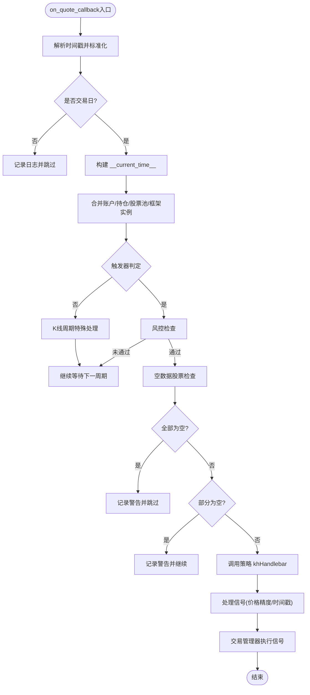

# 数据管理

<cite>
**本文引用的文件**
- [khFrame.py](file://khFrame.py)
- [khConfig.py](file://khConfig.py)
- [khQuantImport.py](file://khQuantImport.py)
- [README.md](file://README.md)
- [khQTTools.py](file://khQTTools.py)
</cite>

## 目录
1. [简介](#简介)
2. [项目结构](#项目结构)
3. [核心组件](#核心组件)
4. [架构总览](#架构总览)
5. [详细组件分析](#详细组件分析)
6. [依赖关系分析](#依赖关系分析)
7. [性能考量](#性能考量)
8. [故障排查指南](#故障排查指南)
9. [结论](#结论)

## 简介
本章节围绕核心框架的数据管理引擎展开，重点说明以下内容：
- init_data 方法如何通过 xtdata.download_history_data2 接口与 MiniQMT 通信，实现历史行情数据的增量下载；
- get_stock_list 方法如何从配置文件或兼容性文件中获取股票代码列表，并处理异常情况下的默认值；
- 数据缓存机制，包括 daily_price_cache 和 _cached_benchmark_close 的设计目的与使用场景；
- 在 on_quote_callback 中如何处理实时/回测行情数据流，构建包含时间、账户、持仓的复合数据结构 data_with_time，并将其传递给策略；
- 提供数据下载流程图与数据结构示意图；
- 提供处理空数据股票的警告逻辑代码片段路径。

## 项目结构
数据管理相关的核心代码集中在 khFrame.py 中，配置来源为 khConfig.py，策略侧的数据访问与上下文封装由 khQuantImport.py 提供。README.md 对数据补充与数据下载的背景做了说明，khQTTools.py 提供了与 MiniQMT 交互的工具函数，包括 download_history_data2 的使用。


图表来源
- [khFrame.py](file://khFrame.py#L708-L742)
- [khConfig.py](file://khConfig.py#L57-L80)
- [khQuantImport.py](file://khQuantImport.py#L1-L120)
- [khQTTools.py](file://khQTTools.py#L2334-L2371)

章节来源
- [khFrame.py](file://khFrame.py#L708-L742)
- [khConfig.py](file://khConfig.py#L57-L80)
- [khQuantImport.py](file://khQuantImport.py#L1-L120)
- [README.md](file://README.md#L566-L1226)
- [khQTTools.py](file://khQTTools.py#L2334-L2371)

## 核心组件
- KhQuantFramework：框架主类，负责初始化交易接口、账户、数据缓存、策略加载与回测调度；其中 init_data 负责历史数据增量下载，on_quote_callback 负责实时/回测行情数据流处理。
- KhConfig：统一读取配置，提供 get_stock_list 与 update_stock_list 等能力，支持从 data.stock_list 与 data.stock_pool 的兼容读取。
- khQuantImport：提供策略侧的上下文解析与便捷函数，辅助策略从 data 中获取时间、账户、持仓、股票池等信息。
- xtquant.xtdata：MiniQMT 提供的历史数据下载与读取接口，框架通过 download_history_data2 实现增量下载，通过 get_market_data_ex 实现本地历史数据读取。

章节来源
- [khFrame.py](file://khFrame.py#L496-L570)
- [khConfig.py](file://khConfig.py#L1-L105)
- [khQuantImport.py](file://khQuantImport.py#L1-L120)

## 架构总览
数据管理引擎在框架启动时完成以下关键步骤：
- 读取配置并解析股票池；
- 通过 download_history_data2 对股票池进行增量历史数据下载；
- 回测阶段通过 get_market_data_ex 读取本地历史数据，构建时间序列；
- 在 on_quote_callback 中构建 data_with_time 复合数据结构，注入账户、持仓、股票池等上下文，传递给策略。


图表来源
- [khFrame.py](file://khFrame.py#L708-L742)
- [khFrame.py](file://khFrame.py#L1478-L1590)
- [khFrame.py](file://khFrame.py#L1826-L1970)
- [khConfig.py](file://khConfig.py#L57-L80)

## 详细组件分析

### init_data 历史数据增量下载
- 功能定位：在回测模式下，批量下载历史数据，采用增量模式，避免重复下载。
- 关键实现：
  - 通过 get_stock_list 获取股票池；
  - 调用 xtdata.download_history_data2，传入 period、start_time、end_time、incrementally=True 与回调；
  - 使用回调函数跟踪进度并在完成时退出等待循环。
- 设计要点：
  - 增量下载避免重复下载，提高效率；
  - 回调进度用于 UI 反馈与流程控制；
  - 若股票池为空，直接记录警告并返回。


图表来源
- [khFrame.py](file://khFrame.py#L708-L742)
- [khConfig.py](file://khConfig.py#L57-L80)

章节来源
- [khFrame.py](file://khFrame.py#L708-L742)
- [khConfig.py](file://khConfig.py#L57-L80)
- [README.md](file://README.md#L566-L1226)
- [khQTTools.py](file://khQTTools.py#L2334-L2371)

### get_stock_list 股票池解析与异常处理
- 优先从 data.stock_list 读取；
- 若为空，尝试从 data.stock_pool（兼容性）读取；
- 若仍为空，尝试从 data.stock_list_file（兼容性文件）读取并写回配置；
- 若仍失败，使用默认股票并记录警告；
- 异常时回退到默认股票并记录错误日志。


图表来源
- [khFrame.py](file://khFrame.py#L1101-L1133)
- [khConfig.py](file://khConfig.py#L57-L80)

章节来源
- [khFrame.py](file://khFrame.py#L1101-L1133)
- [khConfig.py](file://khConfig.py#L57-L80)

### 数据缓存机制：daily_price_cache 与 _cached_benchmark_close
- daily_price_cache：日线价格缓存，用于存储所有股票的日线数据，便于回测时快速访问。
- _cached_benchmark_close：基准指数收盘价缓存，避免重复获取基准数据，提升性能。
- 使用场景：
  - 在回测主循环中，通过预构建的历史数据引用与时间索引映射，减少重复计算；
  - 在计算每日收益与基准对比时，使用缓存的基准收盘价，避免重复查询。


图表来源
- [khFrame.py](file://khFrame.py#L932-L933)
- [khFrame.py](file://khFrame.py#L2928-L2969)
- [modules/khFrame.md](file://modules/khFrame.md#L305-L390)

章节来源
- [khFrame.py](file://khFrame.py#L932-L933)
- [khFrame.py](file://khFrame.py#L2928-L2969)
- [modules/khFrame.md](file://modules/khFrame.md#L305-L390)

### on_quote_callback 实时/回测行情数据流与 data_with_time 构建
- 时间信息提取与标准化：支持毫秒/秒级时间戳，统一转换为标准时间信息字典；
- 交易日校验：若非交易日则跳过策略调用；
- data_with_time 构建：包含 __current_time__、账户信息 __account__、持仓信息 __positions__、股票池 __stock_list__、框架实例 __framework__；
- 策略调用：在触发器判定与风控检查通过后，调用策略 khHandlebar 并处理返回信号；
- 空数据股票处理：统计空数据股票并发出警告，部分空数据时记录警告但继续执行，全部空数据时跳过策略调用。



图表来源
- [khFrame.py](file://khFrame.py#L745-L911)
- [khFrame.py](file://khFrame.py#L1826-L1970)
- [khFrame.py](file://khFrame.py#L2090-L2151)

章节来源
- [khFrame.py](file://khFrame.py#L745-L911)
- [khFrame.py](file://khFrame.py#L1826-L1970)
- [khFrame.py](file://khFrame.py#L2090-L2151)

### 数据结构示意图：data_with_time
data_with_time 是策略侧接收的复合数据结构，包含：
- __current_time__：包含 timestamp、datetime、date、time 等字段；
- __account__：账户资金信息；
- __positions__：当前持仓信息；
- __stock_list__：股票池；
- __framework__：框架实例；
- [股票代码]：当前时间点的行情数据（Series）。

```mermaid
erDiagram
DATA_WITH_TIME {
dict __current_time__
dict __account__
dict __positions__
list __stock_list__
object __framework__
series 股票代码
}
__current_time__ {
int timestamp
string datetime
string date
string time
}
__account__ {
string account_type
string account_id
float cash
float frozen_cash
float market_value
float total_asset
string benchmark
}
__positions__ {
dict 股票代码
}
股票代码 {
series 行情字段(open/high/low/close/volume...)
}
```

图表来源
- [khFrame.py](file://khFrame.py#L1826-L1970)
- [README.md](file://README.md#L1611-L1748)

章节来源
- [khFrame.py](file://khFrame.py#L1826-L1970)
- [README.md](file://README.md#L1611-L1748)

### 处理空数据股票的警告逻辑（代码片段路径）
- 全部空数据股票：记录警告并跳过策略调用。
- 部分空数据股票：记录警告并继续执行。
- 空数据股票列表展示：限制显示数量并提示剩余数量。

章节来源
- [khFrame.py](file://khFrame.py#L853-L893)
- [khFrame.py](file://khFrame.py#L2090-L2130)

## 依赖关系分析
- KhQuantFramework 依赖 KhConfig 获取配置与股票池；
- 数据下载依赖 xtquant.xtdata.download_history_data2；
- 历史数据读取依赖 xtquant.xtdata.get_market_data_ex；
- 策略侧上下文解析依赖 khQuantImport 的 TimeInfo、StockDataParser、PositionParser、StockPoolParser 等；
- khQTTools 提供 download_history_data2 的封装与数据补充流程。


图表来源
- [khFrame.py](file://khFrame.py#L708-L742)
- [khConfig.py](file://khConfig.py#L1-L105)
- [khQuantImport.py](file://khQuantImport.py#L1-L120)
- [khQTTools.py](file://khQTTools.py#L2334-L2371)

章节来源
- [khFrame.py](file://khFrame.py#L708-L742)
- [khConfig.py](file://khConfig.py#L1-L105)
- [khQuantImport.py](file://khQuantImport.py#L1-L120)
- [khQTTools.py](file://khQTTools.py#L2334-L2371)

## 性能考量
- 增量下载：init_data 使用增量模式，避免重复下载，缩短准备时间；
- 预构建缓存：在回测前预构建 historical_data_ref、time_field_cache、time_idx_cache，减少循环中重复计算；
- 基准缓存：_cached_benchmark_close 预缓存基准指数收盘价，减少重复查询；
- 时间统计：回测循环中对各阶段耗时进行统计，便于定位性能瓶颈。

章节来源
- [khFrame.py](file://khFrame.py#L1711-L1742)
- [khFrame.py](file://khFrame.py#L2928-L2969)
- [khFrame.py](file://khFrame.py#L2162-L2171)

## 故障排查指南
- 股票池为空：init_data 会记录警告并返回，检查配置文件 data.stock_list 与 data.stock_pool 是否正确；
- 兼容性文件：若 data.stock_list_file 存在，框架会读取并写回配置，确保后续不再依赖该文件；
- 空数据股票：on_quote_callback 会对空数据股票发出警告，检查数据下载是否成功、数据范围是否正确；
- 增量下载失败：确认 MiniQMT 客户端路径与会话配置，检查网络与权限；
- 基准数据缺失：检查基准指数代码与回测时间范围，必要时手动下载基准数据。

章节来源
- [khFrame.py](file://khFrame.py#L708-L742)
- [khFrame.py](file://khFrame.py#L1101-L1133)
- [khFrame.py](file://khFrame.py#L853-L893)
- [khFrame.py](file://khFrame.py#L1390-L1476)

## 结论
本章节系统梳理了核心框架数据管理引擎的关键流程与实现细节，包括历史数据增量下载、股票池解析、数据缓存与实时/回测数据流处理。通过合理的缓存策略与严格的空数据检查，框架在保证策略执行准确性的同时，兼顾了性能与稳定性。建议在实际部署中：
- 确保配置文件中 data.stock_list 与 data.stock_pool 的一致性；
- 使用增量下载与预构建缓存，缩短回测准备时间；
- 在策略侧通过 khQuantImport 的上下文解析函数获取所需数据，避免直接访问底层 Series 的复杂性；
- 遇到空数据股票时，结合日志与警告信息定位数据源问题。