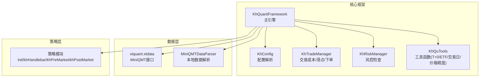
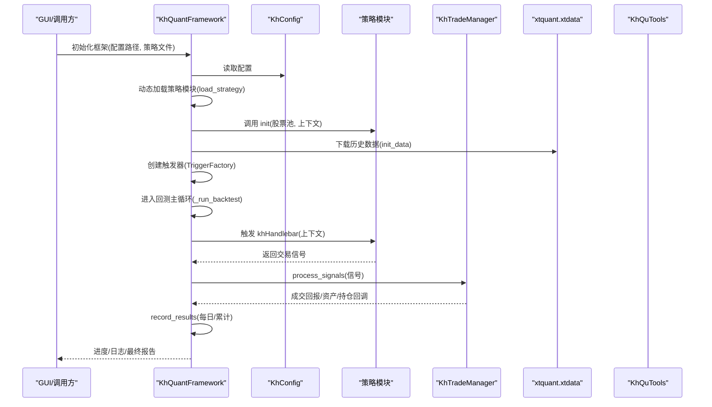
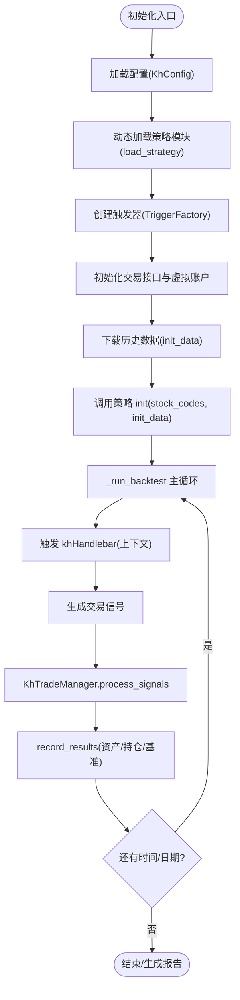
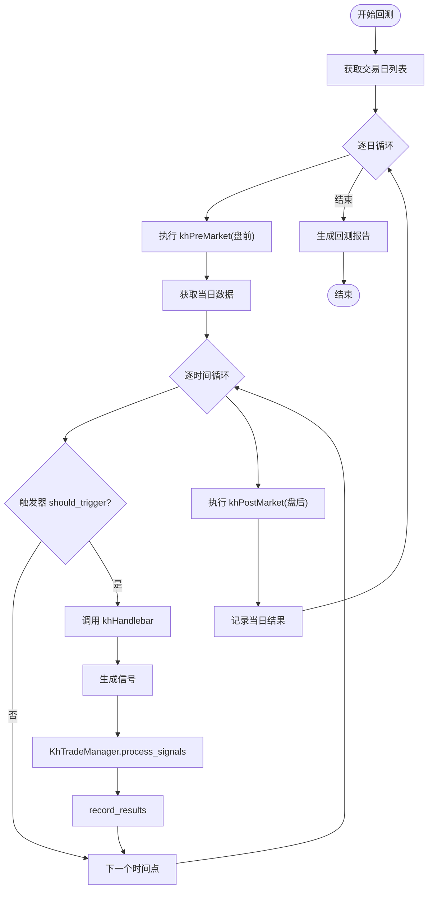
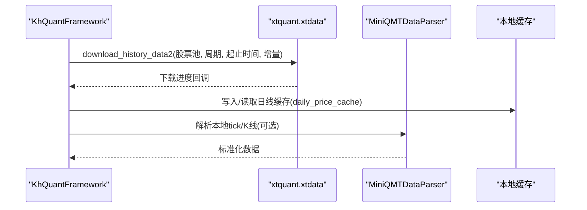
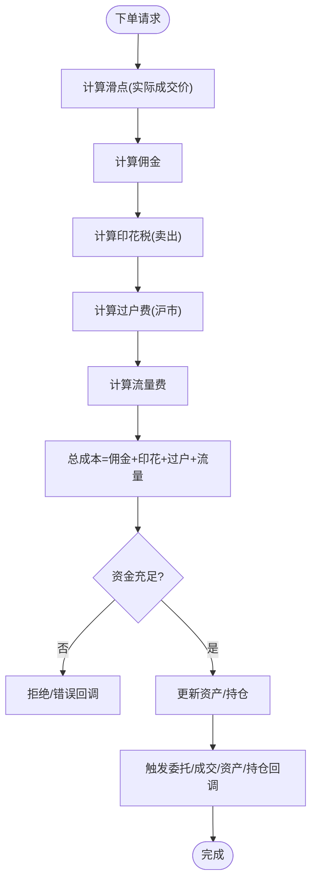
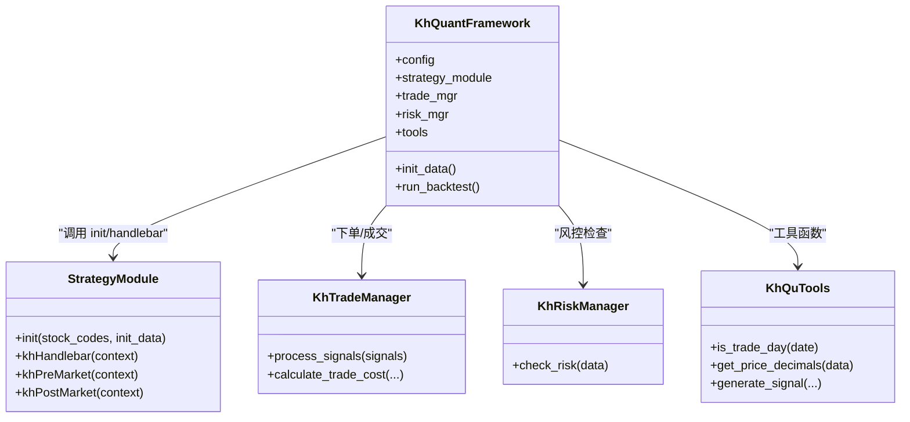
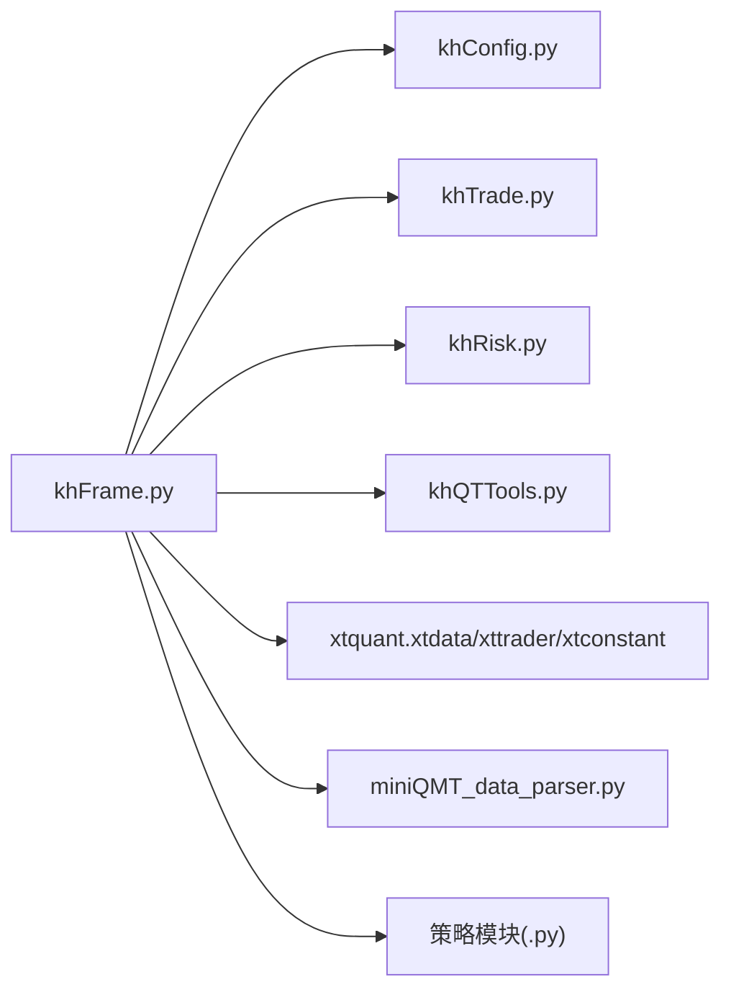

# 核心框架

<cite>
**本文引用的文件**
- [khFrame.py](file://khFrame.py)
- [khConfig.py](file://khConfig.py)
- [khTrade.py](file://khTrade.py)
- [khRisk.py](file://khRisk.py)
- [khQTTools.py](file://khQTTools.py)
- [miniQMT_data_parser.py](file://miniQMT_data_parser.py)
- [README.md](file://README.md)
</cite>

## 目录
1. [简介](#简介)
2. [项目结构](#项目结构)
3. [核心组件](#核心组件)
4. [架构总览](#架构总览)
5. [详细组件分析](#详细组件分析)
6. [依赖分析](#依赖分析)
7. [性能考量](#性能考量)
8. [故障排查指南](#故障排查指南)
9. [结论](#结论)
10. [附录](#附录)

## 简介
本文件围绕核心框架模块“khFrame.py”，系统性阐述其作为策略执行引擎与回测框架的设计与实现，重点说明以下方面：
- KhQuantFramework 主类的初始化流程、配置解析、策略模块动态加载与事件触发器创建
- 策略生命周期管理：init 与 khHandlebar 等必需函数的调用流程
- 数据管理引擎如何通过 xtquant 库从 MiniQMT 获取历史数据并实现本地缓存
- 回测执行引擎主循环逻辑：Tick/K线/自定义时间三种触发模式、交易信号生成与执行、成本与滑点计算
- StrategyExecutor、DataManager、BacktestEngine 等核心类的交互关系图
- 策略执行上下文构建的代码示例路径

## 项目结构
khFrame.py 是量化策略执行引擎的核心，围绕策略生命周期、数据管理、交易执行与回测主循环展开；khConfig.py 提供配置解析；khTrade.py 提供交易成本与滑点计算；khRisk.py 提供风控检查；khQTTools.py 提供工具函数（如价格精度、T+0支持、交易日判断等）；miniQMT_data_parser.py 提供 MiniQMT 本地数据解析能力。

图表来源
- [khFrame.py](file://khFrame.py#L496-L740)
- [khConfig.py](file://khConfig.py#L1-L105)
- [khTrade.py](file://khTrade.py#L1-L120)
- [khRisk.py](file://khRisk.py#L1-L51)
- [khQTTools.py](file://khQTTools.py#L1-L120)
- [miniQMT_data_parser.py](file://miniQMT_data_parser.py#L1-L120)

章节来源
- [khFrame.py](file://khFrame.py#L496-L740)
- [khConfig.py](file://khConfig.py#L1-L105)

## 核心组件
- KhQuantFramework：框架主类，负责策略生命周期管理、事件触发器、交易接口与账户初始化、数据初始化、回测主循环与结果记录
- KhTradeManager：交易成本与滑点计算、下单与成交处理、资金与持仓更新
- KhRiskManager：风控检查（持仓/委托/止损）
- KhQuTools：价格精度、ETF/T+0支持、交易日判断、买卖量估算、信号生成等工具函数
- MiniQMTDataParser：MiniQMT本地数据解析（tick/K线）
- 配置类 KhConfig：解析配置、提供回测时间、股票池、交易成本、风控参数等

章节来源
- [khFrame.py](file://khFrame.py#L496-L740)
- [khTrade.py](file://khTrade.py#L1-L120)
- [khRisk.py](file://khRisk.py#L1-L51)
- [khQTTools.py](file://khQTTools.py#L1-L120)
- [miniQMT_data_parser.py](file://miniQMT_data_parser.py#L1-L120)
- [khConfig.py](file://khConfig.py#L1-L105)

## 架构总览
KhQuantFramework 作为策略执行引擎，串联配置、策略模块、数据与交易模块，形成事件驱动的回测执行流程。策略模块通过 init 提供上下文，khHandlebar 生成交易信号，KhTradeManager 执行下单与成交，KhRiskManager 进行风控检查，KhQuTools 提供价格精度与交易日判断等辅助能力。

图表来源
- [khFrame.py](file://khFrame.py#L649-L1068)
- [khTrade.py](file://khTrade.py#L198-L496)
- [khConfig.py](file://khConfig.py#L1-L105)
- [khQTTools.py](file://khQTTools.py#L1-L120)

## 详细组件分析

### KhQuantFramework 初始化与策略生命周期
- 初始化流程
  - 读取配置文件并解析为配置对象
  - 动态加载策略模块（importlib.spec_from_file_location + exec_module）
  - 创建触发器（Tick/K线/自定义时间）
  - 初始化交易接口与虚拟账户（回测模式）
  - 初始化风控与工具类
- 策略生命周期
  - 策略初始化：调用策略模块的 init(stock_codes, init_data)，init_data 包含 __stock_list__、__framework__、__current_time__、账户与持仓等
  - 回测主循环：遍历交易日与时间序列，按触发器条件调用 khHandlebar，生成信号并执行
  - 结束与收尾：记录最终资产、基准收益、回测统计

图表来源
- [khFrame.py](file://khFrame.py#L649-L1068)
- [khFrame.py](file://khFrame.py#L1779-L2171)

章节来源
- [khFrame.py](file://khFrame.py#L649-L1068)
- [khFrame.py](file://khFrame.py#L1779-L2171)

### 触发器与回测主循环
- 触发器类型
  - TickTrigger：每个Tick触发
  - KLineTrigger：1分钟/5分钟/日K线在形成时触发
  - CustomTimeTrigger：在指定时间点触发
- 主循环逻辑
  - 计算交易日列表，遍历时间序列
  - 盘前/盘后钩子（khPreMarket/khPostMarket）
  - 触发器 should_trigger 判断
  - khHandlebar 生成信号
  - 交易执行与成本/滑点计算
  - 每日/累计结果记录与基准收益计算

图表来源
- [khFrame.py](file://khFrame.py#L1779-L2171)

章节来源
- [khFrame.py](file://khFrame.py#L1779-L2171)

### 数据管理引擎与 MiniQMT 接口
- 历史数据下载
  - 使用 xtquant.xtdata.download_history_data2 下载指定周期、时间范围的历史数据
  - 支持增量下载，等待下载完成
- 本地数据解析
  - MiniQMTDataParser 提供 tick/K线解析，支持从本地文件系统读取并转换为统一格式
  - 支持ETF/T+0识别、价格精度、交易日判断等工具函数
- 本地缓存
  - 框架内部通过 daily_price_cache 与基准缓存实现日线价格缓存，减少重复获取

图表来源
- [khFrame.py](file://khFrame.py#L708-L743)
- [miniQMT_data_parser.py](file://miniQMT_data_parser.py#L1-L120)
- [khFrame.py](file://khFrame.py#L2928-L2955)

章节来源
- [khFrame.py](file://khFrame.py#L708-L743)
- [miniQMT_data_parser.py](file://miniQMT_data_parser.py#L1-L120)
- [khFrame.py](file://khFrame.py#L2928-L2955)

### 交易成本与滑点计算
- 成本构成
  - 佣金（最低收费、比例）
  - 印花税（卖出收取）
  - 过户费（沪市股票）
  - 流量费（每笔）
- 滑点模式
  - ratio：按成交额比例（双向）
  - tick：按最小变动价位跳数（双向）
- 交易执行
  - 回测下单：检查资金/持仓，计算实际成交价格与总成本，更新资产与持仓，触发委托/成交回调

图表来源
- [khTrade.py](file://khTrade.py#L117-L196)
- [khTrade.py](file://khTrade.py#L269-L496)

章节来源
- [khTrade.py](file://khTrade.py#L117-L196)
- [khTrade.py](file://khTrade.py#L269-L496)

### 策略执行上下文构建
- 上下文字段
  - __framework__：框架版本、配置、数据管理器等
  - __current_time__：时间戳/日期/时间
  - __account__：账户信息（回测虚拟账户）
  - __positions__：当前持仓
  - __stock_list__：股票池
- 上下文构建与传递
  - 在策略初始化时传入 init(stock_codes, init_data)
  - 在 khHandlebar 执行时传入当前上下文（包含各股票的实时行情）

图表来源
- [khFrame.py](file://khFrame.py#L1037-L1068)
- [khTrade.py](file://khTrade.py#L198-L496)
- [khRisk.py](file://khRisk.py#L1-L51)
- [khQTTools.py](file://khQTTools.py#L1-L120)

章节来源
- [khFrame.py](file://khFrame.py#L1037-L1068)
- [khTrade.py](file://khTrade.py#L198-L496)
- [khRisk.py](file://khRisk.py#L1-L51)
- [khQTTools.py](file://khQTTools.py#L1-L120)

## 依赖分析
- 外部依赖
  - xtquant：MiniQMT 接口（xtdata、xttrader、xtconstant）
  - PyQt5：GUI 信号与日志输出（在 SimpleGUI/DummySignal 中兼容非GUI模式）
  - pandas/numpy：数据处理
- 内部模块依赖
  - khFrame.py 依赖 khConfig、khTrade、khRisk、khQTTools
  - 策略模块通过动态加载接入框架
  - 数据层通过 xtquant 与本地解析器协同

图表来源
- [khFrame.py](file://khFrame.py#L1-L60)
- [khConfig.py](file://khConfig.py#L1-L105)
- [khTrade.py](file://khTrade.py#L1-L120)
- [khRisk.py](file://khRisk.py#L1-L51)
- [khQTTools.py](file://khQTTools.py#L1-L120)
- [miniQMT_data_parser.py](file://miniQMT_data_parser.py#L1-L120)

章节来源
- [khFrame.py](file://khFrame.py#L1-L60)
- [khConfig.py](file://khConfig.py#L1-L105)
- [khTrade.py](file://khTrade.py#L1-L120)
- [khRisk.py](file://khRisk.py#L1-L51)
- [khQTTools.py](file://khQTTools.py#L1-L120)
- [miniQMT_data_parser.py](file://miniQMT_data_parser.py#L1-L120)

## 性能考量
- 数据下载与缓存
  - 使用增量下载与本地缓存（日线价格缓存）降低重复下载与解析成本
- 时间统计
  - 回测主循环统计各阶段耗时（构造数据、触发器检查、策略处理、交易指令、记录结果等），便于定位瓶颈
- 交易成本与滑点
  - 在下单前统一计算成本与滑点，避免重复计算
- 交易日与时间判断
  - 使用工具函数快速判断交易日与交易时间，减少无效执行

章节来源
- [khFrame.py](file://khFrame.py#L1779-L2171)
- [khFrame.py](file://khFrame.py#L2928-L2955)
- [khTrade.py](file://khTrade.py#L117-L196)
- [khQTTools.py](file://khQTTools.py#L287-L376)

## 故障排查指南
- 策略加载失败
  - 检查策略文件路径与模块名，确认策略模块包含 init 与 khHandlebar
- 回测未触发
  - 检查触发器类型与时间点配置，确认 should_trigger 返回逻辑
- 交易失败
  - 资金不足/持仓不足：查看交易成本与滑点计算结果
  - 委托/成交回调：检查回调日志与错误信息
- 数据问题
  - 确认 MiniQMT 客户端已登录并提供接口
  - 检查数据下载进度与本地解析结果

章节来源
- [khFrame.py](file://khFrame.py#L649-L743)
- [khTrade.py](file://khTrade.py#L269-L496)
- [README.md](file://README.md#L390-L436)

## 结论
khFrame.py 通过 KhQuantFramework 将策略模块、配置、数据与交易模块有机整合，形成事件驱动的回测执行体系。其核心优势在于：
- 策略生命周期清晰：init 与 khHandlebar 的职责分离，上下文构建完整
- 数据获取与缓存：xtquant 与本地解析器协同，支持增量下载与日线缓存
- 交易成本与滑点：可配置的 ratio/tick 模式，真实模拟交易成本
- 回测主循环：支持 Tick/K线/自定义时间三种触发模式，具备盘前盘后钩子与时间统计

## 附录
- 策略执行上下文构建示例路径
  - 初始化上下文构建：[init_data 构建](file://khFrame.py#L1037-L1048)
  - 策略主逻辑上下文构建：[handlebar 上下文](file://khFrame.py#L1037-L1068)
- 交易信号生成与执行示例路径
  - 信号生成与执行：[process_signals](file://khTrade.py#L198-L241)
  - 回测下单与成交：[回测下单](file://khTrade.py#L269-L496)
- 数据下载与缓存示例路径
  - 历史数据下载：[init_data](file://khFrame.py#L708-L743)
  - 日线缓存与基准缓存：[daily_price_cache/_cached_benchmark_close](file://khFrame.py#L2928-L2955)
- 触发器与主循环示例路径
  - 触发器工厂与类型：[TriggerFactory](file://khFrame.py#L246-L276)
  - 回测主循环：[run_backtest 主循环](file://khFrame.py#L1779-L2171)