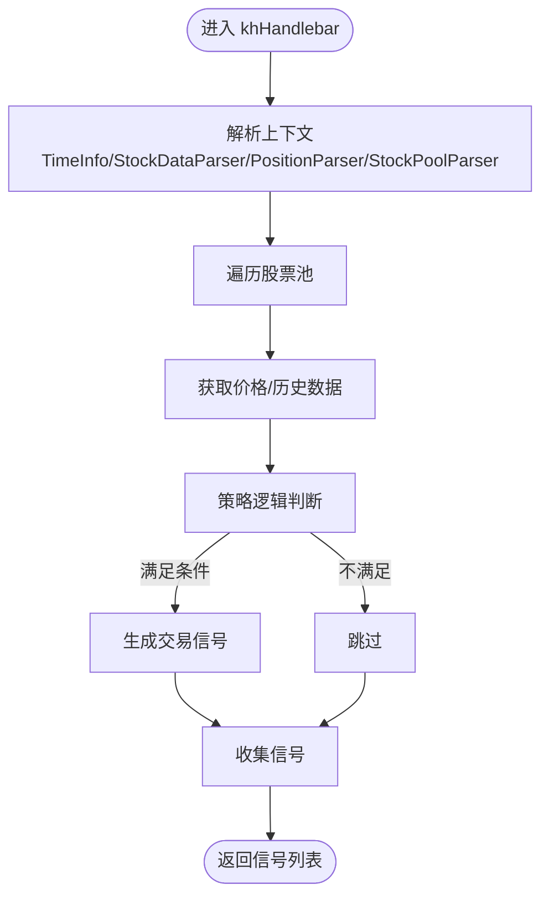

# 策略执行

<cite>
**本文引用的文件**
- [khFrame.py](file://khFrame.py)
- [khQuantImport.py](file://khQuantImport.py)
- [RSI策略.py](file://strategies/RSI策略.py)
- [双均线多股票_使用MA函数.py](file://strategies/双均线多股票_使用MA函数.py)
- [README.md](file://README.md)
- [modules/khFrame.md](file://modules/khFrame.md)
- [modules/GUIkhQuant.md](file://modules/GUIkhQuant.md)
</cite>

## 目录
1. [简介](#简介)
2. [项目结构](#项目结构)
3. [核心组件](#核心组件)
4. [架构总览](#架构总览)
5. [详细组件分析](#详细组件分析)
6. [依赖分析](#依赖分析)
7. [性能考量](#性能考量)
8. [故障排查指南](#故障排查指南)
9. [结论](#结论)
10. [附录](#附录)

## 简介
本文件围绕 KhQuantFramework 类的策略执行生命周期进行深入剖析，重点说明以下内容：
- init 和 khHandlebar 两个核心策略函数的调用时机与上下文
- 框架如何通过 load_strategy 方法动态加载用户提供的 .py 策略文件，并利用 importlib 实现模块热加载
- 策略初始化 init 函数如何接收股票列表和初始数据结构（包含账户、持仓等）
- khHandlebar 函数如何处理每个触发周期的行情数据并返回交易信号
- 策略执行流程图，从触发器触发到调用 khHandlebar 再到处理返回信号的完整链条
- 策略函数签名与参数类型说明（以代码片段路径代替具体代码）

## 项目结构
KhQuant 框架采用“核心框架 + 策略工具 + 策略示例”的组织方式：
- 核心框架：khFrame.py 提供策略生命周期管理、触发器、回测引擎、交易管理、风控等能力
- 策略工具：khQuantImport.py 提供统一导入、上下文解析、便捷函数、信号生成等
- 策略示例：strategies 目录包含多个示例策略，演示 init 与 khHandlebar 的典型用法
- 文档与模块：README.md 与 modules 目录提供接口规范、触发器说明与 GUI 加载校验

图表来源
- [khFrame.py](file://khFrame.py#L495-L1100)
- [khQuantImport.py](file://khQuantImport.py#L1-L120)
- [RSI策略.py](file://strategies/RSI策略.py#L1-L26)
- [双均线多股票_使用MA函数.py](file://strategies/双均线多股票_使用MA函数.py#L1-L36)

章节来源
- [khFrame.py](file://khFrame.py#L495-L1100)
- [khQuantImport.py](file://khQuantImport.py#L1-L120)

## 核心组件
- KhQuantFramework：框架主类，负责初始化、加载策略、构建上下文、触发策略、处理信号、记录回测结果
- 触发器体系：TickTrigger、KLineTrigger、CustomTimeTrigger，决定策略执行频率与时机
- khQuantImport：提供统一导入、上下文解析（TimeInfo、StockDataParser、PositionParser、StockPoolParser）、便捷函数（khGet、khPrice、khHas）、信号生成等
- 策略示例：展示 init(stock_list, context) 与 khHandlebar(context) 的典型实现

章节来源
- [khFrame.py](file://khFrame.py#L495-L1100)
- [khQuantImport.py](file://khQuantImport.py#L1-L120)
- [RSI策略.py](file://strategies/RSI策略.py#L1-L26)
- [双均线多股票_使用MA函数.py](file://strategies/双均线多股票_使用MA函数.py#L1-L36)

## 架构总览
KhQuantFramework 的策略执行链路由“触发器 → 上下文构建 → 策略调用 → 信号处理 → 记录结果”构成。下图展示了从行情回调到策略执行再到交易指令下发的关键节点。

图表来源
- [khFrame.py](file://khFrame.py#L800-L912)
- [khFrame.py](file://khFrame.py#L1040-L1060)
- [khFrame.py](file://khFrame.py#L2130-L2156)

章节来源
- [khFrame.py](file://khFrame.py#L800-L912)
- [khFrame.py](file://khFrame.py#L1040-L1060)
- [khFrame.py](file://khFrame.py#L2130-L2156)

## 详细组件分析

### 1) 策略加载与热加载（importlib）
- 动态加载：KhQuantFramework 在初始化阶段调用 load_strategy，使用 importlib.util.spec_from_file_location 创建模块规范，再通过 module_from_spec 创建模块对象，最后执行 spec.loader.exec_module 执行策略代码
- 热加载要点：将模块加入 sys.modules 并设置 __file__ 指向源文件，确保调试器（如 VSCode debugpy）能够正确识别模块并命中断点
- GUI 校验：GUIkhQuant 侧同样使用 importlib.util.spec_from_file_location 动态导入策略模块，验证 init 与 khHandlebar 是否存在

图表来源
- [khFrame.py](file://khFrame.py#L604-L649)
- [modules/GUIkhQuant.md](file://modules/GUIkhQuant.md#L495-L512)

章节来源
- [khFrame.py](file://khFrame.py#L604-L649)
- [modules/GUIkhQuant.md](file://modules/GUIkhQuant.md#L495-L512)

### 2) 初始化流程：init(stock_list, context)
- 调用时机：框架 run 阶段，完成交易接口初始化、数据准备、股票池类型与价格精度确定后，构建包含时间、账户、持仓、股票池的完整数据结构 init_data，并调用策略模块的 init(stock_list, init_data)
- 参数说明：
  - stock_list：股票池列表
  - context：包含 __current_time__、__account__、__positions__、__stock_list__、__framework__ 等字段的字典
- 示例策略：RSI策略.py 与双均线策略均提供 init(stocks=None, data=None) 的占位实现，表明多数策略无需复杂初始化

章节来源
- [khFrame.py](file://khFrame.py#L1027-L1048)
- [RSI策略.py](file://strategies/RSI策略.py#L1-L12)
- [双均线多股票_使用MA函数.py](file://strategies/双均线多股票_使用MA函数.py#L1-L12)

### 3) 触发器与执行频率
- 触发器类型：
  - TickTrigger：每个 Tick 都触发
  - KLineTrigger：按 1 分钟、5 分钟、日 K 线周期触发
  - CustomTimeTrigger：按自定义时间点触发，支持智能数据适配（全整分钟使用 1 分钟 K 线，否则使用 tick）
- 触发时机：on_quote_callback 或回测主循环中，先 should_trigger 判断，再进行风控检查与数据完整性检查，满足条件后才构建上下文并调用策略

章节来源
- [khFrame.py](file://khFrame.py#L52-L179)
- [README.md](file://README.md#L915-L967)

### 4) 上下文构建与数据注入
- 上下文字段：
  - __current_time__：timestamp/datetime/date/time/raw_time
  - __account__：账户资产（cash/frozen_cash/market_value/total_asset 等）
  - __positions__：持仓详情（volume/can_use_volume/avg_price/current_price/profit 等）
  - __stock_list__：股票池
  - __framework__：框架实例
  - [股票代码]：当前时间点的行情数据（Series/Pandas）
- 构建位置：on_quote_callback 与回测主循环中，分别将账户、持仓、股票池、框架实例注入到数据字典，再传入策略

章节来源
- [khFrame.py](file://khFrame.py#L818-L852)
- [khFrame.py](file://khFrame.py#L1954-L1970)
- [khFrame.py](file://khFrame.py#L2131-L2134)

### 5) 主策略函数：khHandlebar(context)
- 调用时机：触发器判定为 True 且风控通过后，框架将构建好的上下文传入策略模块的 khHandlebar
- 返回值：交易信号列表（每条信号包含 code/action/price/volume 等字段）
- 信号处理：框架对信号中的价格进行动态精度处理，并调用交易管理器 process_signals 执行
- 示例策略：
  - RSI策略：遍历股票池，计算 RSI，依据金叉死叉生成买卖信号
  - 双均线策略：使用 MA 计算 MA5/MA20，生成金叉死叉信号

图表来源
- [khQuantImport.py](file://khQuantImport.py#L133-L208)
- [khQuantImport.py](file://khQuantImport.py#L290-L339)
- [khQuantImport.py](file://khQuantImport.py#L317-L359)
- [RSI策略.py](file://strategies/RSI策略.py#L12-L26)
- [双均线多股票_使用MA函数.py](file://strategies/双均线多股票_使用MA函数.py#L14-L36)

章节来源
- [khQuantImport.py](file://khQuantImport.py#L133-L208)
- [khQuantImport.py](file://khQuantImport.py#L290-L359)
- [RSI策略.py](file://strategies/RSI策略.py#L12-L26)
- [双均线多股票_使用MA函数.py](file://strategies/双均线多股票_使用MA函数.py#L14-L36)

### 6) 信号处理与交易执行
- 价格精度：框架对信号中的 price 进行动态精度处理，确保符合股票池类型要求
- 交易执行：调用交易管理器 process_signals，将信号转换为底层交易指令
- 记录结果：调用 record_results，更新资产、持仓、每日统计，并在最后时间点保存回测结果

章节来源
- [khFrame.py](file://khFrame.py#L900-L907)
- [khFrame.py](file://khFrame.py#L2136-L2156)
- [khFrame.py](file://khFrame.py#L2506-L2680)

### 7) 盘前/盘后回调（可选）
- khPreMarket：每个交易日指定盘前时间点调用一次，上下文与 khHandlebar 相同
- khPostMarket：每个交易日指定盘后时间点调用一次，上下文与 khHandlebar 相同
- 触发条件：需在配置中启用相应回调

章节来源
- [khFrame.py](file://khFrame.py#L1972-L2061)
- [khFrame.py](file://khFrame.py#L2067-L2156)
- [README.md](file://README.md#L1727-L1748)

### 8) 策略函数签名与参数类型
- init(stock_list, context)
  - stock_list: List[str]，股票池列表
  - context: Dict，包含 __current_time__/__account__/__positions__/__stock_list__/__framework__ 等字段
- khHandlebar(context)
  - context: Dict，包含 __current_time__/__account__/__positions__/__stock_list__/[股票代码] 等字段
  - 返回: List[Dict]，每条信号字典包含 code/action/price/volume 等字段
- khPreMarket/context、khPostMarket/context：参数与 khHandlebar 相同

章节来源
- [README.md](file://README.md#L1677-L1748)
- [modules/khFrame.md](file://modules/khFrame.md#L59-L140)
- [modules/khFrame.md](file://modules/khFrame.md#L143-L300)

## 依赖分析
- 框架对策略模块的依赖：通过 importlib 动态导入，策略模块需提供 init 与 khHandlebar（可选 khPreMarket/khPostMarket）
- 策略对工具库的依赖：khQuantImport 提供统一导入与上下文解析，策略中常使用 khGet/khPrice/khHas/generate_signal 等便捷函数
- 触发器与数据周期：触发器类型与数据周期需匹配，框架会进行一致性检查并给出提示

图表来源
- [khFrame.py](file://khFrame.py#L604-L649)
- [khQuantImport.py](file://khQuantImport.py#L1-L120)
- [modules/khFrame.md](file://modules/khFrame.md#L59-L140)
- [modules/khFrame.md](file://modules/khFrame.md#L143-L300)

章节来源
- [khFrame.py](file://khFrame.py#L604-L649)
- [khQuantImport.py](file://khQuantImport.py#L1-L120)
- [modules/khFrame.md](file://modules/khFrame.md#L59-L140)

## 性能考量
- 数据缓存：回测主循环中对历史数据引用、时间字段映射、基准指数收盘价进行缓存，避免重复构建与网络请求
- 时间统计：框架对回测各阶段耗时进行统计，便于定位性能瓶颈
- 交易日判断与最后时间点：通过缓存与向量化操作减少重复计算
- 信号批量处理：使用列表推导式与批量更新，降低循环开销

章节来源
- [khFrame.py](file://khFrame.py#L1711-L1742)
- [khFrame.py](file://khFrame.py#L2162-L2171)
- [khFrame.py](file://khFrame.py#L2611-L2652)
- [khFrame.py](file://khFrame.py#L2671-L2732)
- [khFrame.py](file://khFrame.py#L2733-L2823)

## 故障排查指南
- 策略加载失败：检查策略文件路径、语法与必需函数（init/khHandlebar），GUI 侧同样会进行语法与函数存在性校验
- 触发器与数据周期不匹配：框架会提示不一致并询问是否继续，建议按提示调整配置
- 交易日判断与空数据：若非交易日或所有股票数据为空，框架会跳过策略调用并记录警告
- 信号格式错误：框架会对信号进行格式与字段校验，缺失字段或非法值会被忽略并记录警告
- 回测结果保存：框架会保存交易记录、每日统计、基准数据、策略与配置文件副本，便于复盘

章节来源
- [modules/GUIkhQuant.md](file://modules/GUIkhQuant.md#L495-L512)
- [khFrame.py](file://khFrame.py#L1135-L1247)
- [khFrame.py](file://khFrame.py#L868-L912)
- [khFrame.py](file://khFrame.py#L2413-L2452)
- [khFrame.py](file://khFrame.py#L2453-L2491)

## 结论
KhQuantFramework 通过清晰的策略生命周期管理、灵活的触发器体系与完善的上下文构建，为策略开发提供了稳定高效的执行环境。init 与 khHandlebar 的职责边界明确：前者负责初始化与状态建立，后者负责周期性决策与信号生成。配合 importlib 的动态加载与热加载机制，策略开发与调试体验良好；结合回测引擎与交易管理器，实现了从策略到实盘的顺畅衔接。

## 附录
- 策略示例参考：
  - RSI 策略：[RSI策略.py](file://strategies/RSI策略.py#L1-L26)
  - 双均线策略：[双均线多股票_使用MA函数.py](file://strategies/双均线多股票_使用MA函数.py#L1-L36)
- 接口规范与触发器说明：
  - [README.md](file://README.md#L1677-L1748)
  - [README.md](file://README.md#L915-L967)