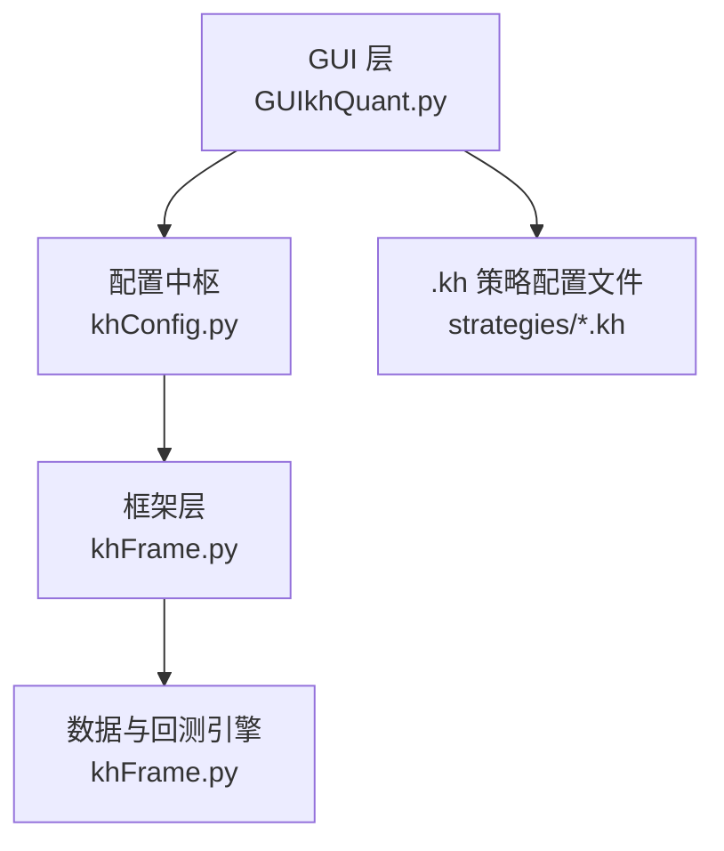
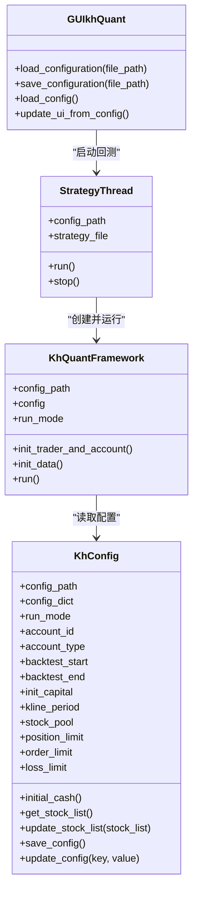
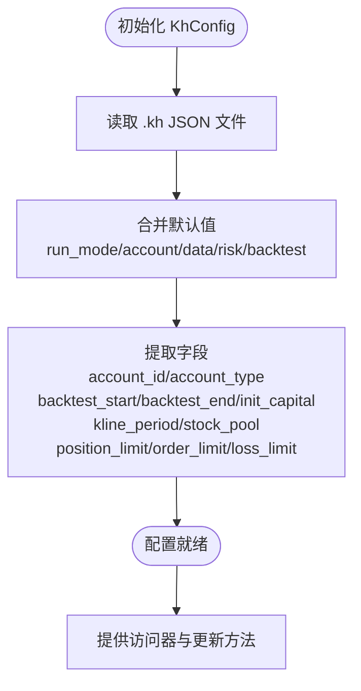
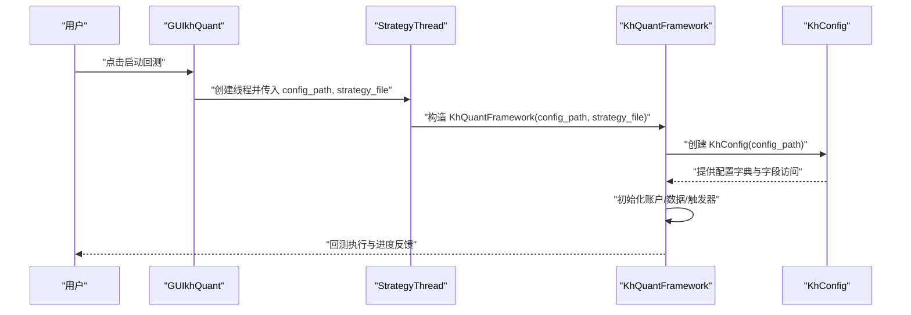
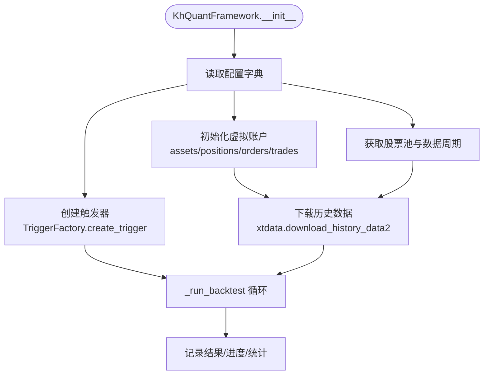
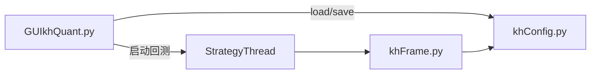

# 配置管理

<cite>
**本文引用的文件**
- [khConfig.py](file://khConfig.py)
- [GUIkhQuant.py](file://GUIkhQuant.py)
- [khFrame.py](file://khFrame.py)
- [RSI策略.kh](file://strategies/RSI策略.kh)
- [双均线多股票_使用MA函数.kh](file://strategies/双均线多股票_使用MA函数.kh)
</cite>

## 目录
1. [简介](#简介)
2. [项目结构](#项目结构)
3. [核心组件](#核心组件)
4. [架构总览](#架构总览)
5. [详细组件分析](#详细组件分析)
6. [依赖关系分析](#依赖关系分析)
7. [性能考量](#性能考量)
8. [故障排查指南](#故障排查指南)
9. [结论](#结论)
10. [附录](#附录)

## 简介
本章节聚焦于“配置管理”模块，系统性阐述 khConfig.py 如何解析与管理系统的 JSON 配置文件（.kh 文件）。该模块承担“系统配置中枢”的角色，负责：
- 将 GUI 界面的用户输入转换为结构化的配置字典；
- 在程序启动时加载配置，并在运行时提供对配置的统一访问；
- 为 khFrame.py 的回测执行提供所需参数（回测区间、基准合约、交易成本、数据设置、股票池等）；
- 提供配置的保存与更新能力，兼容旧版字段（如 stock_list_file）。

同时，文档还说明了配置文件的典型结构、字段含义、默认值策略、以及与 GUI 与框架的集成方式，并给出容错与恢复建议。

## 项目结构
围绕配置管理的关键文件与职责如下：
- khConfig.py：定义 KhConfig 类，封装配置加载、默认值合并、字段读取与更新、保存等能力。
- GUIkhQuant.py：提供 .kh 配置文件的加载/保存入口，负责将 GUI 用户输入映射到配置字典，并在回测启动时将配置路径传递给框架。
- khFrame.py：在运行时通过 KhConfig 访问配置，驱动回测流程（数据下载、触发器、账户初始化、交易成本与风控等）。
- 示例 .kh 配置文件：RSI策略.kh、双均线多股票_使用MA函数.kh，展示回测参数、交易成本、数据设置、股票池等字段的实际组织方式。

图表来源
- [GUIkhQuant.py](file://GUIkhQuant.py#L2482-L2518)
- [khConfig.py](file://khConfig.py#L1-L105)
- [khFrame.py](file://khFrame.py#L496-L570)

章节来源
- [GUIkhQuant.py](file://GUIkhQuant.py#L2482-L2518)
- [khConfig.py](file://khConfig.py#L1-L105)
- [khFrame.py](file://khFrame.py#L496-L570)

## 核心组件
- KhConfig 类
  - 负责从 .kh 文件加载 JSON 并解析为 config_dict；
  - 提供 run_mode、account_id、account_type、backtest_start、backtest_end、init_capital、kline_period、stock_pool、position_limit、order_limit、loss_limit 等字段的读取与默认值合并；
  - 提供 get_stock_list、update_stock_list、save_config、update_config 等方法，支持运行时更新与持久化。

- GUI 层（GUIkhQuant.py）
  - 提供 load_configuration/save_configuration 方法，将 GUI 输入序列化为 .kh 配置文件；
  - 提供 load_config/update_ui_from_config，将 .kh 配置反序列化并更新界面；
  - 在回测启动时，通过 StrategyThread 将配置路径与策略文件传递给 khFrame。

- 框架层（khFrame.py）
  - KhQuantFramework 在初始化时创建 KhConfig(config_path)，并从配置字典读取回测参数、数据周期、股票池、交易成本、风控阈值等；
  - 在回测执行过程中，使用配置中的 kline_period、backtest_start/end、init_capital、benchmark 等字段驱动数据下载与账户初始化。

章节来源
- [khConfig.py](file://khConfig.py#L1-L105)
- [GUIkhQuant.py](file://GUIkhQuant.py#L570-L649)
- [khFrame.py](file://khFrame.py#L496-L570)

## 架构总览
下面的类图展示了配置管理在系统中的角色与交互关系。

图表来源
- [khConfig.py](file://khConfig.py#L1-L105)
- [GUIkhQuant.py](file://GUIkhQuant.py#L130-L183)
- [khFrame.py](file://khFrame.py#L496-L570)

## 详细组件分析

### KhConfig 类设计与实现要点
- 初始化与默认值合并
  - 从根级或 system 字段读取 run_mode，默认回测模式；
  - 从 system 字段读取 userdata_path、session_id、check_interval；
  - 从 account 字段读取 account_id、account_type；
  - 从 backtest 字段读取 start_time、end_time、init_capital；
  - 从 data 字段读取 kline_period；优先使用 stock_list，若无则回退到 stock_pool（兼容旧字段）；
  - 从 risk 字段读取 position_limit、order_limit、loss_limit。
- 访问器与便捷方法
  - initial_cash 属性与 init_capital 保持一致；
  - get_stock_list 提供与 update_stock_list 一致的读取逻辑；
  - update_stock_list 将股票列表写入 data.stock_list，并移除旧字段 stock_list_file；
  - save_config 将 config_dict 写回 .kh 文件；
  - update_config 支持动态更新任意键值并持久化。

图表来源
- [khConfig.py](file://khConfig.py#L1-L105)

章节来源
- [khConfig.py](file://khConfig.py#L1-L105)

### GUI 与 .kh 配置的集成
- 加载配置（load_configuration）
  - 从 .kh 文件读取 JSON，应用到界面；
  - 特别处理 data.stock_list 与旧字段 stock_list_file 的兼容；
  - 更新窗口标题与最近配置路径。
- 保存配置（save_configuration）
  - 将 GUI 输入序列化为 JSON，写入 .kh 文件；
  - 包含策略文件路径、回测参数、交易成本、滑点、数据字段、股票池、触发器、账户信息等。
- 启动回测时的配置传递
  - GUI 通过 StrategyThread 将 config_path 与 strategy_file 传入 khFrame；
  - khFrame 在构造 KhQuantFramework 时创建 KhConfig(config_path)，从而共享同一份配置字典。

图表来源
- [GUIkhQuant.py](file://GUIkhQuant.py#L130-L183)
- [khFrame.py](file://khFrame.py#L496-L570)
- [khConfig.py](file://khConfig.py#L1-L105)

章节来源
- [GUIkhQuant.py](file://GUIkhQuant.py#L570-L649)
- [GUIkhQuant.py](file://GUIkhQuant.py#L2482-L2518)
- [GUIkhQuant.py](file://GUIkhQuant.py#L2531-L2717)
- [khFrame.py](file://khFrame.py#L496-L570)

### khFrame 运行时对配置的使用
- 从配置字典读取回测参数与数据设置
  - 读取 backtest.benchmark 并做格式转换；
  - 读取 backtest.init_capital 初始化虚拟账户资产；
  - 读取 data.kline_period、backtest.start_time、backtest.end_time 用于历史数据下载；
  - 读取 backtest.trigger.type/custom_times/start_time/end_time/interval 用于触发器工厂创建；
  - 读取 risk.position_limit/order_limit/loss_limit 用于风控管理器。
- 从 KhConfig 读取股票池
  - 通过 KhConfig.get_stock_list 或直接访问 config_dict["data"]["stock_list"] 获取股票池。

图表来源
- [khFrame.py](file://khFrame.py#L510-L703)
- [khFrame.py](file://khFrame.py#L1037-L1100)
- [khFrame.py](file://khFrame.py#L1267-L1300)

章节来源
- [khFrame.py](file://khFrame.py#L510-L703)
- [khFrame.py](file://khFrame.py#L1037-L1100)
- [khFrame.py](file://khFrame.py#L1267-L1300)

### 配置文件结构与字段说明
以下为 .kh 配置文件的典型结构与字段说明（来源于示例文件与框架读取逻辑）：
- system
  - userdata_path：用户数据路径（用于 QMT 客户端路径推导）。
  - session_id：会话标识（默认使用当前时间戳）。
  - check_interval：检查间隔（默认 3）。
- run_mode：运行模式（固定为回测）。
- account
  - account_id：账户编号（默认 test_account）。
  - account_type：账户类型（默认 SECURITY_ACCOUNT）。
- strategy_file：策略文件路径。
- backtest
  - start_time：回测开始日期（YYYYMMDD）。
  - end_time：回测结束日期（YYYYMMDD）。
  - init_capital：初始资金。
  - min_volume：最小交易单位（示例中出现）。
  - benchmark：基准合约（示例中为 sh.000300，框架内部转换为 000300.SH）。
  - trade_cost：交易成本
    - min_commission：最低佣金；
    - commission_rate：佣金费率；
    - stamp_tax_rate：印花税率；
    - flow_fee：过户费；
    - slippage：滑点设置（type、tick_size、tick_count、ratio 等）。
  - trigger：触发器设置
    - type：触发类型（tick、1m、5m、1d、custom）；
    - custom_times：自定义触发时间点列表；
    - start_time/end_time：触发时间段；
    - interval：触发间隔。
- data
  - kline_period：K线周期（如 1d）。
  - dividend_type：复权方式（none/front/back/front_ratio/back_ratio）。
  - fields：数据字段集合（如 open/high/low/close/volume/amount 等）。
  - stock_list：股票池列表（优先使用）。
  - stock_pool：兼容旧字段（若 stock_list 不存在则回退）。
- market_callback：盘前盘后回调设置（pre/post market enabled 与时间）。
- risk
  - position_limit：仓位限制比例；
  - order_limit：订单限额；
  - loss_limit：最大亏损比例。

章节来源
- [RSI策略.kh](file://strategies/RSI策略.kh#L1-L71)
- [双均线多股票_使用MA函数.kh](file://strategies/双均线多股票_使用MA函数.kh#L1-L71)
- [khFrame.py](file://khFrame.py#L660-L703)

### 配置文件示例与字段映射
- 示例文件路径
  - RSI策略.kh：包含回测区间、初始资金、交易成本、滑点、触发器、数据字段、股票池等。
  - 双均线多股票_使用MA函数.kh：包含回测区间、初始资金、交易成本、滑点、触发器、数据字段、股票池等。
- 字段映射到 khFrame
  - backtest.benchmark → 框架内部转换为 000300.SH；
  - backtest.init_capital → 虚拟账户初始现金；
  - data.kline_period → 历史数据下载周期；
  - backtest.start_time/end_time → 历史数据下载时间范围；
  - backtest.trigger → 触发器工厂创建；
  - risk.* → 风控阈值。

章节来源
- [RSI策略.kh](file://strategies/RSI策略.kh#L1-L71)
- [双均线多股票_使用MA函数.kh](file://strategies/双均线多股票_使用MA函数.kh#L1-L71)
- [khFrame.py](file://khFrame.py#L660-L703)

### 容错与恢复机制
- 配置文件缺失或路径无效
  - GUI 的 load_configuration/load_config 在读取失败时弹出错误提示并记录日志；
  - 建议：提供默认配置模板或引导用户重新选择有效路径。
- 配置文件格式错误（JSON 解析异常）
  - GUI 的 load_configuration/load_config 捕获异常并提示用户；
  - khConfig 的 _load_config/save_config 在读写失败时抛出异常，便于上层捕获与提示。
- 兼容性字段处理
  - 若 data.stock_list 不存在，回退到 data.stock_pool；
  - 旧字段 stock_list_file 在 update_stock_list 时会被移除，避免冗余。
- 运行时配置更新
  - update_stock_list 会同步更新内存中的 stock_pool，确保一致性；
  - update_config 会立即保存到磁盘，避免配置漂移。

章节来源
- [GUIkhQuant.py](file://GUIkhQuant.py#L2482-L2518)
- [GUIkhQuant.py](file://GUIkhQuant.py#L2531-L2717)
- [khConfig.py](file://khConfig.py#L81-L96)
- [khConfig.py](file://khConfig.py#L63-L80)

## 依赖关系分析
- khConfig 与 khFrame
  - khFrame 在构造 KhQuantFramework 时直接依赖 KhConfig(config_path)；
  - khFrame 通过 config_dict 读取回测参数、数据设置、风控阈值等。
- GUI 与 khConfig/khFrame
  - GUI 通过 StrategyThread 将 config_path 与 strategy_file 传入 khFrame；
  - GUI 的 load/save 配置方法与 khConfig 的 save_config/update_config 相辅相成，确保 GUI 与框架共享同一份配置字典。

图表来源
- [GUIkhQuant.py](file://GUIkhQuant.py#L130-L183)
- [khFrame.py](file://khFrame.py#L496-L570)
- [khConfig.py](file://khConfig.py#L1-L105)

章节来源
- [GUIkhQuant.py](file://GUIkhQuant.py#L130-L183)
- [khFrame.py](file://khFrame.py#L496-L570)
- [khConfig.py](file://khConfig.py#L1-L105)

## 性能考量
- 配置加载与保存
  - JSON 读写为 O(n) 操作，n 为配置项数量；建议在 GUI 侧批量更新后再一次性保存，减少磁盘 IO。
- 运行时访问
  - KhConfig 将配置一次性加载到内存字典，访问为 O(1)；建议在 khFrame 中缓存常用字段（如 kline_period、init_capital）以减少重复查询。
- 兼容字段迁移
  - update_stock_list 会移除旧字段 stock_list_file，避免冗余字段带来的额外解析成本。

[本节为通用指导，不直接分析具体文件]

## 故障排查指南
- 启动回测时报错“配置文件加载失败”
  - 检查 .kh 文件路径是否正确、文件是否可读；
  - 检查 JSON 格式是否合法（键名、引号、逗号等）。
- 回测未按预期执行
  - 检查 backtest.start_time/end_time 是否合理；
  - 检查 data.kline_period 与 stock_list 是否为空；
  - 检查 trigger.type 与 custom_times 是否匹配。
- 交易成本/滑点未生效
  - 检查 trade_cost 字段是否完整（min_commission、commission_rate、stamp_tax_rate、flow_fee、slippage）；
  - 检查 slippage 的 type 与 ratio/tick_count 是否符合预期。
- 股票池为空导致数据下载失败
  - 确认 data.stock_list 或 data.stock_pool 是否存在；
  - 若使用旧字段 stock_list_file，建议迁移到 data.stock_list 并调用 update_stock_list。

章节来源
- [GUIkhQuant.py](file://GUIkhQuant.py#L2482-L2518)
- [khConfig.py](file://khConfig.py#L81-L96)
- [khFrame.py](file://khFrame.py#L708-L743)

## 结论
khConfig.py 作为系统配置中枢，实现了对 .kh 配置文件的统一解析与管理，为 GUI 与 khFrame 提供了稳定、可扩展的配置访问接口。通过合理的默认值合并、兼容字段处理与运行时更新能力，系统能够在不同运行模式与策略场景下灵活适配。配合 GUI 的可视化配置与 khFrame 的回测执行，形成了从“用户输入—配置持久化—框架消费”的闭环。

[本节为总结性内容，不直接分析具体文件]

## 附录
- 配置文件示例参考
  - RSI策略.kh：展示回测参数、交易成本、滑点、触发器、数据字段、股票池、风控等字段组织。
  - 双均线多股票_使用MA函数.kh：同上，体现字段一致性与可移植性。

章节来源
- [RSI策略.kh](file://strategies/RSI策略.kh#L1-L71)
- [双均线多股票_使用MA函数.kh](file://strategies/双均线多股票_使用MA函数.kh#L1-L71)