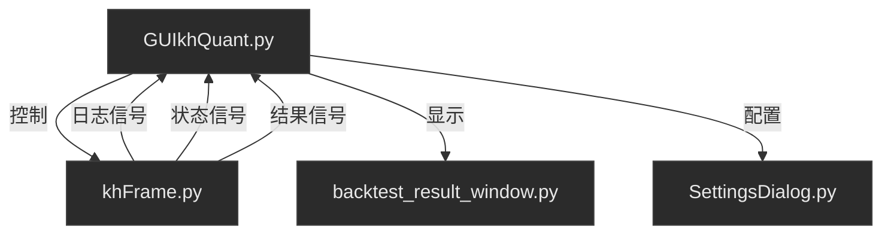
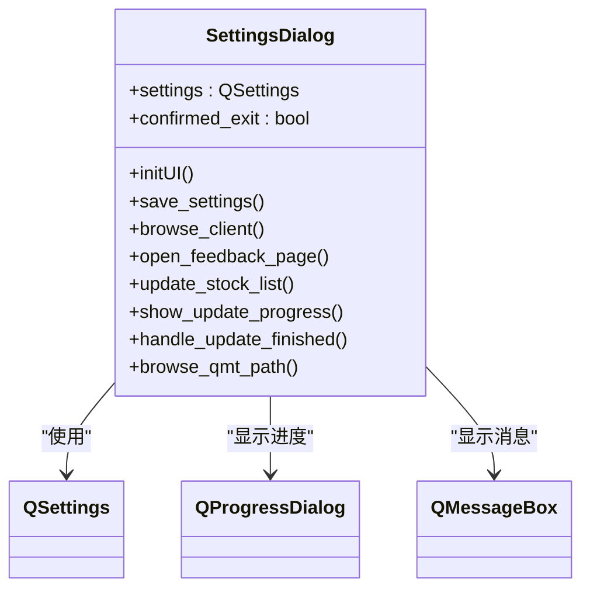
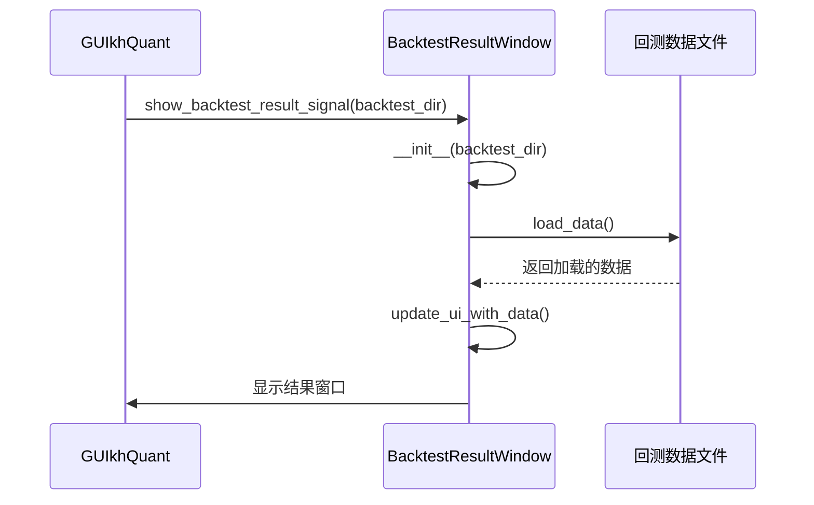
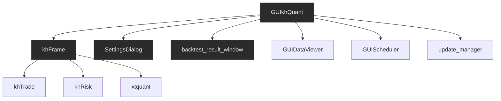

# GUI模块

<cite>
**本文档引用的文件**   
- [GUIkhQuant.py](file://GUIkhQuant.py)
- [SettingsDialog.py](file://SettingsDialog.py)
- [backtest_result_window.py](file://backtest_result_window.py)
- [khFrame.py](file://khFrame.py)
- [modules/GUIkhQuant.md](file://modules/GUIkhQuant.md)
</cite>

## 目录
1. [引言](#引言)
2. [项目结构](#项目结构)
3. [核心组件](#核心组件)
4. [架构概述](#架构概述)
5. [详细组件分析](#详细组件分析)
6. [依赖分析](#依赖分析)
7. [性能考虑](#性能考虑)
8. [故障排除指南](#故障排除指南)
9. [结论](#结论)
10. [附录](#附录) (如有必要)

## 引言
GUI模块是看海量化回测系统的核心主界面，作为系统的控制中心，负责协调策略执行、回测控制、账户管理和数据监控等核心功能。该模块以`GUIkhQuant.py`文件作为主界面控制器，通过`KhQuantMainWindow`类实现了完整的用户交互界面。系统采用模块化设计，通过集成`SettingsDialog.py`和`backtest_result_window.py`等独立模块，构建了一个功能完整、交互友好的量化交易平台。GUI模块不仅提供了直观的配置面板和实时日志反馈，还通过信号-槽机制与核心框架`khFrame.py`进行高效通信，实现了用户操作到策略执行的无缝衔接。

## 项目结构
GUI模块的项目结构清晰，遵循功能分离的设计原则。主界面控制器`GUIkhQuant.py`位于项目根目录，负责整体界面的构建和控制流。`SettingsDialog.py`和`backtest_result_window.py`作为独立的对话框和窗口模块，分别处理软件设置和回测结果展示。`khFrame.py`作为核心框架，被`GUIkhQuant.py`直接调用以驱动策略执行。`modules/GUIkhQuant.md`文档提供了详细的模块技术说明，是理解GUI架构的重要参考。整个结构通过`QMainWindow`、`QDialog`和`QWidget`等PyQt5组件构建，形成了一个层次分明、职责明确的GUI系统。

**Section sources**
- [GUIkhQuant.py](file://GUIkhQuant.py#L1-L5434)
- [SettingsDialog.py](file://SettingsDialog.py#L1-L697)
- [backtest_result_window.py](file://backtest_result_window.py#L1-L3183)
- [khFrame.py](file://khFrame.py#L1-L3152)
- [modules/GUIkhQuant.md](file://modules/GUIkhQuant.md#L1-L792)

## 核心组件
GUI模块的核心组件围绕`KhQuantGUI`类构建，该类继承自`QMainWindow`，是整个主界面的容器。`KhQuantGUI`通过`init_ui`方法初始化界面，创建了由左侧配置面板、中间驱动面板、右侧日志面板和底部状态栏组成的三列布局。它通过`StrategyThread`类在后台线程中执行策略，确保了界面的响应性。`GUILogHandler`类作为自定义日志处理器，将来自`khFrame.py`的日志信息通过`log_signal`信号传递到GUI，实现了跨线程的日志显示。`StockAccount`类用于管理虚拟账户信息。这些核心组件共同协作，为用户提供了一个稳定、高效的回测环境。

**Section sources**
- [GUIkhQuant.py](file://GUIkhQuant.py#L198-L295)
- [GUIkhQuant.py](file://GUIkhQuant.py#L133-L137)
- [GUIkhQuant.py](file://GUIkhQuant.py#L121-L130)
- [GUIkhQuant.py](file://GUIkhQuant.py#L184-L197)

## 架构概述
GUI模块采用经典的MVC（Model-View-Controller）设计模式，其中`GUIkhQuant.py`扮演Controller和View的双重角色，而`khFrame.py`则作为Model层。系统通过信号-槽机制实现松耦合通信，`GUIkhQuant.py`中的`log_signal`、`update_status_signal`和`show_backtest_result_signal`等信号，与`khFrame.py`中的回调函数形成连接，实现了数据的单向流动。主界面的布局遵循从上到下的信息流：顶部工具栏提供全局操作，左侧配置面板用于输入参数，中间驱动面板控制执行流程，右侧日志面板输出结果，底部状态栏提供实时反馈。这种架构确保了系统的可维护性和可扩展性。

**Diagram sources**
- [GUIkhQuant.py](file://GUIkhQuant.py#L198-L295)
- [khFrame.py](file://khFrame.py#L495-L557)
- [backtest_result_window.py](file://backtest_result_window.py#L36-L37)
- [SettingsDialog.py](file://SettingsDialog.py#L29-L30)

## 详细组件分析
### 主界面控制器分析
`KhQuantGUI`类是GUI模块的核心，它通过`__init__`方法完成初始化，包括设置样式表、加载配置和初始化UI。`init_ui`方法构建了主窗口的三列布局，`setup_left_panel`、`setup_middle_panel`和`setup_right_panel`方法分别负责各面板的构建。`start_strategy`和`stop_strategy`方法通过`StrategyThread`控制策略的生命周期。`log_message`方法作为日志入口，通过`log_signal`将消息广播到日志面板。该类还通过`QSettings`持久化用户设置，确保了用户体验的一致性。

**Section sources**
- [GUIkhQuant.py](file://GUIkhQuant.py#L198-L295)
- [GUIkhQuant.py](file://GUIkhQuant.py#L875-L1049)
- [GUIkhQuant.py](file://GUIkhQuant.py#L1333-L1599)
- [GUIkhQuant.py](file://GUIkhQuant.py#L2220-L2403)

### 配置对话框分析
`SettingsDialog`类提供了一个模态对话框，用于管理软件的全局设置。它通过`QSettings`与`GUIkhQuant.py`共享配置，实现了设置的持久化。对话框包含基本参数、股票列表管理、客户端路径和版本信息等分组。`save_settings`方法在用户点击保存时，将界面上的值写入`QSettings`，并立即生效。`update_stock_list`方法通过多进程机制更新股票列表，避免了界面冻结。该对话框的深色主题与主界面保持一致，提供了统一的视觉体验。

**Diagram sources**
- [SettingsDialog.py](file://SettingsDialog.py#L29-L30)
- [SettingsDialog.py](file://SettingsDialog.py#L34-L35)
- [SettingsDialog.py](file://SettingsDialog.py#L562-L617)

### 回测结果窗口分析
`BacktestResultWindow`类负责展示回测的详细分析结果。它通过`init_ui`方法创建了一个包含基本信息、收益曲线和多个Tab页的复杂界面。`create_chart`方法使用`matplotlib`生成了收益曲线、回撤曲线等专业图表。`load_data`方法从指定目录加载`config.csv`、`trades.csv`等回测数据，并填充到相应的表格和图表中。该窗口的深色主题和自适应分辨率设计，确保了在不同设备上都能获得良好的视觉效果。

**Diagram sources**
- [backtest_result_window.py](file://backtest_result_window.py#L36-L37)
- [backtest_result_window.py](file://backtest_result_window.py#L230-L254)
- [backtest_result_window.py](file://backtest_result_window.py#L666-L700)

## 依赖分析
GUI模块的依赖关系清晰，`GUIkhQuant.py`是依赖图的中心节点。它直接依赖`khFrame.py`来执行核心逻辑，依赖`SettingsDialog.py`和`backtest_result_window.py`来提供辅助功能。`khFrame.py`又依赖`khTrade.py`、`khRisk.py`等更底层的模块。这种分层依赖结构避免了循环依赖，使得各模块可以独立开发和测试。`GUIkhQuant.py`通过`try-except`块导入`GUIDataViewer`和`GUIScheduler`等可选模块，实现了功能的灵活扩展。

**Diagram sources**
- [GUIkhQuant.py](file://GUIkhQuant.py#L60-L67)
- [GUIkhQuant.py](file://GUIkhQuant.py#L68-L71)
- [khFrame.py](file://khFrame.py#L18-L20)

## 性能考虑
GUI模块在性能优化方面采取了多项措施。首先，通过`StrategyThread`将耗时的策略执行放在后台线程，保证了UI的流畅性。其次，`GUILogHandler`和`log_flush_timer`配合使用，实现了日志的批量处理和定期刷新，减少了频繁的UI更新。`delay_log_display`功能允许用户在策略运行期间延迟显示日志，显著提升了回测性能。此外，`detect_screen_resolution`方法根据屏幕分辨率动态调整字体大小，优化了高DPI设备的显示效果。这些优化共同确保了系统在处理大规模数据时依然保持良好的响应速度。

## 故障排除指南
当遇到问题时，应首先检查日志面板。`ERROR`级别的日志通常指明了问题的根源。如果策略无法启动，检查`strategy_file`路径是否正确，并确认策略文件包含`init`和`khHandlebar`等必需函数。如果回测结果窗口无法打开，检查`backtest_dir`目录是否存在且包含必要的CSV文件。对于界面显示问题，尝试调整`QSettings`中的字体缩放设置。在开发过程中，可以启用`DEBUG`日志级别以获取更详细的执行信息。

**Section sources**
- [GUIkhQuant.py](file://GUIkhQuant.py#L2220-L2403)
- [GUIkhQuant.py](file://GUIkhQuant.py#L3501-L3562)
- [GUIkhQuant.py](file://GUIkhQuant.py#L2224-L2233)

## 结论
GUI模块成功地将复杂的量化交易功能封装在一个直观、易用的图形界面中。通过`GUIkhQuant.py`作为主控制器，系统实现了对`SettingsDialog.py`和`backtest_result_window.py`等模块的高效集成，并通过`khFrame.py`驱动核心策略执行。其清晰的架构、模块化的设计和丰富的功能，为用户提供了从策略配置、回测执行到结果分析的一站式解决方案。未来可以进一步优化用户体验，例如增加策略模板管理、支持更多图表类型等。