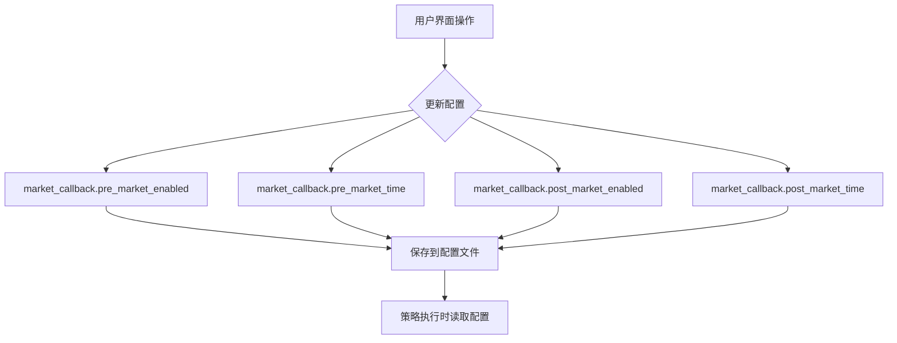
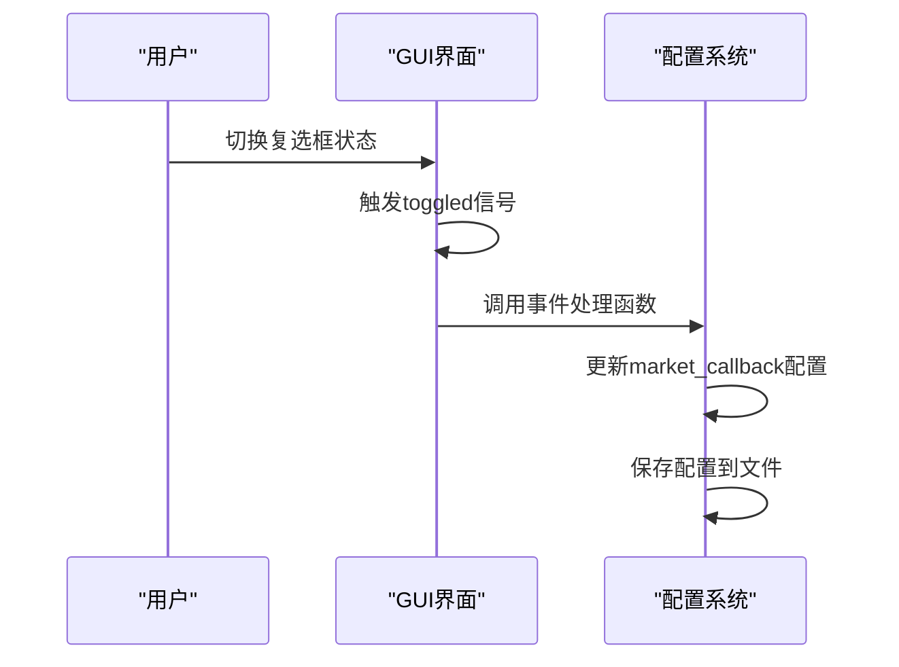
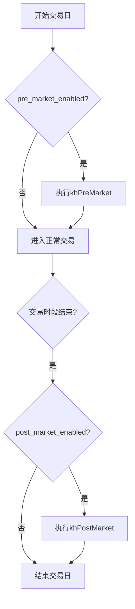

# 盘前盘后配置

<cite>
**本文档引用的文件**   
- [GUIkhQuant.py](file://GUIkhQuant.py)
- [khFrame.py](file://khFrame.py)
- [modules/GUIkhQuant.md](file://modules/GUIkhQuant.md)
- [strategies/CLAUDE.md](file://strategies/CLAUDE.md)
- [strategies/RSI策略.kh](file://strategies/RSI策略.kh)
</cite>

## 目录
1. [简介](#简介)
2. [核心组件](#核心组件)
3. [配置机制](#配置机制)
4. [事件处理逻辑](#事件处理逻辑)
5. [策略执行流程](#策略执行流程)
6. [配置示例](#配置示例)

## 简介
盘前盘后配置功能允许用户在交易日开盘前和收盘后执行特定的策略逻辑。通过`PrePostMarketGroup`类提供的图形界面，用户可以灵活地设置盘前和盘后回调的触发时间，并控制这些回调功能的开关状态。该功能对于需要在交易时段外执行数据预处理、风险评估、日终结算等任务的量化策略尤为重要。

## 核心组件

`PrePostMarketGroup`类是实现盘前盘后配置的核心组件，它提供了用户界面元素来控制回调功能。该类包含两个复选框（`pre_market_enabled`和`post_market_enabled`）用于启用或禁用盘前和盘后回调，以及两个时间编辑器（`pre_market_time`和`post_market_time`）用于设置具体的触发时刻。

**Section sources**
- [modules/GUIkhQuant.md](file://modules/GUIkhQuant.md#L304-L320)

## 配置机制

盘前盘后配置通过将用户设置保存到配置字典中来实现持久化。当用户更改设置时，系统会更新配置中的`market_callback`部分，包括`pre_market_enabled`、`pre_market_time`、`post_market_enabled`和`post_market_time`四个键值。这些配置在策略执行时被读取，以决定是否执行相应的回调函数。



**Diagram sources**
- [GUIkhQuant.py](file://GUIkhQuant.py#L2070-L2076)
- [GUIkhQuant.py](file://GUIkhQuant.py#L4423-L4428)

**Section sources**
- [GUIkhQuant.py](file://GUIkhQuant.py#L2070-L2076)
- [GUIkhQuant.py](file://GUIkhQuant.py#L4423-L4428)

## 事件处理逻辑

当用户切换`pre_market_enabled`或`post_market_enabled`复选框的状态时，会触发相应的事件处理函数`on_pre_market_toggled`和`on_post_market_toggled`。这些函数负责更新界面状态和配置信息，确保用户的操作能够正确地反映在系统行为中。



**Diagram sources**
- [modules/GUIkhQuant.md](file://modules/GUIkhQuant.md#L318-L320)

**Section sources**
- [modules/GUIkhQuant.md](file://modules/GUIkhQuant.md#L318-L320)

## 策略执行流程

在策略执行过程中，系统会根据配置决定是否执行盘前和盘后回调。当满足条件时，系统会构建包含账户信息、持仓信息和股票池的上下文，并调用相应的策略函数`khPreMarket`或`khPostMarket`。这些回调函数可以在开盘前进行数据预处理或在收盘后进行日终结算等操作。



**Diagram sources**
- [khFrame.py](file://khFrame.py#L1748-L1763)
- [khFrame.py](file://khFrame.py#L1975-L2014)

**Section sources**
- [khFrame.py](file://khFrame.py#L1748-L1763)
- [khFrame.py](file://khFrame.py#L1975-L2014)

## 配置示例

以下是一个典型的盘前盘后配置示例，展示了如何在策略配置文件中设置相关参数：

```json
"market_callback": {
    "pre_market_enabled": true,
    "pre_market_time": "09:25:00",
    "post_market_enabled": true,
    "post_market_time": "15:05:00"
}
```

在这个示例中，盘前回调被设置在每天09:25执行，用于开盘前的数据准备；盘后回调被设置在每天15:05执行，用于收盘后的数据处理和日终结算。

**Section sources**
- [strategies/RSI策略.kh](file://strategies/RSI策略.kh#L60-L65)