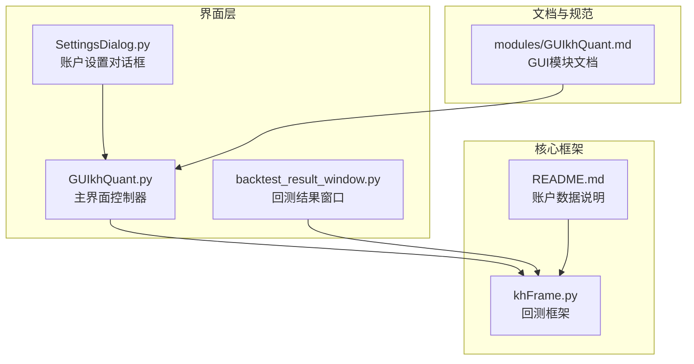
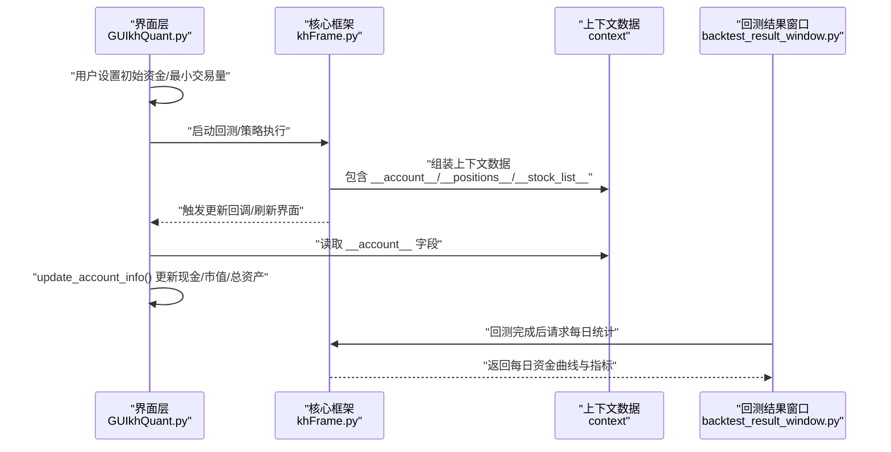
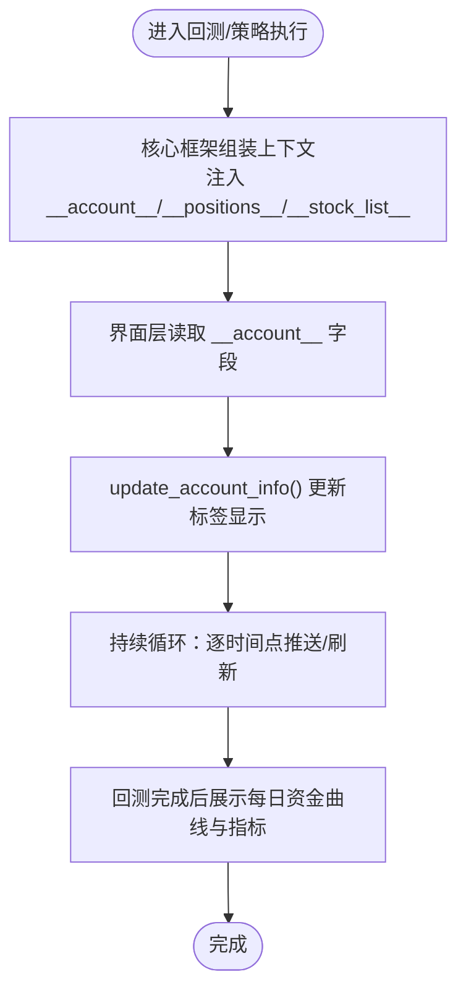
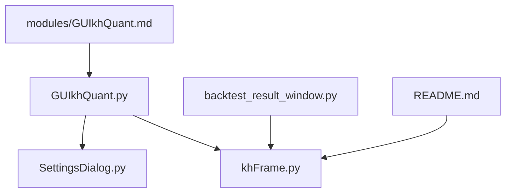

# 账户信息展示

<cite>
**本文引用的文件**
- [GUIkhQuant.py](file://GUIkhQuant.py)
- [khFrame.py](file://khFrame.py)
- [README.md](file://README.md)
- [SettingsDialog.py](file://SettingsDialog.py)
- [backtest_result_window.py](file://backtest_result_window.py)
- [modules/GUIkhQuant.md](file://modules/GUIkhQuant.md)
</cite>

## 目录
1. [简介](#简介)
2. [项目结构](#项目结构)
3. [核心组件](#核心组件)
4. [架构总览](#架构总览)
5. [详细组件分析](#详细组件分析)
6. [依赖关系分析](#依赖关系分析)
7. [性能考量](#性能考量)
8. [故障排查指南](#故障排查指南)
9. [结论](#结论)
10. [附录](#附录)

## 简介
本文件聚焦于账户信息展示与更新机制，围绕虚拟账户的初始资金、最小交易量等配置参数，以及实时的现金余额、持仓市值和总资产等动态信息展开。重点解释：
- 如何通过界面控件配置初始资金与最小交易量；
- 如何通过 update_account_info 方法从核心框架获取账户数据并更新界面；
- 账户信息在策略回测中的重要性及对策略决策的影响。

## 项目结构
与账户信息展示直接相关的模块与文件包括：
- GUIkhQuant.py：主界面控制器，负责界面布局、账户配置输入、账户信息显示更新；
- khFrame.py：核心回测框架，负责生成上下文数据（含账户与持仓），并驱动策略执行；
- README.md：提供账户数据字段说明与使用示例；
- SettingsDialog.py：账户设置对话框，提供账户名称与类型的配置入口；
- backtest_result_window.py：回测结果窗口，展示回测期间每日资金曲线与关键指标；
- modules/GUIkhQuant.md：GUIkhQuant模块文档，包含 AccountInfoGroup 的说明与用法。

图表来源
- [GUIkhQuant.py](file://GUIkhQuant.py#L1796-L1832)
- [khFrame.py](file://khFrame.py#L1931-L1969)
- [README.md](file://README.md#L1780-L1817)
- [SettingsDialog.py](file://SettingsDialog.py#L238-L305)
- [backtest_result_window.py](file://backtest_result_window.py#L269-L346)
- [modules/GUIkhQuant.md](file://modules/GUIkhQuant.md#L274-L316)

章节来源
- [GUIkhQuant.py](file://GUIkhQuant.py#L1796-L1832)
- [modules/GUIkhQuant.md](file://modules/GUIkhQuant.md#L274-L316)

## 核心组件
- 账户配置输入区（主界面）：提供初始资金与最小交易量的输入控件，用于设置虚拟账户的初始条件。
- 账户信息显示区（主界面）：展示实时的现金余额、持仓市值与总资产，支持从核心框架获取数据并刷新。
- 账户设置对话框（SettingsDialog）：提供账户名称与账户类型的配置入口，便于统一管理账户属性。
- 回测结果窗口：展示回测期间每日资金曲线与关键指标，反映账户信息在回测过程中的变化。

章节来源
- [GUIkhQuant.py](file://GUIkhQuant.py#L1796-L1832)
- [SettingsDialog.py](file://SettingsDialog.py#L238-L305)
- [backtest_result_window.py](file://backtest_result_window.py#L269-L346)

## 架构总览
账户信息展示与更新的整体流程如下：
- 界面层通过控件收集初始资金与最小交易量等配置；
- 核心框架在每次数据推送时，将账户与持仓信息注入到上下文中；
- 界面层通过 update_account_info 方法从上下文中提取账户数据并更新显示；
- 回测结果窗口在回测完成后展示每日资金曲线与关键指标。

图表来源
- [GUIkhQuant.py](file://GUIkhQuant.py#L1796-L1832)
- [khFrame.py](file://khFrame.py#L1931-L1969)
- [backtest_result_window.py](file://backtest_result_window.py#L269-L346)

## 详细组件分析

### 账户配置输入区（主界面）
- 初始资金输入控件：用于设置虚拟账户的初始资金，作为回测起始资金。
- 最小交易量输入控件：用于设置最小交易单位，影响下单量的整数倍约束。

这些控件位于中间驱动面板，便于用户在回测前设定虚拟账户的基础参数。

章节来源
- [GUIkhQuant.py](file://GUIkhQuant.py#L1796-L1832)

### 账户信息显示区（主界面）
- 现金余额标签：显示当前可用于交易的现金。
- 持仓市值标签：显示所有持仓按当前市价计算的总市值。
- 总资产标签：显示总资产，等于现金余额与持仓市值之和。
- 持仓数量标签：显示当前持有的股票数量。

该区域通过 update_account_info 方法从核心框架提供的上下文中读取账户数据并刷新显示。

章节来源
- [modules/GUIkhQuant.md](file://modules/GUIkhQuant.md#L274-L316)

### 账户设置对话框（SettingsDialog）
- 账户名称设置：用于标识账户身份。
- 账户类型设置：支持 STOCK/CREDIT/FUTURES 等类型，便于策略按账户类型进行差异化处理。

章节来源
- [SettingsDialog.py](file://SettingsDialog.py#L238-L305)

### 回测结果窗口
- 展示回测期间每日资金曲线与关键指标，包括最终资金、总收益率、年化收益率、最大回撤、夏普比率、索提诺比率、阿尔法、贝塔、胜率、盈亏比、日均交易次数、最大连续盈利/亏损、最大单笔盈利/亏损、年化波动率等。
- 若无每日统计数据，会显示初始值或默认占位符。

章节来源
- [backtest_result_window.py](file://backtest_result_window.py#L269-L346)
- [backtest_result_window.py](file://backtest_result_window.py#L1149-L1173)

### 账户数据字段说明与使用
- 上下文中的账户数据字段：
  - cash：当前可用于交易的现金
  - market_value：所有持仓按当前市价计算的总市值
  - total_asset：总资产，即 cash + market_value
  - frozen_cash：因挂单而冻结的资金
- 示例：策略中可根据 cash 动态计算可买入量，体现账户信息对策略决策的重要性。

章节来源
- [README.md](file://README.md#L1780-L1817)

### 账户信息更新流程图

图表来源
- [khFrame.py](file://khFrame.py#L1931-L1969)
- [modules/GUIkhQuant.md](file://modules/GUIkhQuant.md#L274-L316)
- [backtest_result_window.py](file://backtest_result_window.py#L269-L346)

## 依赖关系分析
- 界面层依赖核心框架提供的上下文数据，尤其是 __account__ 字段；
- 回测结果窗口依赖核心框架的每日统计输出；
- 账户设置对话框为界面层提供账户属性配置入口；
- README.md 提供账户字段说明，指导策略开发者正确使用账户数据。

图表来源
- [GUIkhQuant.py](file://GUIkhQuant.py#L1796-L1832)
- [khFrame.py](file://khFrame.py#L1931-L1969)
- [SettingsDialog.py](file://SettingsDialog.py#L238-L305)
- [backtest_result_window.py](file://backtest_result_window.py#L269-L346)
- [README.md](file://README.md#L1780-L1817)
- [modules/GUIkhQuant.md](file://modules/GUIkhQuant.md#L274-L316)

章节来源
- [GUIkhQuant.py](file://GUIkhQuant.py#L1796-L1832)
- [khFrame.py](file://khFrame.py#L1931-L1969)
- [SettingsDialog.py](file://SettingsDialog.py#L238-L305)
- [backtest_result_window.py](file://backtest_result_window.py#L269-L346)
- [README.md](file://README.md#L1780-L1817)
- [modules/GUIkhQuant.md](file://modules/GUIkhQuant.md#L274-L316)

## 性能考量
- 账户信息更新频率：应避免过于频繁地刷新界面，可在策略执行周期内集中更新，减少 UI 抖动与刷新开销。
- 数据来源一致性：确保从上下文中读取的账户数据与核心框架的资产更新逻辑一致，避免重复计算或并发冲突。
- 回测期间的统计输出：每日统计应在回测完成后一次性展示，避免在回测过程中频繁刷新导致性能下降。

## 故障排查指南
- 现金/市值/总资产标签未更新：
  - 检查 update_account_info 是否被正确调用；
  - 确认核心框架是否已将 __account__ 注入上下文；
  - 核对标签绑定的字段名与上下文字段一致。
- 初始资金或最小交易量设置无效：
  - 确认界面控件的值已被正确读取并传入核心框架；
  - 检查回测启动前的配置保存与加载流程。
- 回测结果窗口无数据：
  - 确认回测已完成并产生每日统计；
  - 检查回测结果窗口的初始化与数据填充逻辑。

章节来源
- [modules/GUIkhQuant.md](file://modules/GUIkhQuant.md#L274-L316)
- [khFrame.py](file://khFrame.py#L1931-L1969)
- [backtest_result_window.py](file://backtest_result_window.py#L269-L346)

## 结论
账户信息展示是策略回测与实盘交易的重要基础。通过界面层的配置输入、核心框架的上下文注入与界面层的更新逻辑，实现了初始资金与最小交易量等静态配置与现金余额、持仓市值、总资产等动态信息的完整闭环。在策略开发中，合理利用账户数据（如 cash）进行动态仓位管理，可显著提升策略的稳健性与可执行性。

## 附录
- 账户数据字段说明与策略使用示例参见 README.md 中的“获取账户数据”部分。
- GUI 模块文档中对 AccountInfoGroup 的说明与用法参见 modules/GUIkhQuant.md。

章节来源
- [README.md](file://README.md#L1780-L1817)
- [modules/GUIkhQuant.md](file://modules/GUIkhQuant.md#L274-L316)