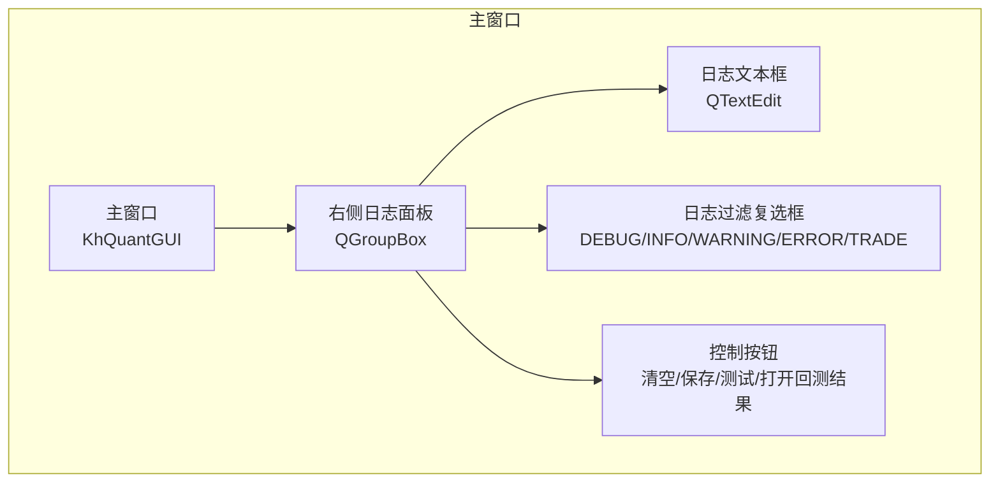
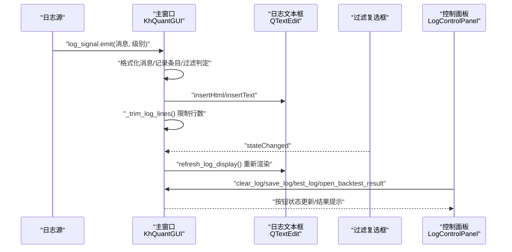
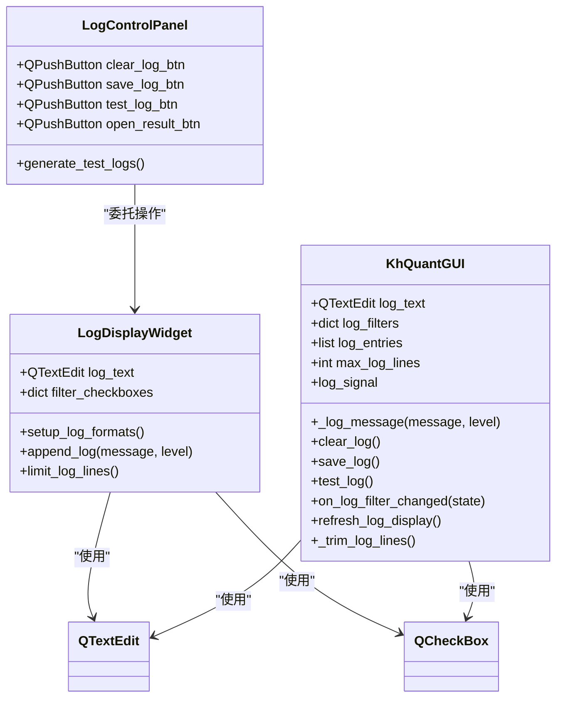

# 右侧日志面板

<cite>
**本文引用的文件**
- [GUIkhQuant.py](file://GUIkhQuant.py)
- [SettingsDialog.py](file://SettingsDialog.py)
- [modules/GUIkhQuant.md](file://modules/GUIkhQuant.md)
</cite>

## 目录
1. [简介](#简介)
2. [项目结构](#项目结构)
3. [核心组件](#核心组件)
4. [架构总览](#架构总览)
5. [组件详解](#组件详解)
6. [依赖关系分析](#依赖关系分析)
7. [性能考量](#性能考量)
8. [故障排查指南](#故障排查指南)
9. [结论](#结论)

## 简介
本文件聚焦于“右侧日志面板”的实现与使用，围绕两个关键组件展开：
- LogDisplayWidget：基于 QTextEdit 的彩色日志显示组件，支持按日志级别设置颜色、过滤显示与行数限制。
- LogControlPanel：提供清空、保存、测试日志、打开回测结果等操作按钮的控制面板。

同时，本文还解释日志过滤复选框的工作原理，以及 limit_log_lines（或内部实现）的内存管理策略，帮助读者理解如何在高并发日志场景下保持界面流畅与稳定。

## 项目结构
右侧日志面板位于主界面的右侧区域，由一个日志显示区与一组控制按钮组成。其布局与交互由主窗口统一管理，日志内容通过信号槽机制跨线程安全更新。

图表来源
- [GUIkhQuant.py](file://GUIkhQuant.py#L1861-L1940)

章节来源
- [GUIkhQuant.py](file://GUIkhQuant.py#L1861-L1940)

## 核心组件
- LogDisplayWidget（模块内定义）
  - 使用 QTextEdit 展示日志，按级别设置颜色，支持过滤与自动滚动。
  - 提供 append_log 方法，线程安全地追加日志并限制行数。
- LogControlPanel（模块内定义）
  - 提供清空、保存、测试日志、打开回测结果等按钮。
  - 通过连接父级日志组件的方法实现操作。

章节来源
- [modules/GUIkhQuant.md](file://modules/GUIkhQuant.md#L327-L421)

## 架构总览
右侧日志面板采用“组件化 + 信号槽”的设计：
- 日志来源：系统日志、策略运行日志、交易日志等。
- 日志接收：主窗口统一接收日志信号，格式化后写入日志文本框。
- 过滤与展示：用户通过复选框筛选级别；主窗口维护日志条目列表，按过滤条件重新渲染。
- 控制操作：清空、保存、测试、打开回测结果等按钮由控制面板触发。

图表来源
- [GUIkhQuant.py](file://GUIkhQuant.py#L822-L842)
- [GUIkhQuant.py](file://GUIkhQuant.py#L3199-L3289)
- [GUIkhQuant.py](file://GUIkhQuant.py#L3285-L3352)
- [GUIkhQuant.py](file://GUIkhQuant.py#L3868-L3888)
- [GUIkhQuant.py](file://GUIkhQuant.py#L3354-L3383)
- [GUIkhQuant.py](file://GUIkhQuant.py#L3501-L3565)

## 组件详解

### LogDisplayWidget（彩色日志显示组件）
- 组件职责
  - 维护一个只读 QTextEdit 作为日志显示区。
  - 为 DEBUG/INFO/WARNING/ERROR/TRADE 五种级别分别设置颜色格式。
  - 提供过滤复选框，支持按级别显示/隐藏。
  - 提供 append_log 方法，线程安全地追加日志并自动滚动至底部。
  - 提供 limit_log_lines 方法，限制日志行数，避免内存占用过高。

- 关键实现要点
  - setup_log_formats：为不同级别设置字符格式（颜色等）。
  - append_log：
    - 判断是否应显示该级别日志。
    - 使用文本光标移动到末尾，设置字符格式，插入带时间戳的消息。
    - ensureCursorVisible 确保可见。
    - 调用 limit_log_lines 限制行数。
  - limit_log_lines：按阈值删除最早日志行，避免频繁删除造成性能抖动。

- 线程安全
  - 日志追加通过信号槽机制在主线程中执行，避免跨线程直接操作 UI 控件引发崩溃。

章节来源
- [modules/GUIkhQuant.md](file://modules/GUIkhQuant.md#L327-L385)
- [modules/GUIkhQuant.md](file://modules/GUIkhQuant.md#L387-L421)

### LogControlPanel（日志控制面板）
- 组件职责
  - 提供清空日志、保存日志、测试日志、打开回测结果等按钮。
  - 将按钮事件委托给父级日志组件（或主窗口）的方法实现。

- 按钮功能
  - 清空日志：清空文本框并清空内存中的日志条目。
  - 保存日志：弹出保存对话框，导出当前文本框内容为纯文本文件。
  - 测试日志：生成多种级别的测试日志，便于验证颜色与过滤效果。
  - 打开回测结果：在回测完成后启用，用于打开回测指标窗口。

章节来源
- [modules/GUIkhQuant.md](file://modules/GUIkhQuant.md#L387-L421)

### 日志过滤复选框与显示刷新
- 过滤机制
  - 主窗口维护一个日志条目列表（内存中），每个条目包含时间、级别、消息与 HTML 格式化片段。
  - 复选框状态变化时，触发刷新逻辑：清空当前显示，遍历内存条目，仅对勾选级别的条目插入 HTML。
  - 通过滚动条定位到末尾，保证用户看到最新日志。

- 刷新流程
  - on_log_filter_changed(state) -> refresh_log_display() -> 清空 -> 逐条插入 -> 滚动到底部。

章节来源
- [GUIkhQuant.py](file://GUIkhQuant.py#L3868-L3888)

### limit_log_lines 的内存管理策略
- 目标
  - 防止日志过多导致内存占用过高与界面卡顿。

- 策略
  - 周期性检查：每 N 条日志检查一次，降低检查频率。
  - 缓冲区删除：超过最大行数 + 缓冲区时一次性删除多余行，避免频繁删除。
  - 内存同步：同步裁剪内存中的日志条目，保持内存占用可控。

- 具体实现位置
  - 主窗口内部的 _trim_log_lines 方法负责限制行数，结合设置项 max_log_lines 生效。

章节来源
- [GUIkhQuant.py](file://GUIkhQuant.py#L3308-L3352)
- [SettingsDialog.py](file://SettingsDialog.py#L172-L204)

### 日志颜色格式与级别映射
- 级别与颜色映射
  - DEBUG：浅紫色
  - INFO：白色
  - WARNING：橙色
  - ERROR：红色
  - TRADE：蓝色（用于交易信息）

- 设置方式
  - 在主窗口中为不同级别设置颜色，插入 HTML 时按级别应用对应颜色。

章节来源
- [GUIkhQuant.py](file://GUIkhQuant.py#L1896-L1903)
- [GUIkhQuant.py](file://GUIkhQuant.py#L3199-L3216)

### 线程安全的日志追加机制
- 信号槽
  - 主窗口定义 log_signal，日志源通过 emit 发送消息与级别。
  - 使用 Qt.QueuedConnection，确保在主线程中执行 _log_message，避免跨线程访问 UI 控件。

- 追加流程
  - 格式化消息（含时间戳与级别颜色）。
  - 过滤系统/更新相关噪声日志（可选）。
  - 记录内存条目，必要时延迟显示。
  - 限制行数并滚动到底部。

章节来源
- [GUIkhQuant.py](file://GUIkhQuant.py#L200-L271)
- [GUIkhQuant.py](file://GUIkhQuant.py#L3199-L3289)

## 依赖关系分析
- 组件耦合
  - LogControlPanel 依赖父级日志组件的方法（清空、保存、测试、打开结果）。
  - LogDisplayWidget 依赖 QTextEdit 与复选框，负责 UI 展示与交互。
  - 主窗口统一管理日志条目、过滤状态与显示刷新。

- 外部依赖
  - PyQt5 的信号槽、QTextEdit、QCheckBox、QTimer 等。
  - 设置对话框提供最大日志行数配置项。

图表来源
- [modules/GUIkhQuant.md](file://modules/GUIkhQuant.md#L327-L421)
- [GUIkhQuant.py](file://GUIkhQuant.py#L1861-L1940)
- [GUIkhQuant.py](file://GUIkhQuant.py#L3199-L3352)

## 性能考量
- 行数限制
  - 采用“周期性检查 + 缓冲区删除 + 内存同步”的策略，避免频繁删除导致 UI 卡顿。
- 批量刷新
  - 刷新显示时一次性插入多条日志，减少 UI 更新次数。
- 延迟显示
  - 在策略运行期间可延迟收集日志，结束后再分批显示，减轻 UI 压力。
- 过滤渲染
  - 通过内存条目与 HTML 片段分离，仅在过滤变化时重建显示，避免全量重绘。

章节来源
- [GUIkhQuant.py](file://GUIkhQuant.py#L3308-L3352)
- [GUIkhQuant.py](file://GUIkhQuant.py#L3868-L3888)

## 故障排查指南
- 日志不显示
  - 检查对应级别的过滤复选框是否勾选。
  - 确认日志级别是否被系统/更新相关关键字过滤跳过。
- 日志过多导致卡顿
  - 调整设置中的“最大日志显示行数”，或启用延迟显示模式。
- 保存日志失败
  - 检查文件权限与路径是否有效；查看错误日志提示。
- 打开回测结果按钮不可用
  - 仅在回测完成后启用；确认回测已完成且结果已生成。

章节来源
- [SettingsDialog.py](file://SettingsDialog.py#L172-L204)
- [GUIkhQuant.py](file://GUIkhQuant.py#L3354-L3383)
- [GUIkhQuant.py](file://GUIkhQuant.py#L3501-L3565)

## 结论
右侧日志面板通过清晰的组件划分与完善的线程安全机制，实现了高性能、可配置的日志展示与控制能力。LogDisplayWidget 提供彩色、可过滤、可限制行数的日志显示；LogControlPanel 提供实用的清空、保存、测试与结果打开功能；主窗口通过统一的信号槽与内存条目管理，确保在高并发日志场景下仍能保持良好的用户体验。