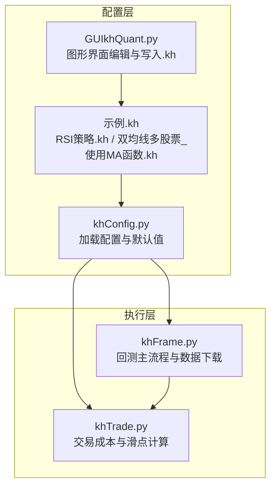
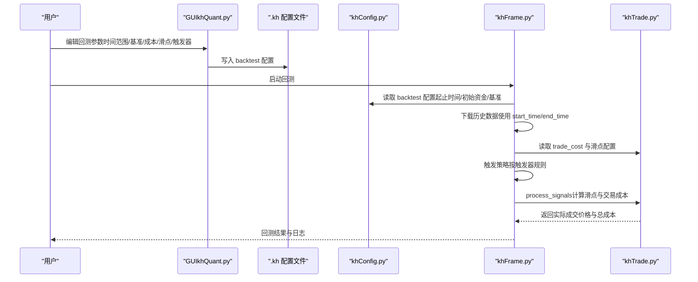
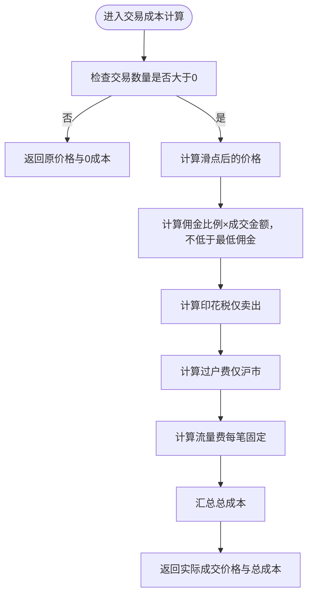
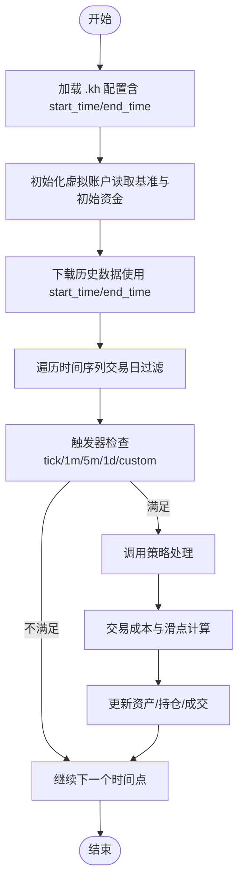
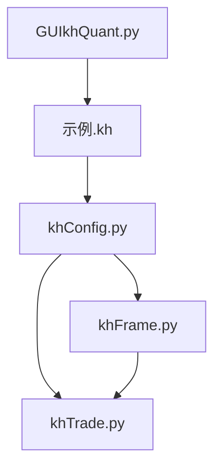

# 回测参数配置组

<cite>
**本文引用的文件**
- [khFrame.py](file://khFrame.py)
- [khConfig.py](file://khConfig.py)
- [khTrade.py](file://khTrade.py)
- [GUIkhQuant.py](file://GUIkhQuant.py)
- [RSI策略.kh](file://strategies/RSI策略.kh)
- [双均线多股票_使用MA函数.kh](file://strategies/双均线多股票_使用MA函数.kh)
</cite>

## 目录
1. [简介](#简介)
2. [项目结构](#项目结构)
3. [核心组件](#核心组件)
4. [架构总览](#架构总览)
5. [详细组件分析](#详细组件分析)
6. [依赖关系分析](#依赖关系分析)
7. [性能考量](#性能考量)
8. [故障排查指南](#故障排查指南)
9. [结论](#结论)
10. [附录](#附录)

## 简介
本文件聚焦于“回测参数配置组”的实现与使用，围绕 khFrame 框架中的回测配置映射关系，系统阐述以下内容：
- 基准合约（benchmark）的配置与转换
- 交易成本（最低佣金、佣金比例、印花税、流量费、过户费）的配置与计算
- 滑点设置（按最小变动价位或按成交额比例）的配置与计算
- 回测时间范围（开始日期与结束日期）的选择逻辑与影响
- 参数如何映射到 .kh 配置文件的 backtest 部分，并驱动 khFrame 的回测执行

## 项目结构
围绕回测参数配置，涉及如下关键文件与职责：
- khConfig.py：负责从 .kh 配置文件加载回测相关参数（起止时间、初始资金、股票池、数据周期等），并暴露给框架其他模块。
- khFrame.py：负责回测主流程，包括数据下载、触发器、策略调用、交易执行与资产更新；同时读取回测时间范围与基准合约。
- khTrade.py：负责交易成本与滑点计算，以及回测下单的执行细节。
- GUIkhQuant.py：提供图形界面，用于编辑 .kh 配置文件中的 backtest 部分（时间范围、基准、交易成本、滑点、触发器等），并将配置写入 .kh 文件。
- 示例 .kh 配置文件（RSI策略.kh、双均线多股票_使用MA函数.kh）：展示 backtest 部分的标准结构与典型参数。

图表来源
- [khConfig.py](file://khConfig.py#L1-L105)
- [khFrame.py](file://khFrame.py#L720-L742)
- [khTrade.py](file://khTrade.py#L1-L120)
- [GUIkhQuant.py](file://GUIkhQuant.py#L1311-L1428)
- [RSI策略.kh](file://strategies/RSI策略.kh#L1-L71)
- [双均线多股票_使用MA函数.kh](file://strategies/双均线多股票_使用MA函数.kh#L1-L71)

章节来源
- [khConfig.py](file://khConfig.py#L1-L105)
- [khFrame.py](file://khFrame.py#L720-L742)
- [khTrade.py](file://khTrade.py#L1-L120)
- [GUIkhQuant.py](file://GUIkhQuant.py#L1311-L1428)
- [RSI策略.kh](file://strategies/RSI策略.kh#L1-L71)
- [双均线多股票_使用MA函数.kh](file://strategies/双均线多股票_使用MA函数.kh#L1-L71)

## 核心组件
- 配置加载与默认值：khConfig 从 .kh 文件读取 backtest 部分，设置回测起止时间、初始资金、股票池、数据周期等默认值。
- 回测主流程：khFrame 在初始化阶段读取基准合约与初始资金，下载历史数据时使用回测起止时间，策略回调中根据触发器决定是否执行策略。
- 交易成本与滑点：khTrade 从 backtest.trade_cost 读取最低佣金、佣金比例、印花税、流量费、滑点类型与参数，计算实际成交价格与总交易成本。
- 图形界面：GUIkhQuant 提供时间范围、基准合约、交易成本、滑点、触发器等配置项，写入 .kh 文件的 backtest 部分。

章节来源
- [khConfig.py](file://khConfig.py#L1-L105)
- [khFrame.py](file://khFrame.py#L660-L703)
- [khTrade.py](file://khTrade.py#L1-L120)
- [GUIkhQuant.py](file://GUIkhQuant.py#L1311-L1428)

## 架构总览
回测参数配置从 .kh 文件进入系统，经过 khConfig 加载，再由 khFrame 与 khTrade 在回测执行过程中使用，最终影响策略下单与资产变动。

图表来源
- [GUIkhQuant.py](file://GUIkhQuant.py#L1311-L1428)
- [khConfig.py](file://khConfig.py#L1-L105)
- [khFrame.py](file://khFrame.py#L720-L742)
- [khTrade.py](file://khTrade.py#L198-L374)

## 详细组件分析

### 基准合约（benchmark）配置
- 配置来源：.kh 文件的 backtest.benchmark 字段。
- 加载与转换：
  - khConfig 读取 backtest.benchmark 并保存为 backtest_start/backtest_end 等字段（用于其他用途）。
  - khFrame 在初始化虚拟账户时，读取 backtest.benchmark 并对 sh.000300 进行格式转换（例如从 sh.000300 转为 000300.SH），随后更新配置字典中的 benchmark。
- 影响范围：
  - khFrame 将基准指数代码写入资产字典，便于后续回测结果对比与分析。

章节来源
- [khConfig.py](file://khConfig.py#L1-L105)
- [khFrame.py](file://khFrame.py#L660-L703)
- [RSI策略.kh](file://strategies/RSI策略.kh#L12-L20)
- [双均线多股票_使用MA函数.kh](file://strategies/双均线多股票_使用MA函数.kh#L12-L20)

### 交易成本配置与计算
- 配置来源：.kh 文件的 backtest.trade_cost 字段，包含最低佣金、佣金比例、印花税、流量费、滑点类型与参数。
- 默认值与读取：
  - khTrade 从 backtest.trade_cost 读取各项参数，并设置默认值（如最低佣金、佣金比例、印花税、流量费、滑点类型与 tick_size/tick_count/ratio）。
- 计算流程：
  - 滑点计算：根据滑点类型（tick 或 ratio）计算实际成交价格。
  - 佣金计算：按成交金额乘以佣金比例，若低于最低佣金则取最低佣金。
  - 印花税：仅在卖出时收取。
  - 过户费：仅对沪市股票收取。
  - 流量费：每笔交易固定收取。
  - 总交易成本：佣金 + 印花税 + 过户费 + 流量费。
- 回测下单影响：
  - 回测下单时，先计算实际成交价格与总成本，再据此检查资金是否足够、更新资产与持仓，并触发交易回调。

图表来源
- [khTrade.py](file://khTrade.py#L81-L196)
- [khTrade.py](file://khTrade.py#L198-L374)

章节来源
- [khTrade.py](file://khTrade.py#L1-L120)
- [khTrade.py](file://khTrade.py#L198-L374)
- [GUIkhQuant.py](file://GUIkhQuant.py#L1311-L1428)
- [RSI策略.kh](file://strategies/RSI策略.kh#L18-L30)
- [双均线多股票_使用MA函数.kh](file://strategies/双均线多股票_使用MA函数.kh#L18-L30)

### 滑点设置（按最小变动价位或按成交额比例）
- 配置项：
  - 类型：tick（按最小变动价跳数）或 ratio（按成交额比例）。
  - tick 模式：tick_size（最小变动价）、tick_count（跳数）。
  - ratio 模式：ratio（滑点比例）。
- 计算逻辑：
  - tick 模式：实际成交价 = 原价 ± tick_size × tick_count（买入上浮、卖出下浮）。
  - ratio 模式：实际成交价 = 原价 × (1 ± ratio/2)（买入上浮、卖出下浮）。
- 在回测下单中，滑点先于交易成本计算，确保后续资金检查与成交金额均基于实际成交价。

章节来源
- [khTrade.py](file://khTrade.py#L81-L116)
- [GUIkhQuant.py](file://GUIkhQuant.py#L1412-L1428)
- [RSI策略.kh](file://strategies/RSI策略.kh#L23-L29)
- [双均线多股票_使用MA函数.kh](file://strategies/双均线多股票_使用MA函数.kh#L23-L29)

### 回测时间范围（开始日期与结束日期）
- 配置来源：.kh 文件的 backtest.start_time 与 backtest.end_time。
- 默认值：khConfig 未显式提供时，会采用默认值（例如 start_time 与 end_time）。
- 使用场景：
  - khFrame 在初始化虚拟账户时读取基准与初始资金。
  - khFrame 在下载历史数据时，将 start_time 与 end_time 传入数据下载接口。
  - khFrame 在策略回调中，结合触发器与交易日判断，仅在回测期间的交易日执行策略。
- 选择逻辑建议：
  - 起止时间应覆盖策略有效运行期，且包含足够的交易日。
  - 若使用自定义触发器，需确保回测期间内存在交易日与触发时间点。

图表来源
- [khConfig.py](file://khConfig.py#L1-L105)
- [khFrame.py](file://khFrame.py#L720-L742)
- [khFrame.py](file://khFrame.py#L745-L919)

章节来源
- [khConfig.py](file://khConfig.py#L1-L105)
- [khFrame.py](file://khFrame.py#L720-L742)
- [khFrame.py](file://khFrame.py#L745-L919)
- [GUIkhQuant.py](file://GUIkhQuant.py#L1430-L1456)
- [RSI策略.kh](file://strategies/RSI策略.kh#L12-L17)
- [双均线多股票_使用MA函数.kh](file://strategies/双均线多股票_使用MA函数.kh#L12-L17)

### .kh 配置文件的 backtest 部分映射
- 关键字段：
  - start_time/end_time：回测起止日期（YYYYMMDD）。
  - init_capital：初始资金。
  - min_volume：最小交易量（GUI 层提供）。
  - benchmark：基准合约代码。
  - trade_cost：交易成本配置（最低佣金、佣金比例、印花税、流量费、滑点）。
  - trigger：触发器配置（类型、自定义时间点、开始/结束时间、间隔）。
- 映射关系：
  - GUIkhQuant 将界面输入写入 .kh 的 backtest 部分。
  - khConfig 读取 .kh 并提供 backtest_start/backtest_end/init_capital 等字段。
  - khFrame 使用 backtest_start/backtest_end 下载数据、控制策略执行节奏。
  - khTrade 使用 trade_cost 计算滑点与交易成本。

章节来源
- [GUIkhQuant.py](file://GUIkhQuant.py#L1311-L1428)
- [GUIkhQuant.py](file://GUIkhQuant.py#L1984-L2046)
- [khConfig.py](file://khConfig.py#L1-L105)
- [khFrame.py](file://khFrame.py#L660-L703)
- [khFrame.py](file://khFrame.py#L720-L742)
- [khTrade.py](file://khTrade.py#L1-L120)
- [RSI策略.kh](file://strategies/RSI策略.kh#L12-L39)
- [双均线多股票_使用MA函数.kh](file://strategies/双均线多股票_使用MA函数.kh#L12-L39)

## 依赖关系分析
- khConfig 为配置入口，khFrame 与 khTrade 均依赖其提供的 backtest 配置。
- khFrame 在数据下载与策略执行阶段使用回测时间范围。
- khTrade 在下单前统一计算滑点与交易成本，影响资金检查与成交金额。
- GUIkhQuant 作为配置编辑器，负责将用户输入写入 .kh 文件。

图表来源
- [khConfig.py](file://khConfig.py#L1-L105)
- [khFrame.py](file://khFrame.py#L720-L742)
- [khTrade.py](file://khTrade.py#L1-L120)
- [GUIkhQuant.py](file://GUIkhQuant.py#L1311-L1428)
- [RSI策略.kh](file://strategies/RSI策略.kh#L1-L71)
- [双均线多股票_使用MA函数.kh](file://strategies/双均线多股票_使用MA函数.kh#L1-L71)

章节来源
- [khConfig.py](file://khConfig.py#L1-L105)
- [khFrame.py](file://khFrame.py#L720-L742)
- [khTrade.py](file://khTrade.py#L1-L120)
- [GUIkhQuant.py](file://GUIkhQuant.py#L1311-L1428)

## 性能考量
- 数据下载窗口：回测时间范围越大，下载的数据量越多，建议合理设置 start_time/end_time，避免不必要的历史数据拉取。
- 触发器粒度：tick 触发器会产生大量策略调用，1m/5m/1d 触发器可显著降低调用频率，提高回测效率。
- 滑点与成本：较大的滑点或较高的佣金比例会放大交易成本，影响收益曲线，建议在 GUI 中谨慎调整。

## 故障排查指南
- 资金不足导致下单失败：
  - 现象：出现“资金不足”错误日志。
  - 原因：买入时所需总资金（含交易成本）超过可用资金。
  - 排查：检查 init_capital、trade_cost（佣金、印花税、过户费、流量费）与滑点设置。
- 持仓不足导致卖出失败：
  - 现象：出现“可用持仓不足”错误日志。
  - 原因：卖出数量超过可用持仓（T+0/T+1 模式影响可用数量）。
  - 排查：确认策略信号数量与当前持仓，检查 T+0 模式设置。
- 交易日过滤导致策略未触发：
  - 现象：某些时间点未触发策略。
  - 原因：非交易日或触发器未满足条件。
  - 排查：核对回测期间的交易日与触发器配置（1m/5m/1d/custom）。

章节来源
- [khTrade.py](file://khTrade.py#L270-L374)
- [khFrame.py](file://khFrame.py#L745-L919)

## 结论
回测参数配置组通过 .kh 文件的 backtest 部分集中管理基准合约、交易成本、滑点与时间范围等关键参数。khConfig 负责加载与默认值，khFrame 负责在回测执行中应用这些参数，khTrade 负责具体的成本与滑点计算。GUIkhQuant 提供直观的界面编辑体验，确保参数准确写入 .kh 文件并驱动回测执行。合理设置这些参数，能够提升回测的真实性与可解释性。

## 附录
- 示例 .kh 配置文件展示了 backtest 部分的完整结构，可作为编写与校验配置的参考模板。
- 在 GUI 中完成参数配置后，建议保存为 .kh 文件并放置在用户策略目录，便于长期维护与版本管理。

章节来源
- [RSI策略.kh](file://strategies/RSI策略.kh#L1-L71)
- [双均线多股票_使用MA函数.kh](file://strategies/双均线多股票_使用MA函数.kh#L1-L71)