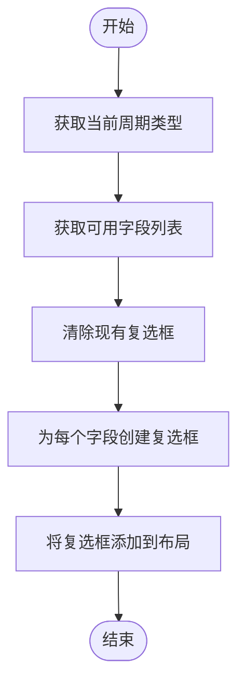

# 数据设置组

<cite>
**本文档引用的文件**
- [GUIkhQuant.md](file://modules/GUIkhQuant.md)
- [GUIkhQuant.py](file://GUIkhQuant.py)
- [khConfig.py](file://khConfig.py)
</cite>

## 目录
1. [简介](#简介)
2. [DataConfigGroup类实现](#dataconfiggroup类实现)
3. [复权方式](#复权方式)
4. [周期类型](#周期类型)
5. [update_data_fields方法](#update_data_fields方法)
6. [数据请求和.kh配置文件结构](#数据请求和kh配置文件结构)

## 简介
本文档详细介绍了`DataConfigGroup`类的实现，重点阐述了复权方式、周期类型的选择，以及`update_data_fields`方法如何根据所选周期动态生成和更新可选数据字段的复选框列表。同时，文档还解释了这些设置如何影响数据请求和`.kh`配置文件的'data'部分结构。

## DataConfigGroup类实现

`DataConfigGroup`类是量化交易系统中用于配置数据相关参数的核心组件。该类继承自`QGroupBox`，提供了一个用户友好的界面来设置数据获取的各种选项。类的主要功能包括复权方式选择、周期类型选择以及根据周期动态更新可选数据字段。

**Section sources**
- [GUIkhQuant.md](file://modules/GUIkhQuant.md#L154-L185)

## 复权方式

复权方式是股票数据分析中的一个重要概念，用于调整历史价格以反映分红、配股等公司行为的影响。`DataConfigGroup`类提供了多种复权方式供用户选择：

- **不复权**: 保持原始交易价格不变，不进行任何调整。
- **前复权**: 将历史价格向前调整，使当前价格与历史价格具有可比性。
- **后复权**: 将历史价格向后调整，保持历史价格不变，调整当前价格。
- **等比前复权**: 使用等比方法进行前复权，保持价格变动的相对比例。
- **等比后复权**: 使用等比方法进行后复权，保持价格变动的相对比例。

用户可以通过`fq_type_combo`下拉框选择所需的复权方式。这些选项在`__init__`方法中通过`addItems`方法添加。

**Section sources**
- [GUIkhQuant.md](file://modules/GUIkhQuant.md#L159-L160)

## 周期类型

周期类型决定了数据的时间粒度，影响数据的详细程度和分析的精度。`DataConfigGroup`类支持以下周期类型：

- **tick**: 逐笔交易数据，最细粒度的数据。
- **1m**: 1分钟K线数据。
- **5m**: 5分钟K线数据。
- **1d**: 日K线数据。

用户可以通过`cycle_combo`下拉框选择所需的周期类型。这些选项在`__init__`方法中通过`addItems`方法添加。周期类型的选择会直接影响`update_data_fields`方法的行为，从而决定可选数据字段的列表。

**Section sources**
- [GUIkhQuant.md](file://modules/GUIkhQuant.md#L163-L164)

## update_data_fields方法

`update_data_fields`方法是`DataConfigGroup`类中的一个关键方法，负责根据当前选择的周期类型动态生成和更新可选数据字段的复选框列表。该方法的实现逻辑如下：

1. 获取当前选择的周期类型。
2. 根据周期类型调用`get_available_fields`方法获取可用的数据字段列表。
3. 清除现有的复选框。
4. 为每个可用字段创建新的复选框，并将其添加到界面布局中。

该方法确保了用户界面始终显示与当前周期类型相匹配的可选数据字段，提高了用户体验和数据配置的准确性。

**Diagram sources**
- [GUIkhQuant.md](file://modules/GUIkhQuant.md#L170-L184)

## 数据请求和.kh配置文件结构

`DataConfigGroup`类的设置不仅影响用户界面，还直接影响数据请求和`.kh`配置文件的结构。当用户保存配置时，相关设置会被写入`.kh`配置文件的'data'部分。具体结构如下：

- **fq_type**: 存储用户选择的复权方式。
- **cycle_type**: 存储用户选择的周期类型。
- **fields**: 存储用户选择的数据字段列表。

这些设置在数据请求时被使用，确保获取的数据符合用户的配置要求。例如，如果用户选择了"前复权"和"1d"周期，系统将请求经过前复权处理的日K线数据。

**Section sources**
- [GUIkhQuant.md](file://modules/GUIkhQuant.md#L603-L605)
- [khConfig.py](file://khConfig.py#L40-L45)