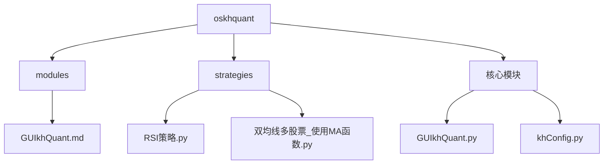
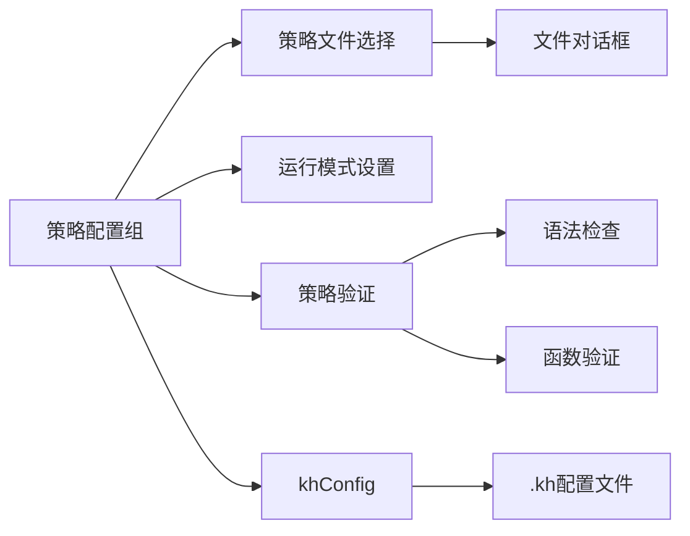
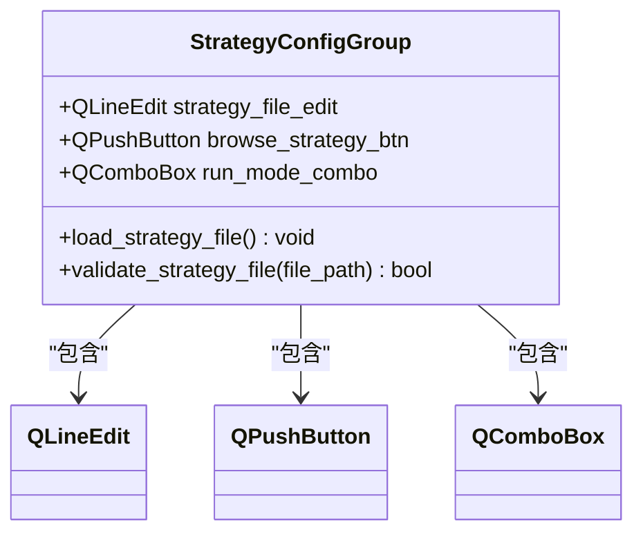
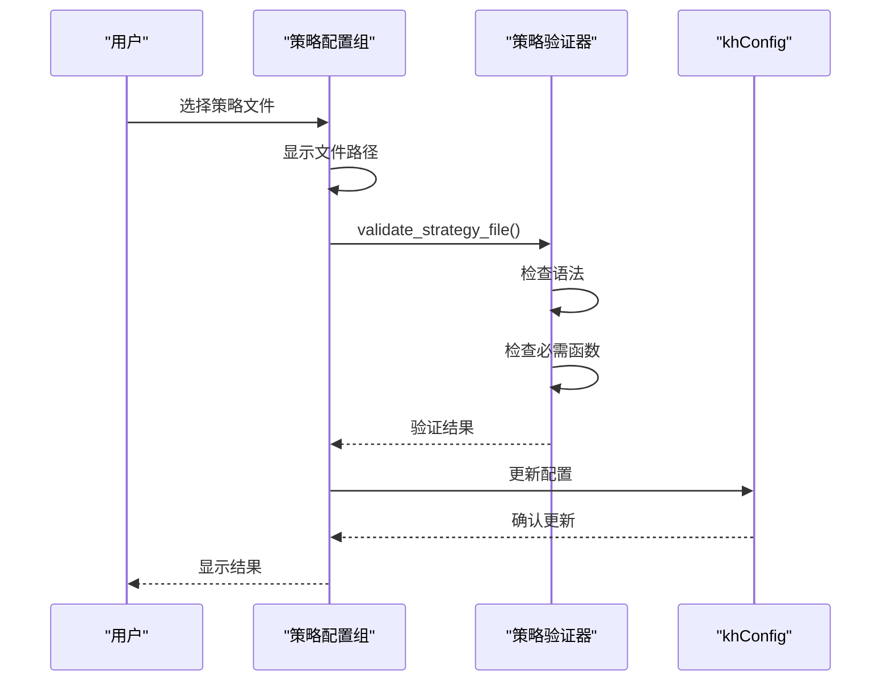
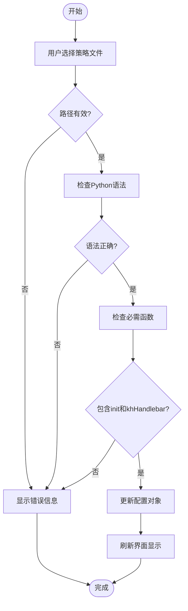
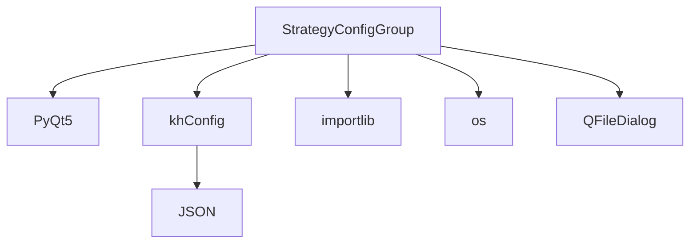

# 策略配置组

<cite>
**本文档引用的文件**   
- [GUIkhQuant.py](file://GUIkhQuant.py)
- [GUIkhQuant.md](file://modules/GUIkhQuant.md)
- [khConfig.py](file://khConfig.py)
- [RSI策略.py](file://strategies/RSI策略.py)
- [双均线多股票_使用MA函数.py](file://strategies/双均线多股票_使用MA函数.py)
- [README.md](file://README.md)
</cite>

## 目录
1. [简介](#简介)
2. [项目结构](#项目结构)
3. [核心组件](#核心组件)
4. [架构概述](#架构概述)
5. [详细组件分析](#详细组件分析)
6. [依赖分析](#依赖分析)
7. [性能考虑](#性能考虑)
8. [故障排除指南](#故障排除指南)
9. [结论](#结论)

## 简介
策略配置组是量化交易系统中的核心组件，负责管理策略文件的选择、运行模式的设置以及策略验证逻辑。该组件通过图形用户界面提供直观的策略配置功能，确保策略文件符合系统要求，并与`.kh`配置文件的'strategy'部分进行数据绑定和序列化。

## 项目结构
策略配置组主要位于GUIkhQuant模块中，与其他核心组件协同工作。项目结构清晰地划分了策略文件、配置文件和核心代码模块。

**图示来源**
- [GUIkhQuant.md](file://modules/GUIkhQuant.md)
- [GUIkhQuant.py](file://GUIkhQuant.py)

**本节来源**
- [GUIkhQuant.py](file://GUIkhQuant.py)
- [GUIkhQuant.md](file://modules/GUIkhQuant.md)

## 核心组件
策略配置组（StrategyConfigGroup）是左侧配置面板的重要组成部分，包含策略文件选择和运行模式设置功能。该组件确保用户选择的策略文件符合系统要求，并在加载时进行验证。

**本节来源**
- [GUIkhQuant.md](file://modules/GUIkhQuant.md#L101-L124)
- [GUIkhQuant.py](file://GUIkhQuant.py)

## 架构概述
策略配置组作为GUI系统的一部分，与配置管理、策略执行和数据绑定等核心功能紧密集成。它通过事件驱动的方式响应用户操作，并与其他组件协同工作。

**图示来源**
- [GUIkhQuant.py](file://GUIkhQuant.py)
- [khConfig.py](file://khConfig.py)

**本节来源**
- [GUIkhQuant.py](file://GUIkhQuant.py)
- [GUIkhQuant.md](file://modules/GUIkhQuant.md)

## 详细组件分析

### 策略配置组分析
策略配置组实现了策略文件选择、运行模式设置和策略验证的核心功能。该组件通过图形界面提供用户友好的配置体验。

#### 对象导向组件

**图示来源**
- [GUIkhQuant.md](file://modules/GUIkhQuant.md#L102-L123)
- [GUIkhQuant.py](file://GUIkhQuant.py)

#### API/服务组件

**图示来源**
- [GUIkhQuant.py](file://GUIkhQuant.py#L1945-L1984)
- [khConfig.py](file://khConfig.py)

#### 复杂逻辑组件

**图示来源**
- [GUIkhQuant.py](file://GUIkhQuant.py#L463-L510)
- [README.md](file://README.md#L1870-L1885)

**本节来源**
- [GUIkhQuant.md](file://modules/GUIkhQuant.md)
- [GUIkhQuant.py](file://GUIkhQuant.py)
- [RSI策略.py](file://strategies/RSI策略.py)
- [双均线多股票_使用MA函数.py](file://strategies/双均线多股票_使用MA函数.py)

### 概念概述
策略配置组的设计遵循了模块化和用户友好的原则，通过分层架构实现了功能的分离和复用。该组件不仅提供了基本的配置功能，还通过验证机制确保了策略的可靠性。

## 依赖分析
策略配置组依赖于多个核心模块，包括GUI框架、配置管理器和策略执行引擎。这些依赖关系确保了组件的功能完整性和系统集成性。

**图示来源**
- [GUIkhQuant.py](file://GUIkhQuant.py)
- [khConfig.py](file://khConfig.py)

**本节来源**
- [GUIkhQuant.py](file://GUIkhQuant.py)
- [khConfig.py](file://khConfig.py)

## 性能考虑
策略配置组在设计时考虑了性能因素，通过异步验证和缓存机制提高了用户体验。组件在加载大型策略文件时能够保持界面响应性，避免了长时间的阻塞操作。

## 故障排除指南
当策略配置组出现问题时，可以检查以下常见情况：策略文件路径是否正确、必需函数是否定义、配置文件是否可写。日志系统提供了详细的错误信息，有助于快速定位问题。

**本节来源**
- [GUIkhQuant.py](file://GUIkhQuant.py)
- [README.md](file://README.md)

## 结论
策略配置组是量化交易系统的关键组件，它通过直观的界面和严格的验证机制，确保了策略配置的正确性和可靠性。该组件的设计体现了模块化、可维护性和用户友好的原则，为系统的稳定运行提供了保障。