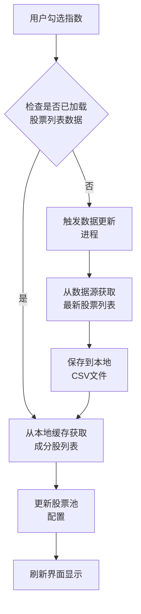
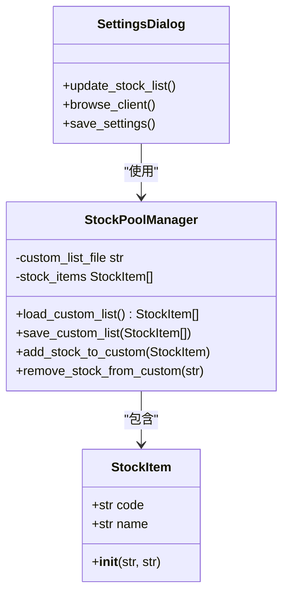
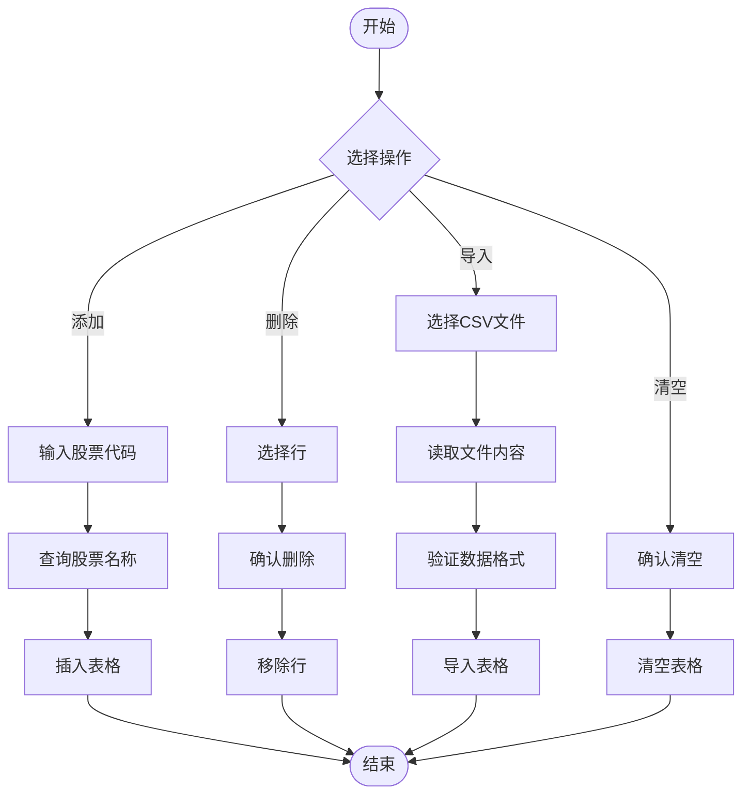
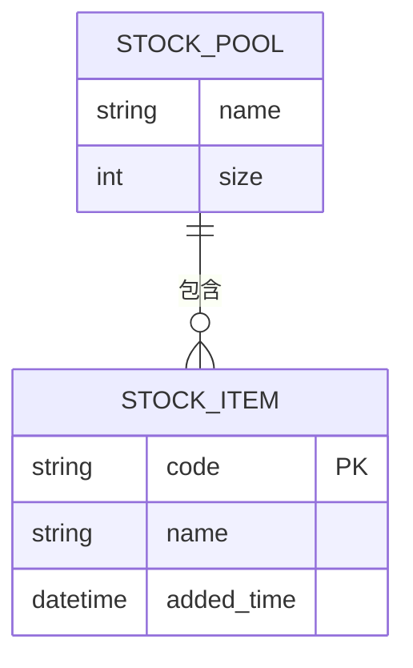
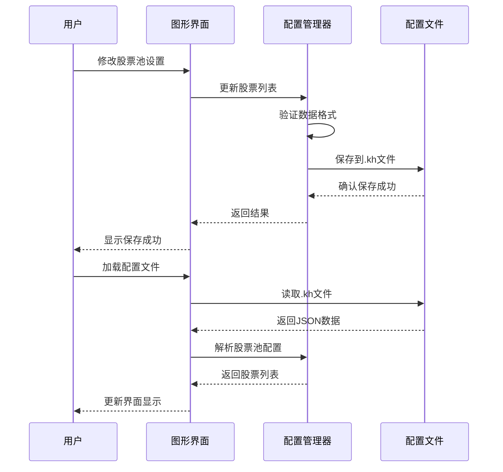
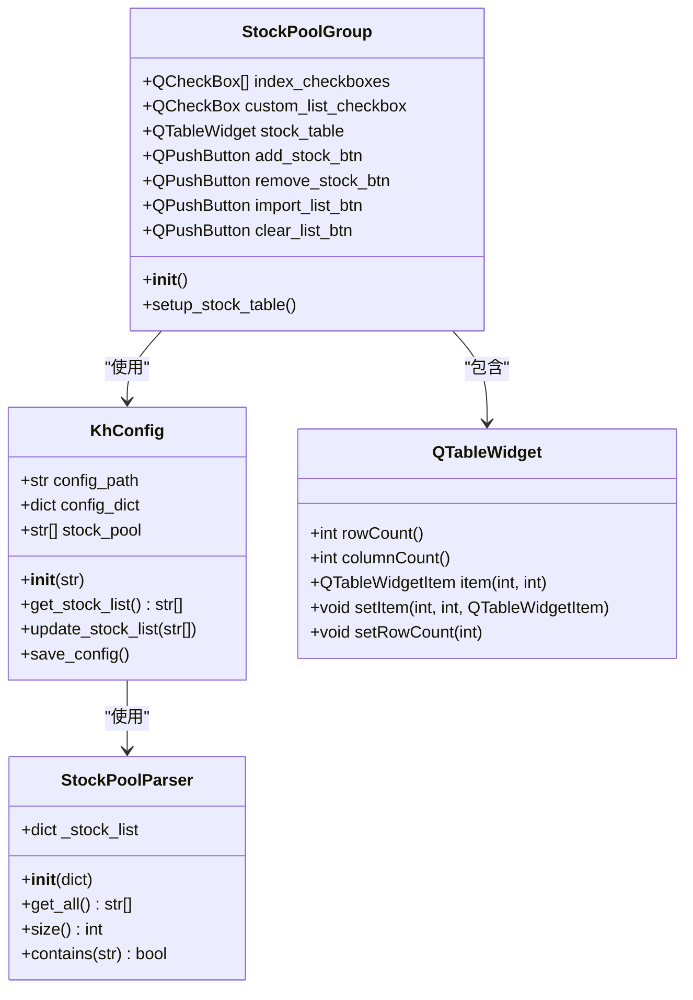

# 股票池设置组

<cite>
**本文档引用的文件**
- [GUIkhQuant.py](file://GUIkhQuant.py)
- [SettingsDialog.py](file://SettingsDialog.py)
- [khConfig.py](file://khConfig.py)
- [khQTTools.py](file://khQTTools.py)
- [GUIScheduler.py](file://GUIScheduler.py)
- [GUIDataViewer.py](file://GUIDataViewer.py)
- [khQuantImport.py](file://khQuantImport.py)
- [modules/GUIkhQuant.md](file://modules/GUIkhQuant.md)
</cite>

## 目录
1. [简介](#简介)
2. [常用指数成分股勾选逻辑](#常用指数成分股勾选逻辑)
3. [自选清单管理](#自选清单管理)
4. [手动股票表格操作](#手动股票表格操作)
5. [股票代码与名称管理](#股票代码与名称管理)
6. [配置文件序列化](#配置文件序列化)
7. [核心类实现](#核心类实现)

## 简介
股票池设置组是量化交易系统中的核心配置组件，负责管理策略运行时所涉及的股票范围。该组件提供了多种方式来定义和管理股票池，包括常用指数成分股的勾选、自选清单的管理以及手动添加股票等操作。通过这些功能，用户可以灵活地配置策略的交易范围，满足不同的投资需求。

**Section sources**
- [GUIkhQuant.py](file://GUIkhQuant.py#L1526-L1562)
- [GUIScheduler.py](file://GUIScheduler.py#L775-L1201)

## 常用指数成分股勾选逻辑
系统提供了对常用指数成分股的便捷勾选功能，用户可以通过复选框快速选择特定指数的成分股。这些指数包括上证50、沪深300、中证500、创业板指和科创50等。

当用户勾选某个指数时，系统会从预加载的股票列表中获取该指数的所有成分股代码。这些成分股信息存储在本地数据文件中，通过`khQTTools.py`中的`get_stock_list_for_subprocess`函数进行管理和更新。每个指数都有对应的代码映射，例如：

- 上证50: sh.000016
- 沪深300: sh.000300
- 中证500: sh.000905
- 创业板指: sz.399006
- 科创50: sh.000688

勾选操作会触发相应的事件处理函数，更新当前的股票池配置，并在界面中显示已选择的股票数量。



**Diagram sources**
- [khQTTools.py](file://khQTTools.py#L1658-L1832)
- [GUIScheduler.py](file://GUIScheduler.py#L797-L809)

**Section sources**
- [GUIkhQuant.py](file://GUIkhQuant.py#L1534-L1562)
- [khQTTools.py](file://khQTTools.py#L1658-L1832)

## 自选清单管理
自选清单功能允许用户创建和管理个性化的股票组合。用户可以通过"编辑自选清单"按钮打开专门的管理界面，在其中添加、删除或修改自选股票。

自选清单的数据持久化存储在本地的CSV文件中，路径通常为`data/自选清单.csv`。系统在启动时会自动加载这些数据，并在用户进行修改后及时保存。每个自选清单条目包含股票代码和股票名称两个字段，确保数据的完整性和可读性。

当用户勾选"自选清单"复选框时，系统会将该清单中的所有股票代码加入到当前的股票池中。这种机制使得用户可以轻松地在不同的投资组合之间切换，而无需重复输入股票代码。



**Diagram sources**
- [SettingsDialog.py](file://SettingsDialog.py#L626-L688)
- [GUIDataViewer.py](file://GUIDataViewer.py#L3062-L3937)

**Section sources**
- [SettingsDialog.py](file://SettingsDialog.py#L626-L688)
- [GUIDataViewer.py](file://GUIDataViewer.py#L3062-L3937)

## 手动股票表格操作
手动股票表格提供了最灵活的股票管理方式，用户可以直接在表格中添加、删除、导入和清空股票。表格包含两列：股票代码和股票名称。

### 添加股票
用户可以通过"添加股票"按钮打开输入对话框，输入股票代码后系统会自动查询并填充股票名称。添加操作会将新的股票条目插入到表格的末尾。

### 删除股票
用户可以选择表格中的一行或多行，然后点击"删除股票"按钮来移除选中的股票。系统会弹出确认对话框以防止误操作。

### 导入列表
"导入列表"功能支持从CSV文件批量导入股票数据。CSV文件应包含两列：第一列为股票代码，第二列为股票名称。系统会读取文件内容并将其添加到表格中。

### 清空列表
"清空列表"按钮会删除表格中的所有股票条目。与删除操作类似，系统会要求用户确认此操作。



**Diagram sources**
- [GUIDataViewer.py](file://GUIDataViewer.py#L3062-L3937)
- [miniQMT_data_viewer.py](file://miniQMT_data_viewer.py#L2354-L3147)

**Section sources**
- [GUIDataViewer.py](file://GUIDataViewer.py#L3062-L3937)
- [miniQMT_data_viewer.py](file://miniQMT_data_viewer.py#L2354-L3147)

## 股票代码与名称管理
系统使用`QTableWidget`来管理股票代码和名称的显示与编辑。表格的实现遵循以下原则：

1. **数据结构**：每行代表一只股票，第一列存储股票代码，第二列存储股票名称。
2. **数据验证**：在添加股票时，系统会验证股票代码的格式是否正确（6位数字）。
3. **名称自动填充**：通过`get_stock_names`函数，系统可以根据股票代码自动获取对应的股票名称。
4. **实时更新**：表格内容的任何更改都会立即反映在内存中的股票池数据结构中。

股票名称的映射数据存储在`data/全部股票_股票列表.csv`文件中，系统在启动时加载该文件到内存缓存中，以提高查询效率。这种设计避免了每次查询都读取文件的性能开销。



**Diagram sources**
- [khQTTools.py](file://khQTTools.py#L1658-L1832)
- [GUIDataViewer.py](file://GUIDataViewer.py#L3062-L3937)

**Section sources**
- [khQTTools.py](file://khQTTools.py#L1658-L1832)
- [GUIDataViewer.py](file://GUIDataViewer.py#L3062-L3937)

## 配置文件序列化
股票池的配置信息最终会序列化到`.kh`配置文件的`stock_pool`部分。`.kh`文件本质上是JSON格式的文本文件，只是使用了自定义的扩展名。

当用户保存配置时，系统会收集当前股票池的所有信息，包括：
- 勾选的指数成分股
- 是否启用自选清单
- 手动添加的股票列表

这些信息会被组织成一个JSON对象，写入配置文件的`stock_pool`字段。在加载配置时，系统会反序列化这些数据，并恢复相应的界面状态。

```json
{
  "stock_pool": {
    "indices": ["sh.000016", "sh.000300"],
    "custom_list_enabled": true,
    "manual_stocks": ["sh.600000", "sz.000001"]
  }
}
```

序列化过程由`khConfig.py`中的`KhConfig`类管理，该类提供了`update_stock_list`和`get_stock_list`等方法来操作配置数据。



**Diagram sources**
- [khConfig.py](file://khConfig.py#L57-L79)
- [modules/GUIkhQuant.md](file://modules/GUIkhQuant.md#L568-L653)

**Section sources**
- [khConfig.py](file://khConfig.py#L57-L79)
- [modules/GUIkhQuant.md](file://modules/GUIkhQuant.md#L568-L653)

## 核心类实现
股票池设置功能的核心实现分散在多个类中，每个类负责不同的职责：

- **StockPoolGroup**: 股票池配置组件的基类，定义了通用的界面元素和行为。
- **KhConfig**: 配置管理类，负责配置数据的加载、保存和序列化。
- **StockPoolParser**: 股票池解析器，用于从数据文件中解析股票池信息。
- **QTableWidget**: Qt表格组件，用于显示和编辑股票代码与名称。

这些类通过清晰的接口进行交互，形成了一个松耦合的系统架构。例如，当用户在界面上修改股票池设置时，事件会传递给`KhConfig`实例，后者负责更新内存中的配置数据，并最终将其持久化到文件系统。



**Diagram sources**
- [khQuantImport.py](file://khQuantImport.py#L317-L337)
- [khConfig.py](file://khConfig.py#L6-L105)
- [modules/GUIkhQuant.md](file://modules/GUIkhQuant.md#L189-L223)

**Section sources**
- [khQuantImport.py](file://khQuantImport.py#L317-L337)
- [khConfig.py](file://khConfig.py#L6-L105)
- [modules/GUIkhQuant.md](file://modules/GUIkhQuant.md#L189-L223)