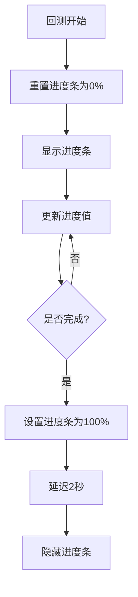
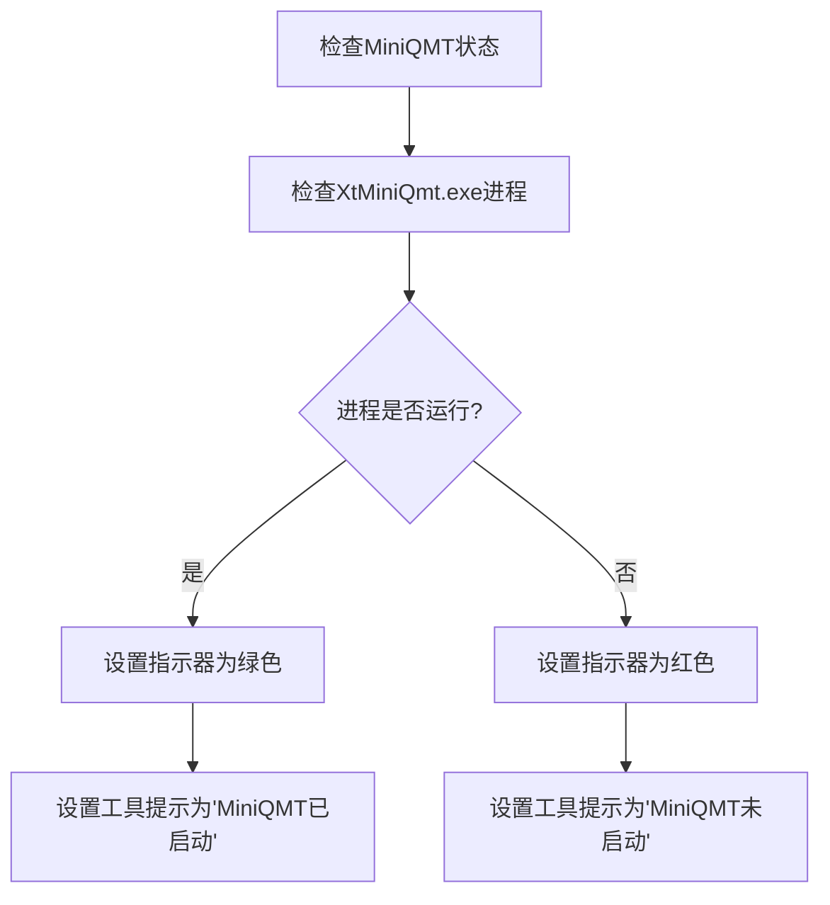

# 底部状态栏

<cite>
**本文档引用的文件**
- [GUIkhQuant.py](file://GUIkhQuant.py)
- [GUI.py](file://GUI.py)
- [khFrame.py](file://khFrame.py)
</cite>

## 目录
1. [简介](#简介)
2. [状态栏组件](#状态栏组件)
3. [状态标签](#状态标签)
4. [进度条](#进度条)
5. [连接指示器](#连接指示器)
6. [状态栏事件处理](#状态栏事件处理)
7. [连接状态更新](#连接状态更新)
8. [结论](#结论)

## 简介
底部状态栏是看海量化回测系统的重要组成部分，为用户提供系统健康状况和任务进度的实时反馈。状态栏由三个核心组件构成：`status_label`用于显示当前系统状态，`progress_bar`用于可视化回测进度，`connection_indicator`用于指示与MiniQMT客户端的连接状态。这些组件协同工作，确保用户能够清晰地了解系统的运行状态和任务执行情况。

## 状态栏组件
底部状态栏在`GUIkhQuant.py`文件中通过`setup_status_bar()`方法创建。该方法初始化了状态栏的各个组件，并将它们整合到用户界面中。状态栏的设计旨在提供直观的视觉反馈，帮助用户监控系统的运行状态和任务进度。

**Section sources**
- [GUIkhQuant.py](file://GUIkhQuant.py#L936-L999)

## 状态标签
`status_label`组件用于显示当前系统状态，如"准备就绪"、"回测进行中..."和"回测完成"。该标签通过`setText()`方法动态更新其内容，以反映系统当前的状态。例如，当回测开始时，状态标签会更新为"回测进行中..."，而在回测完成后，它会显示"回测完成"。

**Section sources**
- [GUIkhQuant.py](file://GUIkhQuant.py#L941-L943)
- [GUIkhQuant.py](file://GUIkhQuant.py#L2292)
- [GUIkhQuant.py](file://GUIkhQuant.py#L2318)

## 进度条
`progress_bar`组件用于可视化回测进度。它通过`setValue()`方法更新进度值，并通过`show()`和`hide()`方法控制其可见性。在回测开始时，进度条会显示并重置为0%，而在回测完成后，它会设置为100%并延迟隐藏，以确保用户能够看到完整的进度反馈。

**Diagram sources**
- [GUIkhQuant.py](file://GUIkhQuant.py#L2283-L2288)
- [GUIkhQuant.py](file://GUIkhQuant.py#L2317-L2320)
- [GUIkhQuant.py](file://GUIkhQuant.py#L4702-L4705)

## 连接指示器
`connection_indicator`组件用于通过颜色变化（绿色/红色）和工具提示来指示与MiniQMT客户端的连接状态。绿色表示已连接，红色表示未连接。该指示器通过`update_status_indicator()`方法更新其状态，确保用户能够实时了解与MiniQMT客户端的连接情况。

**Section sources**
- [GUIkhQuant.py](file://GUIkhQuant.py#L1116-L1125)
- [GUIkhQuant.py](file://GUIkhQuant.py#L1247-L1254)

## 状态栏事件处理
状态栏通过一系列事件处理方法来响应不同的系统事件。例如，`start_strategy()`方法在回测开始时更新状态标签和进度条，`on_strategy_finished()`方法在回测完成后更新状态标签并隐藏进度条。这些事件处理方法确保状态栏能够实时反映系统的运行状态。

**Section sources**
- [GUIkhQuant.py](file://GUIkhQuant.py#L2220-L2297)
- [GUIkhQuant.py](file://GUIkhQuant.py#L2307-L2357)

## 连接状态更新
`update_connection_status`方法的实现通过检查MiniQMT客户端的进程是否存在来更新连接状态。如果进程存在，连接状态指示器会显示为绿色，并提示"MiniQMT已启动"；如果进程不存在，则显示为红色，并提示"MiniQMT未启动"。这种方法确保了连接状态的准确性和实时性。

**Diagram sources**
- [GUIkhQuant.py](file://GUIkhQuant.py#L1242-L1254)
- [GUIkhQuant.py](file://GUIkhQuant.py#L1264-L1287)

## 结论
底部状态栏作为系统健康度和任务进度的实时反馈机制，对于提升用户体验至关重要。通过`status_label`、`progress_bar`和`connection_indicator`三个组件的协同工作，用户能够清晰地了解系统的运行状态和任务执行情况。这种实时反馈机制不仅提高了系统的透明度，还增强了用户对系统的信任和控制感。