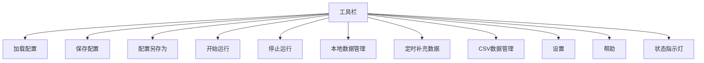
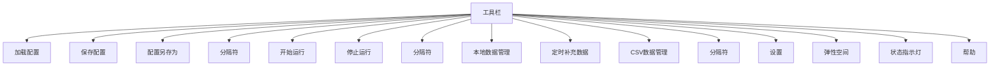
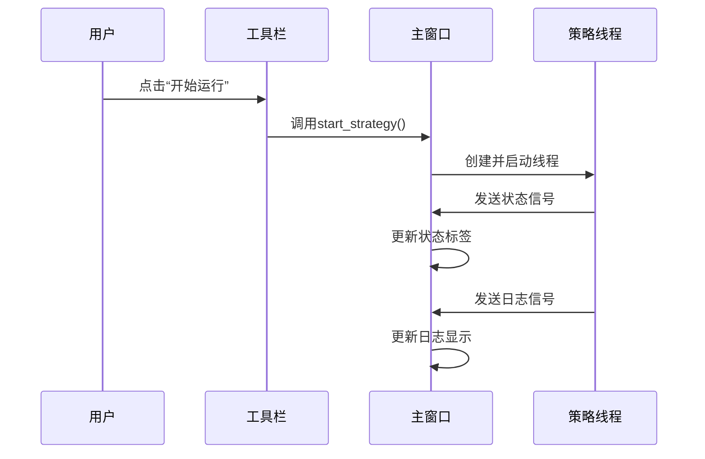

# 顶部工具栏

<cite>
**本文档引用的文件**   
- [GUIkhQuant.py](file://GUIkhQuant.py)
- [modules/GUIkhQuant.md](file://modules/GUIkhQuant.md)
- [GUI.py](file://GUI.py)
</cite>

## 目录
1. [简介](#简介)
2. [工具栏功能概述](#工具栏功能概述)
3. [工具栏按钮详细说明](#工具栏按钮详细说明)
4. [工具栏布局与样式](#工具栏布局与样式)
5. [工具栏与主窗口的交互](#工具栏与主窗口的交互)
6. [可访问性与响应式设计](#可访问性与响应式设计)
7. [结论](#结论)

## 简介
顶部工具栏是看海量化回测系统的主要操作入口，为用户提供了一组直观、高效的控制按钮，用于管理配置、启动回测、访问数据和调整设置。该工具栏的设计理念是将最常用的功能集中在一个易于访问的位置，从而提升用户的操作效率和体验。工具栏通过信号-槽机制与主窗口的其他组件紧密集成，确保了操作的实时性和一致性。

**Section sources**
- [GUIkhQuant.py](file://GUIkhQuant.py#L1050-L1240)

## 工具栏功能概述
工具栏通过`create_toolbar()`方法实现，该方法创建了一个不可移动的工具栏，并添加了一系列功能按钮。这些按钮包括加载和保存配置、开始和停止回测、访问数据中心和软件设置等。工具栏还包含一个状态指示灯，用于显示MiniQMT软件的连接状态，以及一个帮助按钮，用于打开使用教程。

**Diagram sources **
- [GUIkhQuant.py](file://GUIkhQuant.py#L1050-L1240)

**Section sources**
- [GUIkhQuant.py](file://GUIkhQuant.py#L1050-L1240)

## 工具栏按钮详细说明
工具栏中的每个按钮都有特定的图标、提示文本、快捷键绑定和对应的槽函数。以下是各按钮的详细说明：

### 加载配置
- **图标**: `folder_open.png`
- **提示文本**: "加载配置文件(.kh)"
- **快捷键**: `Ctrl+O`
- **槽函数**: `load_config()`
- **功能**: 打开文件对话框，允许用户选择并加载一个.kh配置文件。加载后，界面会根据配置文件中的设置进行更新。

### 保存配置
- **图标**: `save.png`
- **提示文本**: "保存当前配置"
- **快捷键**: `Ctrl+S`
- **槽函数**: `save_config()`
- **功能**: 将当前的配置保存到已加载的配置文件中。如果尚未加载配置文件，则执行“配置另存为”操作。

### 配置另存为
- **图标**: `save_as.png`
- **提示文本**: "配置另存为"
- **快捷键**: `Ctrl+Shift+S`
- **槽函数**: `save_config_as()`
- **功能**: 打开文件对话框，允许用户选择一个新的文件路径来保存当前配置。

### 开始运行
- **图标**: `play.png`
- **提示文本**: "开始策略回测"
- **快捷键**: `F5`
- **槽函数**: `start_strategy()`
- **功能**: 启动策略回测。点击后，系统会创建一个临时配置文件，并启动一个策略线程来执行回测。按钮在回测进行时被禁用。

### 停止运行
- **图标**: `stop.png`
- **提示文本**: "停止策略回测"
- **快捷键**: `Esc`
- **槽函数**: `stop_strategy()`
- **功能**: 停止正在进行的策略回测。点击后，系统会停止策略线程，并清理临时配置文件。按钮在回测未进行时被禁用。

### 本地数据管理
- **图标**: 无
- **提示文本**: "查看和分析本地存储的股票数据"
- **快捷键**: 无
- **槽函数**: `open_data_viewer()`
- **功能**: 打开数据查看器窗口，允许用户查看和分析本地存储的股票数据。

### 定时补充数据
- **图标**: 无
- **提示文本**: "设置和管理数据定时补充任务"
- **快捷键**: 无
- **槽函数**: `open_scheduler()`
- **功能**: 打开数据定时补充模块，允许用户设置和管理数据定时补充任务。

### CSV数据管理
- **图标**: 无
- **提示文本**: "打开CSV数据下载、清洗和管理界面"
- **快捷键**: 无
- **槽函数**: `open_data_module()`
- **功能**: 打开CSV数据管理模块，允许用户下载、清洗和管理CSV数据。

### 设置
- **图标**: `settings.png`
- **提示文本**: "打开软件设置"
- **快捷键**: 无
- **槽函数**: `show_settings()`
- **功能**: 打开设置对话框，允许用户调整软件的各种设置，如延迟日志显示、最大日志行数等。

### 帮助
- **图标**: "?"
- **提示文本**: "打开使用教程"
- **快捷键**: 无
- **槽函数**: `open_help_tutorial()`
- **功能**: 打开在线教程页面，提供用户使用指导。

**Section sources**
- [GUIkhQuant.py](file://GUIkhQuant.py#L1057-L1109)
- [modules/GUIkhQuant.md](file://modules/GUIkhQuant.md#L54-L93)

## 工具栏布局与样式
工具栏的布局通过`create_toolbar()`方法中的代码实现。工具栏包含多个按钮，按钮之间通过分隔符分隔。工具栏的样式通过`setStyleSheet()`方法设置，背景色为深灰色，按钮的背景色为中灰色，鼠标悬停时变为浅灰色，按下时变为深灰色。

**Diagram sources **
- [GUIkhQuant.py](file://GUIkhQuant.py#L1050-L1240)

**Section sources**
- [GUIkhQuant.py](file://GUIkhQuant.py#L1159-L1185)

## 工具栏与主窗口的交互
工具栏通过信号-槽机制与主窗口的其他组件进行交互。例如，当用户点击“开始运行”按钮时，`start_strategy()`槽函数会被调用，该函数会创建一个策略线程并启动回测。回测过程中，策略线程会通过信号向主窗口发送状态和日志信息，主窗口会更新相应的界面元素。

**Diagram sources **
- [GUIkhQuant.py](file://GUIkhQuant.py#L2219-L2360)

**Section sources**
- [GUIkhQuant.py](file://GUIkhQuant.py#L2219-L2360)

## 可访问性与响应式设计
工具栏的设计考虑了可访问性和响应式需求。按钮的大小和间距根据屏幕分辨率动态调整，确保在不同设备上都能良好显示。此外，工具栏中的按钮都配有提示文本，帮助用户理解其功能。状态指示灯和帮助按钮的加入进一步提升了用户体验。

**Section sources**
- [GUIkhQuant.py](file://GUIkhQuant.py#L1116-L1125)
- [GUIkhQuant.py](file://GUIkhQuant.py#L1128-L1148)

## 结论
顶部工具栏是看海量化回测系统的核心组件之一，它通过一组直观的按钮为用户提供了一站式的操作入口。工具栏的设计充分考虑了用户的需求和体验，通过信号-槽机制与主窗口的其他组件紧密集成，确保了操作的实时性和一致性。未来可以进一步优化工具栏的布局和样式，以适应更多不同的使用场景。