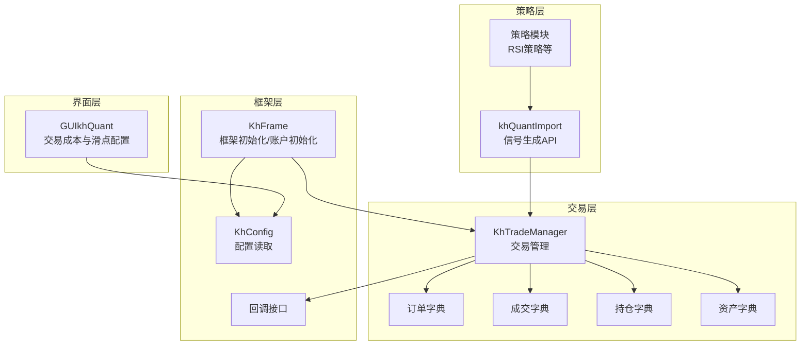
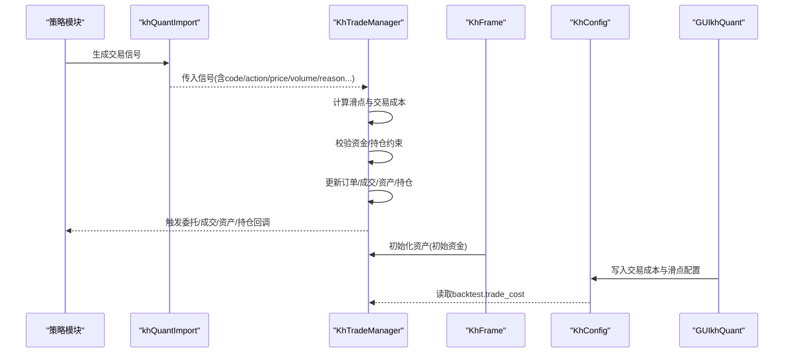
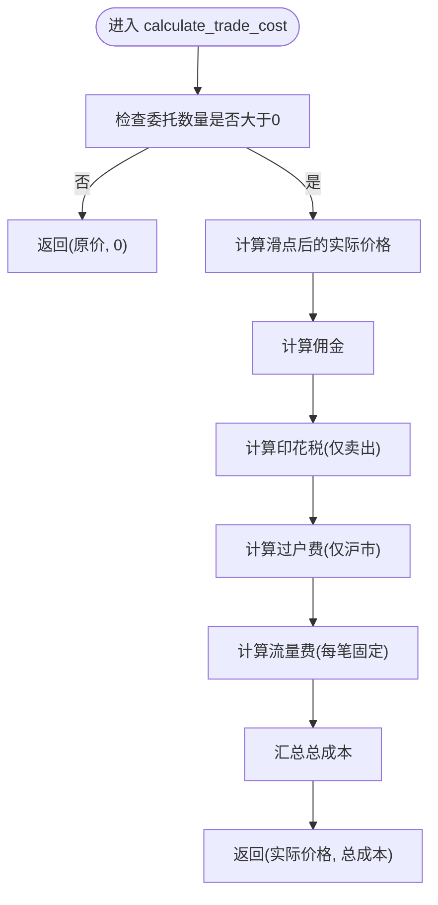
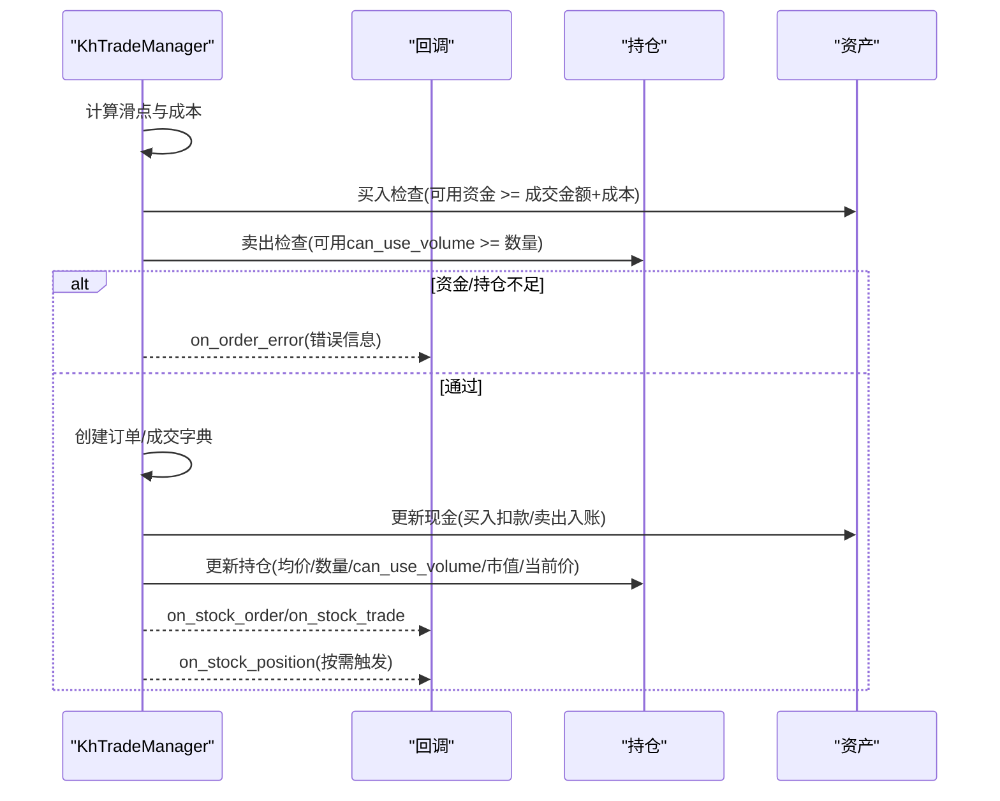
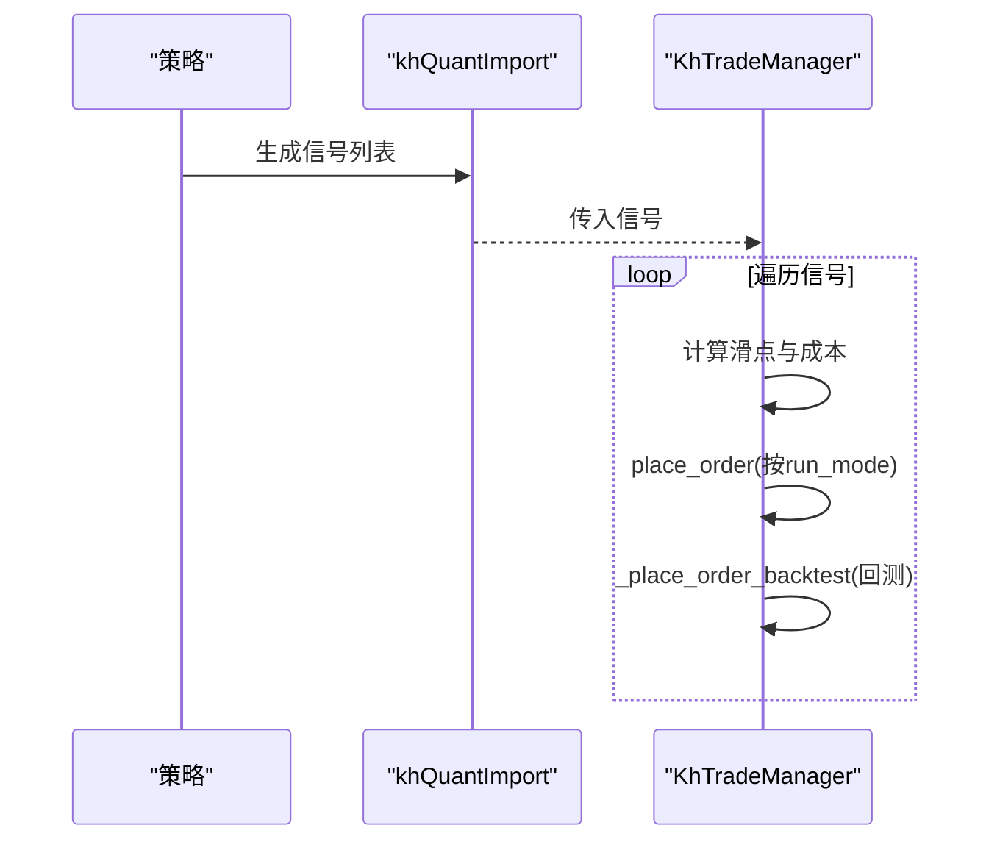
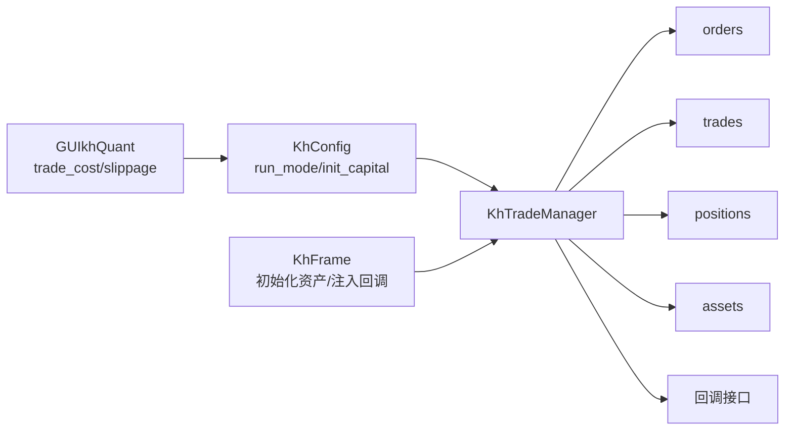

# 交易管理

<cite>
**本文引用的文件**
- [khTrade.py](file://khTrade.py)
- [khFrame.py](file://khFrame.py)
- [khConfig.py](file://khConfig.py)
- [GUIkhQuant.py](file://GUIkhQuant.py)
- [modules/khQuantImport.md](file://modules/khQuantImport.md)
- [strategies/RSI策略.py](file://strategies/RSI策略.py)
</cite>

## 目录
1. [简介](#简介)
2. [项目结构](#项目结构)
3. [核心组件](#核心组件)
4. [架构总览](#架构总览)
5. [详细组件分析](#详细组件分析)
6. [依赖关系分析](#依赖关系分析)
7. [性能考量](#性能考量)
8. [故障排查指南](#故障排查指南)
9. [结论](#结论)
10. [附录](#附录)

## 简介
本文件围绕交易管理模块，系统性解析 khTrade.py 中的 KhTradeManager 类，重点覆盖如下主题：
- 订单管理与下单流程（实盘、模拟、回测三种模式）
- 交易成本计算（佣金、印花税、过户费、流量费）
- 滑点模型（按跳数与按比例两种模式）
- 回测模式下的资金与持仓更新规则
- 配置方法（价格精度、T+0 模式）
- 交易信号处理流程与成本计算细节

## 项目结构
交易管理位于 khTrade.py，与框架初始化 khFrame.py、配置 khConfig.py、GUI 配置 GUIkhQuant.py、策略信号生成 modules/khQuantImport.md 等模块协同工作。

图表来源
- [khTrade.py](file://khTrade.py#L1-L120)
- [khFrame.py](file://khFrame.py#L570-L705)
- [khConfig.py](file://khConfig.py#L1-L60)
- [GUIkhQuant.py](file://GUIkhQuant.py#L1289-L1350)

章节来源
- [khTrade.py](file://khTrade.py#L1-L120)
- [khFrame.py](file://khFrame.py#L570-L705)
- [khConfig.py](file://khConfig.py#L1-L60)
- [GUIkhQuant.py](file://GUIkhQuant.py#L1289-L1350)

## 核心组件
- KhTradeManager：负责交易成本计算、滑点处理、订单/成交/持仓/资产管理、以及在不同运行模式下的下单逻辑。
- KhFrame：负责初始化虚拟账户、设置初始资金、并将回调注入交易管理器。
- KhConfig：提供运行模式、初始资金、交易成本配置等基础信息。
- GUIkhQuant：提供交易成本与滑点配置入口，写入 backtest.trade_cost。
- 策略模块与 khQuantImport：生成交易信号（buy/sell），传递给交易管理器。

章节来源
- [khTrade.py](file://khTrade.py#L1-L120)
- [khFrame.py](file://khFrame.py#L659-L705)
- [khConfig.py](file://khConfig.py#L1-L60)
- [GUIkhQuant.py](file://GUIkhQuant.py#L1289-L1350)
- [modules/khQuantImport.md](file://modules/khQuantImport.md#L508-L570)

## 架构总览
KhTradeManager 在回测模式下通过 _place_order_backtest 执行交易，先计算滑点与交易成本，再校验资金/持仓约束，最后更新订单、成交、资产与持仓，并触发回调。KhFrame 在初始化阶段将初始资金写入交易管理器的 assets 字典，确保回测资金流一致。

图表来源
- [khTrade.py](file://khTrade.py#L197-L239)
- [khTrade.py](file://khTrade.py#L268-L505)
- [khFrame.py](file://khFrame.py#L659-L705)
- [khConfig.py](file://khConfig.py#L1-L60)
- [GUIkhQuant.py](file://GUIkhQuant.py#L1289-L1350)

## 详细组件分析

### KhTradeManager 类与职责
- 初始化与配置
  - 从 config.config_dict["backtest"]["trade_cost"] 读取交易成本参数（最低佣金、佣金比例、印花税率、流量费）与滑点配置（type、tick_size、tick_count、ratio）。
  - 价格精度 price_decimals 默认为2，T+0 模式 t0_mode 默认关闭。
- 订单与资产
  - orders/trades/positions/assets 字典维护交易生命周期各阶段数据。
- 方法概览
  - set_price_decimals：设置价格精度（股票2位，ETF3位）。
  - set_t0_mode：启用/禁用 T+0（当天买入可当天卖出）。
  - calculate_slippage/calculate_commission/calculate_stamp_tax/calculate_transfer_fee/calculate_flow_fee/calculate_trade_cost：交易成本计算链路。
  - process_signals/place_order/_place_order_backtest：交易信号处理与回测下单。
  - on_order/on_trade/on_order_error/on_cancel_error/on_order_stock_async_response：回调处理。

章节来源
- [khTrade.py](file://khTrade.py#L1-L120)
- [khTrade.py](file://khTrade.py#L44-L63)
- [khTrade.py](file://khTrade.py#L80-L114)
- [khTrade.py](file://khTrade.py#L116-L158)
- [khTrade.py](file://khTrade.py#L160-L196)
- [khTrade.py](file://khTrade.py#L197-L239)
- [khTrade.py](file://khTrade.py#L241-L254)
- [khTrade.py](file://khTrade.py#L268-L505)
- [khTrade.py](file://khTrade.py#L507-L533)

### 交易成本计算链路（calculate_trade_cost）
- 输入：原始委托价格、委托数量、交易方向、股票代码。
- 步骤：
  1) 计算滑点后的实际成交价格（按跳数或按比例）。
  2) 计算佣金（按成交金额与比例，不低于最低佣金）。
  3) 计算印花税（仅卖出时收取）。
  4) 计算过户费（仅沪市 sh. 股票收取）。
  5) 计算流量费（每笔固定）。
  6) 汇总得到总交易成本。
- 输出：实际成交价格、总交易成本。

图表来源
- [khTrade.py](file://khTrade.py#L160-L196)
- [khTrade.py](file://khTrade.py#L80-L114)
- [khTrade.py](file://khTrade.py#L116-L126)
- [khTrade.py](file://khTrade.py#L127-L136)
- [khTrade.py](file://khTrade.py#L137-L155)
- [khTrade.py](file://khTrade.py#L156-L158)

章节来源
- [khTrade.py](file://khTrade.py#L80-L158)
- [khTrade.py](file://khTrade.py#L160-L196)

### 滑点设置与实际成交价格
- 滑点类型
  - tick 模式：按最小变动价跳数计算，买入上浮、卖出下浮。
  - ratio 模式：按成交金额的比例计算，买入上浮、卖出下浮。
- 价格精度
  - 使用 price_decimals 控制四舍五入的小数位数。
- 影响范围
  - 仅影响“实际成交价格”，不影响委托价格（委托价格仍为信号中的 price）。

章节来源
- [khTrade.py](file://khTrade.py#L80-L114)
- [khTrade.py](file://khTrade.py#L44-L63)

### 回测下单逻辑（_place_order_backtest）
- 关键步骤
  1) 生成订单ID，提前计算实际成交价格与总交易成本。
  2) 买入：检查可用资金是否足以支付 actual_price * volume + trade_cost。
  3) 卖出：检查可用持仓是否满足 can_use_volume >= volume。
  4) 资金/持仓检查通过后：
     - 创建订单字典（委托价为信号中的 price，成交价为 actual_price）。
     - 创建成交字典（traded_price 为 actual_price）。
     - 更新资产：买入扣款（含成本），卖出入账（成交金额减去成本）。
     - 更新持仓：新建或累加均价、更新 can_use_volume（受 t0_mode 影响）、更新市值与当前价。
  5) 触发委托/成交回调；输出交易成本日志。
- 错误处理
  - 资金不足/持仓不足时，记录错误日志并触发 on_order_error 回调。
  - 异常捕获并触发通用错误回调。

图表来源
- [khTrade.py](file://khTrade.py#L268-L505)

章节来源
- [khTrade.py](file://khTrade.py#L268-L505)

### 资金与持仓更新规则（回测）
- 资金
  - 买入：assets["cash"] -= (actual_price * volume + trade_cost)
  - 卖出：assets["cash"] += (actual_price * volume - trade_cost)
- 持仓
  - 新建：avg_price/open_price/current_price 均设为 actual_price；can_use_volume 受 t0_mode 影响。
  - 增仓：均价按成本加权法更新；can_use_volume 在 T+0 模式下可即时增加。
  - 减仓：volume 与 can_use_volume 同步减少；清仓时删除持仓记录并触发清仓回调。
- T+0 模式
  - 启用时，当天买入的 can_use_volume 立即增加；禁用时，当天买入不可卖出。

章节来源
- [khTrade.py](file://khTrade.py#L378-L456)
- [khTrade.py](file://khTrade.py#L427-L456)
- [khTrade.py](file://khTrade.py#L52-L63)

### 配置方法
- set_price_decimals(decimals)
  - 设置价格精度（股票默认2位，ETF建议3位）。
- set_t0_mode(enabled)
  - 启用/禁用 T+0 模式，打印提示信息。

章节来源
- [khTrade.py](file://khTrade.py#L44-L63)

### 交易信号处理流程
- 策略侧通过 khQuantImport 生成信号（buy/sell），包含 code/action/price/volume/reason 等字段。
- KhTradeManager.process_signals 对每个信号：
  - 忽略 volume<=0 的信号；
  - 计算 trade_cost 与 actual_price 并写入信号；
  - 调用 place_order，依据 run_mode 分派到 live/simulate/backtest。
- 回测模式下，place_order 调用 _place_order_backtest。

图表来源
- [modules/khQuantImport.md](file://modules/khQuantImport.md#L508-L570)
- [khTrade.py](file://khTrade.py#L197-L239)
- [khTrade.py](file://khTrade.py#L241-L254)
- [khTrade.py](file://khTrade.py#L268-L505)

章节来源
- [modules/khQuantImport.md](file://modules/khQuantImport.md#L508-L570)
- [khTrade.py](file://khTrade.py#L197-L254)

### 代码示例（路径指引）
- 交易成本计算链路
  - [calculate_slippage](file://khTrade.py#L80-L114)
  - [calculate_commission](file://khTrade.py#L116-L126)
  - [calculate_stamp_tax](file://khTrade.py#L127-L136)
  - [calculate_transfer_fee](file://khTrade.py#L137-L155)
  - [calculate_flow_fee](file://khTrade.py#L156-L158)
  - [calculate_trade_cost](file://khTrade.py#L160-L196)
- 回测下单与资金/持仓更新
  - [_place_order_backtest](file://khTrade.py#L268-L505)
- 配置方法
  - [set_price_decimals](file://khTrade.py#L44-L51)
  - [set_t0_mode](file://khTrade.py#L52-L63)
- 交易信号生成与处理
  - [khBuy/khSell](file://modules/khQuantImport.md#L508-L570)
  - [RSI策略示例](file://strategies/RSI策略.py#L12-L24)

## 依赖关系分析
- KhTradeManager 依赖
  - 配置：config.config_dict["backtest"]["trade_cost"] 提供成本与滑点参数。
  - 运行模式：config.run_mode 决定下单分支（live/simulate/backtest）。
  - 回调：callback.on_stock_order/on_stock_trade/on_stock_position/on_order_error 等。
  - 框架：KhFrame 初始化 assets、positions、orders、trades，并注入回调。
- 外部依赖
  - xtquant.xttrader.XtQuantTraderCallback、xtconstant（用于订单/成交状态与方向标志）。

图表来源
- [khConfig.py](file://khConfig.py#L1-L60)
- [GUIkhQuant.py](file://GUIkhQuant.py#L1289-L1350)
- [khFrame.py](file://khFrame.py#L659-L705)
- [khTrade.py](file://khTrade.py#L1-L120)

章节来源
- [khConfig.py](file://khConfig.py#L1-L60)
- [GUIkhQuant.py](file://GUIkhQuant.py#L1289-L1350)
- [khFrame.py](file://khFrame.py#L659-L705)
- [khTrade.py](file://khTrade.py#L1-L120)

## 性能考量
- 计算复杂度
  - 交易成本计算为 O(1)，滑点计算 O(1)，适合高频回测。
- 数据结构
  - orders/trades/positions/assets 采用字典存储，查找/更新均为 O(1)。
- 价格精度
  - 通过 price_decimals 控制四舍五入，避免浮点误差累积。
- T+0 模式
  - 仅影响 can_use_volume 的即时可用性，不引入额外计算开销。

[本节为通用指导，无需具体文件分析]

## 故障排查指南
- 资金不足
  - 现象：回测下单时打印资金不足并触发 on_order_error。
  - 排查：确认初始资金、滑点与交易成本叠加是否超过可用资金。
  - 参考路径：[_place_order_backtest 资金检查与错误回调](file://khTrade.py#L286-L307)
- 持仓不足
  - 现象：卖出时可用 can_use_volume 不足触发 on_order_error。
  - 排查：确认 T+0 模式是否开启、是否已发生过买入但未过交收日。
  - 参考路径：[_place_order_backtest 持仓检查与错误回调](file://khTrade.py#L309-L326)
- 滑点与成本异常
  - 现象：成交价与委托价差异过大。
  - 排查：检查滑点类型（tick/ratio）、tick_size/tick_count/ratio 设置。
  - 参考路径：[calculate_slippage](file://khTrade.py#L80-L114)
- 回调未触发
  - 现象：交易完成后未看到委托/成交/资产/持仓回调。
  - 排查：确认 KhFrame 已将 trader_callback 注入到 trade_mgr。
  - 参考路径：[KhFrame 初始化与回调注入](file://khFrame.py#L651-L658)

章节来源
- [khTrade.py](file://khTrade.py#L286-L326)
- [khTrade.py](file://khTrade.py#L80-L114)
- [khFrame.py](file://khFrame.py#L651-L658)

## 结论
KhTradeManager 通过清晰的成本计算链路与严谨的回测下单流程，实现了对交易成本、滑点、资金与持仓的完整模拟。配合 GUI 配置与框架初始化，能够在回测环境中准确反映策略的真实收益与风险。T+0 模式与价格精度控制进一步提升了灵活性与准确性。

[本节为总结，无需具体文件分析]

## 附录

### 交易成本与滑点配置项
- 最低佣金：min_commission
- 佣金比例：commission_rate
- 印花税率：stamp_tax_rate
- 流量费：flow_fee
- 滑点类型：slippage.type（"tick" 或 "ratio"）
- 滑点参数：
  - tick 模式：tick_size、tick_count
  - ratio 模式：ratio

章节来源
- [khTrade.py](file://khTrade.py#L20-L36)
- [GUIkhQuant.py](file://GUIkhQuant.py#L1289-L1350)

### 交易信号字段说明
- code：股票代码
- action：buy/sell
- price：委托价格
- volume：委托数量（股）
- reason：交易原因
- order_type/position_type/order_time/remark：可选字段

章节来源
- [khTrade.py](file://khTrade.py#L197-L216)
- [modules/khQuantImport.md](file://modules/khQuantImport.md#L508-L570)