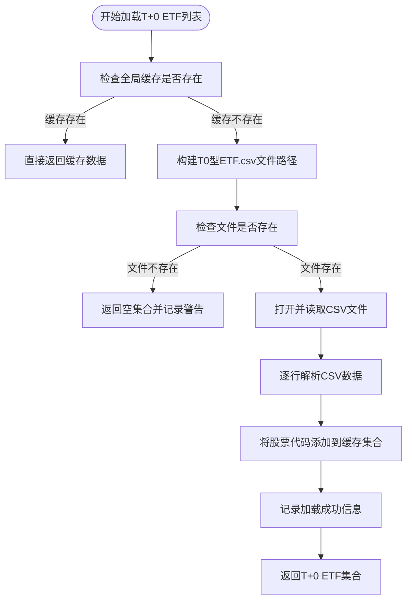
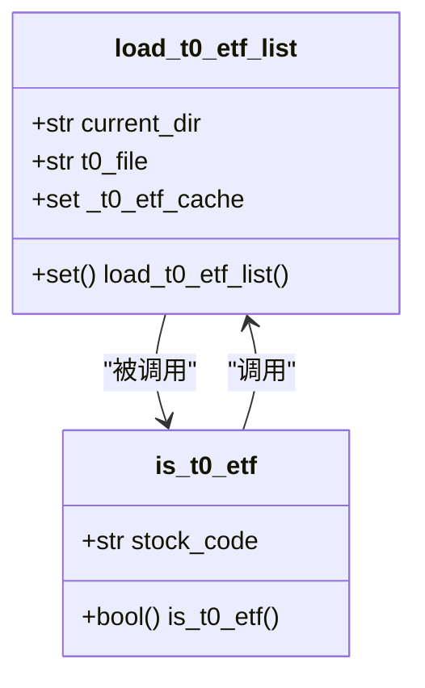
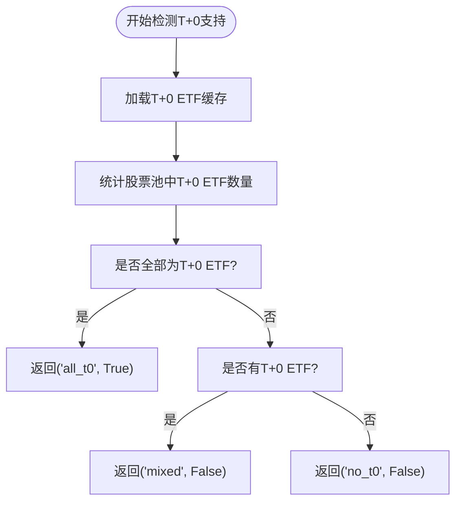
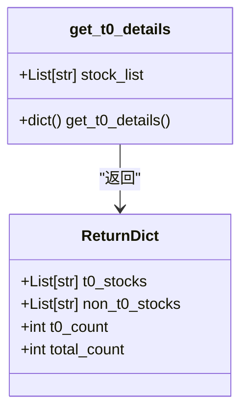
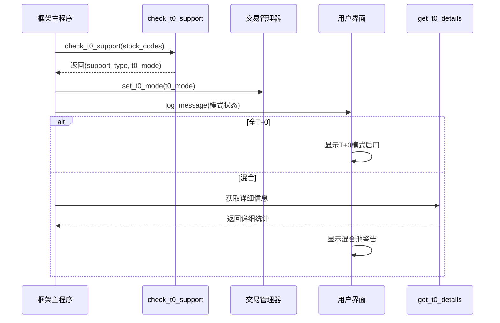
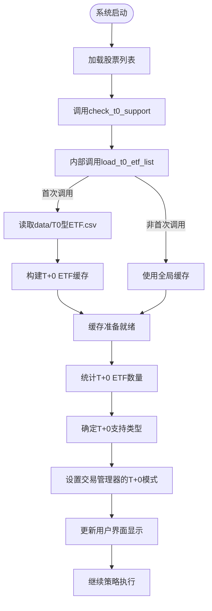

# T+0交易支持

<cite>
**本文档引用的文件**   
- [khQTTools.py](file://khQTTools.py#L136-L235)
- [khFrame.py](file://khFrame.py#L984-L1015)
- [khTrade.py](file://khTrade.py#L42-L63)
</cite>

## 目录
1. [简介](#简介)
2. [T+0功能核心组件](#t0功能核心组件)
3. [T+0 ETF缓存机制](#t0-etf缓存机制)
4. [T+0支持类型检测](#t0支持类型检测)
5. [T+0详细信息查询](#t0详细信息查询)
6. [T+0模式在策略中的应用](#t0模式在策略中的应用)
7. [系统集成与工作流程](#系统集成与工作流程)
8. [最佳实践与注意事项](#最佳实践与注意事项)

## 简介
T+0交易支持功能是本量化交易系统的重要组成部分，旨在为用户提供对T+0型ETF的识别和交易支持能力。该功能通过读取本地CSV文件建立T+0 ETF代码缓存，并提供高效的查询接口，使策略能够根据股票池的构成自动调整交易模式。系统能够准确识别股票池的T+0支持类型（全支持、混合、不支持），并相应地启用T+0或T+1交易模式，确保交易逻辑的正确性。

## T+0功能核心组件

T+0交易支持功能由四个核心函数构成，它们协同工作以实现完整的T+0支持检测和管理：

- `load_t0_etf_list`: 负责加载和缓存T+0型ETF列表
- `is_t0_etf`: 用于判断单个股票是否支持T+0交易
- `check_t0_support`: 检验整个股票池的T+0支持情况
- `get_t0_details`: 获取股票池中T+0支持的详细统计信息

这些函数共同构成了一个完整的T+0支持检测系统，从数据加载到结果查询，为策略引擎提供了必要的决策依据。

**Section sources**
- [khQTTools.py](file://khQTTools.py#L136-L235)

## T+0 ETF缓存机制

### 数据加载与缓存策略

系统通过`load_t0_etf_list`函数实现T+0 ETF列表的加载和缓存。该函数采用全局缓存机制，避免了重复读取文件的开销，提高了查询效率。



**Diagram sources**
- [khQTTools.py](file://khQTTools.py#L137-L170)

### 缓存实现细节

`load_t0_etf_list`函数使用全局变量`_t0_etf_cache`来存储已加载的T+0 ETF代码集合。当函数首次被调用时，它会从`data/T0型ETF.csv`文件中读取所有T+0 ETF代码并存入缓存；后续调用则直接返回缓存数据，避免了重复的I/O操作。



**Diagram sources**
- [khQTTools.py](file://khQTTools.py#L137-L182)

**Section sources**
- [khQTTools.py](file://khQTTools.py#L137-L182)

## T+0支持类型检测

### 支持类型分类逻辑

`check_t0_support`函数是T+0支持检测的核心，它分析股票池中T+0 ETF的占比，并返回相应的支持类型和交易模式标志。



**Diagram sources**
- [khQTTools.py](file://khQTTools.py#L184-L210)

### 返回值说明

`check_t0_support`函数返回一个包含两个元素的元组：

- `support_type`: 表示T+0支持类型，有三种可能值：
  - `'all_t0'`: 股票池中所有股票都支持T+0交易
  - `'mixed'`: 股票池中包含部分支持T+0的股票和部分不支持的股票
  - `'no_t0'`: 股票池中没有股票支持T+0交易
- `is_t0_mode`: 布尔值，表示是否应启用T+0交易模式，仅当`support_type`为`'all_t0'`时为`True`

**Section sources**
- [khQTTools.py](file://khQTTools.py#L184-L210)

## T+0详细信息查询

### 详细信息结构

`get_t0_details`函数提供比`check_t0_support`更详细的T+0支持信息，返回一个包含完整统计信息的字典。



**Diagram sources**
- [khQTTools.py](file://khQTTools.py#L211-L235)

### 信息内容

`get_t0_details`函数返回的字典包含以下四个关键字段：

- `t0_stocks`: 支持T+0交易的股票代码列表
- `non_t0_stocks`: 不支持T+0交易的股票代码列表
- `t0_count`: 支持T+0交易的股票数量
- `total_count`: 股票池总数量

这些详细信息对于用户了解股票池构成、诊断T+0模式未启用原因非常有帮助。

**Section sources**
- [khQTTools.py](file://khQTTools.py#L211-L235)

## T+0模式在策略中的应用

### 策略配置示例

以下是在策略配置中根据T+0支持类型调整交易逻辑的编程示例：

```python
# 在策略初始化时检测T+0支持情况
t0_support_type, t0_mode = check_t0_support(stock_list)

if t0_mode:
    # 启用T+0交易逻辑
    self.enable_t0_trading()
    self.log("T+0交易模式已启用")
else:
    # 使用T+1交易逻辑
    self.enable_t1_trading()
    self.log("使用T+1交易模式")
    
    if t0_support_type == 'mixed':
        # 获取详细信息用于日志记录
        t0_details = get_t0_details(stock_list)
        self.log(f"混合股票池: {t0_details['t0_count']}只T+0 ETF, {len(t0_details['non_t0_stocks'])}只非T+0股票")
```

### 交易模式设置

系统通过`set_t0_mode`方法将T+0模式设置传递给交易管理器，从而影响实际的交易行为。



**Diagram sources**
- [khFrame.py](file://khFrame.py#L984-L1015)
- [khTrade.py](file://khTrade.py#L53-L63)

**Section sources**
- [khFrame.py](file://khFrame.py#L984-L1015)
- [khTrade.py](file://khTrade.py#L53-L63)

## 系统集成与工作流程

### 完整工作流程

T+0支持功能在系统启动时的完整工作流程如下：



**Diagram sources**
- [khFrame.py](file://khFrame.py#L984-L1015)
- [khQTTools.py](file://khQTTools.py#L137-L210)

### 错误处理机制

系统具备完善的错误处理机制，确保在T+0 ETF文件缺失或读取失败时仍能正常运行：

- 当`data/T0型ETF.csv`文件不存在时，`load_t0_etf_list`函数会记录警告日志并返回空集合
- 空集合意味着没有股票被识别为支持T+0，系统将默认使用T+1模式
- 这种设计保证了系统的健壮性，即使缺少T+0配置文件也不会导致程序崩溃

**Section sources**
- [khQTTools.py](file://khQTTools.py#L154-L156)
- [khFrame.py](file://khFrame.py#L984-L1015)

## 最佳实践与注意事项

### 配置文件管理

为确保T+0功能正常工作，需要注意以下几点：

1. **文件位置**: `T0型ETF.csv`文件必须位于`data`目录下
2. **文件格式**: CSV文件应包含T+0 ETF的股票代码，每行一个代码
3. **代码格式**: 股票代码应包含交易所后缀（如.SZ、.SH）

### 性能优化建议

由于`load_t0_etf_list`使用了全局缓存，建议：

- 在策略初始化阶段尽早调用T+0相关函数，以确保缓存被正确加载
- 避免在循环中频繁调用`load_t0_etf_list`，直接使用缓存结果
- 对于大量股票的批量查询，使用`check_t0_support`或`get_t0_details`而非多次调用`is_t0_etf`

### 混合股票池处理

当股票池包含混合类型时，系统会自动禁用T+0模式并发出警告。建议用户：

- 如果需要T+0交易，应确保股票池中只包含T+0型ETF
- 使用`get_t0_details`函数获取详细信息，了解哪些股票不支持T+0
- 根据详细信息调整股票池构成，以满足交易需求