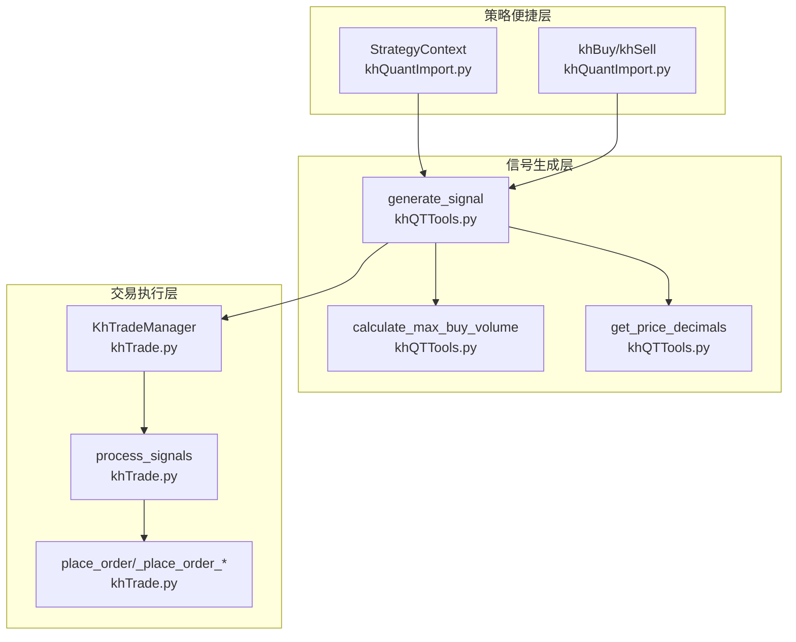
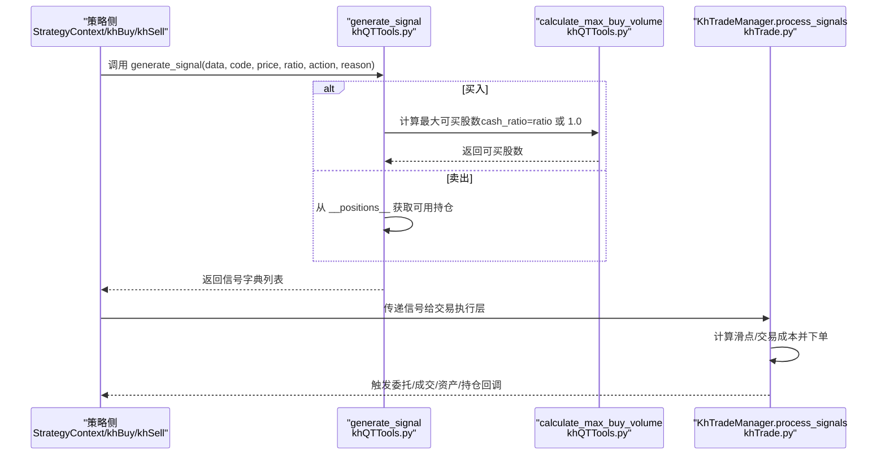
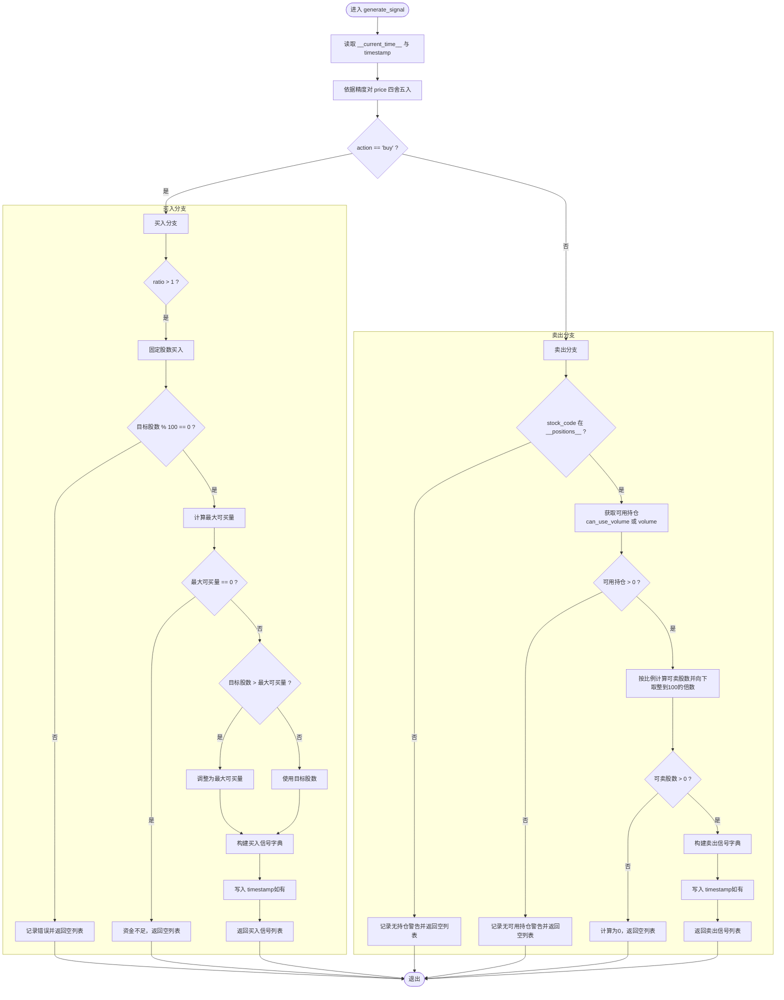
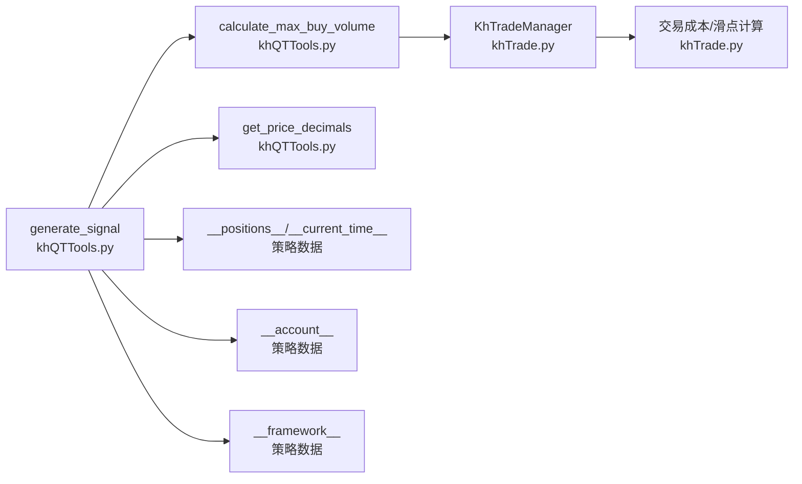

# 交易信号生成

<cite>
**本文引用的文件**
- [khQTTools.py](file://khQTTools.py)
- [khTrade.py](file://khTrade.py)
- [khQuantImport.py](file://khQuantImport.py)
- [README.md](file://README.md)
- [modules/khQuantImport.md](file://modules/khQuantImport.md)
</cite>

## 目录
1. [简介](#简介)
2. [项目结构](#项目结构)
3. [核心组件](#核心组件)
4. [架构概览](#架构概览)
5. [详细组件分析](#详细组件分析)
6. [依赖分析](#依赖分析)
7. [性能考量](#性能考量)
8. [故障排查指南](#故障排查指南)
9. [结论](#结论)
10. [附录](#附录)

## 简介
本文件聚焦于交易信号生成模块，系统性解析 generate_signal 函数的实现逻辑与行为规范，阐明其如何根据输入的价格、交易比例或股数生成标准化的交易信号字典，并自动处理买入资金比例计算与卖出持仓比例计算。文档还详细说明信号中时间戳、交易代码、动作、价格、数量和原因等字段的生成规则，并提供多种使用示例，涵盖按资金比例买入、按固定股数买入以及按持仓比例卖出的具体调用方式与预期输出。

## 项目结构
交易信号生成相关的核心代码分布在以下文件中：
- khQTTools.py：提供 generate_signal、calculate_max_buy_volume、get_price_decimals 等交易信号与价格精度相关工具函数。
- khTrade.py：提供 KhTradeManager 交易管理类，负责信号处理、下单、交易成本计算与资产/持仓更新。
- khQuantImport.py：提供策略侧便捷函数（如 khBuy/khSell）与上下文对象 StrategyContext，简化信号生成与使用。
- README.md 与 modules/khQuantImport.md：提供官方文档与使用示例，补充 generate_signal 的参数、返回值与典型用法。

图表来源
- [khQTTools.py](file://khQTTools.py#L635-L740)
- [khTrade.py](file://khTrade.py#L198-L375)
- [khQuantImport.py](file://khQuantImport.py#L340-L375)

章节来源
- [khQTTools.py](file://khQTTools.py#L635-L740)
- [khTrade.py](file://khTrade.py#L198-L375)
- [khQuantImport.py](file://khQuantImport.py#L340-L375)

## 核心组件
- generate_signal(data, stock_code, price, ratio, action, reason)
  - 功能：生成标准交易信号字典，支持买入与卖出两种动作。
  - 行为要点：
    - 买入：ratio ≤ 1 时按资金比例计算最大可买股数；ratio > 1 时按固定股数买入（必须是100的整数倍）。
    - 卖出：按可用持仓比例计算可卖股数（向下取整到100的倍数）。
    - 价格精度：依据 get_price_decimals(data) 对 price 进行四舍五入。
    - 时间戳：若 data 中存在 __current_time__ 且包含 timestamp，则自动写入信号的 timestamp 字段。
    - 返回：单元素信号字典组成的列表，或空列表。
- calculate_max_buy_volume(data, stock_code, price, cash_ratio)
  - 功能：在考虑交易成本（含滑点）的前提下，计算最大可买入股数（向下取整到100的倍数）。
- get_price_decimals(data)
  - 功能：从 data 的 __framework__ 中获取价格精度（默认2位，ETF为3位）。
- StrategyContext.buy_signal / sell_signal
  - 功能：策略侧便捷方法，自动获取当前价格并调用 generate_signal。
- khBuy / khSell
  - 功能：khQuantImport 提供的便捷函数，内部调用 generate_signal 并返回单个信号字典。

章节来源
- [khQTTools.py](file://khQTTools.py#L635-L740)
- [khQTTools.py](file://khQTTools.py#L543-L634)
- [khQTTools.py](file://khQTTools.py#L239-L286)
- [khQuantImport.py](file://khQuantImport.py#L340-L375)
- [modules/khQuantImport.md](file://modules/khQuantImport.md#L520-L570)

## 架构概览
generate_signal 的调用链路如下：
- 策略侧通过 StrategyContext 或 khBuy/khSell 获取当前价格并调用 generate_signal。
- generate_signal 内部：
  - 依据 action 分支：
    - 买入：ratio > 1 时校验股数合法性并按最大可买量验证；ratio ≤ 1 时调用 calculate_max_buy_volume 计算可买股数。
    - 卖出：从 data 的 __positions__ 获取可用持仓，按比例计算并向下取整到100的倍数。
  - 价格精度由 get_price_decimals 控制，时间戳来自 data 的 __current_time__。
  - 返回标准化信号字典列表。
- 交易执行层 KhTradeManager.process_signals 接收信号，计算交易成本与滑点，执行下单与资产/持仓更新。

图表来源
- [khQTTools.py](file://khQTTools.py#L635-L740)
- [khQTTools.py](file://khQTTools.py#L543-L634)
- [khTrade.py](file://khTrade.py#L198-L375)

## 详细组件分析

### generate_signal 函数
- 输入参数与约束
  - data：包含时间、账户、持仓信息及框架信息 __framework__。
  - stock_code：股票代码。
  - price：交易价格。
  - ratio：买入时为资金使用比例（≤1），卖出时为可用持仓比例（≤1）；若 ratio > 1 且 action='buy'，表示固定买入股数（必须是100的整数倍）。
  - action：'buy' 或 'sell'。
  - reason：交易原因（可选）。
- 价格精度与时间戳
  - 通过 get_price_decimals(data) 获取精度并四舍五入 price。
  - 若 data 中存在 __current_time__ 且包含 timestamp，则将该时间戳写入信号的 timestamp 字段。
- 买入分支逻辑
  - ratio > 1：按固定股数买入，要求股数为100的整数倍；若目标股数超过最大可买量，则调整为目标最大可买量；若资金不足则返回空列表。
  - ratio ≤ 1：按资金比例调用 calculate_max_buy_volume 计算可买股数，向下取整到100的倍数。
- 卖出分支逻辑
  - 从 data 的 __positions__ 获取可用持仓，优先使用 can_use_volume，否则使用 volume。
  - 按 ratio 计算可卖股数并向下取整到100的倍数；若可用持仓为0或不足则返回空列表。
- 返回值
  - 标准化信号字典列表，包含 code、action、price、volume、reason（可选 timestamp）；若条件不满足则返回空列表。

图表来源
- [khQTTools.py](file://khQTTools.py#L635-L740)

章节来源
- [khQTTools.py](file://khQTTools.py#L635-L740)

### calculate_max_buy_volume 函数
- 功能：在考虑交易成本（含滑点）的情况下，计算最大可买入股数（向下取整到100的倍数）。
- 关键步骤
  - 从 data 的 __account__ 获取可用资金，按 cash_ratio 计算可用资金。
  - 依据 get_price_decimals 获取精度并对 price 四舍五入。
  - 从 data 的 __framework__ 获取配置，构造 KhTradeManager 实例以计算滑点与交易成本。
  - 采用估算与逐步递减的方式，确保总花费（实际价格×数量+交易成本）不超过可用资金。
- 返回：最大可买入股数（整百），若无法买入则返回0。

章节来源
- [khQTTools.py](file://khQTTools.py#L543-L634)
- [khTrade.py](file://khTrade.py#L81-L116)

### get_price_decimals 与价格精度控制
- 功能：从 data 的 __framework__ 中读取价格精度；若不可用则使用默认精度（股票2位，ETF 3位）。
- 影响：generate_signal 与 calculate_max_buy_volume 均依赖该精度对价格进行四舍五入，保证信号与计算的一致性。

章节来源
- [khQTTools.py](file://khQTTools.py#L239-L286)

### 策略便捷层：StrategyContext 与 khBuy/khSell
- StrategyContext.buy_signal / sell_signal
  - 自动获取当前价格（close），并调用 generate_signal。
  - 返回单个信号字典，失败返回空字典。
- khBuy / khSell
  - khQuantImport 提供的便捷函数，内部同样调用 generate_signal 并返回单个信号字典。
- 作用：降低策略侧使用门槛，使策略只需关注业务逻辑与比例参数。

章节来源
- [khQuantImport.py](file://khQuantImport.py#L340-L375)
- [modules/khQuantImport.md](file://modules/khQuantImport.md#L520-L570)

## 依赖分析
- generate_signal 依赖
  - calculate_max_buy_volume：用于买入分支的资金比例计算。
  - get_price_decimals：用于价格精度控制。
  - data 的 __positions__/__current_time__/__account__/__framework__：用于读取账户、持仓、时间与框架配置。
- calculate_max_buy_volume 依赖
  - KhTradeManager：用于计算滑点与交易成本。
  - get_price_decimals：用于价格精度控制。
- 交易执行层
  - KhTradeManager.process_signals：接收信号，计算交易成本与滑点，执行下单与资产/持仓更新。

图表来源
- [khQTTools.py](file://khQTTools.py#L543-L740)
- [khTrade.py](file://khTrade.py#L81-L116)

章节来源
- [khQTTools.py](file://khQTTools.py#L543-L740)
- [khTrade.py](file://khTrade.py#L81-L116)

## 性能考量
- 买入最大可买量计算采用“估算+逐步递减”的策略，确保最终结果满足资金约束，但可能带来一定计算开销。建议：
  - 在高频策略中尽量复用已计算的 max_volume，避免重复计算。
  - 合理设置 cash_ratio，减少不必要的多次计算。
- 价格精度控制与四舍五入仅在信号生成阶段进行，对性能影响较小。
- 交易成本计算在交易执行层进行，不影响信号生成阶段的性能。

## 故障排查指南
- 无法生成买入信号
  - 资金不足：calculate_max_buy_volume 返回0，generate_signal 记录资金不足警告并返回空列表。
  - 固定股数非法：ratio > 1 时若目标股数不是100的整数倍，记录错误并返回空列表。
  - 价格异常：price ≤ 0 时返回0并记录警告。
- 无法生成卖出信号
  - 无可用持仓：可用持仓为0或未持有该股票，记录相应警告并返回空列表。
  - 持仓比例计算为0：ratio过小导致向下取整到0，返回空列表。
- 交易执行阶段
  - 资金不足：回测下单时若可用资金不足以覆盖总花费（含交易成本），记录错误并触发委托错误回调。
  - 持仓不足：卖出时可用持仓小于委托数量，记录错误并触发委托错误回调。

章节来源
- [khQTTools.py](file://khQTTools.py#L543-L740)
- [khTrade.py](file://khTrade.py#L283-L327)

## 结论
generate_signal 通过统一的参数约定与自动化计算，将策略侧的交易意图转化为标准化信号字典，显著降低了策略开发复杂度。其对价格精度、资金约束与持仓约束的严格处理，确保了信号的可执行性与一致性。配合 KhTradeManager 的交易成本与滑点计算，形成从信号生成到执行落地的完整闭环。

## 附录

### 字段生成规则与示例
- 字段说明
  - code：股票代码（必填）。
  - action：'buy' 或 'sell'（必填）。
  - price：交易价格（必填，按精度四舍五入）。
  - volume：交易数量（必填，100的整数倍）。
  - reason：交易原因（可选）。
  - timestamp：信号生成时的时间戳（可选，若 data 中存在则自动写入）。
- 示例（按资金比例买入）
  - 调用：generate_signal(context, '000001.SZ', price=10.5, ratio=0.3, action='buy', reason='RSI < 30'）
  - 行为：ratio ≤ 1，按资金比例调用 calculate_max_buy_volume 计算可买股数，向下取整到100的倍数。
  - 输出：包含 code、action、price、volume、reason（可选 timestamp）的信号字典列表。
- 示例（按固定股数买入）
  - 调用：generate_signal(context, '000001.SZ', price=10.5, ratio=200，action='buy', reason='加仓'）
  - 行为：ratio > 1，按200股买入；需满足200是100的整数倍；若超过最大可买量则调整为最大可买量。
  - 输出：包含 code、action、price、volume、reason（可选 timestamp）的信号字典列表。
- 示例（按持仓比例卖出）
  - 调用：generate_signal(context, '600519.SH', price=18.5, ratio=0.5, action='sell', reason='RSI > 70'）
  - 行为：ratio ≤ 1，按可用持仓的50%计算可卖股数，向下取整到100的倍数。
  - 输出：包含 code、action、price、volume、reason（可选 timestamp）的信号字典列表。

章节来源
- [README.md](file://README.md#L1890-L1905)
- [README.md](file://README.md#L2085-L2121)
- [khQTTools.py](file://khQTTools.py#L635-L740)
- [khQuantImport.py](file://khQuantImport.py#L340-L375)
- [modules/khQuantImport.md](file://modules/khQuantImport.md#L520-L570)