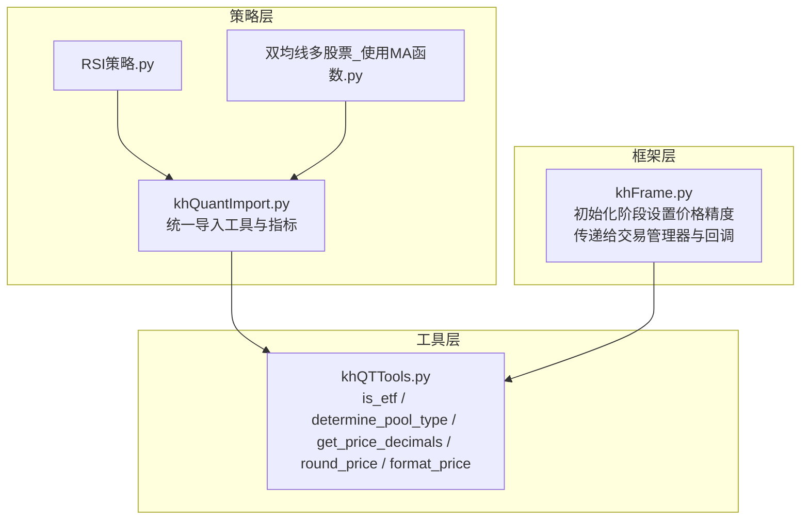
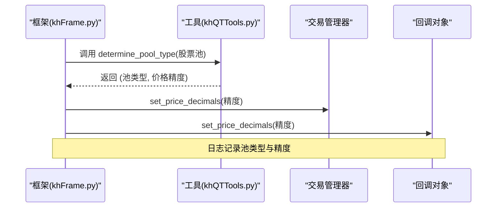
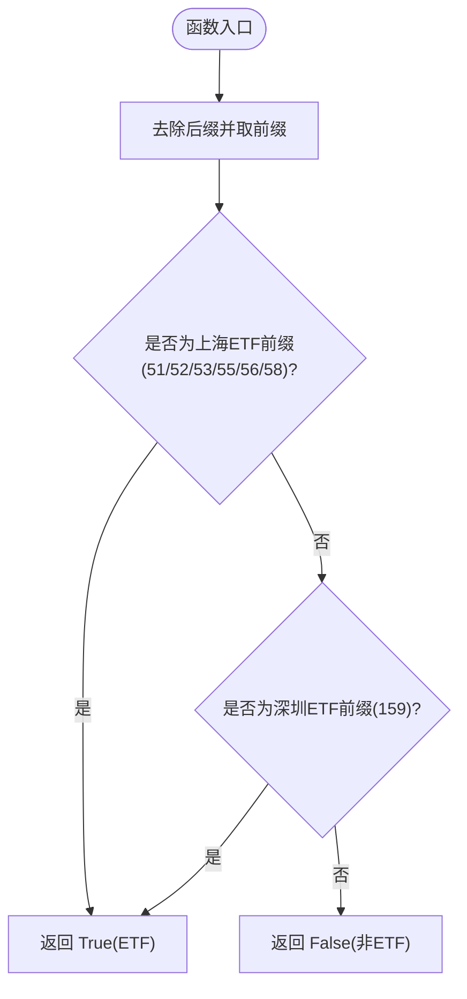
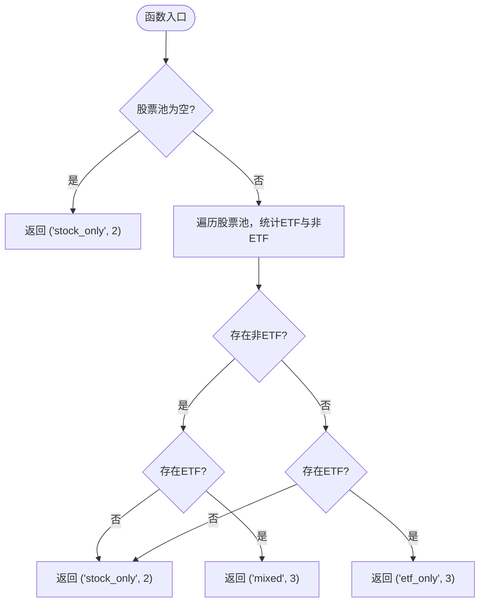
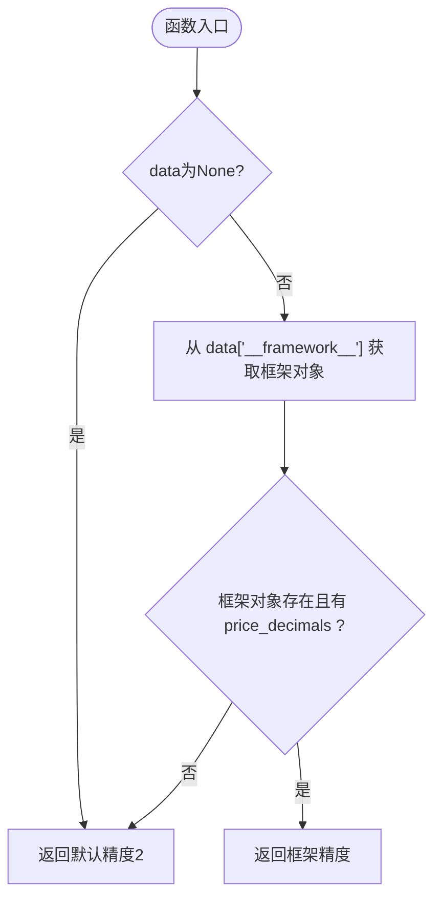
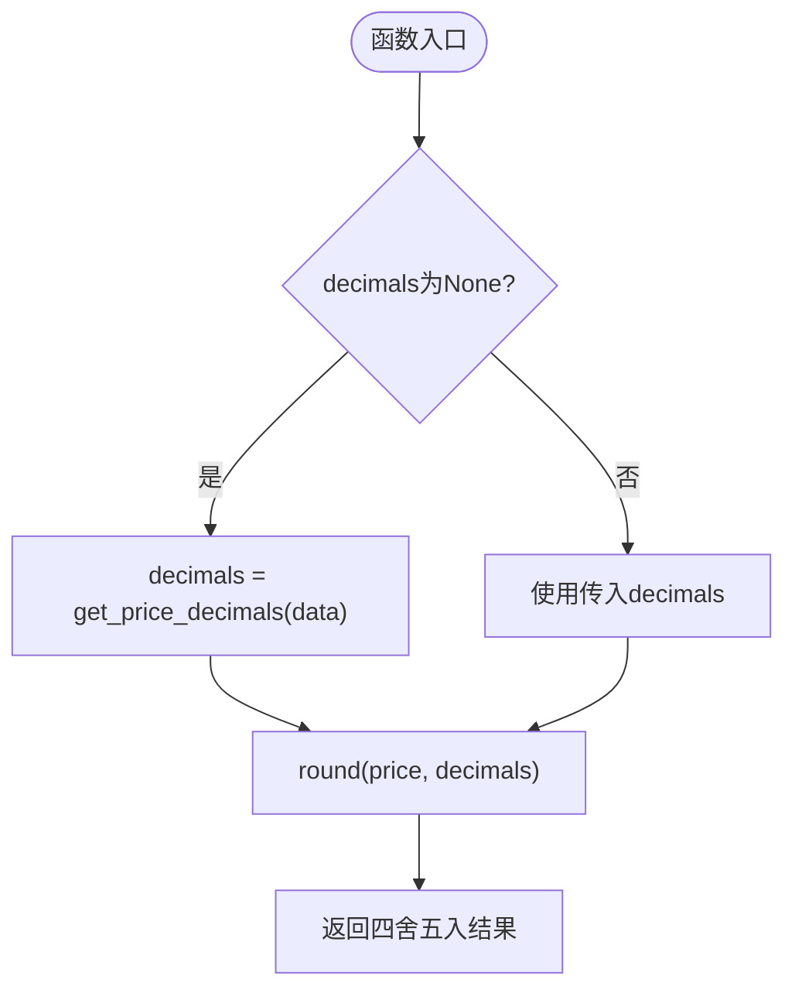
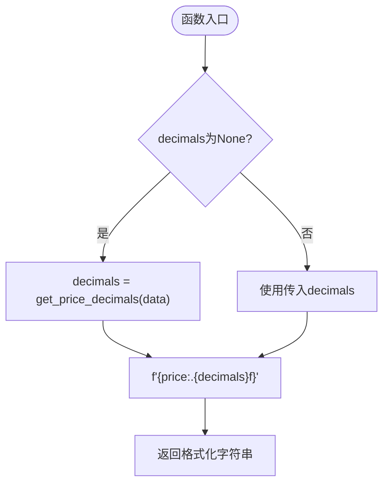
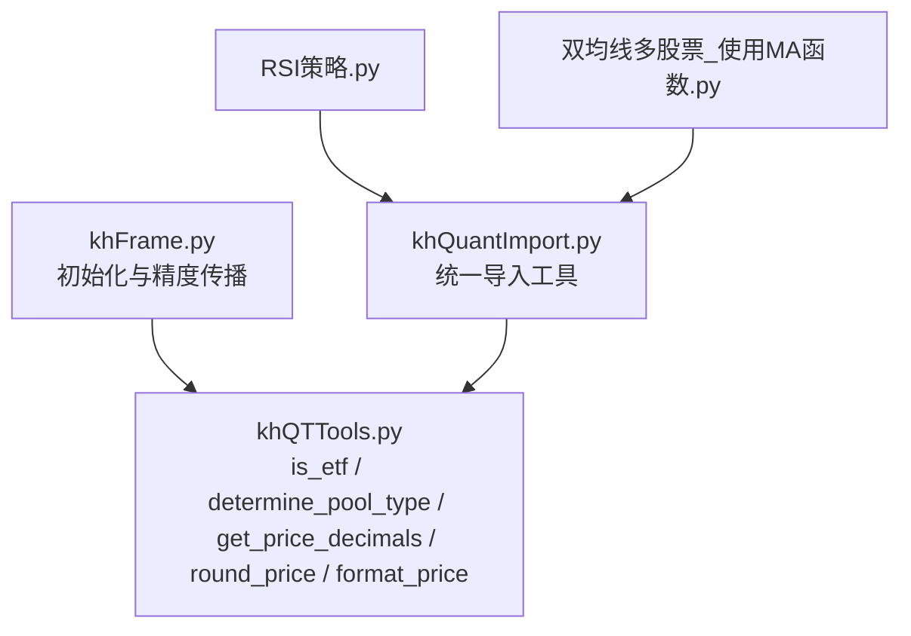

# 价格精度管理

<cite>
**本文引用的文件**
- [khQTTools.py](file://khQTTools.py)
- [khFrame.py](file://khFrame.py)
- [khQuantImport.py](file://khQuantImport.py)
- [RSI策略.py](file://strategies/RSI策略.py)
- [双均线多股票_使用MA函数.py](file://strategies/双均线多股票_使用MA函数.py)
</cite>

## 目录
1. [简介](#简介)
2. [项目结构](#项目结构)
3. [核心组件](#核心组件)
4. [架构总览](#架构总览)
5. [组件详解](#组件详解)
6. [依赖关系分析](#依赖关系分析)
7. [性能考量](#性能考量)
8. [故障排查指南](#故障排查指南)
9. [结论](#结论)

## 简介
本文件聚焦于价格精度管理功能，系统性说明以下函数的工作机制与协作流程：
- is_etf：通过股票代码前缀识别ETF类型（不包含LOF）
- determine_pool_type：分析股票池构成并返回对应的价格精度（股票2位，ETF/混合3位）
- get_price_decimals：从策略数据上下文中获取精度设置，实现动态精度控制
- round_price：基于确定的精度对价格进行四舍五入
- format_price：基于确定的精度对价格进行格式化输出

通过这些函数，系统能够在不同市场环境下（纯股票、纯ETF、混合池）自动选择合适的小数位数，确保交易指令符合交易所要求。

## 项目结构
价格精度管理相关代码主要位于 khQTTools.py，框架在 khFrame.py 中完成初始化时调用 determine_pool_type 并将精度设置传递给交易管理器与回调对象；策略侧通过 khQuantImport.py 提供的统一入口使用 generate_signal 等工具，这些工具内部会调用 get_price_decimals、round_price、format_price 等函数。

图表来源
- [khQTTools.py](file://khQTTools.py#L81-L131)
- [khFrame.py](file://khFrame.py#L964-L971)
- [khQuantImport.py](file://khQuantImport.py#L31-L39)

章节来源
- [khQTTools.py](file://khQTTools.py#L81-L131)
- [khFrame.py](file://khFrame.py#L964-L971)
- [khQuantImport.py](file://khQuantImport.py#L31-L39)

## 核心组件
- is_etf：判断是否为ETF（不包括LOF），依据代码前缀规则（上海ETF前缀51/52/53/55/56/58，深圳ETF前缀159）
- determine_pool_type：根据股票池中是否包含ETF与股票，决定池类型与价格精度（纯股票2位，含ETF或混合3位）
- get_price_decimals：从策略数据对象的框架信息中读取 price_decimals，若缺失则使用默认2位
- round_price：对价格按指定精度进行四舍五入
- format_price：对价格按指定精度格式化为字符串

章节来源
- [khQTTools.py](file://khQTTools.py#L81-L131)
- [khQTTools.py](file://khQTTools.py#L239-L286)

## 架构总览
框架在初始化阶段根据股票池调用 determine_pool_type，得到池类型与价格精度，随后将精度设置传递给交易管理器与回调对象，保证后续交易与日志均使用统一精度。策略侧通过统一导入模块使用工具函数，这些工具函数在内部调用 get_price_decimals、round_price、format_price，从而实现动态与一致的价格处理。

图表来源
- [khFrame.py](file://khFrame.py#L964-L971)
- [khQTTools.py](file://khQTTools.py#L105-L131)

章节来源
- [khFrame.py](file://khFrame.py#L964-L971)

## 组件详解

### is_etf：ETF类型识别
工作机制
- 输入为股票代码字符串（如包含交易所后缀），函数去除后缀并提取前缀
- 上海ETF前缀集合：51、52、53、55、56、58
- 深圳ETF前缀：159
- 若代码以任一上述前缀开头，则判定为ETF；否则为非ETF
- 说明：50/16开头为LOF，不属于ETF范畴

图表来源
- [khQTTools.py](file://khQTTools.py#L81-L104)

章节来源
- [khQTTools.py](file://khQTTools.py#L81-L104)

### determine_pool_type：股票池类型与精度判定
工作机制
- 输入为股票代码列表
- 若列表为空，返回“纯股票”与默认精度2位
- 遍历列表，分别统计是否存在非ETF与ETF
- 分支规则：
  - 纯股票池：返回“stock_only”，精度2位
  - 纯ETF池：返回“etf_only”，精度3位
  - 混合池（含ETF与股票）：返回“mixed”，精度3位
- 输出为二元组：(池类型, 精度)

图表来源
- [khQTTools.py](file://khQTTools.py#L105-L131)

章节来源
- [khQTTools.py](file://khQTTools.py#L105-L131)

### get_price_decimals：动态精度设置
工作机制
- 输入为策略数据对象（包含框架信息 __framework__）
- 若输入为None或框架对象缺失，返回默认精度2位
- 若框架对象存在且具备 price_decimals 属性，优先使用框架设置
- 否则回落到默认2位

图表来源
- [khQTTools.py](file://khQTTools.py#L239-L255)

章节来源
- [khQTTools.py](file://khQTTools.py#L239-L255)

### round_price：价格四舍五入
工作机制
- 输入为原始价格与可选精度
- 若未显式传入精度，则从策略数据对象中获取（get_price_decimals）
- 使用内置四舍五入规则返回浮点数

图表来源
- [khQTTools.py](file://khQTTools.py#L257-L271)

章节来源
- [khQTTools.py](file://khQTTools.py#L257-L271)

### format_price：价格格式化输出
工作机制
- 输入为价格与可选精度
- 若未显式传入精度，则从策略数据对象中获取（get_price_decimals）
- 使用格式化字符串将价格保留相应小数位并返回字符串

图表来源
- [khQTTools.py](file://khQTTools.py#L272-L286)

章节来源
- [khQTTools.py](file://khQTTools.py#L272-L286)

## 依赖关系分析
- khFrame 在初始化阶段调用 determine_pool_type，将池类型与价格精度写入框架状态，并通过交易管理器与回调对象传播
- khQuantImport 将 khQTTools 的工具函数（包括 generate_signal、calculate_max_buy_volume、khMA 等）统一导出，策略侧通过统一入口使用
- 策略侧在生成交易信号、计算最大可买入量、计算均线等场景中，间接依赖 get_price_decimals、round_price、format_price，确保价格处理一致性

图表来源
- [khFrame.py](file://khFrame.py#L964-L971)
- [khQuantImport.py](file://khQuantImport.py#L31-L39)
- [khQTTools.py](file://khQTTools.py#L81-L131)

章节来源
- [khFrame.py](file://khFrame.py#L964-L971)
- [khQuantImport.py](file://khQuantImport.py#L31-L39)

## 性能考量
- is_etf 与 determine_pool_type 均为轻量级字符串前缀判断与一次遍历，时间复杂度为 O(n)，空间复杂度为 O(1)
- get_price_decimals 仅做属性访问，开销极低
- round_price 与 format_price 为简单数值处理，开销可忽略
- 在策略高频调用场景中，建议复用已计算的精度值，避免重复从数据对象中读取

## 故障排查指南
- ETF识别异常
  - 确认股票代码格式是否包含交易所后缀，is_etf 会先去除后缀再判断前缀
  - 若代码以50/16开头，将被识别为LOF，不会被当作ETF
- 精度设置未生效
  - 检查策略数据对象中是否包含 __framework__ 且具备 price_decimals 属性
  - 若未设置，将回落到默认2位
- 交易信号精度不一致
  - 确认 generate_signal、calculate_max_buy_volume 等工具函数是否传入了正确的 data 对象
  - 在日志中观察框架是否正确记录了池类型与精度

章节来源
- [khQTTools.py](file://khQTTools.py#L81-L104)
- [khQTTools.py](file://khQTTools.py#L239-L255)
- [khFrame.py](file://khFrame.py#L964-L971)

## 结论
价格精度管理通过 is_etf 与 determine_pool_type 实现“池类型驱动”的精度决策，结合 get_price_decimals 的动态设置能力，使 round_price 与 format_price 能在策略与交易全流程中保持一致的精度控制。框架在初始化阶段完成精度传播，确保交易管理器与回调对象同步，最终保障交易指令符合交易所要求。