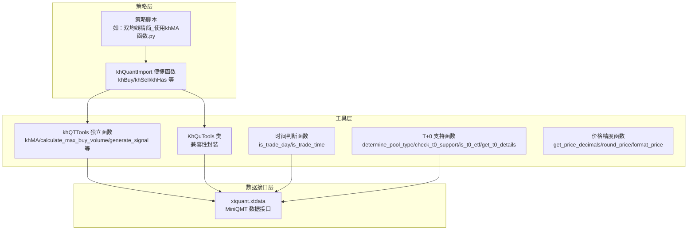
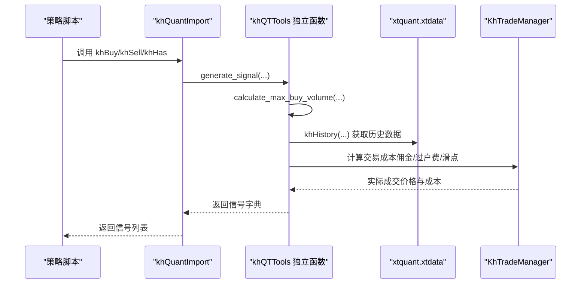
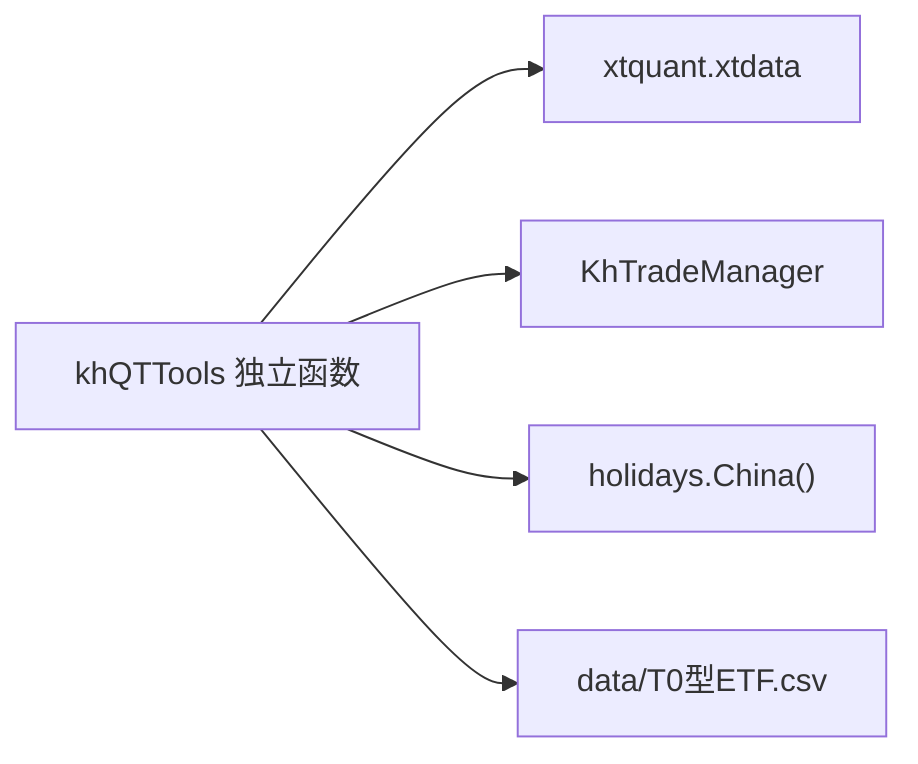

# 工具集

<cite>
**本文引用的文件**
- [khQTTools.py](file://khQTTools.py)
- [README.md](file://README.md)
- [strategies/双均线精简_使用khMA函数.py](file://strategies/双均线精简_使用khMA函数.py)
- [modules/khQuantImport.md](file://modules/khQuantImport.md)
</cite>

## 目录
1. [简介](#简介)
2. [项目结构](#项目结构)
3. [核心组件](#核心组件)
4. [架构总览](#架构总览)
5. [详细组件分析](#详细组件分析)
6. [依赖分析](#依赖分析)
7. [性能考虑](#性能考虑)
8. [故障排查指南](#故障排查指南)
9. [结论](#结论)
10. [附录](#附录)

## 简介
本文件为 khQTTools 工具集的权威使用文档，聚焦于 khQTTools.py 中提供的量化工具函数，特别是 KhQuTools 类与其独立函数版本（如 khMA、calculate_max_buy_volume、generate_signal）。文档还涵盖时间判断函数（is_trade_day、is_trade_time）、股票池类型与 T+0 支持判断函数（determine_pool_type、check_t0_support、is_t0_etf、get_t0_details），并提供参数说明、返回值、使用示例与策略开发中的典型应用场景。

## 项目结构
khQTTools.py 是看海量化交易系统（KHQuant）中的核心工具模块，提供数据获取、时间判断、价格精度处理、T+0 支持检测、交易信号生成与资金计算等能力。策略侧通过 khQuantImport 提供的便捷函数（如 khBuy、khSell、khHas 等）与 khQTTools 的独立函数协同工作。

图表来源
- [khQTTools.py](file://khQTTools.py#L418-L540)
- [strategies/双均线精简_使用khMA函数.py](file://strategies/双均线精简_使用khMA函数.py#L1-L31)
- [modules/khQuantImport.md](file://modules/khQuantImport.md#L508-L538)

章节来源
- [khQTTools.py](file://khQTTools.py#L418-L540)
- [README.md](file://README.md#L2068-L2096)

## 核心组件
- KhQuTools 类：提供与模块级函数等价的方法，便于兼容旧代码；内部调用模块级函数实现。
- khMA：独立函数版本的移动平均线计算，封装历史数据获取与均线计算。
- calculate_max_buy_volume：根据账户资金、交易成本与滑点估算最大可买入手数。
- generate_signal：生成标准交易信号，支持按比例或按股数买入、按可用持仓比例卖出。
- is_trade_day / is_trade_time：交易日与交易时间判断。
- determine_pool_type / check_t0_support / is_t0_etf / get_t0_details：股票池类型与 T+0 支持判断。
- 价格精度函数：get_price_decimals、round_price、format_price。

章节来源
- [khQTTools.py](file://khQTTools.py#L418-L540)
- [khQTTools.py](file://khQTTools.py#L543-L740)
- [khQTTools.py](file://khQTTools.py#L287-L376)
- [khQTTools.py](file://khQTTools.py#L105-L236)
- [khQTTools.py](file://khQTTools.py#L239-L286)

## 架构总览
khQTTools 的核心职责是为策略提供“数据获取 + 业务逻辑”一体化的工具函数。KhQuTools 类作为兼容层，将模块级函数包装为类方法；独立函数版本则直接暴露，便于策略直接调用。T+0 支持与交易成本估算贯穿交易信号生成流程，时间判断与价格精度处理贯穿回测与实盘模拟。

图表来源
- [modules/khQuantImport.md](file://modules/khQuantImport.md#L508-L538)
- [khQTTools.py](file://khQTTools.py#L543-L740)
- [khQTTools.py](file://khQTTools.py#L2482-L2751)

## 详细组件分析

### KhQuTools 类与兼容性
- 提供 is_trade_time、is_trade_day、get_trade_days_count 等方法，内部调用模块级函数。
- 保留 trading_periods、cn_holidays 属性，便于兼容旧代码。
- 适用于需要以类实例方式调用工具函数的场景。

章节来源
- [khQTTools.py](file://khQTTools.py#L418-L441)

### khMA（移动平均线计算）
- 功能：计算指定周期的移动平均线，支持日线、分钟线、tick 等频率。
- 关键逻辑：
  - 自动推导 end_time（分钟/日线）。
  - 若为分钟/5分钟/tick 且不在交易时间，抛出异常。
  - 通过 khHistory 获取 bar_count 条历史数据，计算均值。
  - 根据是否为 ETF 决定精度（ETF 3 位，股票 2 位）。
- 典型应用场景：
  - 双均线或多周期均线策略。
  - 在策略脚本中直接调用，无需手动拉取历史数据。

章节来源
- [khQTTools.py](file://khQTTools.py#L491-L541)
- [strategies/双均线精简_使用khMA函数.py](file://strategies/双均线精简_使用khMA函数.py#L1-L31)

### calculate_max_buy_volume（最大可买入量计算）
- 功能：在给定价格与资金比例下，计算最大可买入手数，考虑交易成本与滑点。
- 关键逻辑：
  - 从 data 中读取账户可用资金，按 cash_ratio 比例使用。
  - 通过 get_price_decimals 获取价格精度并四舍五入。
  - 通过 KhTradeManager 计算交易成本（佣金、过户费、滑点）。
  - 采用“估算-校验”的迭代方式，逐步减少手数直至总成本不超过可用资金。
- 典型应用场景：
  - 买入信号生成前的资金约束校验。
  - 策略资金管理与仓位控制。

章节来源
- [khQTTools.py](file://khQTTools.py#L543-L634)

### generate_signal（生成交易信号）
- 功能：生成标准交易信号，支持买入（按比例或按股数）与卖出（按可用持仓比例）。
- 关键逻辑：
  - 买入：若 ratio > 1 视为目标股数（必须为 100 的整数倍），否则按资金比例计算最大可买；若目标股数超过最大可买则自动下调。
  - 卖出：从 data 的 __positions__ 读取可用股数，按比例向下取整到 100 的倍数。
  - 价格精度处理：统一按精度四舍五入。
- 典型应用场景：
  - 策略主逻辑中直接生成信号，简化下单流程。
  - 与 khBuy/khSell 等便捷函数配合使用。

章节来源
- [khQTTools.py](file://khQTTools.py#L635-L740)
- [modules/khQuantImport.md](file://modules/khQuantImport.md#L508-L538)

### is_trade_day（交易日判断）
- 功能：判断给定日期是否为交易日（工作日且非法定节假日）。
- 关键逻辑：
  - 支持 "YYYY-MM-DD"、"YYYYMMDD" 等格式解析。
  - 排除周末（weekday ≥ 5）。
  - 使用 holidays.China() 判断法定节假日。
  - 异常时回退到默认处理策略。
- 典型应用场景：
  - 回测时间窗口校验、交易日计数、策略风控。

章节来源
- [khQTTools.py](file://khQTTools.py#L296-L376)

### is_trade_time（交易时间判断）
- 功能：判断当前是否处于交易时间（上午 9:30-11:30，下午 13:00-15:00）。
- 关键逻辑：
  - 读取当前时间字符串，与预设交易时段比较。
- 典型应用场景：
  - 避免在非交易时间计算日内指标（如 khMA）。

章节来源
- [khQTTools.py](file://khQTTools.py#L287-L295)

### determine_pool_type（股票池类型判断）
- 功能：根据股票池中是否包含 ETF，决定池类型与价格精度。
- 返回：(pool_type, price_decimals)，pool_type ∈ {'stock_only','etf_only','mixed'}。
- 典型应用场景：
  - 策略初始化阶段统一设置价格精度，避免混合池与纯股票池的精度差异。

章节来源
- [khQTTools.py](file://khQTTools.py#L105-L131)

### check_t0_support / is_t0_etf / get_t0_details（T+0 支持判断）
- 功能：
  - check_t0_support：判断股票池是否全支持 T+0、部分支持或不支持。
  - is_t0_etf：判断单只 ETF 是否支持 T+0。
  - get_t0_details：返回支持 T+0 与不支持 T+0 的股票列表及数量。
- 关键逻辑：
  - 从 data/T0型ETF.csv 加载 T0 ETF 列表，使用全局缓存避免重复读取。
- 典型应用场景：
  - 策略在混合池中区分 T+0 与非 T+0 股票，制定差异化交易策略。

章节来源
- [khQTTools.py](file://khQTTools.py#L137-L236)

### 价格精度处理（get_price_decimals / round_price / format_price）
- 功能：
  - get_price_decimals：从 data 的 __framework__ 读取精度，否则使用默认（股票 2 位，ETF/混合 3 位）。
  - round_price：按精度四舍五入。
  - format_price：按精度格式化为字符串。
- 典型应用场景：
  - 交易信号与报价统一精度，避免浮点误差导致的下单失败。

章节来源
- [khQTTools.py](file://khQTTools.py#L239-L286)

## 依赖分析
- khQTTools 依赖 xtquant.xtdata 获取历史数据与行情数据。
- generate_signal 依赖 khTrade.KhTradeManager 计算交易成本（佣金、过户费、滑点）。
- is_trade_day 依赖 holidays.China() 判断节假日。
- check_t0_support 依赖 data/T0型ETF.csv 文件（可通过 is_t0_etf 加载）。

图表来源
- [khQTTools.py](file://khQTTools.py#L137-L236)
- [khQTTools.py](file://khQTTools.py#L543-L634)

章节来源
- [khQTTools.py](file://khQTTools.py#L137-L236)
- [khQTTools.py](file://khQTTools.py#L543-L634)

## 性能考虑
- khMA 与 khHistory：
  - khHistory 支持 force_download 控制是否强制下载，回测场景建议合理使用以平衡速度与准确性。
  - 数据获取时按频率计算回溯天数并裁剪 bar_count，避免不必要的数据传输。
- calculate_max_buy_volume：
  - 采用“估算-校验”策略，逐步减少手数，避免过度遍历；手数按 100 的倍数递减，兼顾效率与合规。
- T+0 支持：
  - load_t0_etf_list 使用全局缓存，避免重复 IO；建议策略在初始化阶段加载一次。

章节来源
- [khQTTools.py](file://khQTTools.py#L2482-L2751)
- [khQTTools.py](file://khQTTools.py#L543-L634)
- [khQTTools.py](file://khQTTools.py#L137-L171)

## 故障排查指南
- khMA 报错“不在交易时间内”：
  - 检查频率是否为分钟/5分钟/tick，且当前时间是否处于交易时段。
  - 参考：[khQTTools.py](file://khQTTools.py#L518-L522)
- calculate_max_buy_volume 返回 0：
  - 检查 data 中 __account__ 是否存在、可用资金是否充足、price 是否为正数。
  - 参考：[khQTTools.py](file://khQTTools.py#L556-L634)
- generate_signal 未生成买入信号：
  - 检查 ratio 是否大于 1 且为 100 的倍数；或资金比例下最大可买为 0。
  - 参考：[khQTTools.py](file://khQTTools.py#L635-L740)
- is_trade_day 解析日期异常：
  - 确认日期格式是否为 "YYYY-MM-DD" 或 "YYYYMMDD"；异常时会回退默认处理。
  - 参考：[khQTTools.py](file://khQTTools.py#L296-L376)
- T+0 列表文件缺失：
  - 确认 data/T0型ETF.csv 是否存在；日志会记录警告。
  - 参考：[khQTTools.py](file://khQTTools.py#L151-L171)

章节来源
- [khQTTools.py](file://khQTTools.py#L518-L522)
- [khQTTools.py](file://khQTTools.py#L556-L634)
- [khQTTools.py](file://khQTTools.py#L635-L740)
- [khQTTools.py](file://khQTTools.py#L296-L376)
- [khQTTools.py](file://khQTTools.py#L151-L171)

## 结论
khQTTools 提供了从数据获取、时间判断、T+0 支持检测到交易信号生成与资金约束计算的一体化工具集，既支持类实例调用（兼容性），也支持独立函数调用（简洁高效）。配合 khQuantImport 的便捷函数，策略开发者可以快速构建稳健的回测与实盘模拟流程。

## 附录

### 使用示例与典型场景

- 使用 khMA 计算均线并生成信号
  - 参考策略：[strategies/双均线精简_使用khMA函数.py](file://strategies/双均线精简_使用khMA函数.py#L1-L31)
  - 场景：单股票双均线金叉死叉择时，使用 khMA 计算短期与长期均线，结合 generate_signal 生成买卖信号。

- 使用 calculate_max_buy_volume 与 generate_signal
  - 参考：[README.md](file://README.md#L2068-L2096)
  - 场景：按资金比例买入，先计算最大可买手数，再生成信号，避免资金不足导致下单失败。

- 使用 is_trade_day 与 is_trade_time
  - 场景：回测前校验日期合法性与交易时段，避免在非交易时间计算指标。

- 使用 determine_pool_type 与 check_t0_support
  - 场景：多股票池策略中，根据池类型与 T+0 支持情况制定差异化交易策略与风控。

章节来源
- [strategies/双均线精简_使用khMA函数.py](file://strategies/双均线精简_使用khMA函数.py#L1-L31)
- [README.md](file://README.md#L2068-L2096)
- [khQTTools.py](file://khQTTools.py#L287-L376)
- [khQTTools.py](file://khQTTools.py#L105-L236)