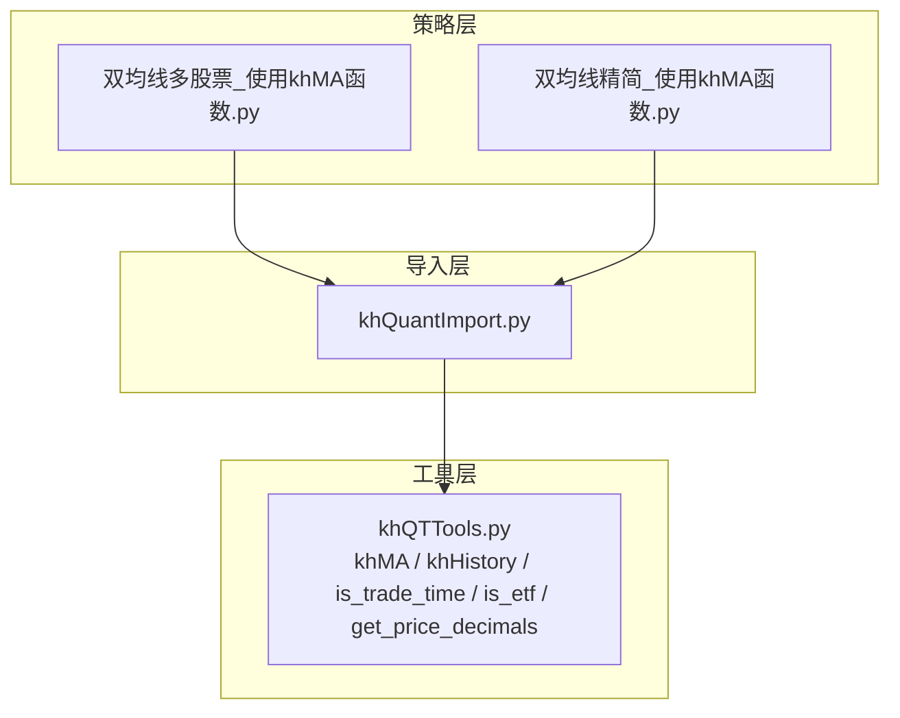
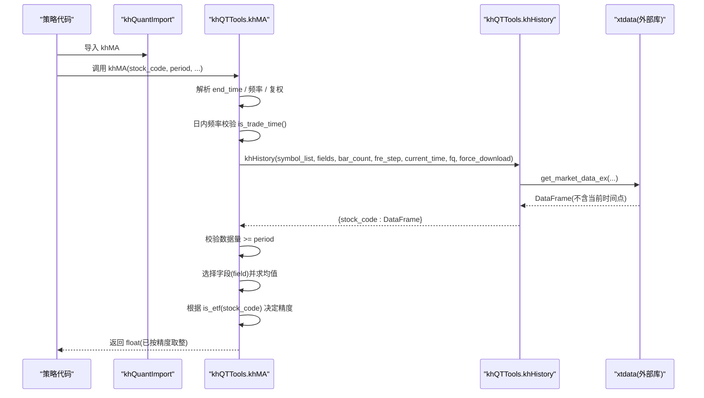
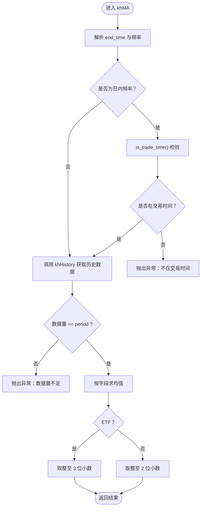
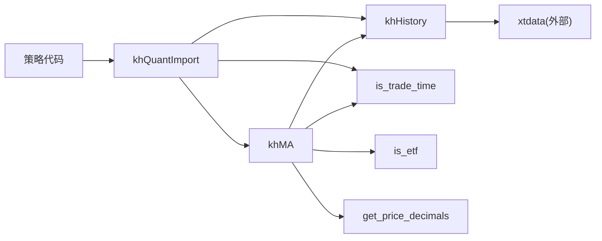

# 技术指标计算

<cite>
**本文引用的文件**
- [khQTTools.py](file://khQTTools.py)
- [khQuantImport.py](file://khQuantImport.py)
- [strategies/双均线多股票_使用khMA函数.py](file://strategies/双均线多股票_使用khMA函数.py)
- [strategies/双均线精简_使用khMA函数.py](file://strategies/双均线精简_使用khMA函数.py)
- [modules/khQuantImport.md](file://modules/khQuantImport.md)
</cite>

## 目录
1. [简介](#简介)
2. [项目结构](#项目结构)
3. [核心组件](#核心组件)
4. [架构总览](#架构总览)
5. [详细组件分析](#详细组件分析)
6. [依赖关系分析](#依赖关系分析)
7. [性能考量](#性能考量)
8. [故障排查指南](#故障排查指南)
9. [结论](#结论)
10. [附录](#附录)

## 简介
本文件围绕技术指标计算功能，重点阐述 khMA 函数的实现细节与使用方式。khMA 封装了历史数据获取与移动平均计算，支持日线、分钟线、Tick 等多频率，并在日内频率下结合交易时间校验，自动根据股票类型（ETF/普通股票）调整价格精度，确保回测与实盘的一致性与准确性。文末提供在双均线策略中调用 khMA 计算短期与长期均线的实际代码示例路径。

## 项目结构
- khMA 位于 khQTTools 模块中，作为独立函数直接暴露给策略使用。
- khQuantImport 提供统一导入入口，将 khMA 等工具函数直接暴露，便于策略侧一键导入。
- 策略示例位于 strategies 目录，展示如何在多股票与单股票场景中调用 khMA。

图表来源
- [khQuantImport.py](file://khQuantImport.py#L30-L46)
- [khQTTools.py](file://khQTTools.py#L490-L541)

章节来源
- [khQuantImport.py](file://khQuantImport.py#L30-L46)
- [modules/khQuantImport.md](file://modules/khQuantImport.md#L407-L429)

## 核心组件
- khMA：独立函数版本的移动平均计算，内部调用 khHistory 获取历史数据，自动处理结束时间、复权方式、数据量校验与价格精度。
- khHistory：历史数据获取核心函数，支持多股票、多字段、多频率、多时间格式，严格不包含当前时间点，保证回测一致性。
- is_trade_time：交易时间判断，用于日内频率下的安全校验。
- is_etf / get_price_decimals：根据股票类型与策略数据字典决定价格精度（ETF 3 位，普通股票 2 位）。

章节来源
- [khQTTools.py](file://khQTTools.py#L490-L541)
- [khQTTools.py](file://khQTTools.py#L287-L336)
- [khQTTools.py](file://khQTTools.py#L81-L104)
- [khQTTools.py](file://khQTTools.py#L239-L255)

## 架构总览
khMA 的调用链路如下：策略侧调用 khMA → khMA 内部调用 khHistory → 通过 xtdata 获取历史数据 → 返回 DataFrame → 计算均值并按精度取整。

图表来源
- [khQTTools.py](file://khQTTools.py#L490-L541)
- [khQTTools.py](file://khQTTools.py#L2481-L2750)

## 详细组件分析

### khMA 函数实现细节
- 参数与行为
  - 股票代码：支持单只或多只（khHistory 支持列表）
  - 周期长度：period 必须为正整数
  - 计算字段：默认 close，可选 open/high/low/volume/amount 等
  - 时间频率：支持 '1d'/'1m'/'5m'/'tick' 等
  - 结束时间：可为 None（自动取当前时间），或指定日期/时间字符串
  - 复权方式：'pre'/'post'/'none'
  - 数据对象：可选，用于从策略上下文中读取价格精度设置
- 内部流程
  - 自动推导 end_time（日内频率使用秒级时间，日线使用日期）
  - 日内频率下调用 is_trade_time() 校验交易时间，非交易时间抛出异常
  - 调用 khHistory 获取 bar_count 条历史数据，严格不包含当前时间点
  - 校验数据量是否满足 period，否则抛出异常
  - 选择字段并计算均值，按精度取整
  - 精度规则：ETF 使用 3 位小数，普通股票使用 2 位小数；也可从 data 中读取框架配置
- 错误处理
  - 数据不足：抛出异常提示“数据量不足 period 条”
  - 非交易时间：日内频率下抛出异常
  - 参数非法：khHistory 内部参数校验

图表来源
- [khQTTools.py](file://khQTTools.py#L490-L541)
- [khQTTools.py](file://khQTTools.py#L287-L336)
- [khQTTools.py](file://khQTTools.py#L81-L104)
- [khQTTools.py](file://khQTTools.py#L239-L255)

章节来源
- [khQTTools.py](file://khQTTools.py#L490-L541)

### khHistory 函数与数据边界
- 功能要点
  - 支持多股票、多字段、多频率、多时间格式
  - 严格不包含 current_time 这个时间点，确保回测一致性
  - 支持跳过停牌（按 volume==0 过滤）
  - 支持强制下载与本地缓存策略
- 时间边界验证
  - 日线：按日期比较，不包含当前日期
  - 分钟/Tick：按精确时间比较，不包含当前时间
- 复权映射
  - fq='pre'/'post'/'none' 映射为 'front'/'back'/'none'

章节来源
- [khQTTools.py](file://khQTTools.py#L2481-L2750)

### 价格精度与股票类型判定
- is_etf：根据股票代码前缀判断是否为 ETF（上海 51/52/53/55/56/58、深圳 159 开头）
- get_price_decimals：优先从 data 中读取框架配置，否则默认 2 位
- khMA 内部：若 data 为空则按 is_etf 判定，ETF 3 位，否则 2 位

章节来源
- [khQTTools.py](file://khQTTools.py#L81-L104)
- [khQTTools.py](file://khQTTools.py#L239-L255)
- [khQTTools.py](file://khQTTools.py#L490-L541)

### 交易时间校验与日内频率
- is_trade_time：判断当前时间是否在 09:30-11:30、13:00-15:00
- khMA：仅对 '1m'、'5m'、'tick' 频率进行校验，非交易时间直接抛错
- KhQuTools.is_trade_time：类方法，内部委托模块级函数

章节来源
- [khQTTools.py](file://khQTTools.py#L287-L336)
- [khQTTools.py](file://khQTTools.py#L421-L487)

### 在双均线策略中的实际调用示例
- 多股票双均线（使用 khMA）
  - 调用路径：策略主函数中对每只股票分别调用 khMA(股票代码, 5/20, end_time=当前日期)
  - 依据短期均线与长期均线的交叉生成买卖信号
  - 示例文件路径：[双均线多股票_使用khMA函数.py](file://strategies/双均线多股票_使用khMA函数.py#L12-L31)
- 单股票双均线（使用 khMA）
  - 调用路径：策略主函数中对单一股票分别调用 khMA(股票代码, 5/20, end_time=当前日期)
  - 示例文件路径：[双均线精简_使用khMA函数.py](file://strategies/双均线精简_使用khMA函数.py#L11-L29)

章节来源
- [strategies/双均线多股票_使用khMA函数.py](file://strategies/双均线多股票_使用khMA函数.py#L12-L31)
- [strategies/双均线精简_使用khMA函数.py](file://strategies/双均线精简_使用khMA函数.py#L11-L29)

## 依赖关系分析
- khMA 依赖
  - khHistory：获取历史数据
  - is_trade_time：日内频率校验
  - is_etf / get_price_decimals：价格精度决策
- khHistory 依赖
  - xtdata：外部行情数据接口
  - pandas/datetime：数据处理与时间解析
- khQuantImport 导出
  - khMA、is_trade_time、is_trade_day 等工具函数直接暴露，策略侧只需 from khQuantImport import *

图表来源
- [khQuantImport.py](file://khQuantImport.py#L30-L46)
- [khQTTools.py](file://khQTTools.py#L490-L541)
- [khQTTools.py](file://khQTTools.py#L2481-L2750)

章节来源
- [khQuantImport.py](file://khQuantImport.py#L30-L46)

## 性能考量
- 数据下载策略
  - khMA 默认 force_download=False，避免重复下载，提升回测效率
  - khHistory 支持 force_download=True，必要时可强制刷新
- 数据范围与缓冲
  - khHistory 会根据频率与 bar_count 计算回溯天数，增加缓冲以确保足够的历史数据
- 价格精度
  - khMA 内部按 ETF/普通股票自动取整，避免浮点误差累积影响信号生成

章节来源
- [khQTTools.py](file://khQTTools.py#L490-L541)
- [khQTTools.py](file://khQTTools.py#L2481-L2750)

## 故障排查指南
- “不在交易时间内，无法计算日内移动平均线”
  - 现象：日内频率下调用 khMA 抛出异常
  - 排查：确认 is_trade_time() 返回 True；检查 end_time 是否为交易时段
  - 参考：[khQTTools.py](file://khQTTools.py#L518-L521)
- “股票 X 数据量不足 Y 条，无法计算均线Y”
  - 现象：历史数据不足 period 条
  - 排查：确认 bar_count 设置合理；检查 khHistory 返回的数据长度；核对 end_time 边界（不包含当前时间点）
  - 参考：[khQTTools.py](file://khQTTools.py#L534-L536)
- “无法解析时间格式”
  - 现象：khHistory 解析 current_time 失败
  - 排查：支持格式包括 YYYYMMDD、YYYY-MM-DD、YYYYMMDD HHMMSS、YYYY-MM-DD HH:MM:SS
  - 参考：[khQTTools.py](file://khQTTools.py#L2537-L2560)
- “价格精度不符合预期”
  - 现象：khMA 返回值小数位与预期不符
  - 排查：确认 is_etf 判定是否正确；或 data 中是否设置了框架价格精度
  - 参考：[khQTTools.py](file://khQTTools.py#L81-L104), [khQTTools.py](file://khQTTools.py#L239-L255), [khQTTools.py](file://khQTTools.py#L538-L540)

章节来源
- [khQTTools.py](file://khQTTools.py#L287-L336)
- [khQTTools.py](file://khQTTools.py#L490-L541)
- [khQTTools.py](file://khQTTools.py#L2481-L2750)

## 结论
khMA 通过封装 khHistory 与交易时间校验，提供了简洁可靠的移动平均计算能力。其自动精度处理与严格的回测边界设计，使得在双均线策略等场景中能够稳定、一致地生成信号。配合 khQuantImport 的统一导入，策略开发者可专注于交易逻辑，而不必关心底层数据获取与边界细节。

## 附录
- khMA 参数速览
  - stock_code：股票代码（字符串或列表）
  - period：周期长度（正整数）
  - field：计算字段（默认 'close'）
  - fre_step：时间频率（'1d'/'1m'/'5m'/'tick'）
  - end_time：结束时间（可为 None）
  - fq：复权方式（'pre'/'post'/'none'）
  - data：策略数据对象（可选，用于读取框架价格精度）
- khHistory 关键参数
  - symbol_list：股票代码（字符串或列表）
  - fields：字段列表（如 ['open','high','low','close','volume']）
  - bar_count：K线数量
  - fre_step：频率
  - current_time：当前时间（支持多种格式）
  - skip_paused：是否跳过停牌
  - fq：复权方式
  - force_download：是否强制下载

章节来源
- [khQTTools.py](file://khQTTools.py#L490-L541)
- [khQTTools.py](file://khQTTools.py#L2481-L2750)
- [modules/khQuantImport.md](file://modules/khQuantImport.md#L407-L429)