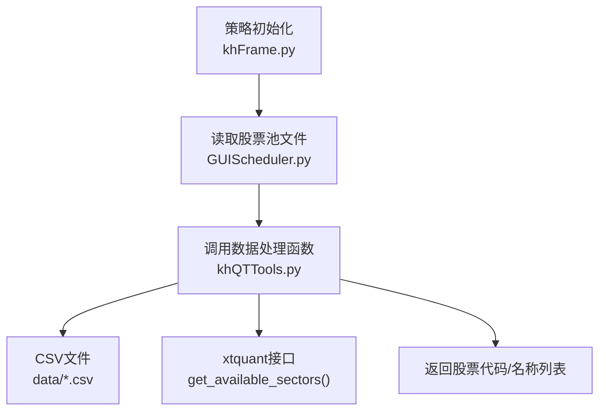
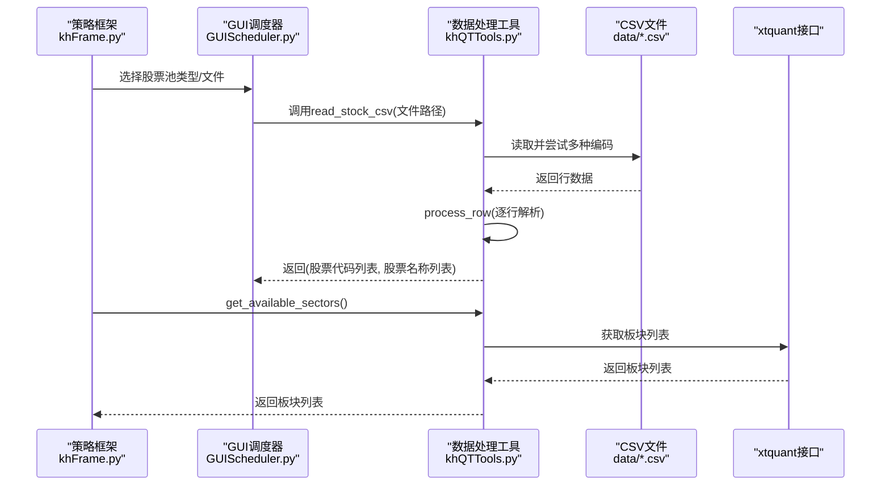
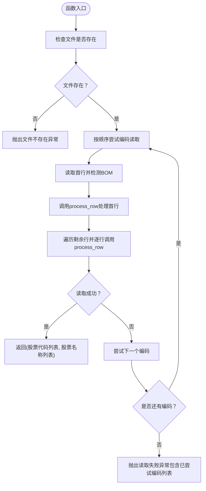
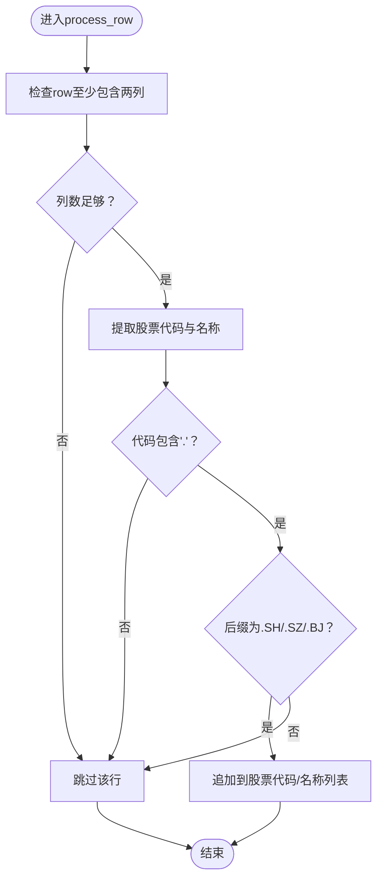
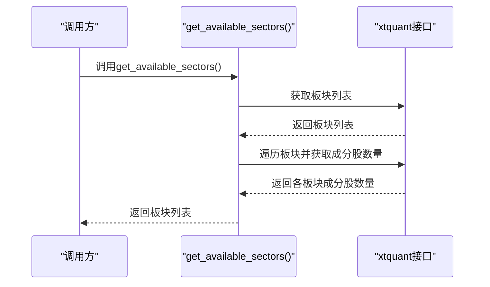
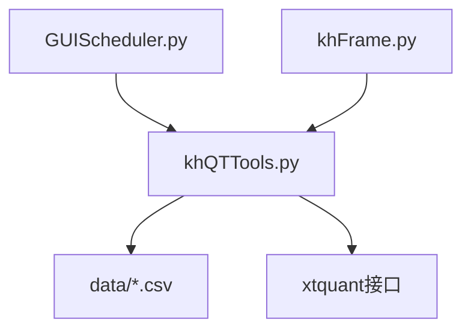

# 数据处理工具

<cite>
**本文引用的文件**
- [khQTTools.py](file://khQTTools.py)
- [README.md](file://README.md)
- [data/沪深300成分股_股票列表.csv](file://data/沪深300成分股_股票列表.csv)
- [data/全部股票_股票列表.csv](file://data/全部股票_股票列表.csv)
- [GUIDataViewer.py](file://GUIDataViewer.py)
- [miniQMT_data_viewer.py](file://miniQMT_data_viewer.py)
- [GUIScheduler.py](file://GUIScheduler.py)
- [khFrame.py](file://khFrame.py)
</cite>

## 目录
1. [简介](#简介)
2. [项目结构](#项目结构)
3. [核心组件](#核心组件)
4. [架构总览](#架构总览)
5. [详细组件分析](#详细组件分析)
6. [依赖分析](#依赖分析)
7. [性能考虑](#性能考虑)
8. [故障排查指南](#故障排查指南)
9. [结论](#结论)
10. [附录](#附录)

## 简介
本文件聚焦于数据处理工具模块中的关键函数，特别是与股票列表CSV文件读取与处理相关的函数，包括：
- read_stock_csv：支持多种编码格式（UTF-8、GBK、GB18030、GB2312、UTF-16、ASCII）读取股票CSV文件，并自动处理BOM头，返回股票代码与名称列表。
- process_row：对CSV单行数据进行解析与清洗，过滤并规范化股票代码，确保交易所后缀合法。
- get_available_sectors：通过xtquant接口获取可用的行业板块列表，便于策略侧按板块维度进行筛选与构建股票池。

文档将为每个函数提供参数说明、返回值、异常处理机制与典型使用示例，并结合策略初始化加载股票池的场景，给出实际落地建议与最佳实践。

## 项目结构
与数据处理相关的核心文件与数据资源如下：
- khQTTools.py：包含read_stock_csv、process_row、get_available_sectors等数据处理函数，以及与数据下载、存储、格式化相关的辅助函数。
- data/沪深300成分股_股票列表.csv、data/全部股票_股票列表.csv：示例CSV文件，包含“股票代码,股票名称”的两列格式。
- GUIDataViewer.py、miniQMT_data_viewer.py：展示了系统中其他模块对CSV文件的读取与处理方式，可作为read_stock_csv使用场景的参考。
- GUIScheduler.py：GUI侧股票池选择与文件加载逻辑，体现CSV文件在界面层的使用方式。
- khFrame.py：策略框架在初始化阶段加载股票池的入口，体现read_stock_csv在策略生命周期中的关键位置。

**图表来源**
- [khFrame.py](file://khFrame.py#L942-L968)
- [GUIScheduler.py](file://GUIScheduler.py#L1230-L1245)
- [khQTTools.py](file://khQTTools.py#L741-L796)
- [data/沪深300成分股_股票列表.csv](file://data/沪深300成分股_股票列表.csv#L1-L20)

**章节来源**
- [khFrame.py](file://khFrame.py#L942-L968)
- [GUIScheduler.py](file://GUIScheduler.py#L1230-L1245)
- [khQTTools.py](file://khQTTools.py#L741-L796)
- [data/沪深300成分股_股票列表.csv](file://data/沪深300成分股_股票列表.csv#L1-L20)

## 核心组件
本节概述与数据处理直接相关的关键函数及其职责：
- read_stock_csv：读取CSV文件，自动探测编码并处理BOM，逐行调用process_row解析，最终返回股票代码与名称列表。
- process_row：对单行CSV数据进行清洗与过滤，确保股票代码包含合法交易所后缀（如.SH/.SZ/.BJ），并提取股票名称。
- get_available_sectors：通过xtquant接口获取可用板块列表，便于策略侧按板块维度构建股票池。

**章节来源**
- [khQTTools.py](file://khQTTools.py#L741-L796)
- [khQTTools.py](file://khQTTools.py#L798-L825)
- [khQTTools.py](file://khQTTools.py#L1341-L1363)

## 架构总览
下图展示了策略初始化加载股票池时，数据处理函数在整个系统中的位置与交互关系。

**图表来源**
- [khFrame.py](file://khFrame.py#L942-L968)
- [GUIScheduler.py](file://GUIScheduler.py#L1230-L1245)
- [khQTTools.py](file://khQTTools.py#L741-L796)
- [khQTTools.py](file://khQTTools.py#L1341-L1363)

## 详细组件分析

### 函数：read_stock_csv
- 功能概述
  - 读取股票CSV文件，支持多种编码格式（UTF-8、GBK、GB18030、GB2312、UTF-16、ASCII），自动探测并处理BOM头，逐行调用process_row进行解析，最终返回股票代码与名称列表。
- 参数
  - file_path：CSV文件的完整路径（字符串）。
- 返回值
  - 元组：(股票代码列表, 股票名称列表)，列表元素为字符串。
- 异常处理
  - 若文件不存在，抛出FileNotFoundError。
  - 若尝试完所有编码仍无法读取，抛出Exception，提示已尝试的编码列表。
  - 其他读取过程中的异常将被捕获并重新抛出，包含错误信息。
- 自动处理机制
  - 编码探测：按预设顺序尝试编码；若某次读取成功，立即停止尝试。
  - BOM检测：读取首行后检查首个单元格是否以BOM开头，若有则去除。
  - 行解析：逐行调用process_row，确保只保留合法交易所后缀的股票代码。
- 实际使用示例（策略初始化加载股票池）
  - 在策略初始化阶段，GUI调度器根据用户选择的股票池类型，拼接CSV文件路径，调用read_stock_csv读取股票列表，随后将结果传递给策略框架，用于构建交易池与设置价格精度。
  - 参考路径：
    - GUI侧文件选择与加载：[GUIScheduler.py](file://GUIScheduler.py#L1230-L1245)
    - 策略初始化调用：[khFrame.py](file://khFrame.py#L942-L968)
    - CSV文件格式示例：[data/沪深300成分股_股票列表.csv](file://data/沪深300成分股_股票列表.csv#L1-L20)

**图表来源**
- [khQTTools.py](file://khQTTools.py#L741-L796)

**章节来源**
- [khQTTools.py](file://khQTTools.py#L741-L796)
- [GUIScheduler.py](file://GUIScheduler.py#L1230-L1245)
- [khFrame.py](file://khFrame.py#L942-L968)
- [data/沪深300成分股_股票列表.csv](file://data/沪深300成分股_股票列表.csv#L1-L20)

### 函数：process_row
- 功能概述
  - 对CSV单行数据进行清洗与过滤，确保股票代码包含合法交易所后缀（如.SH/.SZ/.BJ），并提取股票名称。
- 参数
  - row：CSV行数据（列表形式）。
  - stock_codes：股票代码列表（会被修改）。
  - stock_names：股票名称列表（会被修改）。
- 返回值
  - 无（直接修改传入的列表）。
- 过滤逻辑
  - 至少包含两列：股票代码与股票名称。
  - 股票代码必须包含'.'，且后缀为.SH/.SZ/.BJ之一，否则跳过。
- 实际使用示例
  - 在read_stock_csv中逐行调用，完成对CSV行的解析与过滤，最终生成合法的股票池。

**图表来源**
- [khQTTools.py](file://khQTTools.py#L798-L825)

**章节来源**
- [khQTTools.py](file://khQTTools.py#L798-L825)

### 函数：get_available_sectors
- 功能概述
  - 通过xtquant接口获取可用的行业板块列表，并记录每个板块的成分股数量，便于策略侧按板块维度进行筛选与构建股票池。
- 参数
  - 无。
- 返回值
  - 板块代码列表（字符串列表）；若发生异常，返回空列表。
- 异常处理
  - 捕获异常并记录错误日志，返回空列表，避免影响上层流程。
- 实际使用示例
  - 在策略初始化或策略运行期间，调用该函数获取板块列表，结合GUI或策略逻辑选择目标板块，进一步获取板块内股票列表，构建策略股票池。

**图表来源**
- [khQTTools.py](file://khQTTools.py#L1341-L1363)

**章节来源**
- [khQTTools.py](file://khQTTools.py#L1341-L1363)

## 依赖分析
- 与xtquant的依赖
  - get_available_sectors依赖xtdata接口获取板块列表与板块内股票数量。
- 与CSV文件的依赖
  - read_stock_csv依赖CSV文件格式为“股票代码,股票名称”，并支持多种编码与BOM处理。
- 与GUI与策略框架的依赖
  - GUIScheduler根据用户选择的股票池类型，拼接CSV文件路径并调用数据处理函数。
  - khFrame在策略初始化阶段调用数据处理函数，完成股票池加载与价格精度设置。

**图表来源**
- [GUIScheduler.py](file://GUIScheduler.py#L1230-L1245)
- [khFrame.py](file://khFrame.py#L942-L968)
- [khQTTools.py](file://khQTTools.py#L741-L796)
- [khQTTools.py](file://khQTTools.py#L1341-L1363)

**章节来源**
- [GUIScheduler.py](file://GUIScheduler.py#L1230-L1245)
- [khFrame.py](file://khFrame.py#L942-L968)
- [khQTTools.py](file://khQTTools.py#L741-L796)
- [khQTTools.py](file://khQTTools.py#L1341-L1363)

## 性能考虑
- 编码探测顺序
  - read_stock_csv按预设顺序尝试编码，若文件较大，建议优先确保文件采用UTF-8编码，以减少不必要的探测开销。
- BOM处理
  - 自动检测并去除BOM，避免后续字符串匹配与正则处理的额外开销。
- 行解析与过滤
  - process_row仅进行基础过滤（列数、后缀合法性），逻辑简单，对大数据量CSV文件的解析开销较低。
- 板块列表获取
  - get_available_sectors会多次调用xtdata接口获取板块与成分股数量，建议在策略初始化阶段缓存结果，避免重复调用。

[本节为通用性能建议，不直接分析具体文件，故不附“章节来源”]

## 故障排查指南
- 文件不存在
  - 现象：调用read_stock_csv时抛出文件不存在异常。
  - 排查：确认文件路径是否正确，文件是否存在。
  - 参考：[khQTTools.py](file://khQTTools.py#L741-L756)
- 编码不匹配
  - 现象：读取失败或乱码。
  - 排查：确认CSV文件编码是否为UTF-8、GBK、GB18030、GB2312、UTF-16、ASCII之一；若为UTF-8-BOM，系统会自动去除BOM。
  - 参考：[khQTTools.py](file://khQTTools.py#L754-L794)
- 股票代码格式不合法
  - 现象：某些行未被加入股票池。
  - 排查：检查CSV中股票代码是否包含'.'且后缀为.SH/.SZ/.BJ；否则会被过滤。
  - 参考：[khQTTools.py](file://khQTTools.py#L813-L824)
- 板块列表为空
  - 现象：get_available_sectors返回空列表。
  - 排查：确认xtquant客户端已正确连接并可用；查看日志中的错误信息。
  - 参考：[khQTTools.py](file://khQTTools.py#L1341-L1363)

**章节来源**
- [khQTTools.py](file://khQTTools.py#L741-L796)
- [khQTTools.py](file://khQTTools.py#L798-L825)
- [khQTTools.py](file://khQTTools.py#L1341-L1363)

## 结论
- read_stock_csv与process_row共同实现了对CSV股票列表文件的稳健读取与清洗，支持多种编码与BOM处理，确保策略初始化阶段能可靠地加载股票池。
- get_available_sectors为策略侧按板块维度构建股票池提供了基础数据来源。
- 在策略初始化流程中，GUI调度器与框架层通过调用这些函数，完成从文件到股票池的完整链路。

[本节为总结性内容，不直接分析具体文件，故不附“章节来源”]

## 附录

### CSV文件格式与示例
- 格式要求
  - 两列：股票代码,股票名称。
  - 股票代码需包含交易所后缀（.SH/.SZ/.BJ）。
- 示例文件
  - [data/沪深300成分股_股票列表.csv](file://data/沪深300成分股_股票列表.csv#L1-L20)
  - [data/全部股票_股票列表.csv](file://data/全部股票_股票列表.csv#L1-L20)

**章节来源**
- [data/沪深300成分股_股票列表.csv](file://data/沪深300成分股_股票列表.csv#L1-L20)
- [data/全部股票_股票列表.csv](file://data/全部股票_股票列表.csv#L1-L20)

### 策略初始化加载股票池的典型流程
- GUI侧选择股票池类型或自定义文件，拼接CSV文件路径。
- 调用read_stock_csv读取股票列表。
- 将股票列表传递给策略框架，设置价格精度并初始化交易池。
- 参考：
  - [GUIScheduler.py](file://GUIScheduler.py#L1230-L1245)
  - [khFrame.py](file://khFrame.py#L942-L968)

**章节来源**
- [GUIScheduler.py](file://GUIScheduler.py#L1230-L1245)
- [khFrame.py](file://khFrame.py#L942-L968)