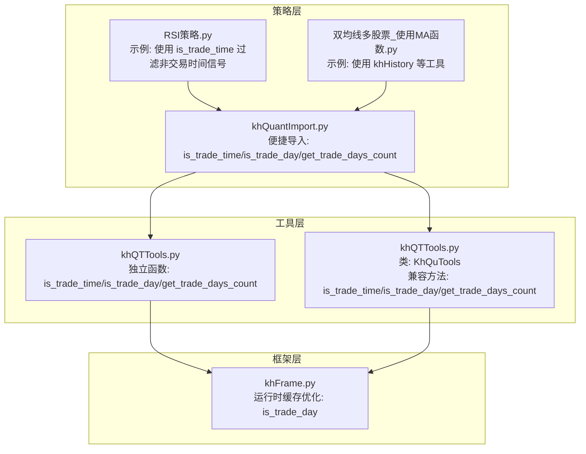
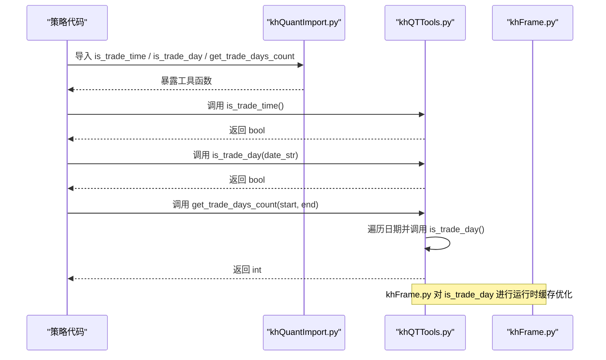
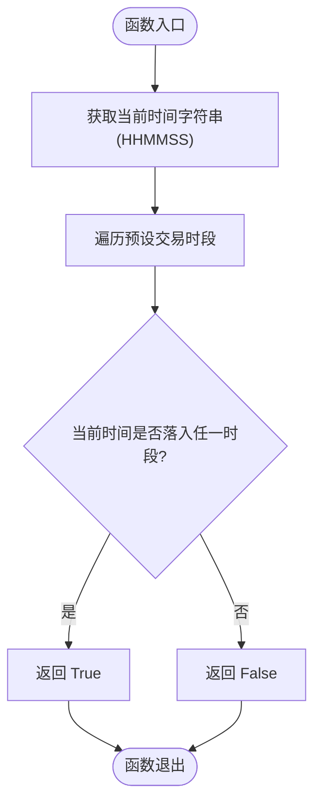
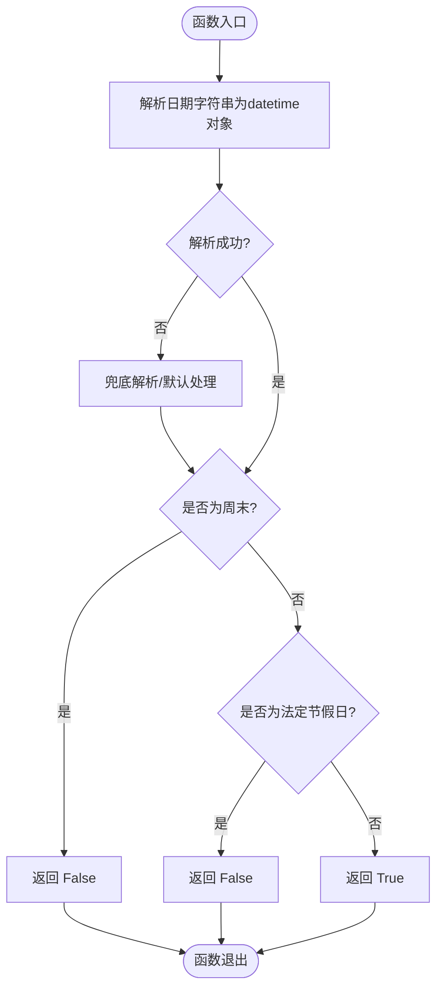
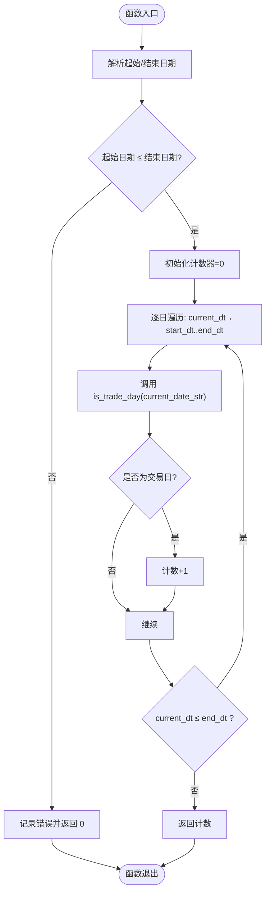
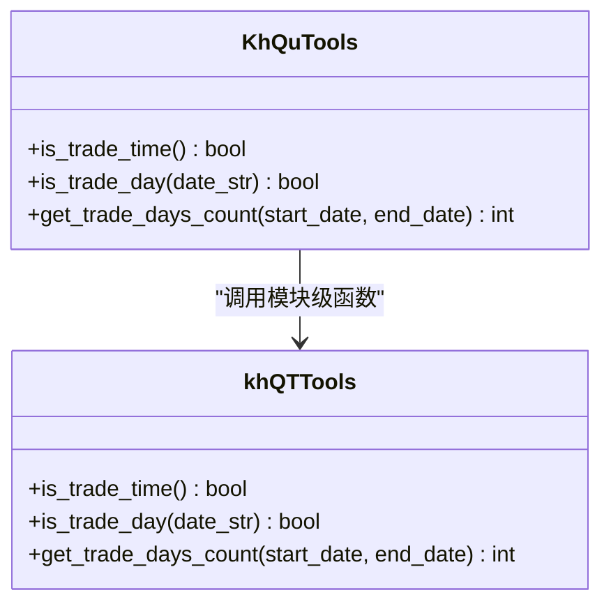
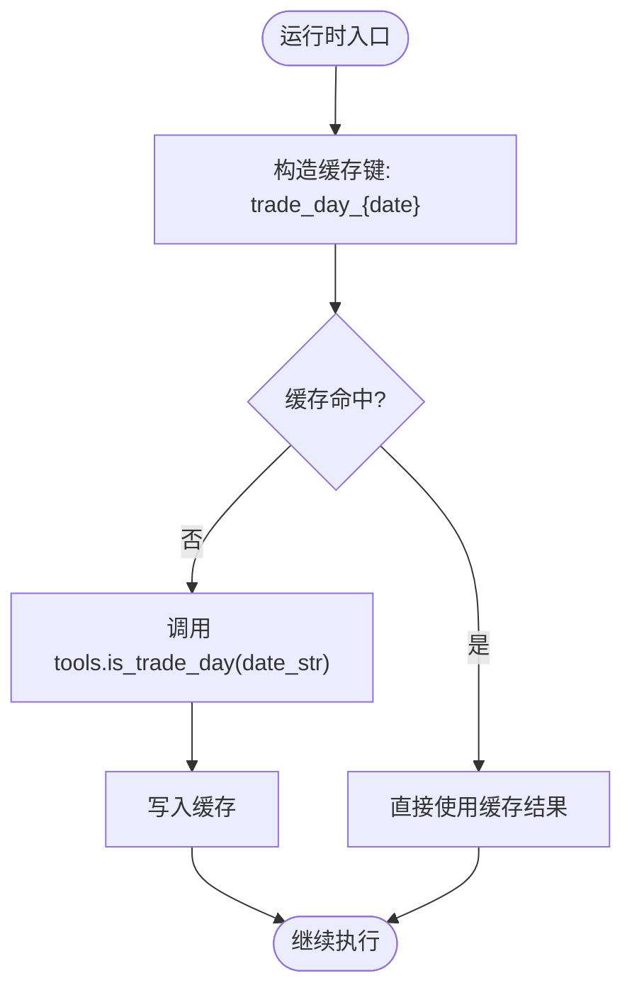
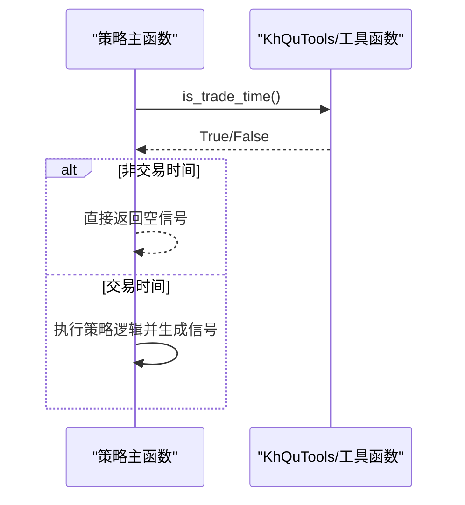
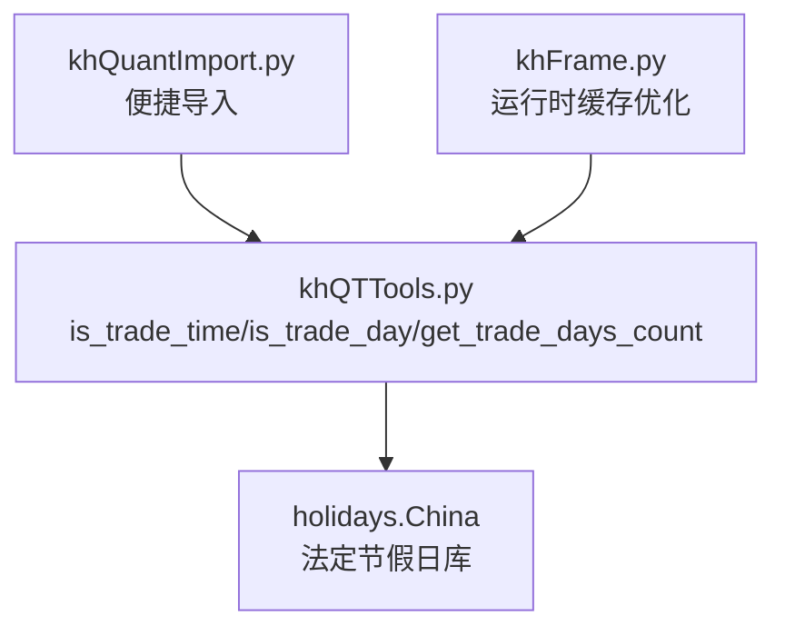

# 时间判断工具

<cite>
**本文引用的文件**
- [khQTTools.py](file://khQTTools.py)
- [README.md](file://README.md)
- [khFrame.py](file://khFrame.py)
- [khQuantImport.py](file://khQuantImport.py)
- [RSI策略.py](file://strategies/RSI策略.py)
- [双均线多股票_使用MA函数.py](file://strategies/双均线多股票_使用MA函数.py)
</cite>

## 目录
1. [简介](#简介)
2. [项目结构](#项目结构)
3. [核心组件](#核心组件)
4. [架构总览](#架构总览)
5. [详细组件分析](#详细组件分析)
6. [依赖分析](#依赖分析)
7. [性能考量](#性能考量)
8. [故障排查指南](#故障排查指南)
9. [结论](#结论)
10. [附录](#附录)

## 简介
本文件系统性阐述“时间判断工具”的实现与使用，重点覆盖以下函数：
- is_trade_time：判断当前是否处于A股常规交易时段（09:30-11:30, 13:00-15:00）。
- is_trade_day：判断指定日期是否为A股交易日（工作日且非法定节假日），支持多种日期格式输入。
- get_trade_days_count：计算两个日期之间的交易日天数，为策略绩效评估提供时间基准。

同时，文档提供在策略中过滤非交易日信号的实际应用示例，帮助读者在实践中正确使用这些工具。

## 项目结构
时间判断工具位于 khQTTools.py 中，提供独立函数与兼容类方法两种调用方式；在 khFrame.py 中对 is_trade_day 进行了运行时缓存优化；在 khQuantImport.py 中将 is_trade_time、is_trade_day、get_trade_days_count 作为便捷工具直接暴露给策略层；README.md 提供了函数使用示例与说明。

**图表来源**
- [khQTTools.py](file://khQTTools.py#L287-L416)
- [khFrame.py](file://khFrame.py#L2579-L2596)
- [khQuantImport.py](file://khQuantImport.py#L31-L39)
- [RSI策略.py](file://strategies/RSI策略.py#L12-L24)
- [双均线多股票_使用MA函数.py](file://strategies/双均线多股票_使用MA函数.py#L14-L33)

**章节来源**
- [khQTTools.py](file://khQTTools.py#L287-L416)
- [khFrame.py](file://khFrame.py#L2579-L2596)
- [khQuantImport.py](file://khQuantImport.py#L31-L39)
- [README.md](file://README.md#L2000-L2054)

## 核心组件
- is_trade_time：基于预设交易时段（09:30-11:30, 13:00-15:00）判断当前是否为交易时间。
- is_trade_day：综合工作日与法定节假日判断指定日期是否为交易日，支持多种日期格式输入。
- get_trade_days_count：遍历日期范围，使用 is_trade_day 计算交易日天数。

上述函数既可作为模块级独立函数直接调用，也可通过 KhQuTools 类方法调用，后者用于兼容旧版本。

**章节来源**
- [khQTTools.py](file://khQTTools.py#L287-L416)
- [README.md](file://README.md#L2000-L2054)

## 架构总览
时间判断工具在系统中的调用关系如下：
- 策略层通过 khQuantImport.py 直接导入 is_trade_time、is_trade_day、get_trade_days_count。
- khFrame.py 在运行时对 is_trade_day 进行缓存优化，避免重复查询。
- khQTTools.py 提供独立函数与 KhQuTools 类方法，二者均依赖全局交易时段与节假日库。

**图表来源**
- [khQuantImport.py](file://khQuantImport.py#L31-L39)
- [khQTTools.py](file://khQTTools.py#L287-L416)
- [khFrame.py](file://khFrame.py#L2579-L2596)

## 详细组件分析

### is_trade_time：交易时间判断
- 预设交易时段：上午 09:30-11:30，下午 13:00-15:00。
- 判断逻辑：获取当前时间的时分秒字符串，与预设时段进行区间比较，命中即为交易时间。
- 使用场景：在策略主函数中先行判断，仅在交易时间内执行交易逻辑，避免非交易时间的无效计算与信号生成。

**图表来源**
- [khQTTools.py](file://khQTTools.py#L287-L294)

**章节来源**
- [khQTTools.py](file://khQTTools.py#L287-L294)
- [README.md](file://README.md#L2000-L2019)

### is_trade_day：交易日判断
- 输入支持：支持 "YYYY-MM-DD"、"YYYYMMDD" 等常见日期格式；默认为当天。
- 判断流程：
  1) 标准化日期格式，解析为 datetime 对象；
  2) 若为周末（weekday ≥ 5），直接返回非交易日；
  3) 使用节假日库（holidays.China）判断是否为法定节假日；
  4) 非周末且非节假日则为交易日。
- 异常处理：解析失败时尝试兜底解析与默认处理，保证鲁棒性。

**图表来源**
- [khQTTools.py](file://khQTTools.py#L296-L375)

**章节来源**
- [khQTTools.py](file://khQTTools.py#L296-L375)
- [README.md](file://README.md#L2021-L2038)

### get_trade_days_count：交易日计数
- 输入：起始日期与结束日期（"YYYY-MM-DD"）。
- 计算流程：
  1) 解析起止日期；
  2) 校验起始日期不晚于结束日期；
  3) 逐日前进，使用 is_trade_day 判断并累加交易日计数；
  4) 返回累计天数。
- 错误处理：异常时记录日志并返回 0。

**图表来源**
- [khQTTools.py](file://khQTTools.py#L377-L416)

**章节来源**
- [khQTTools.py](file://khQTTools.py#L377-L416)
- [README.md](file://README.md#L2040-L2054)

### KhQuTools 类：兼容性封装
- 提供 is_trade_time、is_trade_day、get_trade_days_count 的类方法版本，内部直接调用模块级函数。
- 适用于需要面向对象风格或历史兼容的场景。

**图表来源**
- [khQTTools.py](file://khQTTools.py#L422-L441)

**章节来源**
- [khQTTools.py](file://khQTTools.py#L422-L441)

### khFrame.py 的运行时优化
- 对 is_trade_day 的调用进行缓存，键为 "trade_day_{date}"，避免重复查询。
- 非交易日时，不更新持仓市值，仅使用前一个交易日的市值数据，减少无效计算。

**图表来源**
- [khFrame.py](file://khFrame.py#L2579-L2596)

**章节来源**
- [khFrame.py](file://khFrame.py#L2579-L2596)

### 策略中的实际应用示例
- 使用 is_trade_time 过滤非交易时间信号：在策略主函数中先判断是否为交易时间，非交易时间直接返回空信号列表，避免无效逻辑执行。
- 使用 is_trade_day 过滤非交易日信号：在回测或模拟运行中，若某日为非交易日，可跳过该日的信号生成与处理，确保策略时间基准与真实市场一致。

**图表来源**
- [README.md](file://README.md#L2000-L2019)

**章节来源**
- [README.md](file://README.md#L2000-L2019)
- [RSI策略.py](file://strategies/RSI策略.py#L12-L24)
- [双均线多股票_使用MA函数.py](file://strategies/双均线多股票_使用MA函数.py#L14-L33)

## 依赖分析
- 外部依赖：holidays.China（法定节假日库）。
- 内部依赖：全局交易时段列表与节假日缓存。
- 调用关系：策略层通过 khQuantImport.py 导入工具函数；框架层在 khFrame.py 对 is_trade_day 进行缓存优化；工具层 khQTTools.py 提供独立函数与类方法。

**图表来源**
- [khQTTools.py](file://khQTTools.py#L287-L416)
- [khQuantImport.py](file://khQuantImport.py#L31-L39)
- [khFrame.py](file://khFrame.py#L2579-L2596)

**章节来源**
- [khQTTools.py](file://khQTTools.py#L287-L416)
- [khQuantImport.py](file://khQuantImport.py#L31-L39)
- [khFrame.py](file://khFrame.py#L2579-L2596)

## 性能考量
- is_trade_time：O(1) 时间复杂度，仅进行字符串比较，开销极低。
- is_trade_day：O(1) 时间复杂度，主要为日期解析与 weekday/holidays 查询；节假日库在首次使用时会加载缓存，后续查询为 O(1)。
- get_trade_days_count：O(N) 时间复杂度，N 为日期跨度天数；建议在长跨度计算时配合缓存与批量处理。
- khFrame.py 的缓存：对 is_trade_day 的调用进行缓存，避免重复查询，显著降低重复日期判断的成本。

[本节为一般性指导，无需列出具体文件来源]

## 故障排查指南
- 日期格式错误：is_trade_day 支持多种格式，若传入格式不被识别，将触发异常并尝试兜底解析；若仍失败，默认按交易日处理，可在日志中查看提示。
- 节假日库加载失败：确保已安装 holidays 库；若节假日库不可用，is_trade_day 将退化为仅依据工作日判断。
- 非交易时间信号：在策略中使用 is_trade_time 过滤，避免在非交易时间生成信号；若发现策略在非交易时间仍有信号，检查是否遗漏了该判断。
- 非交易日信号：在回测中若某日为非交易日，应跳过该日的信号生成与处理；khFrame.py 已对非交易日进行优化，避免无效计算。

**章节来源**
- [khQTTools.py](file://khQTTools.py#L346-L375)
- [khFrame.py](file://khFrame.py#L2601-L2610)

## 结论
时间判断工具为策略开发提供了可靠的时间基准：
- is_trade_time 确保策略仅在交易时段执行；
- is_trade_day 准确剔除周末与法定节假日，保证交易日判断的准确性；
- get_trade_days_count 为策略绩效评估提供精确的时间跨度统计。

通过 khQuantImport.py 的便捷导入与 khFrame.py 的运行时缓存优化，这些工具在策略层与框架层均能高效、稳定地发挥作用。

[本节为总结性内容，无需列出具体文件来源]

## 附录
- 使用示例与说明详见 README 文档对应章节。
- 策略示例展示了如何在策略主函数中使用 is_trade_time 过滤非交易时间信号。

**章节来源**
- [README.md](file://README.md#L2000-L2054)
- [RSI策略.py](file://strategies/RSI策略.py#L12-L24)
- [双均线多股票_使用MA函数.py](file://strategies/双均线多股票_使用MA函数.py#L14-L33)