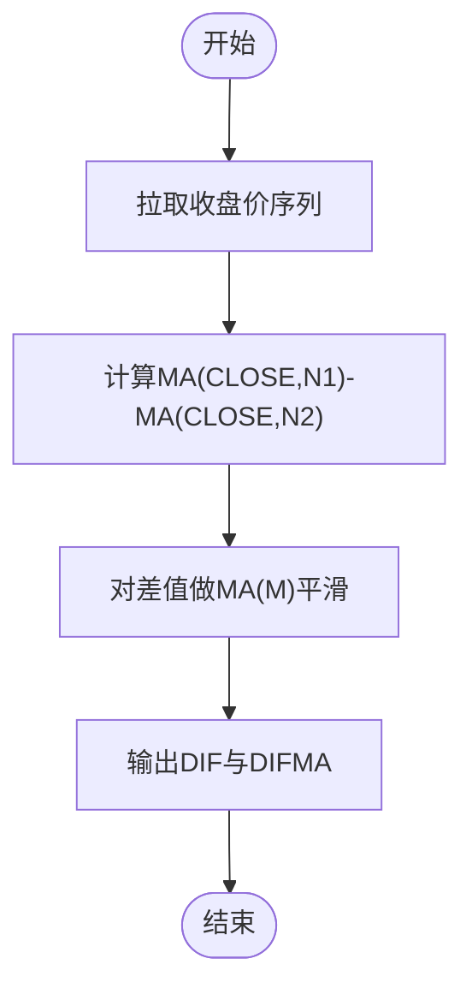

# 复合与特色指标

<cite>
**本文引用的文件**
- [MyTT.py](file://MyTT.py)
- [khQuantImport.py](file://khQuantImport.py)
- [khQTTools.py](file://khQTTools.py)
- [RSI策略.py](file://strategies/RSI策略.py)
- [双均线多股票_使用MA函数.py](file://strategies/双均线多股票_使用MA函数.py)
- [双均线多股票_使用khMA函数.py](file://strategies/双均线多股票_使用khMA函数.py)
- [README.md](file://README.md)
- [khFrame.py](file://khFrame.py)
</cite>

## 目录
1. [简介](#简介)
2. [项目结构](#项目结构)
3. [核心组件](#核心组件)
4. [架构总览](#架构总览)
5. [详细组件分析](#详细组件分析)
6. [依赖关系分析](#依赖关系分析)
7. [性能考量](#性能考量)
8. [故障排查指南](#故障排查指南)
9. [结论](#结论)
10. [附录](#附录)

## 简介
本文件聚焦于复合与特色技术指标，围绕 MyTT.py 中的 BBI（多空指标）、DFMA（平行线差指标）、XSII（薛斯通道II）与 TAQ（唐安奇通道）展开，系统讲解其构建原理、参数配置、动态调整机制与实战应用。文档还结合策略示例与回测说明，帮助读者理解这些指标在趋势跟踪与区间交易策略中的用法与回测表现分析思路。

## 项目结构
MyTT 提供了丰富的基础与复合指标函数，策略层通过 khQuantImport 统一导入，配合 khQTTools 的行情与信号生成能力，形成“指标计算—信号生成—回测执行”的闭环。

图表来源
- [MyTT.py](file://MyTT.py#L1-L120)
- [khQuantImport.py](file://khQuantImport.py#L40-L60)
- [RSI策略.py](file://strategies/RSI策略.py#L1-L26)
- [双均线多股票_使用MA函数.py](file://strategies/双均线多股票_使用MA函数.py#L1-L36)
- [双均线多股票_使用khMA函数.py](file://strategies/双均线多股票_使用khMA函数.py#L1-L33)
- [khQTTools.py](file://khQTTools.py#L490-L541)
- [khFrame.py](file://khFrame.py#L1160-L1195)

章节来源
- [MyTT.py](file://MyTT.py#L1-L120)
- [khQuantImport.py](file://khQuantImport.py#L40-L60)
- [README.md](file://README.md#L686-L705)

## 核心组件
- 基础运算与序列工具：提供序列滚动窗口、差分、位移、统计等通用函数，支撑各类指标的构建。
- 复合指标函数：包含 BBI、DFMA、XSII、TAQ 等复合通道与多周期综合指标。
- 策略接入与导出：khQuantImport 将 MyTT 指标与 khQTTools 工具统一导出，策略文件可直接使用。

章节来源
- [MyTT.py](file://MyTT.py#L1-L120)
- [MyTT.py](file://MyTT.py#L259-L284)
- [MyTT.py](file://MyTT.py#L341-L346)
- [MyTT.py](file://MyTT.py#L410-L421)
- [khQuantImport.py](file://khQuantImport.py#L40-L60)

## 架构总览
复合指标在 MyTT 中以“基础函数组合”的方式实现，策略层通过 khQuantImport 统一导入，利用 khQTTools 的 khHistory、khMA、generate_signal 等工具完成数据拉取与信号生成，khFrame 负责回测调度与触发。

图表来源
- [khQuantImport.py](file://khQuantImport.py#L40-L60)
- [RSI策略.py](file://strategies/RSI策略.py#L12-L26)
- [双均线多股票_使用MA函数.py](file://strategies/双均线多股票_使用MA函数.py#L14-L36)
- [双均线多股票_使用khMA函数.py](file://strategies/双均线多股票_使用khMA函数.py#L12-L33)
- [khQTTools.py](file://khQTTools.py#L490-L541)
- [khFrame.py](file://khFrame.py#L1160-L1195)

## 详细组件分析

### BBI（多空指标）
- 构建原理
  - BBI 是对多个周期均线的等权平均，体现多周期共振的综合趋势。其公式为四个不同周期均线的算术平均。
- 参数配置
  - M1/M2/M3/M4：分别代表短、中、长、超长周期的均线权重。默认值为 3/6/12/20。
- 优势与用法
  - 多周期综合：相比单一周期均线，BBI 更平滑、滞后更低，适合中短期趋势跟踪。
  - 信号生成：可作为趋势方向参考，结合价格与 BBI 的相对位置，辅助多空决策。
- 实战要点
  - 与价格同向为多头，反之为空头；可与动量或通道类指标联动过滤。
  - 与多周期均线策略结合，提升共振确认强度。

图表来源
- [MyTT.py](file://MyTT.py#L259-L262)

章节来源
- [MyTT.py](file://MyTT.py#L259-L262)

### DFMA（平行线差指标）
- 构建原理
  - 计算短周期与长周期均线之差，再对该差值做移动平均，形成“平行线差”的平滑版本，用于捕捉趋势强度与方向。
- 参数配置
  - N1/N2/M：N1 与 N2 分别为短、长周期均线，M 为差值的平滑周期。默认 N1=10、N2=50、M=10。
- 优势与用法
  - 去噪平滑：通过差值再平滑，降低噪音，更适合趋势跟踪。
  - 交叉信号：可作为金叉/死叉的过滤条件，结合成交量或其他动量指标。
- 实战要点
  - 与价格背离过大时，注意回调风险；可叠加布林或通道类指标进行区间判断。

图表来源
- [MyTT.py](file://MyTT.py#L341-L346)

章节来源
- [MyTT.py](file://MyTT.py#L341-L346)

### XSII（薛斯通道II）
- 构建原理
  - 通道由两条动态轨构成：上轨与下轨。上轨与下轨分别基于“动态移动平均”与偏离度系数计算，实现对价格波动的自适应调整。
  - 关键步骤：
    - 计算中间值 AA：对(2×收盘价+最高价+最低价)/4 的5日均线；
    - 计算通道轨 TD1/TD2：基于 AA 的 N% 与 (200-N)% 比例；
    - 计算偏离度 CC：(中间值与20日均线的偏离)/(20日均线)，作为平滑因子；
    - 对收盘价做动态平滑 DMA(CLOSE, CC)，得到 DD；
    - 计算通道轨 TD3/TD4：(1±M%)×DD。
- 参数配置
  - N：通道宽度比例参数，默认 102；
  - M：动态轨偏移比例，默认 7。
- 动态调整机制
  - 偏离度 CC 随价格与20日均线偏离而变化，从而改变 DMA 的平滑因子，使通道轨随波动率自适应调整。
- 优势与用法
  - 自适应通道：在震荡市中收窄，在趋势市中扩张，适合区间交易与趋势跟踪的双重场景。
  - 区间交易：价格触及上轨/下轨附近可考虑反向操作；趋势确认后可跟随方向。
  - 趋势跟踪：通道方向与价格方向一致时，可作为趋势确认信号。

图表来源
- [MyTT.py](file://MyTT.py#L410-L421)

章节来源
- [MyTT.py](file://MyTT.py#L410-L421)

### TAQ（唐安奇通道）
- 构建原理
  - 唐安奇通道由最高价与最低价驱动，上轨为 N 日最高价，下轨为 N 日最低价，中轨为上下轨的均值。
- 参数配置
  - N：周期，默认可按需设置。
- 动态调整机制
  - 随时间滚动更新，N 日内的最高/最低价决定通道上下轨，具备强动态性。
- 优势与用法
  - 区间识别：通道上轨/下轨可作为阻力/支撑位；
  - 趋势确认：价格突破通道后可视为趋势确立；
  - 区间交易：通道内高抛低吸，突破后顺势跟踪。

图表来源
- [MyTT.py](file://MyTT.py#L278-L283)

章节来源
- [MyTT.py](file://MyTT.py#L278-L283)

### 指标在策略中的典型用法与回测
- RSI 策略（多只股票）
  - 使用 MyTT 的 RSI 计算，结合“上穿/下穿阈值”生成买卖信号，演示了指标在策略中的直接调用与信号生成流程。
- 双均线策略（使用 MA 与 khMA）
  - 展示了两种写法：直接使用 MyTT.MA 计算均线，或使用 khQTTools.khMA 封装的行情获取+均线计算，二者均可在策略中生成信号并参与回测。

图表来源
- [RSI策略.py](file://strategies/RSI策略.py#L12-L26)
- [双均线多股票_使用MA函数.py](file://strategies/双均线多股票_使用MA函数.py#L14-L36)
- [双均线多股票_使用khMA函数.py](file://strategies/双均线多股票_使用khMA函数.py#L12-L33)
- [khQTTools.py](file://khQTTools.py#L635-L740)

章节来源
- [RSI策略.py](file://strategies/RSI策略.py#L12-L26)
- [双均线多股票_使用MA函数.py](file://strategies/双均线多股票_使用MA函数.py#L14-L36)
- [双均线多股票_使用khMA函数.py](file://strategies/双均线多股票_使用khMA函数.py#L12-L33)
- [khQTTools.py](file://khQTTools.py#L635-L740)

## 依赖关系分析
- khQuantImport 将 MyTT 指标函数统一导出，策略文件通过 from khQuantImport import * 直接使用 MA、RSI、DFMA、XSII、TAQ 等。
- khQTTools 提供 khHistory、khMA、generate_signal 等工具，策略侧通过这些工具完成数据拉取与信号生成。
- khFrame 负责回测调度，确保策略在指定周期（如日K线）触发执行。

图表来源
- [khQuantImport.py](file://khQuantImport.py#L40-L60)
- [khFrame.py](file://khFrame.py#L1160-L1195)

章节来源
- [khQuantImport.py](file://khQuantImport.py#L40-L60)
- [khFrame.py](file://khFrame.py#L1160-L1195)

## 性能考量
- 指标计算复杂度
  - 基础序列函数（滚动窗口、差分、位移、统计）通常为 O(n)；复合指标（如 XSII）涉及动态平滑与偏离度计算，整体仍为 O(n)。
- 数据规模与回测效率
  - 回测参数设置中建议合理选择数据周期与复权方式，避免不必要的数据冗余；K线触发在回测中更高效，适合中长期趋势策略。
- 交易成本与滑点
  - 回测界面支持设置佣金、印花税、滑点等成本参数，策略侧也可通过 khQTTools 的 generate_signal 与 calculate_max_buy_volume 控制下单与资金使用。

章节来源
- [README.md](file://README.md#L686-L705)
- [README.md](file://README.md#L929-L940)
- [khQTTools.py](file://khQTTools.py#L543-L634)
- [khQTTools.py](file://khQTTools.py#L635-L740)

## 故障排查指南
- 数据周期与触发类型不匹配
  - 当数据设置周期与触发类型不一致时，回测可能产生性能问题或触发精度异常。应按提示调整数据周期与触发类型，确保匹配。
- 价格字段兼容性
  - khQuantImport 对 tick/K线数据的 close 字段做了兼容映射，若出现价格为 None 或 NaN，需检查数据源与字段映射。
- 交易时间与频率限制
  - 对于日内频率（1m/5m/tick），需在交易时间内计算均线；否则会报错。可通过 khQTTools 的 is_trade_time 判断。

章节来源
- [khFrame.py](file://khFrame.py#L1160-L1195)
- [khQuantImport.py](file://khQuantImport.py#L96-L132)
- [khQTTools.py](file://khQTTools.py#L287-L300)

## 结论
- BBI 通过多周期均线的等权平均，提供更稳健的趋势参考，适合中短期趋势跟踪。
- DFMA 以“差值平滑”的方式降低噪音，适合趋势强度与方向的识别。
- XSII 与 TAQ 均为动态通道类指标：XSII 通过动态平滑与偏离度自适应调整通道轨，TAQ 以滚动高低点驱动通道上下轨。两者均可用于区间交易与趋势确认。
- 策略层通过 khQuantImport 与 khQTTools 的统一接口，能够快速将指标融入交易信号，并在 khFrame 的回测框架中高效执行。

## 附录
- 参数建议
  - BBI：M1/M2/M3/M4 可按 3/6/12/20 起步，视回测表现微调。
  - DFMA：N1/N2/M 可设为 10/50/10，观察趋势确认与噪音抑制效果。
  - XSII：N≈100±，M≈5~10，兼顾通道宽度与动态灵敏度。
  - TAQ：N 可按 20/40/60 等周期测试，观察通道对支撑/阻力的识别能力。
- 回测注意事项
  - 明确数据周期与触发类型匹配，避免性能与精度问题；
  - 合理设置交易成本与滑点，贴近真实交易环境；
  - 在区间交易策略中，建议结合动量或趋势过滤，降低假突破风险。