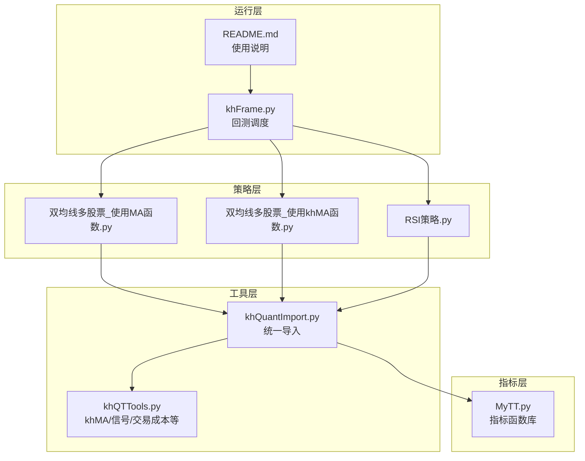
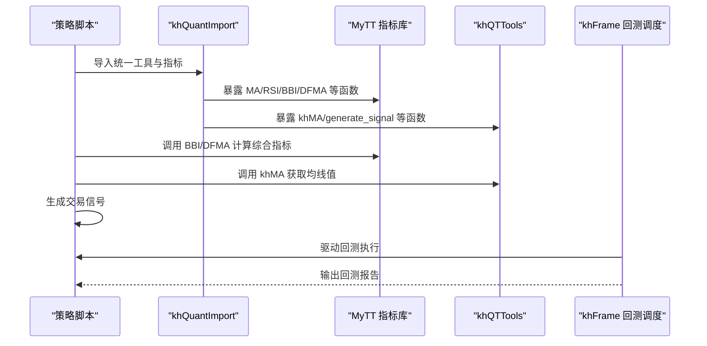
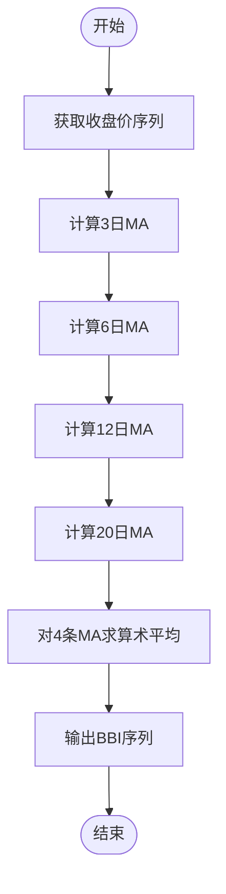
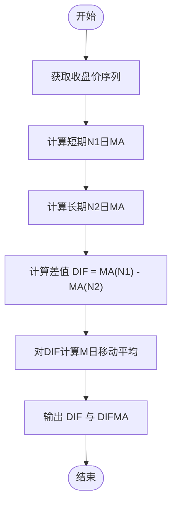
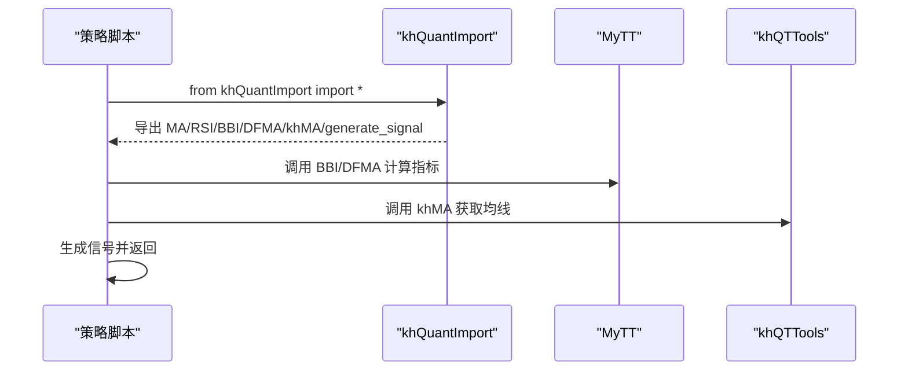
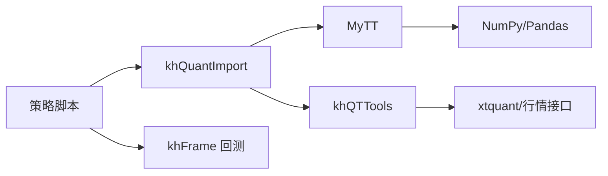

# 多均线综合类指标

<cite>
**本文引用的文件**
- [MyTT.py](file://MyTT.py)
- [khQuantImport.py](file://khQuantImport.py)
- [khQTTools.py](file://khQTTools.py)
- [strategies/双均线多股票_使用MA函数.py](file://strategies/双均线多股票_使用MA函数.py)
- [strategies/双均线多股票_使用khMA函数.py](file://strategies/双均线多股票_使用khMA函数.py)
- [strategies/RSI策略.py](file://strategies/RSI策略.py)
- [README.md](file://README.md)
- [khFrame.py](file://khFrame.py)
</cite>

## 目录
1. [简介](#简介)
2. [项目结构](#项目结构)
3. [核心组件](#核心组件)
4. [架构总览](#架构总览)
5. [详细组件分析](#详细组件分析)
6. [依赖分析](#依赖分析)
7. [性能考量](#性能考量)
8. [故障排查指南](#故障排查指南)
9. [结论](#结论)
10. [附录](#附录)

## 简介
本文件围绕“多均线综合类技术指标”展开，重点解析两个代表性指标：BBI（多空指标）与 DFMA（平行线差指标）。我们将从实现原理、数据结构、处理逻辑、与策略的集成方式、以及在不同市场环境下的适用性等方面进行系统阐述，并结合仓库中的指标库与策略示例，给出在 Python 策略中的调用路径与回测实践建议。

## 项目结构
本项目采用模块化组织，技术指标集中在 MyTT 指标库，策略示例位于 strategies 目录，统一导入入口在 khQuantImport，行情与均线封装在 khQTTools，回测运行由 khFrame 驱动。

图表来源
- [MyTT.py](file://MyTT.py#L259-L352)
- [khQuantImport.py](file://khQuantImport.py#L41-L572)
- [khQTTools.py](file://khQTTools.py#L491-L541)
- [strategies/双均线多股票_使用MA函数.py](file://strategies/双均线多股票_使用MA函数.py#L1-L36)
- [strategies/双均线多股票_使用khMA函数.py](file://strategies/双均线多股票_使用khMA函数.py#L1-L33)
- [strategies/RSI策略.py](file://strategies/RSI策略.py#L1-L26)
- [khFrame.py](file://khFrame.py#L1267-L2252)
- [README.md](file://README.md#L440-L626)

章节来源
- [MyTT.py](file://MyTT.py#L259-L352)
- [khQuantImport.py](file://khQuantImport.py#L41-L572)
- [khQTTools.py](file://khQTTools.py#L491-L541)
- [strategies/双均线多股票_使用MA函数.py](file://strategies/双均线多股票_使用MA函数.py#L1-L36)
- [strategies/双均线多股票_使用khMA函数.py](file://strategies/双均线多股票_使用khMA函数.py#L1-L33)
- [strategies/RSI策略.py](file://strategies/RSI策略.py#L1-L26)
- [khFrame.py](file://khFrame.py#L1267-L2252)
- [README.md](file://README.md#L440-L626)

## 核心组件
- 指标库 MyTT：提供 BBI、DFMA 等多均线综合指标，以及 MA、EMA、SMA 等基础均线与通用函数。
- 统一导入 khQuantImport：将 MyTT 指标与 khQTTools 工具函数统一导出，策略只需一行导入即可使用。
- khQTTools：提供 khMA 等封装函数，简化策略中获取历史数据与计算均线的过程。
- 策略示例：双均线策略（使用 MA 与 khMA）与 RSI 策略，展示指标在策略中的调用方式与回测流程。

章节来源
- [MyTT.py](file://MyTT.py#L259-L352)
- [khQuantImport.py](file://khQuantImport.py#L41-L572)
- [khQTTools.py](file://khQTTools.py#L491-L541)
- [strategies/双均线多股票_使用MA函数.py](file://strategies/双均线多股票_使用MA函数.py#L1-L36)
- [strategies/双均线多股票_使用khMA函数.py](file://strategies/双均线多股票_使用khMA函数.py#L1-L33)
- [strategies/RSI策略.py](file://strategies/RSI策略.py#L1-L26)

## 架构总览
下图展示了从策略到指标再到回测运行的整体流程。

图表来源
- [khQuantImport.py](file://khQuantImport.py#L41-L572)
- [MyTT.py](file://MyTT.py#L259-L352)
- [khQTTools.py](file://khQTTools.py#L491-L541)
- [khFrame.py](file://khFrame.py#L1267-L2252)

## 详细组件分析

### BBI（多空指标）：多周期均线融合的稳定性增强
- 实现原理
  - BBI 通过对多个周期的简单移动平均（如3日、6日、12日、20日）进行算术平均，形成一条综合均线，从而降低单一周期均线的滞后性与噪声，提升趋势判断的稳定性。
  - 在 MyTT 中，BBI 的实现直接调用 MA 函数分别计算各周期均线，再求平均。
- 数据结构与复杂度
  - 输入为收盘价序列，输出为等长的 BBI 序列。
  - 复杂度约为 O(N × K)，其中 N 为序列长度，K 为参与融合的均线周期数（本实现为常数4）。
- 与传统单均线策略对比
  - 在震荡市中，单均线容易产生频繁假信号；BBI 通过多周期融合，平滑了单周期的波动，降低噪音，提高穿越信号的可靠性。
  - 在趋势市中，BBI 仍能跟随趋势，但由于融合多周期，其对短期波动的反应会慢于短周期均线，适合中长期趋势跟踪。
- 在策略中的调用路径
  - 策略中通过 khQuantImport 导入后，直接调用 BBI 函数，返回 BBI 序列，再结合交叉、粘合等条件生成买卖信号。
  - 参考路径：[MyTT.BBI](file://MyTT.py#L259-L262)

图表来源
- [MyTT.py](file://MyTT.py#L259-L262)

章节来源
- [MyTT.py](file://MyTT.py#L259-L262)

### DFMA（平行线差指标）：双均线差值与动量捕捉
- 实现原理
  - DFMA 通过计算短期均线与长期均线的差值（DIF），再对差值进行移动平均（DIFMA），形成两条轨迹：DIF（差值）与 DIFMA（差值的均线）。
  - 该模型既能反映趋势强度（差值幅度），又能体现动量变化（差值的均线趋势），适合在趋势启动初期识别信号。
- 数据结构与复杂度
  - 输入为收盘价序列，输出为 DIF 与 DIFMA 两条序列。
  - 复杂度约为 O(N × 2)，N 为序列长度，涉及两次 MA 计算。
- 与传统双均线策略对比
  - 传统双均线策略关注两条均线的交叉；DFMA 更关注差值的动量与强度变化，适合在趋势初期捕捉“差值加速”的信号。
  - 在震荡市中，DFMA 的差值可能反复穿越零轴，需配合过滤条件（如趋势强度阈值）使用。
- 在策略中的调用路径
  - 策略中通过 khQuantImport 导入后，调用 DFMA 函数，返回 DIF 与 DIFMA 序列，再结合金叉/死叉、零轴穿越、动量背离等条件生成买卖信号。
  - 参考路径：[MyTT.DFMA](file://MyTT.py#L341-L345)

图表来源
- [MyTT.py](file://MyTT.py#L341-L345)

章节来源
- [MyTT.py](file://MyTT.py#L341-L345)

### 指标与策略的集成：Python 策略中的调用方式
- 统一导入
  - 策略只需导入 khQuantImport，即可直接使用 MA、RSI、BBI、DFMA 等指标函数，以及 khMA、generate_signal 等工具函数。
  - 参考路径：[khQuantImport.__all__](file://khQuantImport.py#L540-L572)
- 双均线策略（使用 MA 与 khMA）
  - 使用 MyTT.MA 的版本：先拉取历史收盘价，再调用 MA 计算均线，最后生成买卖信号。
    - 参考路径：[strategies/双均线多股票_使用MA函数.py](file://strategies/双均线多股票_使用MA函数.py#L1-L36)
  - 使用 khMA 的版本：khMA 内置行情获取与均线计算，策略更简洁。
    - 参考路径：[strategies/双均线多股票_使用khMA函数.py](file://strategies/双均线多股票_使用khMA函数.py#L1-L33)
- RSI 策略
  - 展示了如何在策略中调用 RSI 指标并结合阈值生成信号。
  - 参考路径：[strategies/RSI策略.py](file://strategies/RSI策略.py#L1-L26)

图表来源
- [khQuantImport.py](file://khQuantImport.py#L41-L572)
- [MyTT.py](file://MyTT.py#L259-L352)
- [khQTTools.py](file://khQTTools.py#L491-L541)
- [strategies/双均线多股票_使用MA函数.py](file://strategies/双均线多股票_使用MA函数.py#L1-L36)
- [strategies/双均线多股票_使用khMA函数.py](file://strategies/双均线多股票_使用khMA函数.py#L1-L33)
- [strategies/RSI策略.py](file://strategies/RSI策略.py#L1-L26)

章节来源
- [khQuantImport.py](file://khQuantImport.py#L41-L572)
- [MyTT.py](file://MyTT.py#L259-L352)
- [khQTTools.py](file://khQTTools.py#L491-L541)
- [strategies/双均线多股票_使用MA函数.py](file://strategies/双均线多股票_使用MA函数.py#L1-L36)
- [strategies/双均线多股票_使用khMA函数.py](file://strategies/双均线多股票_使用khMA函数.py#L1-L33)
- [strategies/RSI策略.py](file://strategies/RSI策略.py#L1-L26)

### 回测与应用建议
- 回测流程
  - 通过 khFrame 驱动策略回测，系统会自动保存回测结果并生成报告。
  - 参考路径：[khFrame 回测调度](file://khFrame.py#L1267-L2252)
- 使用说明
  - README 中提供了回测的加载、配置、数据补充、运行与报告解读的完整流程。
  - 参考路径：[README.md（回测与报告）](file://README.md#L440-L626)

章节来源
- [khFrame.py](file://khFrame.py#L1267-L2252)
- [README.md](file://README.md#L440-L626)

## 依赖分析
- 指标依赖
  - BBI/DFMA 依赖 MA 函数；MA 依赖 pandas rolling 平滑与 NumPy 计算。
- 策略依赖
  - 策略通过 khQuantImport 统一导入，间接依赖 MyTT 与 khQTTools。
- 运行依赖
  - 回测由 khFrame 驱动，策略文件在回测配置中指定。

图表来源
- [khQuantImport.py](file://khQuantImport.py#L41-L572)
- [MyTT.py](file://MyTT.py#L87-L101)
- [khQTTools.py](file://khQTTools.py#L23-L31)
- [khFrame.py](file://khFrame.py#L1267-L2252)

章节来源
- [khQuantImport.py](file://khQuantImport.py#L41-L572)
- [MyTT.py](file://MyTT.py#L87-L101)
- [khQTTools.py](file://khQTTools.py#L23-L31)
- [khFrame.py](file://khFrame.py#L1267-L2252)

## 性能考量
- 计算复杂度
  - MA/EMA/SMA 等均线计算为 O(N)；BBI/DFMA 为 O(N × K)，K 为参与融合/差值的均线数（常数级）。
- 数据规模
  - 回测时建议使用本地数据补充，减少网络请求，提升回测速度。
- 指标平滑
  - BBI 通过多周期均线融合降低滞后，DFMA 通过差值均线捕捉动量，二者均有利于在震荡市中减少噪音。

[本节为通用性能讨论，不直接分析具体文件]

## 故障排查指南
- 数据不足
  - 计算 MA/BBI/DFMA 时，若历史数据不足会抛出异常。请确保回测前已补充所需周期数据。
  - 参考路径：[khQTTools.khMA 数据校验](file://khQTTools.py#L524-L540)
- 交易时间与频率
  - 对于日内频率（如 1m/5m/tick），需在交易时间内计算均线，否则会抛出异常。
  - 参考路径：[khQTTools.khMA 交易时间判断](file://khQTTools.py#L518-L522)
- 回测运行与报告
  - 回测完成后会生成报告窗口，若未显示，可在日志面板点击“打开回测指标”按钮。
  - 参考路径：[README.md 回测报告](file://README.md#L580-L626)

章节来源
- [khQTTools.py](file://khQTTools.py#L518-L540)
- [README.md](file://README.md#L580-L626)

## 结论
- BBI 通过多周期均线融合，有效平滑单一均线的滞后性与噪音，提升趋势判断稳定性，适合中长期趋势跟踪。
- DFMA 通过双均线差值与差值均线捕捉趋势强度与动量变化，适合在趋势启动初期识别信号。
- 在策略中，通过 khQuantImport 统一导入指标与工具，结合 khMA 等封装函数，可快速实现多均线综合类指标的策略化落地，并依托 khFrame 完成回测与报告生成。

[本节为总结性内容，不直接分析具体文件]

## 附录
- 指标调用路径参考
  - BBI：[MyTT.BBI](file://MyTT.py#L259-L262)
  - DFMA：[MyTT.DFMA](file://MyTT.py#L341-L345)
  - khMA：[khQTTools.khMA](file://khQTTools.py#L491-L541)
  - 统一导入：[khQuantImport.__all__](file://khQuantImport.py#L540-L572)
- 策略示例参考
  - 双均线（MA）：[strategies/双均线多股票_使用MA函数.py](file://strategies/双均线多股票_使用MA函数.py#L1-L36)
  - 双均线（khMA）：[strategies/双均线多股票_使用khMA函数.py](file://strategies/双均线多股票_使用khMA函数.py#L1-L33)
  - RSI 策略：[strategies/RSI策略.py](file://strategies/RSI策略.py#L1-L26)
- 回测与报告
  - 回测调度：[khFrame.py](file://khFrame.py#L1267-L2252)
  - 使用说明与报告解读：[README.md](file://README.md#L440-L626)