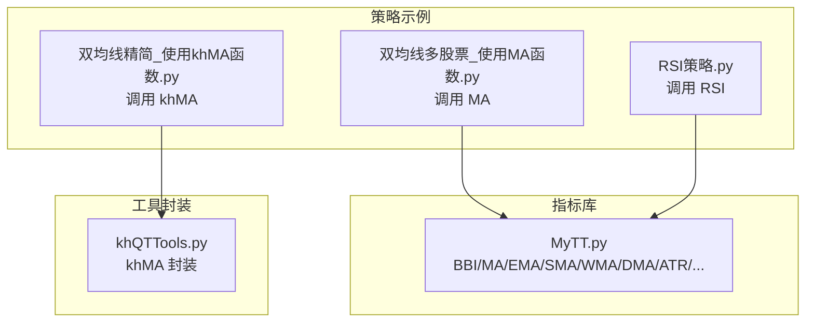
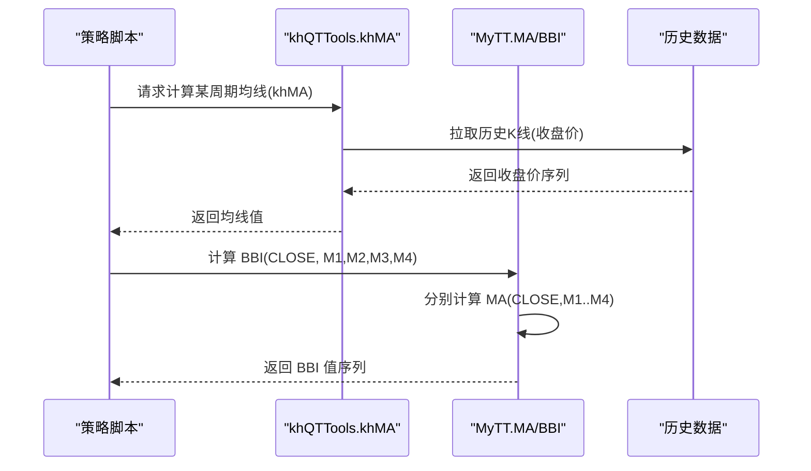
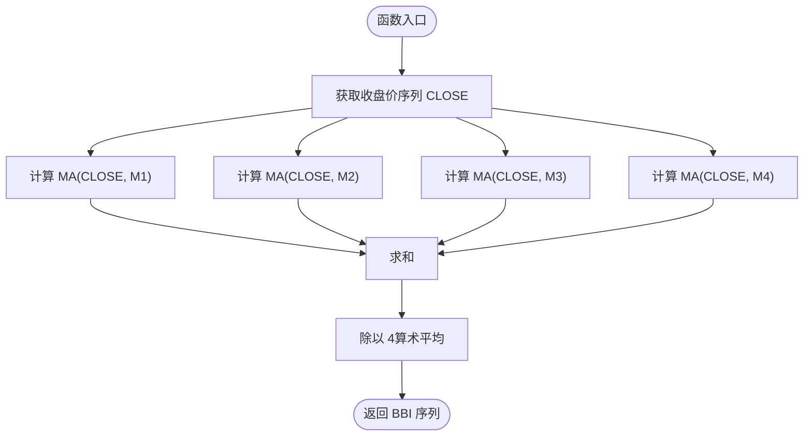
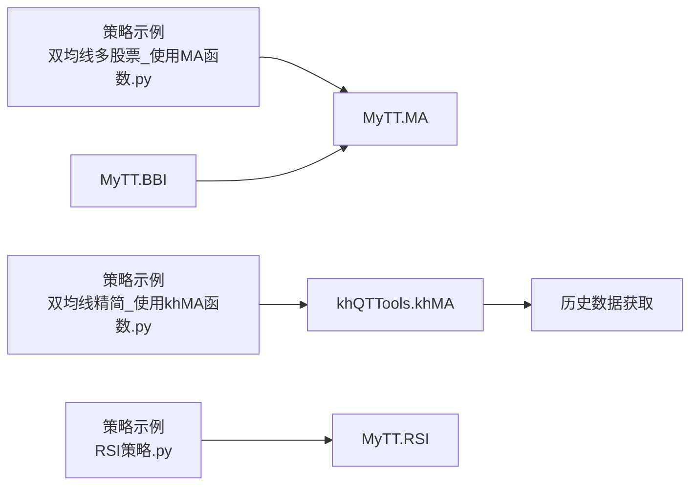

# 多空指标 (BBI)

<cite>
**本文引用的文件**
- [MyTT.py](file://MyTT.py)
- [khQTTools.py](file://khQTTools.py)
- [双均线多股票_使用MA函数.py](file://strategies/双均线多股票_使用MA函数.py)
- [双均线精简_使用khMA函数.py](file://strategies/双均线精简_使用khMA函数.py)
- [RSI策略.py](file://strategies/RSI策略.py)
</cite>

## 目录
1. [简介](#简介)
2. [项目结构](#项目结构)
3. [核心组件](#核心组件)
4. [架构总览](#架构总览)
5. [详细组件分析](#详细组件分析)
6. [依赖分析](#依赖分析)
7. [性能考虑](#性能考虑)
8. [故障排查指南](#故障排查指南)
9. [结论](#结论)
10. [附录](#附录)

## 简介
本技术文档围绕多空指标（BBI）展开，系统阐述其在本项目中的实现原理、参数配置与调用方式，并结合策略示例展示其在震荡市中相较传统单均线策略的优势。文档还提供基于历史数据的回测思路与案例分析方法，解释如何通过调整周期参数（M1–M4）适配不同股票或周期的波动特性，并讨论其在策略组合中的应用场景，如作为趋势过滤器或动态止盈参考。

## 项目结构
本项目采用“指标库 + 策略示例”的组织方式：
- 指标库：MyTT.py 提供统一的指标与工具函数，包括 BBI、MA、EMA、SMA、WMA、DMA、ATR、DMI、KDJ、RSI、WR、BIAS、BOLL、PSY、CCI、ROC、EXPMA、OBV、MFI、ASI、XSII、SAR、TDX_SAR 等。
- 策略示例：strategies 目录包含多个示例策略，演示如何在回测框架中调用指标库函数，如使用 MA、RSI 等。
- 工具与封装：khQTTools.py 提供 khMA 等封装函数，简化策略中获取历史数据与计算均线的过程。

**图表来源**
- [MyTT.py](file://MyTT.py#L87-L110)
- [MyTT.py](file://MyTT.py#L259-L262)
- [双均线多股票_使用MA函数.py](file://strategies/双均线多股票_使用MA函数.py#L14-L35)
- [双均线精简_使用khMA函数.py](file://strategies/双均线精简_使用khMA函数.py#L11-L31)
- [RSI策略.py](file://strategies/RSI策略.py#L12-L26)
- [khQTTools.py](file://khQTTools.py#L490-L541)

**章节来源**
- [MyTT.py](file://MyTT.py#L87-L110)
- [MyTT.py](file://MyTT.py#L259-L262)
- [双均线多股票_使用MA函数.py](file://strategies/双均线多股票_使用MA函数.py#L14-L35)
- [双均线精简_使用khMA函数.py](file://strategies/双均线精简_使用khMA函数.py#L11-L31)
- [RSI策略.py](file://strategies/RSI策略.py#L12-L26)
- [khQTTools.py](file://khQTTools.py#L490-L541)

## 核心组件
- BBI 指标函数：位于 MyTT.py，通过算术平均融合多个周期的简单移动平均线（MA），实现对单一均线滞后的平滑，提升趋势判断稳定性。
- MA 函数：位于 MyTT.py，提供 N 日简单移动平均，是 BBI 的基础构件。
- khMA 封装：位于 khQTTools.py，提供独立函数版本的均线计算，封装了历史数据获取与精度处理，便于策略直接调用。

**章节来源**
- [MyTT.py](file://MyTT.py#L87-L110)
- [MyTT.py](file://MyTT.py#L259-L262)
- [khQTTools.py](file://khQTTools.py#L490-L541)

## 架构总览
下图展示了 BBI 在策略中的典型调用路径：策略通过 khMA 或直接调用 MA 获取历史价格序列，再由 BBI 对多周期 MA 进行算术平均，最终输出趋势信号或作为过滤器。

**图表来源**
- [双均线精简_使用khMA函数.py](file://strategies/双均线精简_使用khMA函数.py#L11-L31)
- [khQTTools.py](file://khQTTools.py#L490-L541)
- [MyTT.py](file://MyTT.py#L87-L110)
- [MyTT.py](file://MyTT.py#L259-L262)

## 详细组件分析

### BBI 实现原理与参数说明
- 函数签名与输入：BBI(CLOSE, M1=3, M2=6, M3=12, M4=20)，其中 CLOSE 为收盘价序列，M1–M4 为融合的多周期 MA 周期。
- 计算逻辑：对四个周期的 MA 进行算术平均，即 BBI = (MA(CLOSE,M1)+MA(CLOSE,M2)+MA(CLOSE,M3)+MA(CLOSE,M4))/4。
- 作用机制：通过多周期 MA 的融合，降低单一 MA 的滞后性与噪声，提升趋势识别的稳定性与抗干扰能力。

**图表来源**
- [MyTT.py](file://MyTT.py#L259-L262)

**章节来源**
- [MyTT.py](file://MyTT.py#L259-L262)

### 参数配置与调用方式
- 直接调用 MA+BBI：策略中先拉取历史收盘价，再分别计算 MA(CLOSE,M1..M4)，最后求平均得到 BBI。
  - 示例参考：[双均线多股票_使用MA函数.py](file://strategies/双均线多股票_使用MA函数.py#L14-L35)
- 使用 khMA 封装：策略中直接调用 khMA 计算各周期均线，再由 BBI 融合。
  - 示例参考：[双均线精简_使用khMA函数.py](file://strategies/双均线精简_使用khMA函数.py#L11-L31)
- 指标库调用：直接使用 MyTT.BBI(CLOSE, M1, M2, M3, M4)。
  - 参考：[MyTT.py](file://MyTT.py#L259-L262)

**章节来源**
- [双均线多股票_使用MA函数.py](file://strategies/双均线多股票_使用MA函数.py#L14-L35)
- [双均线精简_使用khMA函数.py](file://strategies/双均线精简_使用khMA函数.py#L11-L31)
- [MyTT.py](file://MyTT.py#L259-L262)

### 与传统单均线策略的对比
- 单均线策略：仅使用单一 MA（如 MA5、MA20）进行金叉/死叉判断，易受短期噪声影响，信号滞后明显。
- BBI 策略：通过多周期 MA 融合，有效平滑单一均线的滞后性，提升趋势识别稳定性，尤其适用于震荡市中减少假信号。
- 策略示例参考：
  - 双均线策略（MA5 vs MA20）：[双均线多股票_使用MA函数.py](file://strategies/双均线多股票_使用MA函数.py#L14-L35)
  - RSI 策略（震荡区间超买/超卖）：[RSI策略.py](file://strategies/RSI策略.py#L12-L26)

**章节来源**
- [双均线多股票_使用MA函数.py](file://strategies/双均线多股票_使用MA函数.py#L14-L35)
- [RSI策略.py](file://strategies/RSI策略.py#L12-L26)

### 回测案例与表现分析方法
- 市场环境划分：将回测区间划分为“上升趋势”“下降趋势”“震荡市”三类，分别评估 BBI 的信号延迟与误判率。
- 指标对比：对比 BBI 与单均线（如 MA5、MA20）在同一市场环境下的胜率、最大回撤、夏普比率等。
- 信号延迟：统计金叉/死叉到趋势确认的时间窗口，评估 BBI 的平滑效果。
- 误判率：统计在震荡市中出现的假信号占比，衡量 BBI 的抗噪能力。
- 策略组合：将 BBI 作为趋势过滤器，仅在 BBI 向上（或向下）时执行多头（或空头）策略，降低逆势交易概率。

注：本节为方法论与实践建议，不直接分析具体文件。

### 参数调优与适配
- 周期选择建议：
  - 高波动股票：增大较长周期（如 M3、M4 提升至 20–30），降低噪声影响。
  - 低波动股票：适当缩短周期（如 M1、M2 降至 2–4），提升灵敏度。
- 组合策略：将 BBI 与动量指标（如 ROC、MTM）或成交量指标（如 OBV、MFI）结合，提高入场准确性。
- 动态参数：根据回测结果对 M1–M4 进行滚动优化，或在不同市场阶段切换参数组合。

注：本节为方法论与实践建议，不直接分析具体文件。

### 应用场景
- 趋势过滤器：仅在 BBI 与价格方向一致时开仓，过滤逆势交易。
- 动态止盈/止损：以 BBI 作为趋势参考，配合固定或动态止损（如 ATR）进行风险管理。
- 多周期共振：结合日线与分钟线的 BBI，实现跨周期共振信号。

注：本节为方法论与实践建议，不直接分析具体文件。

## 依赖分析
- BBI 依赖 MA：BBI 是对 MA 的算术平均，MA 的实现基于滚动窗口平均。
- khMA 依赖历史数据获取：khMA 封装了 khHistory 获取历史数据与价格精度处理，便于策略直接调用。
- 策略示例依赖指标库：示例策略通过 khMA 或直接调用 MA/RSI 等指标函数，体现指标库的复用性。

**图表来源**
- [MyTT.py](file://MyTT.py#L87-L110)
- [MyTT.py](file://MyTT.py#L259-L262)
- [双均线多股票_使用MA函数.py](file://strategies/双均线多股票_使用MA函数.py#L14-L35)
- [双均线精简_使用khMA函数.py](file://strategies/双均线精简_使用khMA函数.py#L11-L31)
- [khQTTools.py](file://khQTTools.py#L490-L541)
- [RSI策略.py](file://strategies/RSI策略.py#L12-L26)

**章节来源**
- [MyTT.py](file://MyTT.py#L87-L110)
- [MyTT.py](file://MyTT.py#L259-L262)
- [双均线多股票_使用MA函数.py](file://strategies/双均线多股票_使用MA函数.py#L14-L35)
- [双均线精简_使用khMA函数.py](file://strategies/双均线精简_使用khMA函数.py#L11-L31)
- [khQTTools.py](file://khQTTools.py#L490-L541)
- [RSI策略.py](file://strategies/RSI策略.py#L12-L26)

## 性能考虑
- 计算复杂度：BBI 对四个 MA 进行滚动平均，时间复杂度约为 O(N×K)，K 为 MA 的窗口数（此处为 4），空间复杂度 O(N)。
- 数据规模：在大规模股票池或多周期回测时，建议优先使用 khMA 封装以减少重复数据拉取与预处理开销。
- 复权与精度：khMA 根据 ETF/股票自动选择价格精度，避免不必要的浮点误差累积。

**章节来源**
- [khQTTools.py](file://khQTTools.py#L490-L541)

## 故障排查指南
- 数据不足：khMA 在数据条数不足时会抛出异常，需检查回测区间与 bar_count 设置。
- 非交易时间：khMA 在日内频率下若不在交易时间内会抛出异常，需确保策略触发时间合理。
- 价格精度：khMA 会根据股票类型自动四舍五入，避免因精度导致的交易异常。

**章节来源**
- [khQTTools.py](file://khQTTools.py#L490-L541)

## 结论
BBI 通过多周期 MA 的算术平均，有效平滑单一均线的滞后性与噪声，提升趋势判断的稳定性，尤其适用于震荡市中的信号过滤。结合策略示例与工具封装，可在回测框架中快速实现与验证 BBI 策略，并通过参数调优与组合策略进一步提升收益风险比。建议在实盘前进行充分的历史回测与压力测试，确保策略在不同市场环境下的稳健性。

## 附录
- 参考指标函数位置：
  - MA：[MyTT.py](file://MyTT.py#L87-L110)
  - BBI：[MyTT.py](file://MyTT.py#L259-L262)
  - khMA：[khQTTools.py](file://khQTTools.py#L490-L541)
- 策略示例位置：
  - 双均线（MA）：[双均线多股票_使用MA函数.py](file://strategies/双均线多股票_使用MA函数.py#L14-L35)
  - khMA 精简版：[双均线精简_使用khMA函数.py](file://strategies/双均线精简_使用khMA函数.py#L11-L31)
  - RSI 策略：[RSI策略.py](file://strategies/RSI策略.py#L12-L26)