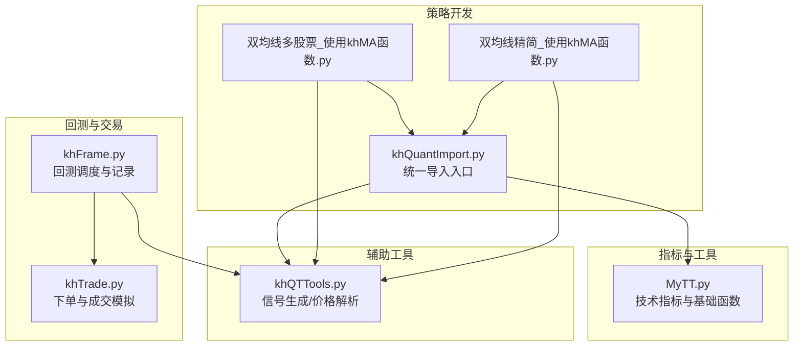
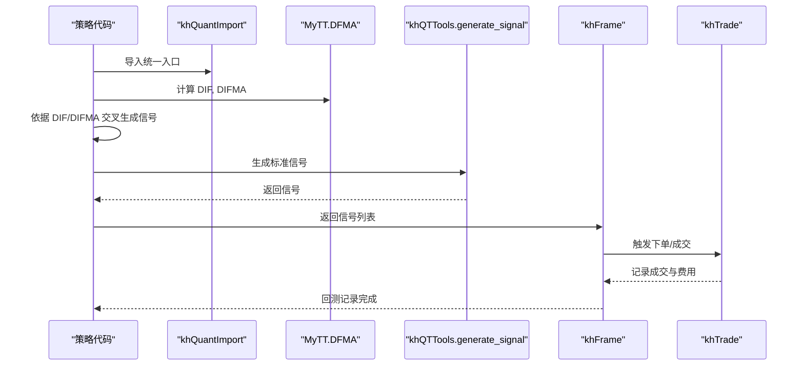
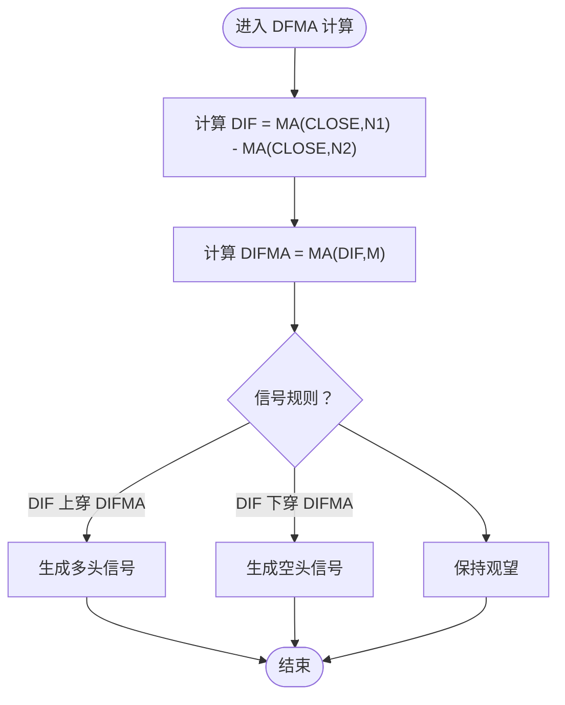
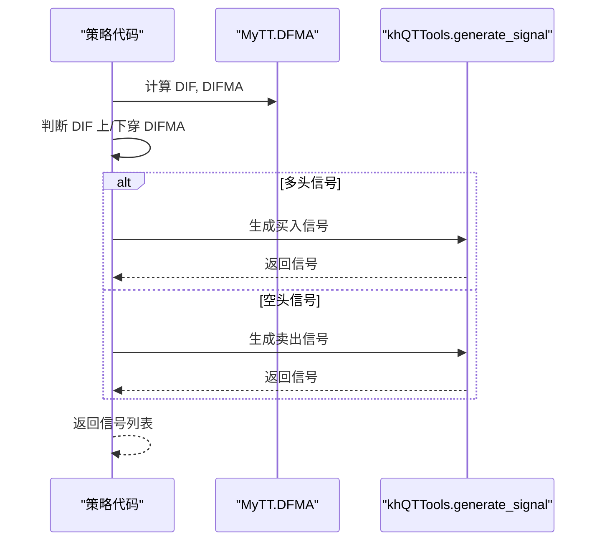
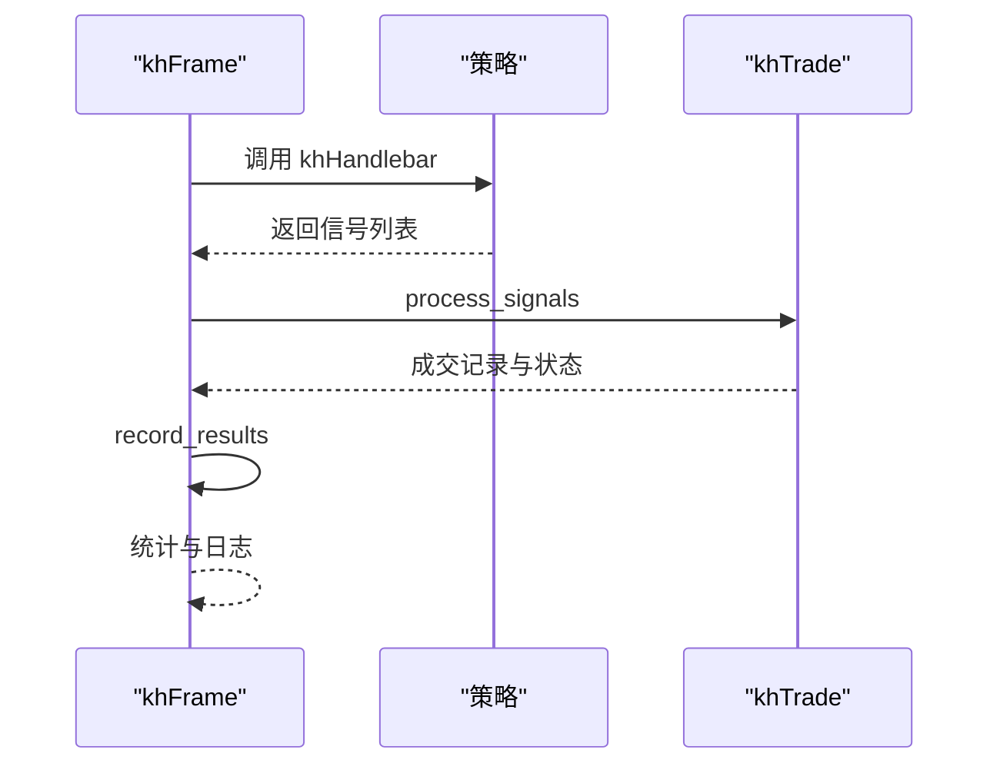
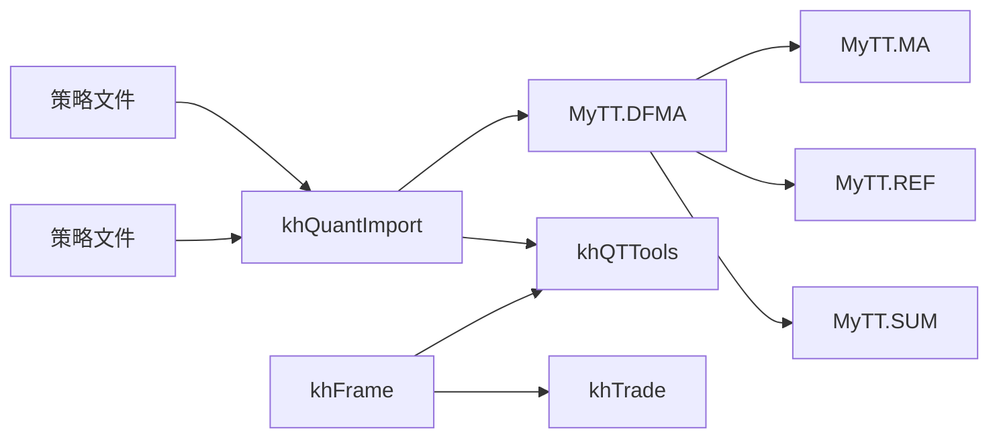

# 平行线差指标 (DFMA)

<cite>
**本文引用的文件**
- [MyTT.py](file://MyTT.py)
- [khQuantImport.py](file://khQuantImport.py)
- [khQTTools.py](file://khQTTools.py)
- [khFrame.py](file://khFrame.py)
- [khTrade.py](file://khTrade.py)
- [strategies/双均线多股票_使用khMA函数.py](file://strategies/双均线多股票_使用khMA函数.py)
- [strategies/双均线精简_使用khMA函数.py](file://strategies/双均线精简_使用khMA函数.py)
- [modules/khQuantImport.md](file://modules/khQuantImport.md)
- [CLAUDE.md](file://CLAUDE.md)
</cite>

## 目录
1. [简介](#简介)
2. [项目结构](#项目结构)
3. [核心组件](#核心组件)
4. [架构总览](#架构总览)
5. [详细组件分析](#详细组件分析)
6. [依赖关系分析](#依赖关系分析)
7. [性能考量](#性能考量)
8. [故障排查指南](#故障排查指南)
9. [结论](#结论)
10. [附录](#附录)

## 简介
本技术文档围绕平行线差指标（DFMA）展开，系统阐述其“双均线差值模型”：通过计算短期与长期均线（如10日与50日）的差值（DIF），再对DIF进行移动平均得到DIFMA，从而捕捉趋势强度与动量变化。文档重点说明DFMA函数的实现逻辑，强调其在趋势启动初期的信号识别能力，相较传统“金叉死叉”策略具有更低的滞后性。同时，结合代码示例展示如何在策略中利用DIF上穿/下穿DIFMA生成交易信号，并提供回测流程说明与参数优化建议，以及如何结合成交量等指标进行信号过滤以提升胜率。

## 项目结构
本仓库采用模块化组织，核心与策略分离：
- 指标与工具：MyTT.py 提供统一技术指标与基础运算函数
- 策略开发：khQuantImport.py 暴露统一导入入口，策略文件位于 strategies/ 目录
- 回测与交易：khFrame.py 负责回测调度与记录，khTrade.py 负责下单与成交模拟
- 辅助工具：khQTTools.py 提供信号生成、价格解析、历史数据获取等

图表来源
- [MyTT.py](file://MyTT.py#L1-L120)
- [khQuantImport.py](file://khQuantImport.py#L1-L120)
- [khFrame.py](file://khFrame.py#L1596-L1620)
- [khTrade.py](file://khTrade.py#L339-L360)
- [khQTTools.py](file://khQTTools.py#L631-L715)
- [strategies/双均线多股票_使用khMA函数.py](file://strategies/双均线多股票_使用khMA函数.py#L1-L33)
- [strategies/双均线精简_使用khMA函数.py](file://strategies/双均线精简_使用khMA函数.py#L1-L31)

章节来源
- [MyTT.py](file://MyTT.py#L1-L120)
- [khQuantImport.py](file://khQuantImport.py#L1-L120)
- [khFrame.py](file://khFrame.py#L1596-L1620)
- [khTrade.py](file://khTrade.py#L339-L360)
- [khQTTools.py](file://khQTTools.py#L631-L715)
- [strategies/双均线多股票_使用khMA函数.py](file://strategies/双均线多股票_使用khMA函数.py#L1-L33)
- [strategies/双均线精简_使用khMA函数.py](file://strategies/双均线精简_使用khMA函数.py#L1-L31)

## 核心组件
- DFMA 指标函数：实现双均线差值模型，返回 DIF 与 DIFMA 两列序列，用于趋势强度与动量判别
- 交叉与持续交叉：CROSS/LONGCROSS 提供金叉/长期交叉判定，可用于对比传统策略
- 信号生成：generate_signal 提供统一的信号构建与下单参数封装
- 回测调度：khFrame 负责按交易日循环、记录信号与结果
- 交易执行：khTrade 负责下单、成交与费用模拟

章节来源
- [MyTT.py](file://MyTT.py#L341-L346)
- [MyTT.py](file://MyTT.py#L165-L171)
- [khQTTools.py](file://khQTTools.py#L631-L715)
- [khFrame.py](file://khFrame.py#L2145-L2171)
- [khTrade.py](file://khTrade.py#L535-L567)

## 架构总览
DFMA 在策略中的典型工作流如下：
- 策略侧通过 khQuantImport 获取数据与工具
- 使用 MyTT.DFMA 计算 DIF 与 DIFMA
- 以 DIF 上穿/下穿 DIFMA 作为入场/出场信号
- 通过 generate_signal 生成标准信号，khFrame 调度回测，khTrade 执行下单

图表来源
- [khQuantImport.py](file://khQuantImport.py#L1-L120)
- [MyTT.py](file://MyTT.py#L341-L346)
- [khQTTools.py](file://khQTTools.py#L631-L715)
- [khFrame.py](file://khFrame.py#L2145-L2171)
- [khTrade.py](file://khTrade.py#L535-L567)

## 详细组件分析

### DFMA 指标实现与双均线差值模型
- 函数签名与输入输出
  - 函数：DFMA(CLOSE, N1=10, N2=50, M=10)
  - 输入：CLOSE（收盘价）
  - 输出：DIF（短期均线与长期均线之差）、DIFMA（DIF的M日移动平均）
- 实现要点
  - DIF = MA(CLOSE, N1) - MA(CLOSE, N2)
  - DIFMA = MA(DIF, M)
  - 通过不同N1/N2/M组合，可灵活刻画短期动量与趋势强度
- 与传统金叉策略的差异
  - 金叉策略基于两条均线的交叉（如MA5上穿MA10），存在滞后
  - DFMA策略关注两条均线差值的变化（DIF）及其平滑（DIFMA），在趋势启动初期更具敏感性，能更早识别动量变化

图表来源
- [MyTT.py](file://MyTT.py#L341-L346)

章节来源
- [MyTT.py](file://MyTT.py#L341-L346)

### 交叉与持续交叉（CROSS/LONGCROSS）对比
- CROSS：判断 S1 由小于 S2 向上穿过 S2 的瞬间
- LONGCROSS：要求 S1 在 N 个周期内持续小于 S2 后才发生交叉
- 适用场景
  - 传统双均线策略常用 CROSS 作为金叉/死叉信号
  - DFMA 策略更偏向 DIF 与 DIFMA 的交叉，强调差值变化而非均线相对位置

章节来源
- [MyTT.py](file://MyTT.py#L165-L171)

### 策略中利用 DIF/DIFMA 生成交易信号
- 生成信号的步骤
  - 计算 DFMA 得到 DIF 与 DIFMA
  - 判断 DIF 与 DIFMA 的上穿/下穿
  - 调用 generate_signal 生成标准信号（含股票代码、动作、价格、数量、原因等）
- 与现有策略的对比
  - 双均线策略以 MA5/MA20 交叉为信号（参考双均线策略文件）
  - DFMA 策略以 DIF/DIFMA 交叉为信号，理论上在趋势初期更灵敏

图表来源
- [MyTT.py](file://MyTT.py#L341-L346)
- [khQTTools.py](file://khQTTools.py#L631-L715)

章节来源
- [khQTTools.py](file://khQTTools.py#L631-L715)
- [strategies/双均线多股票_使用khMA函数.py](file://strategies/双均线多股票_使用khMA函数.py#L1-L33)
- [strategies/双均线精简_使用khMA函数.py](file://strategies/双均线精简_使用khMA函数.py#L1-L31)

### 回测流程与记录
- khFrame 负责：
  - 交易日历生成与遍历
  - 策略调用、信号处理、交易执行、结果记录
- khTrade 负责：
  - 下单、成交、费用模拟与状态更新
- 信号记录：
  - 记录时间戳、股票代码、动作、价格、数量、金额、手续费等

图表来源
- [khFrame.py](file://khFrame.py#L1596-L1620)
- [khFrame.py](file://khFrame.py#L2145-L2171)
- [khTrade.py](file://khTrade.py#L339-L360)
- [khTrade.py](file://khTrade.py#L535-L567)

章节来源
- [khFrame.py](file://khFrame.py#L1596-L1620)
- [khFrame.py](file://khFrame.py#L2145-L2171)
- [khTrade.py](file://khTrade.py#L339-L360)
- [khTrade.py](file://khTrade.py#L535-L567)

### 参数 N1、N2、M 的优化方法
- N1/N2：短期/长期均线周期
  - 常见组合：N1=10，N2=50（趋势识别常用）
  - 更短周期组合（如 N1=5，N2=20）对短期动量更敏感
  - 更长周期组合（如 N1=20，N2=120）对长期趋势更稳健
- M：DIF 的平滑周期
  - M 增大，DIFMA 更平滑，信号更稳健但滞后增加
  - M 减小，DIFMA 更敏感，信号更早但噪声更大
- 优化建议
  - 使用回测框架对不同参数组合进行网格搜索
  - 关注胜率、盈亏比、最大回撤、年化收益等指标
  - 结合波动率与流动性进行约束（如仅在成交量放大时生效）

章节来源
- [MyTT.py](file://MyTT.py#L341-L346)
- [khFrame.py](file://khFrame.py#L1596-L1620)

### 与其他指标结合进行信号过滤
- 成交量过滤
  - 可在 DIF/DIFMA 交叉时叠加成交量条件（如成交量较前 N 日均值放大），以过滤假突破
  - 参考 MyTT 中的成交量相关指标（如 VR、MFI、OBV）作为过滤器
- 趋势确认
  - 可叠加布林带、ATR 等指标，确认趋势强度与波动环境
- 风险控制
  - 设置止损/止盈，结合最大回撤与单笔风险限额

章节来源
- [MyTT.py](file://MyTT.py#L305-L323)
- [MyTT.py](file://MyTT.py#L377-L381)
- [MyTT.py](file://MyTT.py#L383-L390)
- [MyTT.py](file://MyTT.py#L253-L257)

## 依赖关系分析
- 指标依赖
  - DFMA 依赖 MA（移动平均）、REF（延后）、SUM（滚动求和）
- 策略依赖
  - khQuantImport 统一导入 MyTT 指标与 khQTTools 工具
- 回测与交易依赖
  - khFrame 调用 khTrade 进行下单与记录
  - generate_signal 由 khQTTools 提供，统一信号格式

图表来源
- [MyTT.py](file://MyTT.py#L87-L93)
- [MyTT.py](file://MyTT.py#L51-L57)
- [MyTT.py](file://MyTT.py#L63-L65)
- [khQuantImport.py](file://khQuantImport.py#L1-L120)
- [khFrame.py](file://khFrame.py#L2145-L2171)
- [khTrade.py](file://khTrade.py#L339-L360)

章节来源
- [MyTT.py](file://MyTT.py#L87-L93)
- [MyTT.py](file://MyTT.py#L51-L57)
- [MyTT.py](file://MyTT.py#L63-L65)
- [khQuantImport.py](file://khQuantImport.py#L1-L120)
- [khFrame.py](file://khFrame.py#L2145-L2171)
- [khTrade.py](file://khTrade.py#L339-L360)

## 性能考量
- 计算复杂度
  - MA 与 EMA 等滚动计算通常为 O(T×N) 级别，其中 T 为样本长度，N 为窗口大小
  - DFMA 由两次 MA 与一次 MA 组成，整体复杂度可控
- 优化建议
  - 使用向量化运算（pandas/numpy）避免显式循环
  - 对历史数据进行缓存，减少重复计算
  - 在策略中仅计算必要周期，避免过度回测

[本节为通用性能讨论，不直接分析具体文件]

## 故障排查指南
- 信号未生成
  - 检查 DIF/DIFMA 计算是否成功（确认 CLOSE 数据有效）
  - 检查交叉条件是否满足（CROSS/LONGCROSS 可用于验证）
- 回测未执行
  - 确认 khFrame 的交易日历与触发机制正常
  - 检查 record_results 是否被调用
- 下单异常
  - 检查 generate_signal 的参数（价格精度、数量、资金比例）
  - 检查 khTrade 的订单状态与成交模拟

章节来源
- [khQTTools.py](file://khQTTools.py#L631-L715)
- [khFrame.py](file://khFrame.py#L2145-L2171)
- [khTrade.py](file://khTrade.py#L535-L567)

## 结论
DFMA 通过“双均线差值 + 差值平滑”的双均线差值模型，能够在趋势启动初期更早识别动量变化，相较传统金叉策略具备更低的滞后性。结合成交量与趋势确认指标进行信号过滤，可进一步提升策略胜率与稳定性。通过 khQuant 的统一导入、回测调度与交易模拟，可在本地高效地进行参数优化与策略验证。

[本节为总结性内容，不直接分析具体文件]

## 附录
- 快速路径参考
  - DFMA 实现：[MyTT.py](file://MyTT.py#L341-L346)
  - 交叉函数：[MyTT.py](file://MyTT.py#L165-L171)
  - 信号生成：[khQTTools.py](file://khQTTools.py#L631-L715)
  - 回测记录：[khFrame.py](file://khFrame.py#L2506-L2696)
  - 交易执行：[khTrade.py](file://khTrade.py#L339-L360)
  - 双均线策略示例（对比）：[strategies/双均线多股票_使用khMA函数.py](file://strategies/双均线多股票_使用khMA函数.py#L1-L33)、[strategies/双均线精简_使用khMA函数.py](file://strategies/双均线精简_使用khMA函数.py#L1-L31)
  - khQuantImport 文档与示例：[modules/khQuantImport.md](file://modules/khQuantImport.md#L489-L784)、[CLAUDE.md](file://CLAUDE.md#L127-L206)