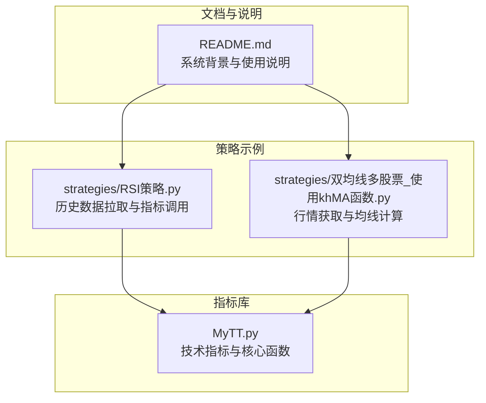
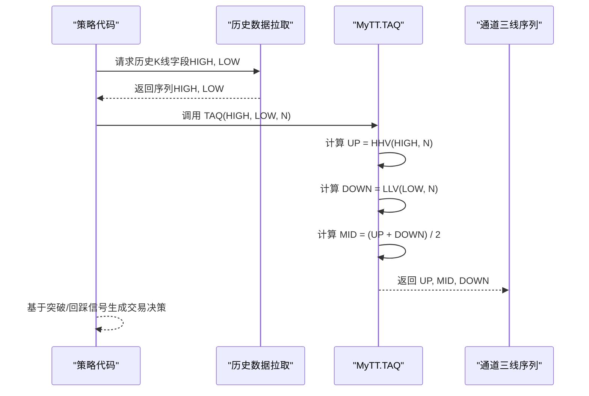
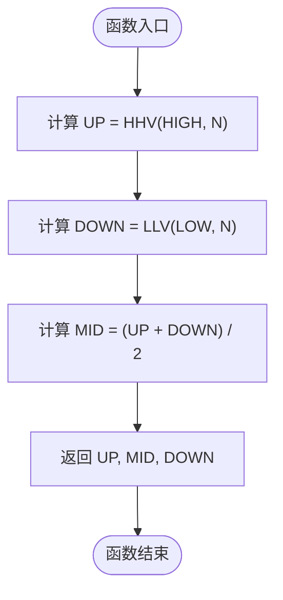
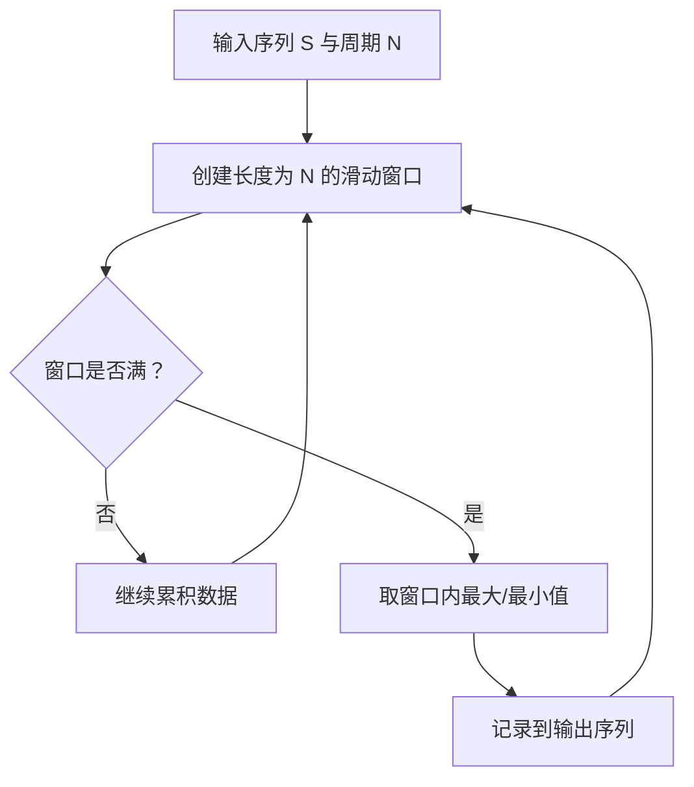
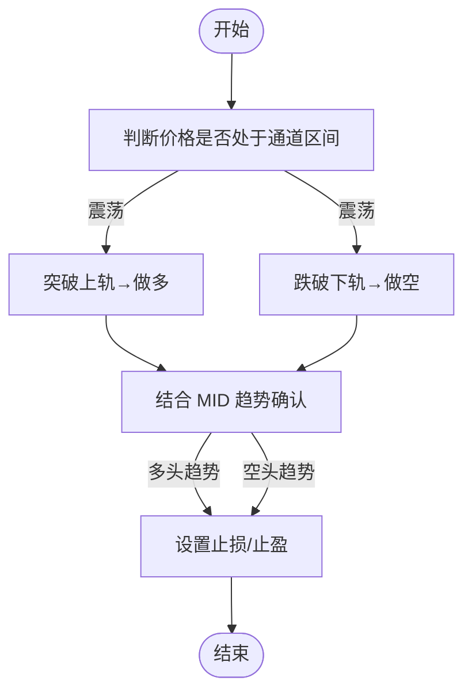
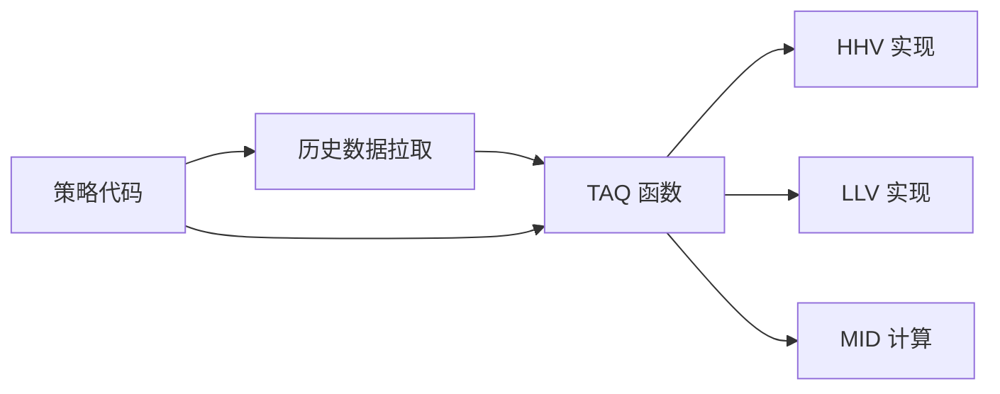

# 唐安奇通道 (TAQ)

<cite>
**本文引用的文件**
- [MyTT.py](file://MyTT.py)
- [README.md](file://README.md)
- [RSI策略.py](file://strategies/RSI策略.py)
- [双均线多股票_使用khMA函数.py](file://strategies/双均线多股票_使用khMA函数.py)
</cite>

## 目录
1. [简介](#简介)
2. [项目结构](#项目结构)
3. [核心组件](#核心组件)
4. [架构总览](#架构总览)
5. [详细组件分析](#详细组件分析)
6. [依赖关系分析](#依赖关系分析)
7. [性能与复杂度](#性能与复杂度)
8. [故障排查指南](#故障排查指南)
9. [结论](#结论)
10. [附录](#附录)

## 简介
本文件围绕“唐安奇通道（TAQ）”技术指标展开，系统阐述其基于N日最高价与最低价构建固定通道的原理与实现，重点说明：
- UP = HHV(HIGH, N) 与 DOWN = LLV(LOW, N) 的滚动窗口计算逻辑；
- 中线 MID = (UP + DOWN) / 2 的数学表达与趋势参考意义；
- 在区间震荡行情中的支撑/阻力识别作用；
- 突破策略中作为入场信号的应用场景；
- 通过代码片段路径展示 TAQ 函数的调用方式（如 TAQ(HIGH, LOW, 20)）；
- 结合A股K线图示例，演示价格突破上轨（UP）或跌破下轨（DOWN）的买卖决策；
- 强调其在趋势延续与反转判断中的局限性。

## 项目结构
本仓库提供一套面向A股的量化交易系统与指标库。与TAQ相关的核心实现位于指标库模块中，策略示例展示了如何在策略中拉取历史数据并调用指标函数。

**图表来源**
- [MyTT.py](file://MyTT.py#L1-L624)
- [RSI策略.py](file://strategies/RSI策略.py#L1-L26)
- [双均线多股票_使用khMA函数.py](file://strategies/双均线多股票_使用khMA函数.py#L1-L33)
- [README.md](file://README.md#L1-L200)

**章节来源**
- [MyTT.py](file://MyTT.py#L1-L624)
- [README.md](file://README.md#L1-L200)

## 核心组件
- TAQ 函数：接收最高价序列、最低价序列与周期N，返回上轨（UP）、中线（MID）、下轨（DOWN）三线序列。
- HHV/LLV：滚动窗口内的最高价与最低价序列，用于确定通道上下轨。
- MID：上下轨的算术平均，作为趋势参考与中枢。

上述组件共同构成固定通道的数学表达与实现基础。

**章节来源**
- [MyTT.py](file://MyTT.py#L277-L284)
- [MyTT.py](file://MyTT.py#L71-L76)
- [MyTT.py](file://MyTT.py#L426-L458)

## 架构总览
TAQ指标在策略中的典型调用流程如下：

**图表来源**
- [MyTT.py](file://MyTT.py#L277-L284)
- [MyTT.py](file://MyTT.py#L71-L76)
- [RSI策略.py](file://strategies/RSI策略.py#L12-L24)

## 详细组件分析

### TAQ 函数与通道三线
- 输入：最高价序列 HIGH、最低价序列 LOW、周期 N（整数）。
- 计算：
  - 上轨 UP：N周期内最高价序列（HHV(HIGH, N)）。
  - 下轨 DOWN：N周期内最低价序列（LLV(LOW, N)）。
  - 中线 MID：(UP + DOWN) / 2。
- 输出：三线序列（UP, MID, DOWN）。

**图表来源**
- [MyTT.py](file://MyTT.py#L277-L284)
- [MyTT.py](file://MyTT.py#L71-L76)

**章节来源**
- [MyTT.py](file://MyTT.py#L277-L284)

### HHV 与 LLV 的滚动窗口实现
- HHV：对长度为N的滚动窗口取最大值，得到每个位置的N日最高价序列。
- LLV：对长度为N的滚动窗口取最小值，得到每个位置的N日最低价序列。
- 复杂度：对长度为T的序列，单次滚动窗口计算为 O(T*N)；若N较小且T较大，可视为近似 O(T) 的线性扫描。

**图表来源**
- [MyTT.py](file://MyTT.py#L71-L76)
- [MyTT.py](file://MyTT.py#L426-L458)

**章节来源**
- [MyTT.py](file://MyTT.py#L71-L76)
- [MyTT.py](file://MyTT.py#L426-L458)

### 突破策略与买卖决策（基于通道三线）
- 区间震荡识别：当价格在 UP/DOWN 之间反复横跳，通道宽度反映波动区间。
- 入场信号：
  - 突破上轨（CLOSE 上穿 UP）：多头入场信号，结合 MID 作为趋势参考。
  - 跌破下轨（CLOSE 下穿 DOWN）：空头入场信号，结合 MID 作为趋势参考。
- 止损/止盈：可将 MID 作为止损位或趋势反转参考，或以通道宽度的倍数设定目标。
- 注意：在趋势行情中，突破可能伴随加速，需结合趋势强度指标（如DMI、MACD）过滤。

[本图为概念性流程示意，不直接映射具体源文件，故无图表来源]

### 代码片段路径（调用 TAQ）
- TAQ 函数定义与三线返回：[MyTT.py](file://MyTT.py#L277-L284)
- HHV/LLV 实现（滚动窗口）：[MyTT.py](file://MyTT.py#L71-L76), [MyTT.py](file://MyTT.py#L426-L458)
- 策略中拉取历史数据并调用指标的示例：[RSI策略.py](file://strategies/RSI策略.py#L12-L24)
- 行情获取与均线示例（同属指标调用范式）：[双均线多股票_使用khMA函数.py](file://strategies/双均线多股票_使用khMA函数.py#L12-L31)

**章节来源**
- [MyTT.py](file://MyTT.py#L277-L284)
- [MyTT.py](file://MyTT.py#L71-L76)
- [MyTT.py](file://MyTT.py#L426-L458)
- [RSI策略.py](file://strategies/RSI策略.py#L12-L24)
- [双均线多股票_使用khMA函数.py](file://strategies/双均线多股票_使用khMA函数.py#L12-L31)

## 依赖关系分析
- TAQ 依赖 HHV 与 LLV 计算 UP 与 DOWN，再由三线合成 MID。
- 策略侧通过历史数据拉取函数获取 HIGH/LOW，再调用 TAQ 得到通道三线。
- 与系统文档的关系：README 提供系统背景、数据来源与策略开发范式，为指标使用提供上下文。

**图表来源**
- [MyTT.py](file://MyTT.py#L277-L284)
- [MyTT.py](file://MyTT.py#L71-L76)
- [MyTT.py](file://MyTT.py#L426-L458)
- [RSI策略.py](file://strategies/RSI策略.py#L12-L24)

**章节来源**
- [MyTT.py](file://MyTT.py#L277-L284)
- [MyTT.py](file://MyTT.py#L71-L76)
- [MyTT.py](file://MyTT.py#L426-L458)
- [RSI策略.py](file://strategies/RSI策略.py#L12-L24)

## 性能与复杂度
- 计算复杂度：对长度为 T 的序列，HHV/LLV 的滚动窗口计算为 O(T*N)；当 N 固定时，整体近似 O(T)。
- 内存占用：输出三线序列，长度与输入一致，额外为滚动窗口缓存，内存约为 O(T+N)。
- 实践建议：
  - 选择合适的 N：N 过小易受噪声干扰，过大可能滞后；结合波动率与回测效果选择。
  - 与趋势指标结合：在趋势行情中，突破信号可能产生较大回撤，建议叠加趋势过滤（如 ADX、MACD 等）。

[本节为一般性性能讨论，不直接分析具体文件，故无章节来源]

## 故障排查指南
- 数据长度不足：若历史数据条数少于 N，可能导致通道三线出现 NaN 或异常。应确保拉取足够长的历史序列。
- 交易时间与数据一致性：策略应在交易时间内调用指标，避免非交易时段数据不一致导致的误判。
- 与系统文档对照：README 中有关于交易信号、日志与数据获取的说明，可据此核对策略实现。

**章节来源**
- [README.md](file://README.md#L1890-L1927)
- [README.md](file://README.md#L2098-L2121)

## 结论
- TAQ 通过固定周期的最高价与最低价构建通道，MID 作为中枢提供趋势参考；
- 在震荡行情中，通道三线可作为支撑/阻力识别工具；
- 突破上轨/跌破下轨可作为入场信号，但需结合趋势过滤与风险管理；
- 实际使用中应关注数据长度、交易时间与系统文档规范，确保策略稳健性。

[本节为总结性内容，不直接分析具体文件，故无章节来源]

## 附录
- 术语说明：
  - UP：通道上轨（N日最高价）
  - DOWN：通道下轨（N日最低价）
  - MID：通道中线（(UP + DOWN)/2）
- 参考实现与调用路径：
  - [MyTT.py](file://MyTT.py#L277-L284)
  - [MyTT.py](file://MyTT.py#L71-L76)
  - [MyTT.py](file://MyTT.py#L426-L458)
  - [RSI策略.py](file://strategies/RSI策略.py#L12-L24)
  - [双均线多股票_使用khMA函数.py](file://strategies/双均线多股票_使用khMA函数.py#L12-L31)