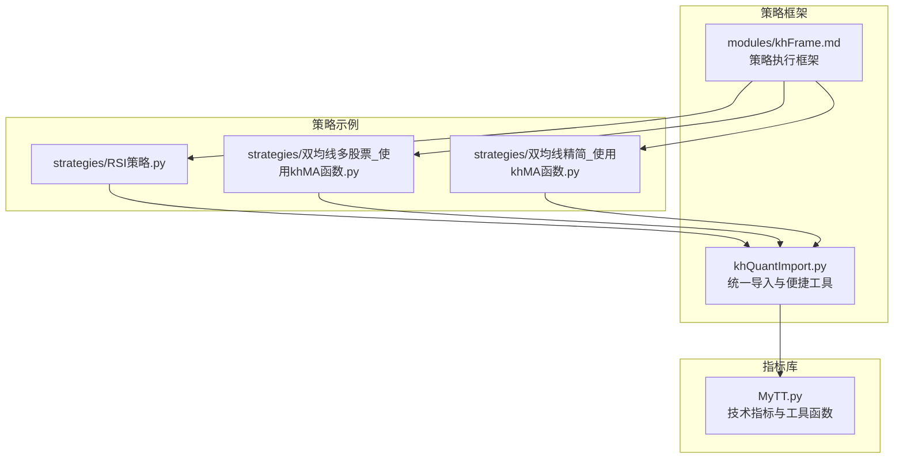
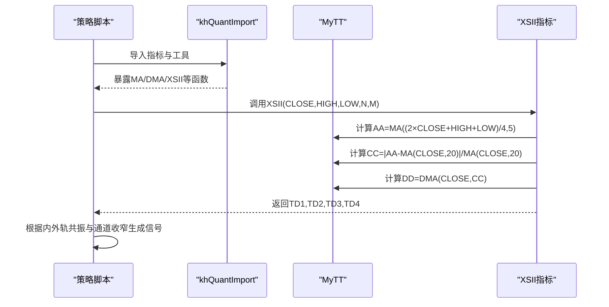
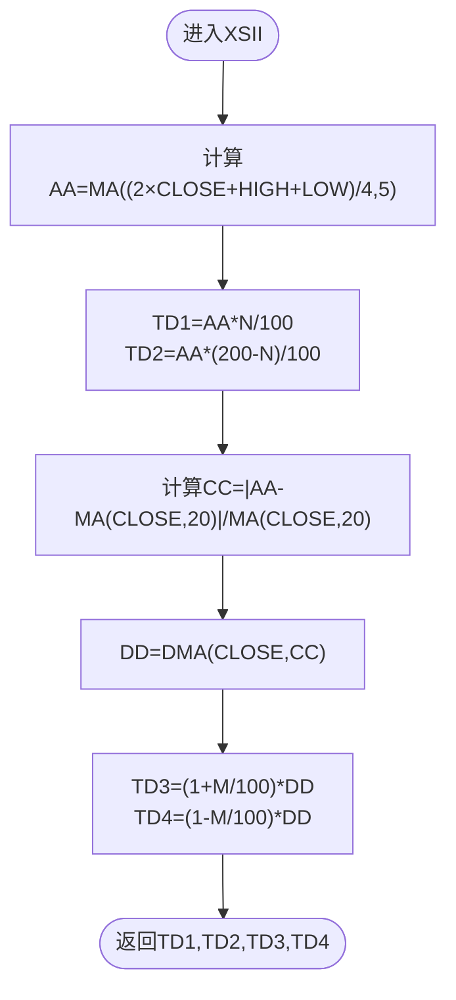
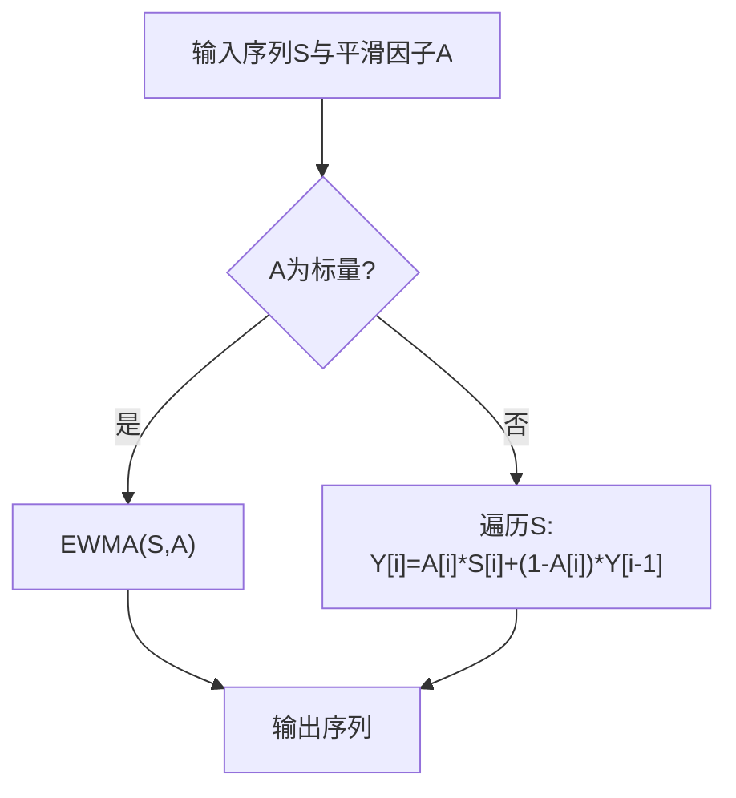
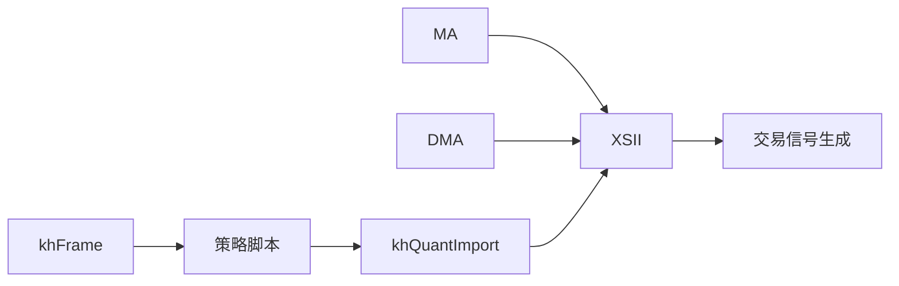

# 薛斯通道II (XSII)

<cite>
**本文引用的文件**
- [MyTT.py](file://MyTT.py)
- [khQuantImport.py](file://khQuantImport.py)
- [README.md](file://README.md)
- [modules/khFrame.md](file://modules/khFrame.md)
- [strategies/RSI策略.py](file://strategies/RSI策略.py)
- [strategies/双均线多股票_使用khMA函数.py](file://strategies/双均线多股票_使用khMA函数.py)
- [strategies/双均线精简_使用khMA函数.py](file://strategies/双均线精简_使用khMA函数.py)
</cite>

## 目录
1. [简介](#简介)
2. [项目结构](#项目结构)
3. [核心组件](#核心组件)
4. [架构总览](#架构总览)
5. [详细组件分析](#详细组件分析)
6. [依赖关系分析](#依赖关系分析)
7. [性能与实现特性](#性能与实现特性)
8. [参数配置与使用示例](#参数配置与使用示例)
9. [交易信号与共振策略](#交易信号与共振策略)
10. [故障排查](#故障排查)
11. [结论](#结论)

## 简介
本文件系统化阐述“薛斯通道II”（XSII）技术指标的双层自适应通道机制，面向A股波动行情场景，帮助用户理解并应用该通道在趋势跟踪与震荡识别中的双重优势。XSII通过两层轨道实现：
- 第一层轨道（TD1、TD2）：以加权均价AA = MA((2×CLOSE + HIGH + LOW)/4, 5)为中心，按N%与(200−N)%的比例偏移构建动态中枢区间；
- 第二层轨道（TD3、TD4）：以动态移动平均DD = DMA(CLOSE, CC)为基准，其中平滑因子CC由价格偏离度（与20日均线的相对偏差）决定，实现通道宽度随波动率自适应调整。

此外，文档还解释(1+M/100)与(1−M/100)比例因子对通道扩张与收缩的影响，并结合代码示例XSII(CLOSE, HIGH, LOW, 102, 7)说明参数含义与典型取值，最后给出内外轨共振与通道收窄判变的实战要点。

## 项目结构
XSII指标位于指标库模块中，配合统一导入模块与策略框架，可在策略中直接调用并参与信号生成。

**图表来源**
- [MyTT.py](file://MyTT.py#L409-L421)
- [khQuantImport.py](file://khQuantImport.py#L41-L68)
- [modules/khFrame.md](file://modules/khFrame.md#L59-L110)
- [strategies/RSI策略.py](file://strategies/RSI策略.py#L1-L26)
- [strategies/双均线多股票_使用khMA函数.py](file://strategies/双均线多股票_使用khMA函数.py#L1-L33)
- [strategies/双均线精简_使用khMA函数.py](file://strategies/双均线精简_使用khMA函数.py#L1-L31)

**章节来源**
- [MyTT.py](file://MyTT.py#L409-L421)
- [khQuantImport.py](file://khQuantImport.py#L41-L68)
- [modules/khFrame.md](file://modules/khFrame.md#L59-L110)

## 核心组件
- XSII指标函数：实现双层通道计算，返回TD1、TD2、TD3、TD4四条轨道。
- DMA动态移动平均：支持序列平滑因子，依据价格偏离度自适应调整平滑强度。
- MA移动平均：用于计算中枢与偏离度的基础平滑。
- 统一导入模块khQuantImport：将MyTT指标函数暴露到策略命名空间，便于策略直接调用。

**章节来源**
- [MyTT.py](file://MyTT.py#L409-L421)
- [MyTT.py](file://MyTT.py#L103-L111)
- [MyTT.py](file://MyTT.py#L87-L93)
- [khQuantImport.py](file://khQuantImport.py#L41-L68)

## 架构总览
XSII在策略中的典型调用路径如下：策略通过统一导入模块获取指标函数，按日线数据调用XSII，得到四条轨道，再结合内外轨共振与通道收窄等规则生成交易信号。

**图表来源**
- [khQuantImport.py](file://khQuantImport.py#L41-L68)
- [MyTT.py](file://MyTT.py#L409-L421)
- [MyTT.py](file://MyTT.py#L87-L93)
- [MyTT.py](file://MyTT.py#L103-L111)

## 详细组件分析

### XSII指标函数实现与双层通道机制
XSII的计算步骤如下：
- 计算中枢加权均价AA：以(2×收盘价 + 最高价 + 最低价)/4的5日移动平均作为中枢；
- 第一层轨道TD1、TD2：以AA为基准，按N%与(200−N)%的比例偏移，形成动态中枢区间；
- 计算价格偏离度CC：以AA与20日均线的相对偏差作为平滑因子CC；
- 计算动态移动平均DD：以CC为序列平滑因子，对收盘价进行动态平滑；
- 第二层轨道TD3、TD4：以DD为基准，按(1+M/100)与(1−M/100)的比例偏移，形成自适应通道宽度。

**图表来源**
- [MyTT.py](file://MyTT.py#L409-L421)
- [MyTT.py](file://MyTT.py#L87-L93)
- [MyTT.py](file://MyTT.py#L103-L111)

**章节来源**
- [MyTT.py](file://MyTT.py#L409-L421)

### DMA动态移动平均与自适应平滑
DMA函数支持两种输入：
- 标量平滑因子：等价于指数加权移动平均；
- 序列平滑因子：逐点递推，依据序列值动态调整平滑强度，从而实现对价格偏离度的自适应响应。

**图表来源**
- [MyTT.py](file://MyTT.py#L103-L111)

**章节来源**
- [MyTT.py](file://MyTT.py#L103-L111)

### MA移动平均与滚动窗口
MA函数采用滚动窗口计算，用于中枢与偏离度的基础平滑，确保XSII在不同周期下保持稳健。

**章节来源**
- [MyTT.py](file://MyTT.py#L87-L93)

### 统一导入与策略集成
khQuantImport将MyTT中的指标函数（如MA、DMA、XSII）统一暴露到策略命名空间，策略只需一行导入即可使用。

**章节来源**
- [khQuantImport.py](file://khQuantImport.py#L41-L68)

## 依赖关系分析
XSII依赖于MA与DMA两个基础函数，前者用于中枢与偏离度计算，后者用于动态平滑。khQuantImport将这些函数暴露给策略，策略框架在每次触发时将当前日线数据传入XSII，得到四条轨道。

**图表来源**
- [MyTT.py](file://MyTT.py#L87-L93)
- [MyTT.py](file://MyTT.py#L103-L111)
- [MyTT.py](file://MyTT.py#L409-L421)
- [khQuantImport.py](file://khQuantImport.py#L41-L68)
- [modules/khFrame.md](file://modules/khFrame.md#L144-L207)

**章节来源**
- [MyTT.py](file://MyTT.py#L87-L93)
- [MyTT.py](file://MyTT.py#L103-L111)
- [MyTT.py](file://MyTT.py#L409-L421)
- [khQuantImport.py](file://khQuantImport.py#L41-L68)
- [modules/khFrame.md](file://modules/khFrame.md#L144-L207)

## 性能与实现特性
- 计算复杂度：XSII涉及多次滚动窗口与序列递推，整体为线性复杂度，适合日线回测与实盘高频触发场景；
- 自适应性：通过CC与DMA实现通道宽度随价格偏离度自适应调整，提升在震荡与趋势中的鲁棒性；
- 参数稳定性：N与M的取值直接影响通道灵敏度与稳定性，建议在样本外进行参数寻优。

[本节为一般性说明，不直接分析具体文件]

## 参数配置与使用示例
- 参数说明
  - N：第一层轨道的偏移比例，决定中枢区间的上下边界；
  - M：第二层轨道的扩张/收缩比例，决定通道宽度随波动率的自适应幅度；
- 示例调用
  - XSII(CLOSE, HIGH, LOW, 102, 7)：N=102，M=7，适用于震荡偏强的A股行情，通道较窄但对中枢偏移敏感。

**章节来源**
- [MyTT.py](file://MyTT.py#L409-L421)

## 交易信号与共振策略
- 内外轨共振
  - 价格突破TD1且处于TD3之上：视为多头共振，信号强度较高；
  - 价格跌破TD2且处于TD4之下：视为空头共振，信号强度较高；
- 通道收窄判变
  - TD3与TD4间距缩小，且伴随成交量萎缩或背离信号，可能预示趋势转折；
  - TD1与TD2间距扩大，且价格持续在通道上沿或下沿运行，可能预示趋势延续。
- 实战要点
  - 结合RSI、MACD等其他指标进行一致性过滤，避免假突破；
  - 注意止损止盈设置，通道宽度随波动率变化，应动态调整风险敞口；
  - 在盘前/盘后回调中，结合趋势与成交量进行方向确认。

**章节来源**
- [strategies/RSI策略.py](file://strategies/RSI策略.py#L1-L26)
- [strategies/双均线多股票_使用khMA函数.py](file://strategies/双均线多股票_使用khMA函数.py#L1-L33)
- [strategies/双均线精简_使用khMA函数.py](file://strategies/双均线精简_使用khMA函数.py#L1-L31)
- [README.md](file://README.md#L1611-L1735)

## 故障排查
- 指标返回异常
  - 确认输入字段CLOSE/HIGH/LOW齐全且非空；
  - 检查MA与DMA的滚动窗口长度是否合理（如5日、20日）；
- 策略调用失败
  - 确认khQuantImport已正确导入指标函数；
  - 检查策略框架的触发频率与数据字段映射（tick/K线）；
- 信号无效
  - 核对内外轨共振条件与通道收窄判别逻辑；
  - 结合交易成本与滑点设置，评估信号净收益。

**章节来源**
- [khQuantImport.py](file://khQuantImport.py#L41-L68)
- [README.md](file://README.md#L1611-L1735)

## 结论
XSII通过双层通道与自适应平滑，兼顾中枢识别与波动率响应，适用于A股波动行情的多空判断与趋势跟踪。建议在策略中结合内外轨共振与通道收窄判变，并辅以其他指标与风控手段，以提升信号稳定性与胜率。

[本节为总结性内容，不直接分析具体文件]