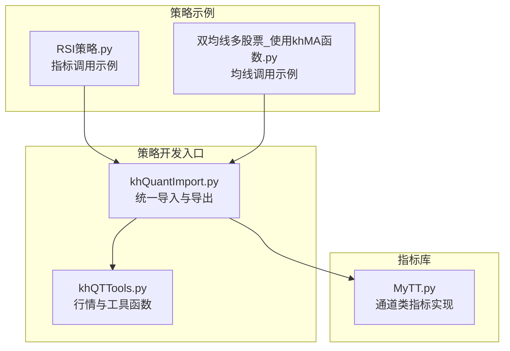
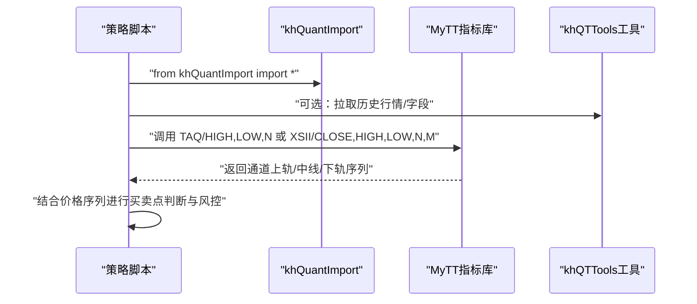
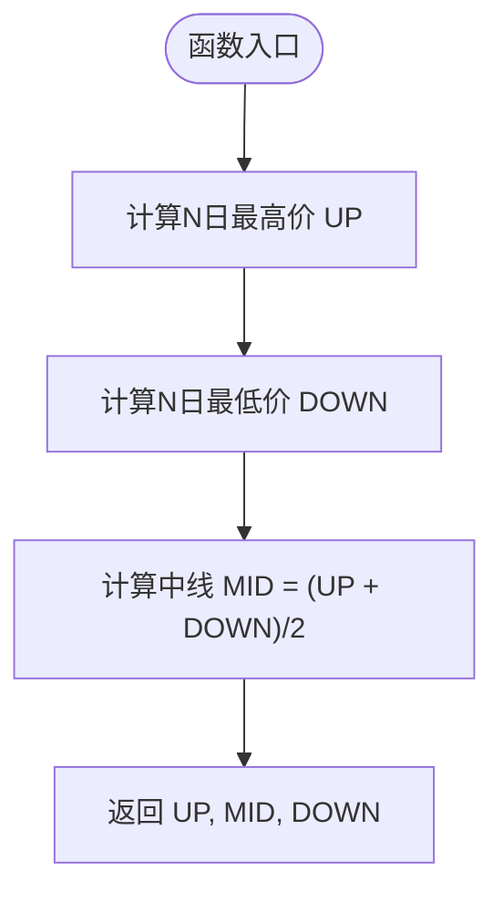
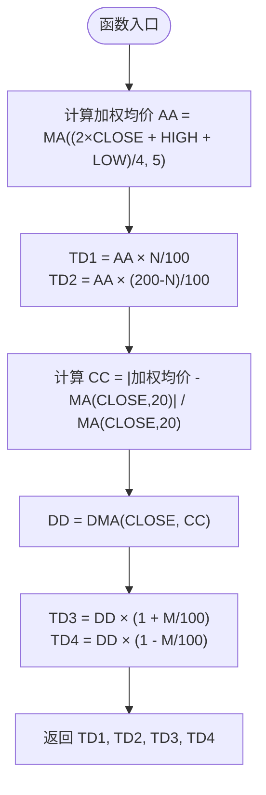
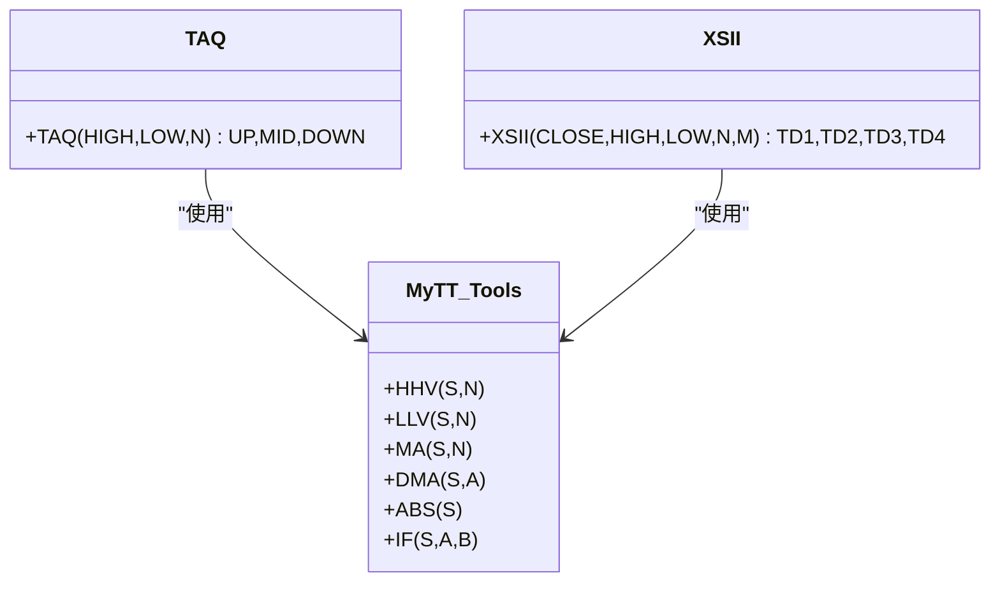
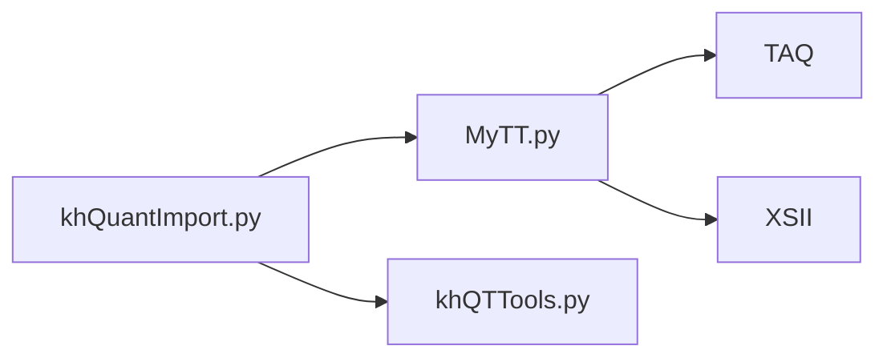

# 通道类指标

<cite>
**本文引用的文件**
- [MyTT.py](file://MyTT.py)
- [khQuantImport.py](file://khQuantImport.py)
- [khQTTools.py](file://khQTTools.py)
- [RSI策略.py](file://strategies/RSI策略.py)
- [双均线多股票_使用khMA函数.py](file://strategies/双均线多股票_使用khMA函数.py)
</cite>

## 目录
1. [简介](#简介)
2. [项目结构](#项目结构)
3. [核心组件](#核心组件)
4. [架构概览](#架构概览)
5. [详细组件分析](#详细组件分析)
6. [依赖分析](#依赖分析)
7. [性能考量](#性能考量)
8. [故障排查指南](#故障排查指南)
9. [结论](#结论)
10. [附录](#附录)

## 简介
本技术文档聚焦于通道类指标“唐安奇通道”（TAQ）与“薛斯通道II”（XSII）的构建逻辑与动态调整机制，面向A股实盘与回测场景，帮助读者理解其参数设置、调用方式以及在区间交易与突破策略中的应用方法。文档通过代码级分析与可视化图示，解释TAQ固定通道与XSII复合通道的计算步骤，并给出参数调优与风险控制建议。

## 项目结构
通道类指标位于指标库模块中，通过统一导入模块对外暴露，策略侧通过统一入口便捷调用。下图展示了与通道类指标相关的核心文件及其关系。

图表来源
- [MyTT.py](file://MyTT.py#L278-L422)
- [khQuantImport.py](file://khQuantImport.py#L41-L572)
- [khQTTools.py](file://khQTTools.py#L1-L200)
- [RSI策略.py](file://strategies/RSI策略.py#L1-L26)
- [双均线多股票_使用khMA函数.py](file://strategies/双均线多股票_使用khMA函数.py#L1-L33)

章节来源
- [MyTT.py](file://MyTT.py#L278-L422)
- [khQuantImport.py](file://khQuantImport.py#L41-L572)

## 核心组件
- 唐安奇通道（TAQ）
  - 输入：最高价（HIGH）、最低价（LOW）、周期N
  - 输出：UP（上轨）、MID（中线）、DOWN（下轨）
  - 构建逻辑：以N日最高价与N日最低价为基准，中线为两者平均，形成固定区间通道
- 薛斯通道II（XSII）
  - 输入：收盘价（CLOSE）、最高价（HIGH）、最低价（LOW）、参数N、M
  - 输出：TD1、TD2（第一层轨道）、TD3、TD4（第二层轨道）
  - 构建逻辑：第一层基于加权均价的百分比偏移；第二层以动态移动平均（DMA）与动态平滑因子（CC）实现自适应宽度

章节来源
- [MyTT.py](file://MyTT.py#L278-L422)

## 架构概览
通道类指标在框架中的调用链路如下：策略通过统一导入模块获取指标函数，策略侧按需拉取历史行情或直接传入字段序列，指标函数完成计算并返回通道上下轨与中线。

图表来源
- [khQuantImport.py](file://khQuantImport.py#L41-L572)
- [MyTT.py](file://MyTT.py#L278-L422)
- [khQTTools.py](file://khQTTools.py#L1-L200)

## 详细组件分析

### 唐安奇通道（TAQ）
- 计算步骤
  - 计算N日最高价（UP）与N日最低价（DOWN）
  - 中线（MID）为（UP + DOWN）/ 2
  - 形成固定区间通道：UP、MID、DOWN
- 参数与调用
  - 关键参数：N（周期）
  - 调用方式：传入HIGH、LOW与N，返回UP、MID、DOWN三轨
- 应用方法
  - 区间交易：价格在UP与DOWN之间震荡时，可采用高抛低吸策略；MID作为趋势参考，辅助判断多空方向
  - 突破策略：价格突破UP或DOWN时，结合趋势与成交量确认方向，顺势加仓
- 动态调整机制
  - 通道宽度由N决定，属于固定区间；可通过回测对比不同N值对策略稳定性与胜率的影响，选择最优参数

图表来源
- [MyTT.py](file://MyTT.py#L278-L284)

章节来源
- [MyTT.py](file://MyTT.py#L278-L284)

### 薛斯通道II（XSII）
- 计算步骤
  - 第一层轨道（TD1、TD2）
    - 以（2×CLOSE + HIGH + LOW）/ 4 的加权均价为中心，按N与（200-N）的百分比偏移得到TD1与TD2
  - 第二层轨道（TD3、TD4）
    - 计算价格偏离度CC：基于加权均价与20日均线的偏离程度
    - 以CC为动态平滑因子，对CLOSE做动态移动平均（DMA），得到DD
    - TD3、TD4分别在DD基础上按（1+M/100）与（1-M/100）偏移
- 参数与调用
  - 关键参数：N（第一层偏移比例）、M（第二层偏移比例）
  - 调用方式：传入CLOSE、HIGH、LOW与N、M，返回TD1、TD2、TD3、TD4四轨
- 应用方法
  - 区间交易：TD1与TD2构成第一层窄区间，TD3与TD4构成第二层宽区间，可用于分层加仓与止盈
  - 突破策略：当价格突破TD1或TD2时，结合TD3/4的宽度变化判断趋势强度与空间
- 动态调整机制
  - CC随价格偏离度变化而变化，DMA对CLOSE进行自适应平滑，使通道宽度随市场波动率动态收缩或扩张

图表来源
- [MyTT.py](file://MyTT.py#L410-L421)

章节来源
- [MyTT.py](file://MyTT.py#L410-L421)

### 类关系与依赖
- 指标函数依赖
  - TAQ依赖：HHV（N日最高）、LLV（N日最低）、中线计算
  - XSII依赖：MA（移动平均）、DMA（动态移动平均）、绝对值与百分比偏移
- 统一导入与导出
  - khQuantImport将MyTT与khQTTools的常用符号统一导出，策略侧可直接使用

图表来源
- [MyTT.py](file://MyTT.py#L71-L120)
- [MyTT.py](file://MyTT.py#L278-L422)

章节来源
- [MyTT.py](file://MyTT.py#L71-L120)
- [MyTT.py](file://MyTT.py#L278-L422)
- [khQuantImport.py](file://khQuantImport.py#L41-L572)

## 依赖分析
- 指标函数依赖关系
  - TAQ：HHV、LLV、中线计算
  - XSII：MA、DMA、绝对值、百分比偏移
- 统一导入模块
  - khQuantImport将指标函数与工具函数统一导出，策略侧无需逐个导入

图表来源
- [MyTT.py](file://MyTT.py#L278-L422)
- [khQuantImport.py](file://khQuantImport.py#L41-L572)

章节来源
- [MyTT.py](file://MyTT.py#L278-L422)
- [khQuantImport.py](file://khQuantImport.py#L41-L572)

## 性能考量
- 计算复杂度
  - TAQ：对HIGH与LOW分别进行滚动N日最值计算，时间复杂度约O(T×N)，空间复杂度O(T)
  - XSII：包含滚动MA、DMA与绝对值运算，整体复杂度约O(T×(N+1))，其中DMA在序列长度T上迭代
- 优化建议
  - 合理选择N与M：过小的N导致噪声放大，过大N降低灵敏度；M控制通道宽度自适应幅度
  - 使用pandas滚动窗口与向量化运算，避免显式循环
  - 在策略侧缓存历史序列，减少重复计算

## 故障排查指南
- 常见问题
  - 参数取值异常：确保N、M为合理范围；N应小于等于观察窗口，M为正数
  - 数据缺失：检查HIGH、LOW、CLOSE字段是否存在NaN或空值
  - 结果异常：核对MA与DMA的输入序列长度与平滑因子CC的取值范围
- 排查步骤
  - 分步验证：先单独验证MA、DMA、HHV、LLV的结果
  - 对比不同N/M组合：通过回测对比不同参数下的稳定性与收益
  - 可视化校验：将通道上下轨叠加到K线图上，观察突破与回踩情形

## 结论
TAQ与XSII分别代表两类典型通道设计：前者以固定区间捕捉震荡，后者以复合轨道与动态宽度适应趋势与波动。通过统一的指标库与策略入口，开发者可快速在A股行情上实现区间交易与突破策略，并结合中线与动态宽度进行风险控制与仓位管理。

## 附录
- 参数设置与调用示例（路径指引）
  - TAQ调用：参见 [MyTT.py](file://MyTT.py#L278-L284)
  - XSII调用：参见 [MyTT.py](file://MyTT.py#L410-L421)
  - 统一导入：参见 [khQuantImport.py](file://khQuantImport.py#L41-L572)
  - 策略侧指标调用示例（RSI）：参见 [RSI策略.py](file://strategies/RSI策略.py#L1-L26)
  - 策略侧均线调用示例（khMA）：参见 [双均线多股票_使用khMA函数.py](file://strategies/双均线多股票_使用khMA函数.py#L1-L33)