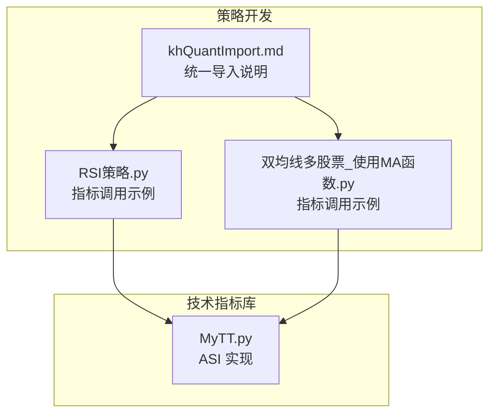
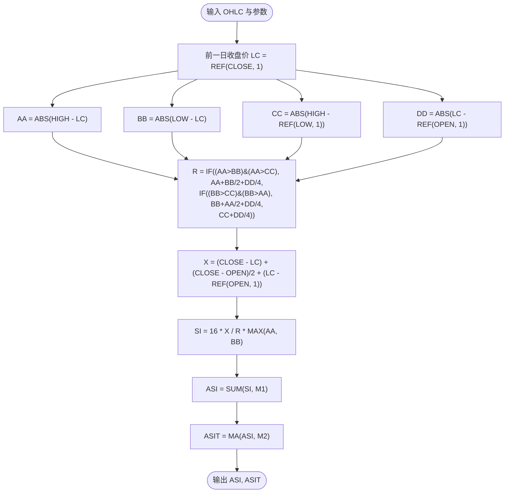
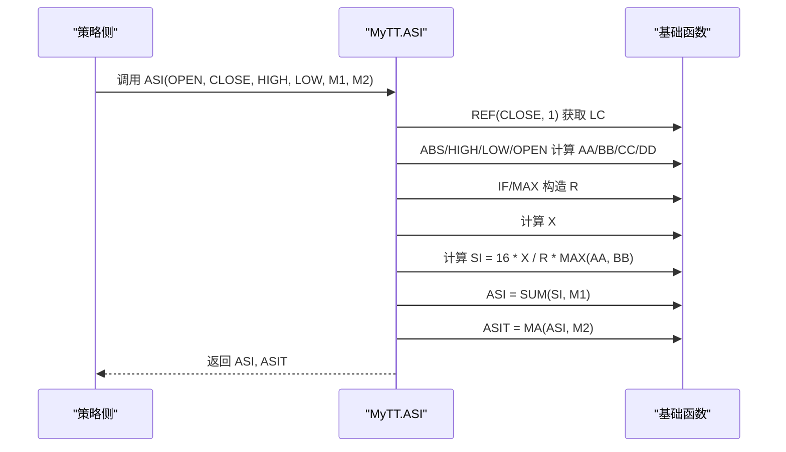
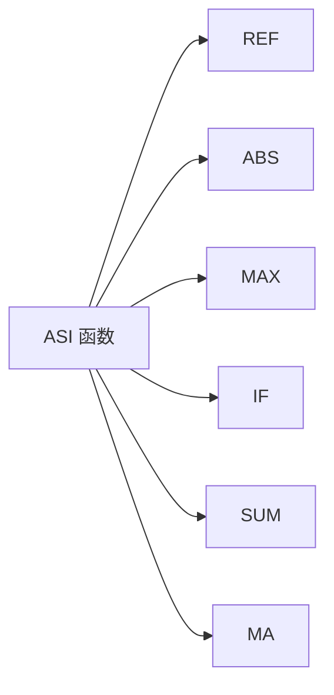

# 振动升降指标 (ASI)

<cite>
**本文引用的文件**
- [MyTT.py](file://MyTT.py)
- [khQuantImport.md](file://modules/khQuantImport.md)
- [RSI策略.py](file://strategies/RSI策略.py)
- [双均线多股票_使用MA函数.py](file://strategies/双均线多股票_使用MA函数.py)
</cite>

## 目录
1. [简介](#简介)
2. [项目结构](#项目结构)
3. [核心组件](#核心组件)
4. [架构总览](#架构总览)
5. [详细组件分析](#详细组件分析)
6. [依赖分析](#依赖分析)
7. [性能考量](#性能考量)
8. [故障排查指南](#故障排查指南)
9. [结论](#结论)
10. [附录](#附录)

## 简介
本专项文档聚焦于振动升降指标（ASI）在 MyTT 技术指标库中的实现与应用，系统性剖析 ASI(OPEN, CLOSE, HIGH, LOW, M1=26, M2=10) 的计算模型与信号逻辑，解释基准值 R 的多条件判断与对跳空的适应性处理，说明综合价格变动值 X 的构成原理，阐述单日振动值 SI 的计算过程与 M1 周期累计形成 ASI 的机制，以及 ASIT（移动平均线）作为信号线的作用。最后给出基于 ASI 的交易决策方法，包括突破、形态与背离的识别思路，并总结其在趋势确认与震荡过滤中的优势。

## 项目结构
- ASI 属于 MyTT 技术指标库的一部分，位于 MyTT.py 中，提供对日线 OHLC 数据的批量向量化计算。
- khQuantImport 提供统一导入入口，策略侧通过 from khQuantImport import * 即可直接使用 ASI 等指标函数。
- 示例策略展示了如何在策略中调用指标并生成交易信号，为 ASI 的实盘/回测应用提供参考。

**图表来源**
- [MyTT.py](file://MyTT.py#L391-L407)
- [khQuantImport.md](file://modules/khQuantImport.md#L1-L40)
- [RSI策略.py](file://strategies/RSI策略.py#L1-L26)
- [双均线多股票_使用MA函数.py](file://strategies/双均线多股票_使用MA函数.py#L1-L36)

**章节来源**
- [MyTT.py](file://MyTT.py#L391-L407)
- [khQuantImport.md](file://modules/khQuantImport.md#L1-L40)

## 核心组件
- ASI 函数：接收日线 OHLC 与周期参数，返回累计振动值 ASI 与其移动平均 ASIT。
- 基础工具函数：REF、ABS、MAX、IF、SUM、MA 等，用于序列运算与条件判断。
- 策略侧调用：通过 khQuantImport 统一导入后，在策略中直接调用 ASI 并结合信号生成函数。

**章节来源**
- [MyTT.py](file://MyTT.py#L391-L407)
- [MyTT.py](file://MyTT.py#L51-L69)
- [MyTT.py](file://MyTT.py#L87-L93)
- [MyTT.py](file://MyTT.py#L113-L115)
- [MyTT.py](file://MyTT.py#L165-L171)
- [MyTT.py](file://MyTT.py#L193-L200)
- [khQuantImport.md](file://modules/khQuantImport.md#L1-L40)

## 架构总览
ASI 的计算链路由“基准值 R 的多条件判断”“综合价格变动值 X 的构造”“单日振动值 SI 的计算”“M1 周期累计形成 ASI”“ASIT 作为信号线”五个关键环节组成，最终输出两条序列供策略使用。

**图表来源**
- [MyTT.py](file://MyTT.py#L391-L407)

## 详细组件分析

### ASI 函数的数学模型与信号逻辑
- 输入：日线 OHLC（开盘、收盘、最高、最低）与周期参数 M1、M2。
- 输出：ASI（累计振动值）、ASIT（ASI 的 M2 日移动平均，作为信号线）。
- 关键变量：
  - LC：前一日收盘价（REF(CLOSE, 1)）。
  - AA、BB、CC、DD：分别衡量当日最高/最低与前一日收盘价、前一日最低价与前一日开盘价等的绝对差异。
  - R：基准值，采用多条件判断，确保在不同波动环境下稳健归一。
  - X：综合价格变动值，融合当日收盘与开盘、前一日开盘与收盘的多维变动。
  - SI：单日振动值，受 R 归一与 MAX(AA, BB) 放大。
  - ASI：SI 的 M1 日累计，体现累积波动强度。
  - ASIT：对 ASI 的 M2 日移动平均，作为信号线，用于判定趋势方向与转折。

**图表来源**
- [MyTT.py](file://MyTT.py#L391-L407)
- [MyTT.py](file://MyTT.py#L51-L69)
- [MyTT.py](file://MyTT.py#L87-L93)
- [MyTT.py](file://MyTT.py#L113-L115)
- [MyTT.py](file://MyTT.py#L165-L171)
- [MyTT.py](file://MyTT.py#L193-L200)

**章节来源**
- [MyTT.py](file://MyTT.py#L391-L407)

### 基准值 R 的多条件判断与对跳空的适应性
- R 的计算采用三段式条件判断，优先选择最大绝对差对应的组合，兼顾前一日开盘与收盘的波动贡献（DD/4），从而在跳空与无跳空情形下均能稳健归一。
- 这种设计使 ASI 对跳空缺口具有更强的鲁棒性：即使当日出现跳空，R 仍能通过 MAX(AA, BB, CC) 与 DD 的组合，合理反映真实波动幅度，避免归一尺度过大或过小导致的信号失真。

**章节来源**
- [MyTT.py](file://MyTT.py#L391-L407)

### 综合价格变动值 X 的构成原理
- X 融合了三类价格变动：
  - 当日收盘与前一日收盘的差值；
  - 当日收盘与当日开盘的半权重差值；
  - 前一日收盘与前一日开盘的差值。
- 这种加权组合既强调当日收盘对趋势的主导作用，又兼顾开盘与前一日开盘的惯性影响，形成对多维价格变动的综合刻画。

**章节来源**
- [MyTT.py](file://MyTT.py#L391-L407)

### 单日振动值 SI 的计算与 M1 周期累计
- SI 通过 16 倍缩放、X/R 归一与 MAX(AA, BB) 放大，确保在不同波动区间内保持相对稳定的信号强度。
- ASI 为 SI 的 M1 日累计，体现一段时间内的累积波动强度。M1 的取值（默认 26）决定了对波动累积的敏感度与平滑度。

**章节来源**
- [MyTT.py](file://MyTT.py#L391-L407)

### ASIT（移动平均线）作为信号线
- ASIT 为 ASI 的 M2 日移动平均（默认 10），作为信号线用于趋势方向判断与转折识别。
- 策略可基于 ASIT 的斜率、交叉、背离等特征生成交易信号。

**章节来源**
- [MyTT.py](file://MyTT.py#L391-L407)

### 交易决策方法：突破、形态与背离
- 突破信号
  - ASI 向上穿越 ASIT 时，视为多头信号；向下穿越时，视为空头信号。
  - 可结合趋势过滤（如仅在 ASIT 同向时才入场）降低假突破概率。
- 形态信号
  - 利用 ASI 的局部高点/低点与价格走势的背离形态，识别潜在反转。
  - 例如：价格创新高但 ASI 不创新高，可能预示动能减弱。
- 背离信号
  - 价格与 ASI 的背离可作为趋势确认与反转预警的依据。
  - 配合 ASIT 斜率变化，提高信号可靠性。
- 趋势确认与震荡过滤
  - 在 ASIT 向上/向下趋势中使用 ASI，有助于过滤震荡行情中的噪声信号。
  - 可叠加其他过滤条件（如成交量、布林带等）进一步提升胜率。

**章节来源**
- [MyTT.py](file://MyTT.py#L391-L407)

### 在策略中的使用示例
- khQuantImport 提供统一导入，策略侧可直接使用 ASI 等指标。
- 示例策略展示了如何在 khHandlebar 中拉取历史 OHLC、调用指标并生成买卖信号，为 ASI 的策略集成提供参考。

**章节来源**
- [khQuantImport.md](file://modules/khQuantImport.md#L1-L40)
- [RSI策略.py](file://strategies/RSI策略.py#L1-L26)
- [双均线多股票_使用MA函数.py](file://strategies/双均线多股票_使用MA函数.py#L1-L36)

## 依赖分析
- ASI 依赖的基础函数包括：REF（获取前值）、ABS（绝对值）、MAX（最大值）、IF（条件判断）、SUM（滚动求和）、MA（移动平均）。
- 这些函数均为向量化实现，确保在日线 OHLC 序列上高效运行。

**图表来源**
- [MyTT.py](file://MyTT.py#L391-L407)
- [MyTT.py](file://MyTT.py#L51-L69)
- [MyTT.py](file://MyTT.py#L87-L93)
- [MyTT.py](file://MyTT.py#L113-L115)
- [MyTT.py](file://MyTT.py#L165-L171)
- [MyTT.py](file://MyTT.py#L193-L200)

**章节来源**
- [MyTT.py](file://MyTT.py#L391-L407)

## 性能考量
- 向量化实现：ASI 与基础函数均基于 NumPy/Pandas 的向量化运算，适合大规模日线数据的批量计算。
- 复杂度分析：ASI 的核心计算为 O(N)（N 为交易日数），其中包含若干 O(1) 的条件判断与算术运算，整体性能优良。
- 参数选择：M1 决定累积窗口长度，M2 决定信号线平滑度。增大 M1/M2 会提高平滑度但降低灵敏度；反之则更敏感但噪声更大。

[本节为一般性性能讨论，不直接分析具体文件]

## 故障排查指南
- 数据缺失或异常
  - 确保传入的 OHLC 序列长度足够，且无 NaN/无穷值，避免 SUM/MA/REF 等函数产生异常。
- 参数设置
  - M1、M2 的取值需结合回测周期与交易频率进行调优；过小易产生噪音，过大易滞后。
- 信号漂移
  - 若出现频繁假信号，可结合 ASIT 斜率或叠加其他过滤条件（如成交量、布林带）进行过滤。

[本节为一般性排查建议，不直接分析具体文件]

## 结论
ASI 通过基准值 R 的多条件判断与对跳空的适应性处理，结合综合价格变动值 X 的多维刻画，形成稳健的单日振动值 SI，并以 M1 累积与 M2 平滑生成 ASI 与 ASIT。策略侧可基于 ASIT 的突破、形态与背离信号进行趋势确认与震荡过滤，实现对波动强度与方向的综合把握。配合合理的参数与过滤条件，ASI 可作为趋势跟踪与震荡过滤的有力工具。

[本节为总结性内容，不直接分析具体文件]

## 附录
- 相关文件路径与行号（用于定位实现细节）
  - ASI 函数定义与实现：[MyTT.py](file://MyTT.py#L391-L407)
  - 基础函数（REF/ABS/MAX/IF/SUM/MA）：[MyTT.py](file://MyTT.py#L51-L69), [MyTT.py](file://MyTT.py#L87-L93), [MyTT.py](file://MyTT.py#L113-L115), [MyTT.py](file://MyTT.py#L165-L171), [MyTT.py](file://MyTT.py#L193-L200)
  - khQuantImport 统一导入说明：[khQuantImport.md](file://modules/khQuantImport.md#L1-L40)
  - 策略调用示例（RSI）：[RSI策略.py](file://strategies/RSI策略.py#L1-L26)
  - 策略调用示例（双均线）：[双均线多股票_使用MA函数.py](file://strategies/双均线多股票_使用MA函数.py#L1-L36)