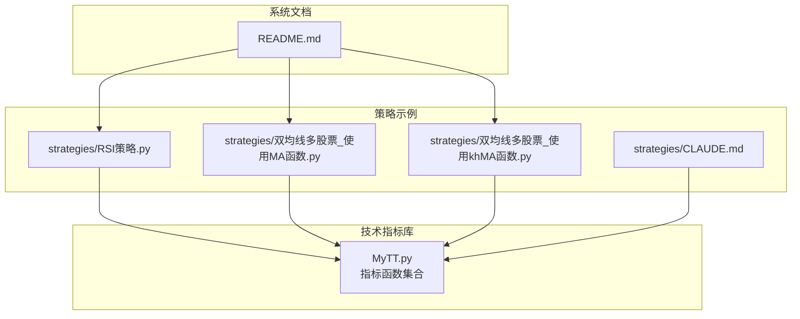
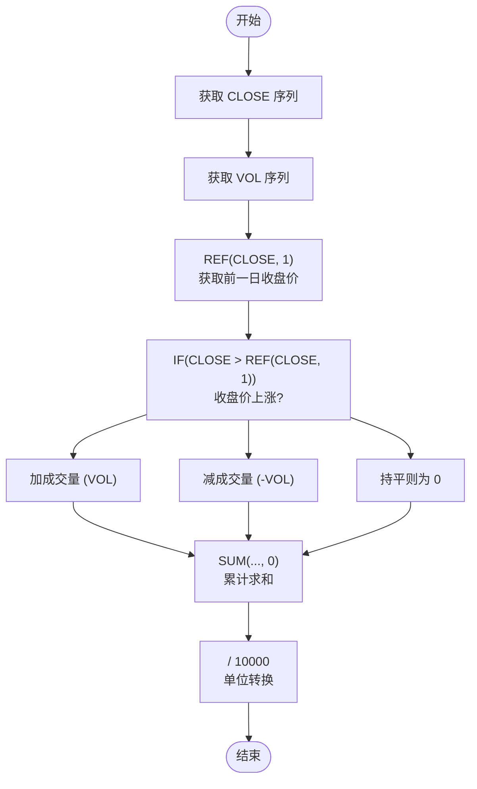
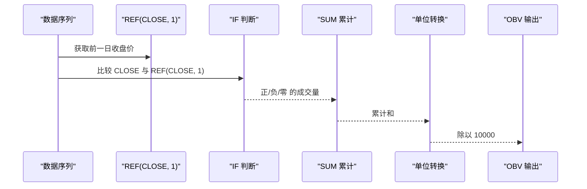
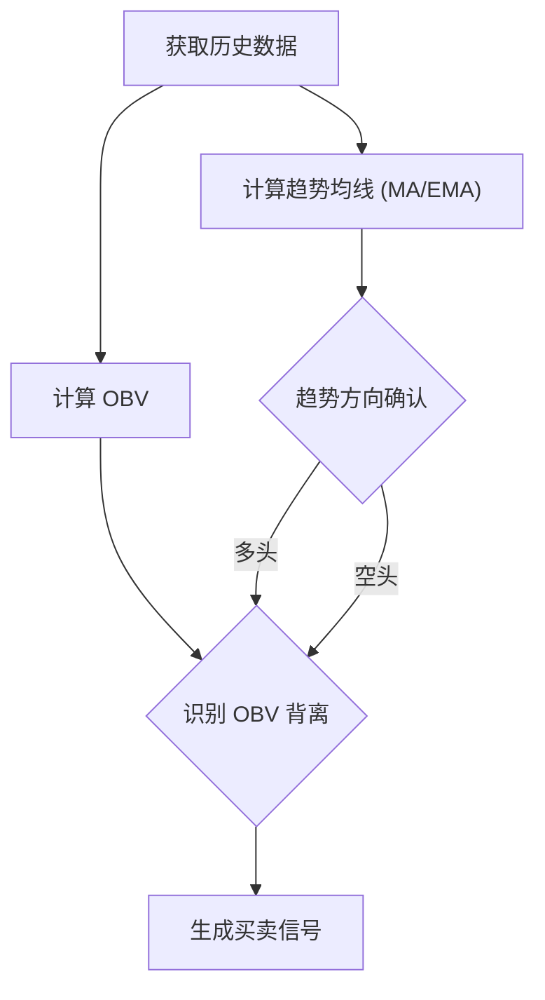
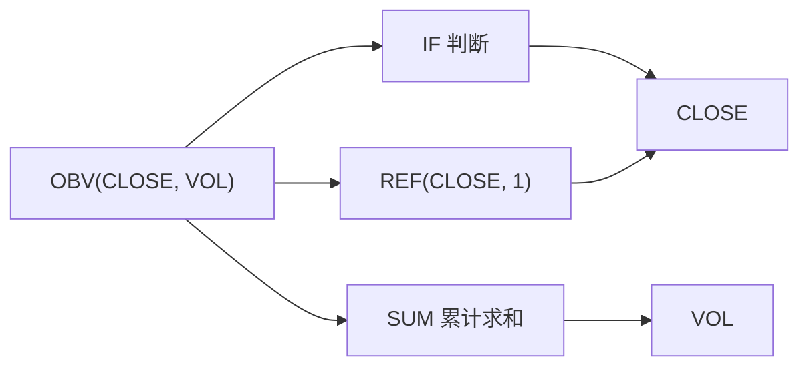

# 能量潮指标 (OBV)

<cite>
**本文引用的文件**
- [MyTT.py](file://MyTT.py)
- [README.md](file://README.md)
- [RSI策略.py](file://strategies/RSI策略.py)
- [双均线多股票_使用MA函数.py](file://strategies/双均线多股票_使用MA函数.py)
- [双均线多股票_使用khMA函数.py](file://strategies/双均线多股票_使用khMA函数.py)
- [CLAUDE.md](file://strategies/CLAUDE.md)
</cite>

## 目录
1. [简介](#简介)
2. [项目结构](#项目结构)
3. [核心组件](#核心组件)
4. [架构总览](#架构总览)
5. [详细组件分析](#详细组件分析)
6. [依赖分析](#依赖分析)
7. [性能考虑](#性能考虑)
8. [故障排查指南](#故障排查指南)
9. [结论](#结论)
10. [附录](#附录)

## 简介
本文件围绕能量潮指标（On-Balance Volume, OBV）展开，重点解析 MyTT.py 中 OBV(CLOSE, VOL) 的实现原理与使用方法。该指标通过将成交量与价格变动方向结合，累计资金流入与流出，从而反映市场主力行为。本文将系统阐述：
- CLOSE（收盘价）与 VOL（成交量）在 OBV 中的作用机制
- 当日收盘价高于/低于前一日时对成交量的加减逻辑
- OBV 曲线与价格走势背离在预示趋势反转中的意义
- 结合均线判断 OBV 信号的实战策略示例
- 在震荡市与趋势市中的表现差异与常见误判场景及应对方法

## 项目结构
本项目采用模块化设计，技术指标集中在 MyTT.py 中，策略示例位于 strategies 目录。与 OBV 直接相关的实现位于 MyTT.py 的指标函数区，策略示例展示了如何在回测框架中使用 MyTT 提供的指标函数。

**图表来源**
- [MyTT.py](file://MyTT.py#L377-L381)
- [RSI策略.py](file://strategies/RSI策略.py#L1-L26)
- [双均线多股票_使用MA函数.py](file://strategies/双均线多股票_使用MA函数.py#L18-L33)
- [双均线多股票_使用khMA函数.py](file://strategies/双均线多股票_使用khMA函数.py#L18-L33)
- [CLAUDE.md](file://strategies/CLAUDE.md#L193-L215)
- [README.md](file://README.md#L160-L176)

**章节来源**
- [MyTT.py](file://MyTT.py#L377-L381)
- [README.md](file://README.md#L160-L176)

## 核心组件
- OBV 指标函数：OBV(CLOSE, VOL)，基于收盘价与成交量的方向性累计，返回单位化后的 OBV 序列。
- 依赖函数：
  - REF(CLOSE, 1)：获取前一日收盘价，用于比较当日与前一日的涨跌。
  - IF 条件判断：根据涨跌决定对成交量的加或减。
  - SUM 累计求和：对每日的成交量符号化结果进行累计。
  - 单位转换：最终结果除以 10000，便于与价格在同一量级下观察。

上述组件在 MyTT.py 中以函数形式实现，形成“输入序列 → 条件判断 → 累计求和 → 单位转换”的处理链路。

**章节来源**
- [MyTT.py](file://MyTT.py#L51-L53)
- [MyTT.py](file://MyTT.py#L48-L48)
- [MyTT.py](file://MyTT.py#L63-L65)
- [MyTT.py](file://MyTT.py#L377-L381)

## 架构总览
下图展示了 OBV 的数据流与处理步骤，映射到 MyTT.py 中的具体实现。

**图表来源**
- [MyTT.py](file://MyTT.py#L377-L381)

## 详细组件分析

### OBV 实现原理与输入参数机制
- 输入参数
  - CLOSE：收盘价序列，用于判断当日涨跌。
  - VOL：成交量序列（单位为“手”），用于累计资金流入/流出。
- 核心逻辑
  - 比较当日 CLOSE 与前一日 CLOSE，决定当日成交量的符号：
    - 收盘价上涨：当日成交量计入（正）；
    - 收盘价下跌：当日成交量抵扣（负）；
    - 收盘价不变：当日成交量为 0。
  - 对每日符号化后的成交量进行累计求和，得到 OBV 序列。
  - 将累计结果除以 10000，进行单位转换，便于与价格在同一量级下观察。
- 输出
  - OBV 序列，长度与输入序列一致，首日为 0（无前一日收盘价对比）。

**图表来源**
- [MyTT.py](file://MyTT.py#L377-L381)

**章节来源**
- [MyTT.py](file://MyTT.py#L377-L381)

### OBV 与价格走势的背离意义
- 背离含义
  - 价格上涨但 OBV 下降：表明上涨缺乏成交量配合，可能为“假突破”，存在回调风险；
  - 价格下跌但 OBV 上升：表明下跌中存在资金承接，可能为“底部背离”，具备反弹动能。
- 实战启示
  - 结合趋势判断：在上升趋势中出现顶背离，应警惕见顶；在下降趋势中出现底背离，可考虑逢低吸纳。
  - 结合震荡区间：在震荡市中，背离信号更易出现，需结合其他信号过滤。

（本节为概念性说明，不直接分析具体文件）

### 结合均线判断 OBV 信号的实战策略示例
- 策略思路
  - OBV 与价格走势背离：当价格创新高而 OBV 未创新高（顶背离），或价格创新低而 OBV 未创新低（底背离）时，视为趋势反转信号。
  - 均线确认：以 MA 或 EMA 等均线作为趋势方向确认，仅在趋势方向与背离一致时才入场。
- 示例策略（基于框架 API 的思路）
  - 使用 MA/EMA 判断趋势方向；
  - 计算 OBV 与价格序列，识别背离；
  - 在趋势方向确认后，结合 OBV 背离发出买卖信号。
- 参考实现风格
  - 策略示例展示了如何在回测框架中拉取历史数据、计算指标、生成交易信号的流程，可借鉴其结构组织方式。

**图表来源**
- [双均线多股票_使用MA函数.py](file://strategies/双均线多股票_使用MA函数.py#L18-L33)
- [双均线多股票_使用khMA函数.py](file://strategies/双均线多股票_使用khMA函数.py#L18-L33)
- [CLAUDE.md](file://strategies/CLAUDE.md#L193-L215)

**章节来源**
- [双均线多股票_使用MA函数.py](file://strategies/双均线多股票_使用MA函数.py#L18-L33)
- [双均线多股票_使用khMA函数.py](file://strategies/双均线多股票_使用khMA函数.py#L18-L33)
- [CLAUDE.md](file://strategies/CLAUDE.md#L193-L215)

### OBV 在震荡市与趋势市中的表现差异
- 趋势市
  - OBV 通常与价格趋势保持一致，背离信号更可靠；
  - 在单边行情中，OBV 的累计方向与价格方向一致，可作为趋势确认工具。
- 震荡市
  - OBV 容易出现频繁背离，信号噪声较大；
  - 需要结合均线、通道或周期性指标进行过滤，降低误判概率。

（本节为概念性说明，不直接分析具体文件）

### 常见误判场景与应对方法
- 误判场景
  - 震荡行情中的频繁背离；
  - 突发消息面冲击导致的短期背离；
  - 价格与成交量背离但趋势未改变。
- 应对方法
  - 引入均线确认趋势方向；
  - 延长观察周期（如周线/月线）以过滤短期噪音；
  - 结合其他成交量指标（如 MFI、VR）进行交叉验证；
  - 控制仓位，避免在无趋势确认时重仓。

（本节为概念性说明，不直接分析具体文件）

## 依赖分析
OBV 的实现依赖于 MyTT.py 中的基础函数，形成如下依赖关系：

**图表来源**
- [MyTT.py](file://MyTT.py#L48-L48)
- [MyTT.py](file://MyTT.py#L51-L53)
- [MyTT.py](file://MyTT.py#L63-L65)
- [MyTT.py](file://MyTT.py#L377-L381)

**章节来源**
- [MyTT.py](file://MyTT.py#L48-L48)
- [MyTT.py](file://MyTT.py#L51-L53)
- [MyTT.py](file://MyTT.py#L63-L65)
- [MyTT.py](file://MyTT.py#L377-L381)

## 性能考虑
- 计算复杂度
  - OBV 的核心步骤为逐日比较与累计求和，时间复杂度为 O(N)，空间复杂度为 O(N)。
- 优化建议
  - 使用向量化运算（如 NumPy/Pandas）可显著提升性能；
  - 对于长周期回测，建议缓存中间结果（如 REF/CLOSE 的前值）以减少重复计算；
  - 在策略中批量计算多个标的时，尽量合并数据访问与指标计算，减少 I/O 与函数调用开销。

（本节为一般性建议，不直接分析具体文件）

## 故障排查指南
- 常见问题
  - OBV 输出异常为常数或全为 0：检查 CLOSE/VOL 是否存在 NaN 或缺失值；确认数据对齐与长度一致。
  - OBV 与价格走势不一致：确认是否正确使用 REF(CLOSE, 1) 进行前一日对比；检查单位转换是否遗漏。
  - 信号过于频繁：在震荡市中引入均线过滤或延长观察周期。
- 参考实现风格
  - 策略示例展示了如何在回测框架中拉取历史数据、计算指标、生成交易信号的流程，可据此对照排查。

**章节来源**
- [双均线多股票_使用MA函数.py](file://strategies/双均线多股票_使用MA函数.py#L18-L33)
- [CLAUDE.md](file://strategies/CLAUDE.md#L193-L215)

## 结论
OBV 通过将成交量与价格变动方向结合，提供了一种衡量资金流向的视角。在趋势市中，OBV 与价格趋势一致性较强，背离信号具有较高参考价值；在震荡市中，需结合均线与周期性指标进行过滤，以降低误判概率。MyTT.py 中的 OBV 实现简洁高效，依赖基础函数完成条件判断、累计求和与单位转换，易于在策略中集成与扩展。

## 附录
- 相关策略示例文件展示了如何在回测框架中使用 MyTT 指标函数，可作为 OBV 策略开发的参考模板。

**章节来源**
- [RSI策略.py](file://strategies/RSI策略.py#L1-L26)
- [README.md](file://README.md#L160-L176)