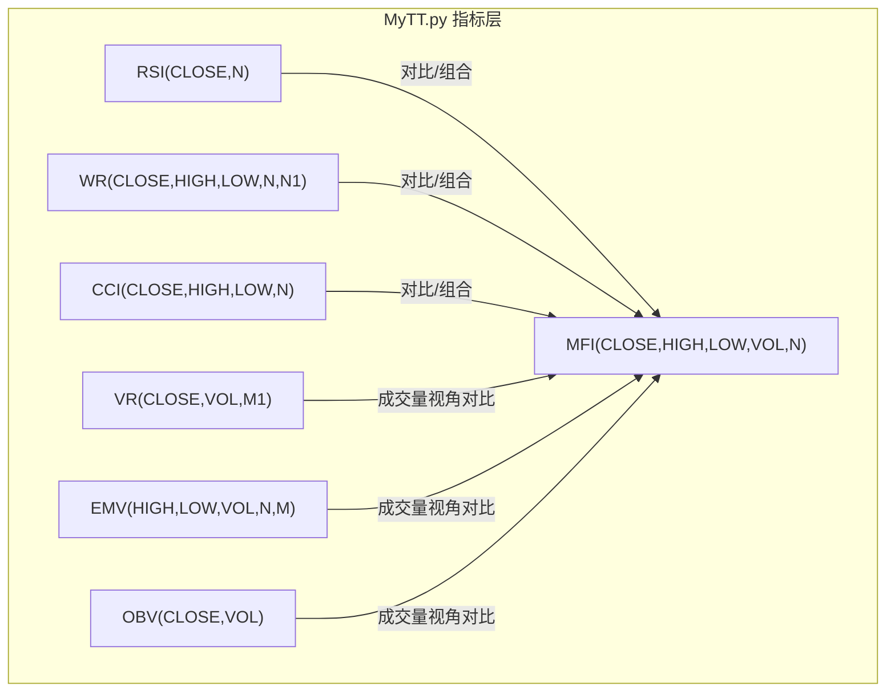
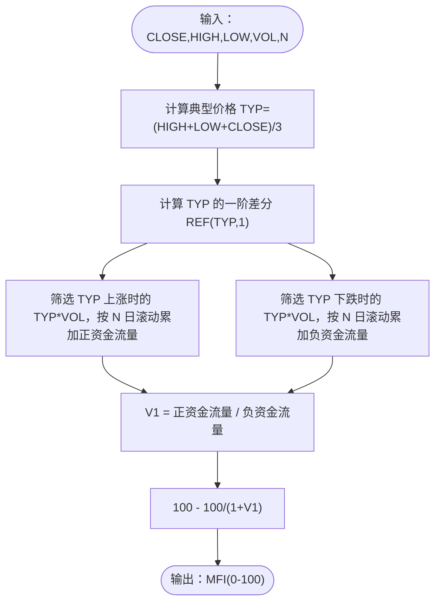
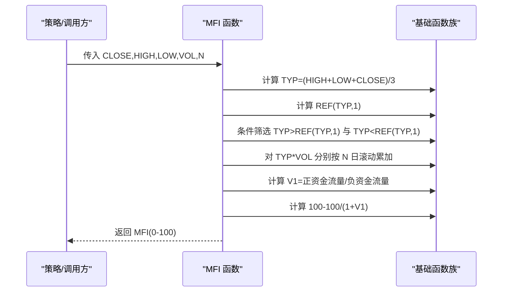
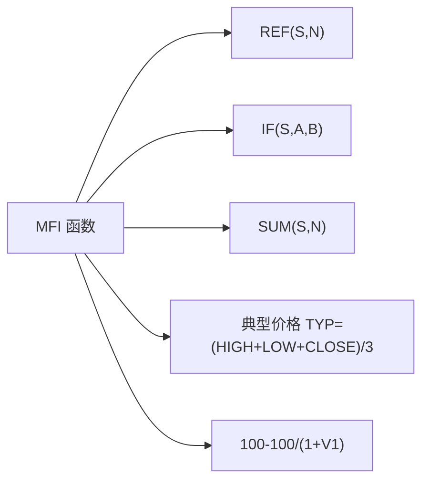

# 资金流量指标 (MFI)

<cite>
**本文引用的文件**
- [MyTT.py](file://MyTT.py)
- [README.md](file://README.md)
- [RSI策略.py](file://strategies/RSI策略.py)
- [CLAUDE.md](file://strategies/CLAUDE.md)
</cite>

## 目录
1. [简介](#简介)
2. [项目结构](#项目结构)
3. [核心组件](#核心组件)
4. [架构总览](#架构总览)
5. [详细组件分析](#详细组件分析)
6. [依赖分析](#依赖分析)
7. [性能考量](#性能考量)
8. [故障排查指南](#故障排查指南)
9. [结论](#结论)
10. [附录](#附录)

## 简介
本文件围绕 MyTT.py 中的 MFI(CLOSE, HIGH, LOW, VOL, N=14) 函数，系统化阐述资金流量指标（Money Flow Index, MFI）的实现与应用。MFI 被称为“成交量加权的 RSI”，其核心思想是将典型价格（Typical Price, TYP）作为衡量价格强度的标尺，并以成交量作为权重，分别累加“正资金流量”（价格上涨时的 TYP×VOL）与“负资金流量”（价格下跌时的 TYP×VOL），通过两者比率构造动量强度，再经由 100-100/(1+V1) 的变换映射到 0–100 区间，从而实现与 RSI 类似的超买/超卖判别。

本文件还对比 MFI 与 RSI 的异同，解释典型价格在资金流量判定中的作用，梳理正负资金流量的累加逻辑与最终指标值的归一化过程，给出超买（>80）与超卖（<20）的市场含义，并提供参数 N 的敏感度分析与不同交易周期下的参数优化建议。最后，结合仓库中的 RSI 策略示例，说明如何在策略中使用 MFI 与 RSI 进行对比与协同。

## 项目结构
MyTT.py 提供了大量技术指标与基础函数，MFI 位于“2级：技术指标函数（续，明确字段依赖）”区域，紧邻其他成交量/价量类指标（如 VR、EMV、OBV 等），并与 RSI、WR、CCI 等经典动量/超买超卖指标并列在同一层级，便于横向对比与组合使用。

**图表来源**
- [MyTT.py](file://MyTT.py#L211-L424)

**章节来源**
- [MyTT.py](file://MyTT.py#L211-L424)

## 核心组件
- MFI 函数：输入为日线字段 CLOSE、HIGH、LOW、VOL，周期 N 默认 14；典型价格 TYP=(HIGH+LOW+CLOSE)/3；正资金流量与负资金流量分别按 TYP 的涨跌与 TYP×VOL 累加，比率 V1 为正/负资金流量之比；最终指标值为 100-100/(1+V1)，映射到 0–100。
- 典型价格（TYP）：作为衡量当日价格强度的综合指标，既考虑了收盘价，又兼顾最高/最低价，从而在不依赖涨跌方向的前提下，提供更稳健的价格强度基准。
- 正/负资金流量累加：以 TYP 的涨跌为条件，分别对 TYP×VOL 进行 N 日滚动累加，形成“流入”与“流出”的资金量度。
- 比率转换：通过 100-100/(1+V1) 将 V1 映射到 0–100 区间，避免无穷大风险，且与 RSI 的 0–100 归一化一致，便于跨指标比较。

**章节来源**
- [MyTT.py](file://MyTT.py#L383-L389)

## 架构总览
MFI 的实现依赖于 MyTT 的基础函数族，包括：
- REF：获取历史值（如 REF(TYP,1)）
- IF：条件判断（正/负资金流量的筛选）
- SUM：滚动/累计求和（N 日窗口）
- 以及常用的数学与统计函数（MAX、ABS、MA、EMA 等，用于其他指标）

**图表来源**
- [MyTT.py](file://MyTT.py#L383-L389)

**章节来源**
- [MyTT.py](file://MyTT.py#L383-L389)

## 详细组件分析

### MFI 实现与数据流
- 输入字段与单位：CLOSE、HIGH、LOW、VOL（单位为“手”，1 手=100 股）。典型价格 TYP 采用三价均值，兼顾当日最高、最低与收盘价，避免单一价格点的噪声干扰。
- 正/负资金流量累加：以 TYP 的涨跌为分界，分别对 TYP×VOL 进行 N 日滚动累加。该设计将价格强度与成交量双重因素结合，使指标对“量价配合”的敏感度更高。
- 比率与归一化：V1 为正/负资金流量之比，100-100/(1+V1) 将其映射到 0–100，与 RSI 的 0–100 归一化一致，便于统一阈值与可视化。
- 边界与稳定性：当负资金流量接近 0 时，V1 趋向无穷大，100/(1+V1) 趋近 0，MFI 趋近 100；当正资金流量接近 0 时，V1 趋近 0，MFI 趋近 0。该变换天然避免了除零与无穷大问题。

**图表来源**
- [MyTT.py](file://MyTT.py#L383-L389)

**章节来源**
- [MyTT.py](file://MyTT.py#L383-L389)

### 典型价格（TYP）的作用
- 作为衡量当日价格强度的综合指标，TYP 将收盘价纳入考量，同时考虑当日最高/最低价，减少单一价格点的噪声影响，使资金流量的“方向性”判断更稳健。
- 在 MFI 中，TYP 与 VOL 相乘，形成“成交量加权的价格强度”，从而在不依赖涨跌方向的前提下，提供更稳健的资金流向度量。

**章节来源**
- [MyTT.py](file://MyTT.py#L383-L389)

### 正负资金流量的累加逻辑
- 正资金流量：当 TYP 上涨时，取 TYP×VOL 并按 N 日滚动累加，反映“主动买盘”对价格的推动。
- 负资金流量：当 TYP 下降时，取 TYP×VOL 并按 N 日滚动累加，反映“主动卖盘”对价格的压制。
- 比率 V1：正/负资金流量之比，体现“买盘强度/卖盘强度”的相对水平。
- 归一化：100-100/(1+V1)，将 V1 映射到 0–100，便于与 RSI 等指标统一阈值。

**章节来源**
- [MyTT.py](file://MyTT.py#L383-L389)

### 与 RSI 的异同
- 相同点：
  - 归一化到 0–100 区间，便于超买/超卖阈值统一。
  - 均采用 N 日滚动窗口，具备趋势平滑与周期敏感性。
- 不同点：
  - RSI 仅基于价格涨跌差分（CLOSE-REF(CLOSE,1)），衡量价格动量。
  - MFI 在 RSI 基础上引入成交量权重（TYP×VOL），强调“量价配合”的资金流向，对突破与反转的确认更具成交量维度的佐证。
- 在策略中，RSI 常见阈值为 30/70，MFI 可借鉴类似的 20/80 阈值，但需结合市场与周期进行校准。

**章节来源**
- [MyTT.py](file://MyTT.py#L211-L215)
- [MyTT.py](file://MyTT.py#L383-L389)
- [RSI策略.py](file://strategies/RSI策略.py#L1-L24)

### 超买/超卖区域的市场含义
- 超买（>80）：正资金流量显著超过负资金流量，表明短期内买盘主导，价格可能面临回调压力；适合谨慎做空或止盈。
- 超卖（<20）：负资金流量显著超过正资金流量，表明短期内卖盘主导，价格可能面临反弹动力；适合谨慎做多或止盈。
- 注意：阈值并非绝对，需结合价格趋势、成交量变化与市场情绪进行综合判断。

**章节来源**
- [MyTT.py](file://MyTT.py#L383-L389)

### 参数 N 的敏感度与周期优化建议
- N 越大：滚动窗口更长，MFI 更平滑，对短期噪音抑制更强，但对价格反转的反应更慢，适合中长线趋势跟踪。
- N 越小：滚动窗口更短，MFI 更敏感，对短期反转更灵敏，但易受噪音干扰，适合短线震荡策略。
- 不同周期建议：
  - 日线：N=14（与 RSI 常用周期一致），兼顾趋势与震荡。
  - 周线/月线：N=20–26，更偏向趋势确认。
  - 分钟/小时线：N=5–10，更偏向短期动量捕捉。
- 建议在策略回测中对 N 进行网格搜索，结合最大回撤、夏普比率等指标选择最优参数。

**章节来源**
- [MyTT.py](file://MyTT.py#L383-L389)

### 与成交量类指标的对比
- VR（容量比率）：仅基于成交量的涨跌分组，不引入典型价格，更偏向“量能强弱”的判断。
- EMV（简易波动指标）：引入价幅变动与成交量的交互，强调价格波动与成交量的匹配。
- OBV（能量潮指标）：累计成交量的方向性，强调资金净流入/流出的累积效应。
- MFI：在上述基础上，引入典型价格与成交量的乘积，形成“成交量加权的价格强度”，在不依赖涨跌方向的前提下，提供更稳健的资金流向度量。

**章节来源**
- [MyTT.py](file://MyTT.py#L305-L323)
- [MyTT.py](file://MyTT.py#L377-L381)
- [MyTT.py](file://MyTT.py#L317-L323)

### 与 RSI 策略的结合
- 仓库中的 RSI 策略示例展示了在日线周期下使用 RSI(14) 的超买超卖交易信号生成方式（阈值 30/70）。MFI 可以作为同一周期下的补充指标，用于：
  - 验证 RSI 信号的成交量配合度（如 RSI 超买/超卖时，MFI 是否同步呈现相反/一致的信号）。
  - 在 RSI 信号稀疏时，以 MFI 的 20/80 阈值作为辅助入场/出场信号。
- 策略中可将 MFI 与 RSI 组合，形成“价量双因子”的信号过滤，降低误判概率。

**章节来源**
- [RSI策略.py](file://strategies/RSI策略.py#L1-L24)
- [CLAUDE.md](file://strategies/CLAUDE.md#L1-L37)

## 依赖分析
MFI 的实现依赖于 MyTT 的基础函数族，包括 REF、IF、SUM 等，这些函数在 MyTT.py 的“0级：核心工具函数（适配日线数据字段）”与“1级：应用层函数（直接适配日线字段）”中均有定义，体现了良好的模块化与低耦合设计。

**图表来源**
- [MyTT.py](file://MyTT.py#L383-L389)

**章节来源**
- [MyTT.py](file://MyTT.py#L383-L389)

## 性能考量
- 计算复杂度：MFI 的核心计算为 N 日滚动窗口内的条件筛选与累加，时间复杂度约为 O(T×N)，其中 T 为交易日数量；空间复杂度与序列长度线性相关。
- 优化建议：
  - 使用滚动窗口（rolling）与向量化运算（pandas/numpy）以提升性能。
  - 在策略回测中，尽量复用已计算的中间变量（如 TYP、REF(TYP,1)），避免重复计算。
  - 对于高频数据（分钟/小时），可考虑分批计算或缓存中间结果，以降低内存占用。

[本节为通用性能建议，不直接分析具体文件，故无章节来源]

## 故障排查指南
- 输入字段缺失或单位不一致：确保传入 CLOSE、HIGH、LOW、VOL 字段齐全，且 VOL 单位为“手”。单位不一致会导致资金流量计算偏移。
- N 设置过小导致噪声放大：在震荡市场中，过小的 N 会使 MFI 波动剧烈，建议适当增大 N 或叠加平滑。
- 超买/超卖阈值不适用：不同市场与周期下，阈值需校准。可结合历史数据回测，寻找最优阈值（如 20/80 的变体）。
- 与 RSI 的阈值混淆：RSI 常用 30/70，MFI 常用 20/80，二者阈值不同，需分别设置与验证。

**章节来源**
- [MyTT.py](file://MyTT.py#L383-L389)
- [RSI策略.py](file://strategies/RSI策略.py#L1-L24)

## 结论
MFI 通过将典型价格与成交量相乘，形成“成交量加权的价格强度”，并在 N 日滚动窗口内分别累加正/负资金流量，以比率形式反映资金流向的相对强弱，并通过 100-100/(1+V1) 归一化到 0–100 区间。相较 RSI，MFI 更强调成交量维度的确认，适合在趋势跟踪与震荡策略中作为价量双因子的补充。参数 N 的选择直接影响指标的敏感度与稳定性，应结合周期与市场特性进行优化。在策略层面，可将 MFI 与 RSI 结合使用，以提升信号的稳健性与胜率。

[本节为总结性内容，不直接分析具体文件，故无章节来源]

## 附录
- 参考资料与背景：KHQuant 项目 README 中对系统定位、数据依赖与回测功能的说明，有助于理解指标在回测环境中的使用方式与数据来源。

**章节来源**
- [README.md](file://README.md#L1-L120)