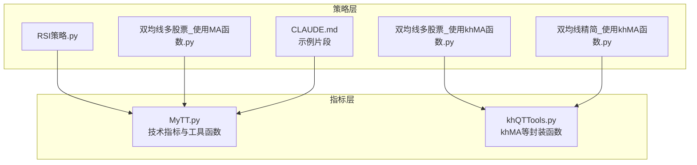
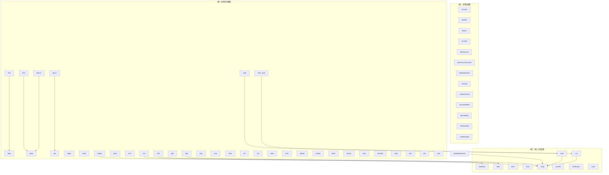
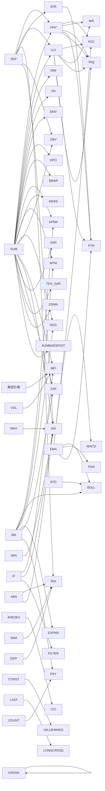
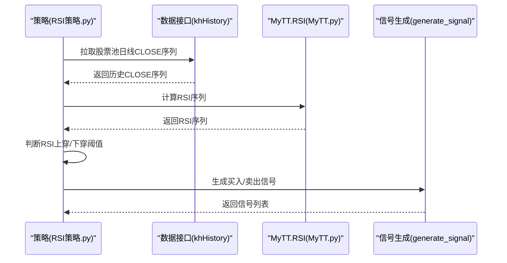

# 技术指标库

<cite>
**本文引用的文件**
- [MyTT.py](file://MyTT.py)
- [khQTTools.py](file://khQTTools.py)
- [RSI策略.py](file://strategies/RSI策略.py)
- [双均线多股票_使用MA函数.py](file://strategies/双均线多股票_使用MA函数.py)
- [双均线多股票_使用khMA函数.py](file://strategies/双均线多股票_使用khMA函数.py)
- [双均线精简_使用khMA函数.py](file://strategies/双均线精简_使用khMA函数.py)
- [CLAUDE.md](file://strategies/CLAUDE.md)
</cite>

## 目录
1. [简介](#简介)
2. [项目结构](#项目结构)
3. [核心组件](#核心组件)
4. [架构总览](#架构总览)
5. [详细组件分析](#详细组件分析)
6. [依赖分析](#依赖分析)
7. [性能考量](#性能考量)
8. [故障排查指南](#故障排查指南)
9. [结论](#结论)
10. [附录](#附录)

## 简介
本文件面向“看海量化交易系统”（KHQuant）的指标库，系统性梳理并说明 MyTT.py 中包含的技术分析函数，涵盖基础工具函数与技术指标函数两大层级。文档重点解释每个指标的输入参数、返回值、典型应用场景与在量化策略中的使用方式，并对比 khQTTools.py 中 khMA 等函数与 MyTT.MA 的差异与关系，最后提供基于这些指标构建策略的实践示例与参考路径。

## 项目结构
- MyTT.py：提供基础工具函数与技术指标函数，统一以日线字段命名（CLOSE、HIGH、LOW、OPEN、VOL、REF_CLOSE），并以 NumPy/Pandas 实现高效向量化计算。
- khQTTools.py：提供 khMA 等封装函数，内置行情获取与均线计算，简化策略侧数据拉取与精度处理。
- 策略示例：包含使用 MyTT 与 khMA 的多策略示例，展示指标在回测中的调用方式与信号生成。

**图表来源**
- [MyTT.py](file://MyTT.py#L1-L624)
- [khQTTools.py](file://khQTTools.py#L491-L540)
- [RSI策略.py](file://strategies/RSI策略.py#L1-L26)
- [双均线多股票_使用MA函数.py](file://strategies/双均线多股票_使用MA函数.py#L1-L36)
- [双均线多股票_使用khMA函数.py](file://strategies/双均线多股票_使用khMA函数.py#L1-L33)
- [双均线精简_使用khMA函数.py](file://strategies/双均线精简_使用khMA函数.py#L1-L31)
- [CLAUDE.md](file://strategies/CLAUDE.md#L193-L216)

**章节来源**
- [MyTT.py](file://MyTT.py#L1-L624)
- [khQTTools.py](file://khQTTools.py#L491-L540)
- [RSI策略.py](file://strategies/RSI策略.py#L1-L26)
- [双均线多股票_使用MA函数.py](file://strategies/双均线多股票_使用MA函数.py#L1-L36)
- [双均线多股票_使用khMA函数.py](file://strategies/双均线多股票_使用khMA函数.py#L1-L33)
- [双均线精简_使用khMA函数.py](file://strategies/双均线精简_使用khMA函数.py#L1-L31)
- [CLAUDE.md](file://strategies/CLAUDE.md#L193-L216)

## 核心组件
- 基础工具函数（0级）：提供序列运算、统计与布尔判断等通用能力，如 REF、SUM、HHV、LLV、DIFF、STD、AVEDEV、SLOPE、FORCAST、LAST 等。
- 应用层函数（1级）：基于0级函数构建条件判断与周期统计，如 COUNT、EVERY、EXIST、FILTER、BARSLAST、BARSLASTCOUNT、BARSSINCEN、CROSS、LONGCROSS、VALUEWHEN、BETWEEN、TOPRANGE、LOWRANGE 等。
- 技术指标函数（2级）：面向日线字段的成熟指标，如 MA、EMA、SMA、WMA、DMA、DSMA、RSI、KDJ、MACD、BOLL、BIAS、PSY、CCI、ATR、BBI、DMI、TAQ、KTN、TRIX、VR、CR、EMV、DPO、BRAR、DFMA、MTM、MASS、ROC、EXPMA、OBV、MFI、ASI、XSII、SAR、TDX_SAR 等。
- 动态扩展函数：支持动态周期的 HHV/LLV、SUMBARSFAST、DSMA 等。

**章节来源**
- [MyTT.py](file://MyTT.py#L1-L624)

## 架构总览
MyTT 的函数分层清晰：0级工具函数提供原子能力，1级应用函数组合0级函数实现条件与周期统计，2级技术指标函数直接依赖日线字段并组合0/1级函数实现成熟指标。khMA 则在 khQTTools 中封装了行情获取与均线计算，策略侧可直接调用，无需自行拉取历史数据。

**图表来源**
- [MyTT.py](file://MyTT.py#L1-L624)

## 详细组件分析

### 基础工具函数（0级）
- REF(S, N=1)：序列后移N位，获取历史值，如 REF(CLOSE,1) 为昨收价。
- SUM(S, N)：N日累计和；N=0为累计求和。
- HHV(S, N)、LLV(S, N)：N日最高/最低价；支持动态周期（N为序列）。
- DIFF(S, N=1)：序列差分（前值-后值）。
- STD(S, N)：N日标准差。
- AVEDEV(S, N)：N日平均绝对偏差。
- SLOPE(S, N)：N日线性回归斜率。
- FORCAST(S, N)：N日线性回归预测值。
- LAST(S, A, B)：A到B日前持续满足条件。
- CONST(S)：序列末尾值扩展为等长常量。
- IF(S, A, B)：布尔判断（S为真返回A，否则B）。
- MAX(S1, S2)、MIN(S1, S2)：序列最大/最小值。
- ABS(S)、LN(S)、POW(S, N)、SQRT(S)、SIN(S)、COS(S)、TAN(S)：基础数学函数。
- RD(N, D=3)：四舍五入取D位小数。

典型应用
- 用于构建条件判断（如 CROSS、LONGCROSS）、周期统计（如 COUNT、BARSLAST）、序列变换（如 DIFF、STD）。

**章节来源**
- [MyTT.py](file://MyTT.py#L1-L120)
- [MyTT.py](file://MyTT.py#L424-L458)

### 应用层函数（1级）
- COUNT(S, N)：N日内满足条件的天数。
- EVERY(S, N)：N日内全部满足条件。
- EXIST(S, N)：N日内存在满足条件。
- FILTER(S, N)：条件成立后屏蔽后续N周期。
- BARSLAST(S)：上一次条件成立到当前的周期数。
- BARSLASTCOUNT(S)：连续满足条件的周期数。
- BARSSINCEN(S, N)：N周期内首次满足条件到现在的周期数。
- CROSS(S1, S2)：向上金叉。
- LONGCROSS(S1, S2, N)：持续N周期后交叉。
- VALUEWHEN(S, X)：条件成立时记录X值。
- BETWEEN(S, A, B)：S在A和B之间。
- TOPRANGE(S)、LOWRANGE(S)：当前值为近多少周期内的最大/最小值。

典型应用
- 用于信号过滤、条件成立后的记忆与延后处理、趋势持续性判断等。

**章节来源**
- [MyTT.py](file://MyTT.py#L129-L191)

### 技术指标函数（2级）
以下为常用指标的输入、返回与典型用途说明（以 MyTT.py 中实现为准）：

- MA(S, N)
  - 输入：S（序列，如 CLOSE）、N（周期）
  - 返回：N日简单移动平均
  - 典型用途：趋势判断、金叉死叉信号
  - 参考路径：[MyTT.py](file://MyTT.py#L87-L89)

- EMA(S, N)
  - 输入：S（序列）、N（周期）
  - 返回：N日指数移动平均
  - 典型用途：快速趋势跟踪、MACD基础
  - 参考路径：[MyTT.py](file://MyTT.py#L91-L93)

- SMA(S, N, M=1)
  - 输入：S（序列）、N（平滑周期）、M（权重）
  - 返回：中国式SMA（用于KDJ平滑）
  - 典型用途：KDJ计算中的平滑
  - 参考路径：[MyTT.py](file://MyTT.py#L95-L97)

- WMA(S, N)
  - 输入：S（序列）、N（周期）
  - 返回：加权移动平均
  - 典型用途：时间加权均线
  - 参考路径：[MyTT.py](file://MyTT.py#L99-L101)

- DMA(S, A)
  - 输入：S（序列）、A（平滑因子，支持序列）
  - 返回：动态移动平均
  - 典型用途：自适应平滑均线
  - 参考路径：[MyTT.py](file://MyTT.py#L103-L111)

- DSMA(X, N)
  - 输入：X（序列）、N（基准周期）
  - 返回：偏差自适应移动平均
  - 典型用途：波动敏感的自适应均线
  - 参考路径：[MyTT.py](file://MyTT.py#L462-L491)

- RSI(CLOSE, N=24)
  - 输入：CLOSE（收盘价）、N（周期）
  - 返回：RSI值
  - 典型用途：超买超卖判断
  - 参考路径：[MyTT.py](file://MyTT.py#L211-L215)

- KDJ(CLOSE, HIGH, LOW, N=9, M1=3, M2=3)
  - 输入：CLOSE、HIGH、LOW、N、M1、M2
  - 返回：K、D、J
  - 典型用途：短期超买超卖与背离
  - 参考路径：[MyTT.py](file://MyTT.py#L202-L209)

- MACD(CLOSE, SHORT=12, LONG=26, M=9)
  - 输入：CLOSE、SHORT、LONG、M
  - 返回：DIF、DEA、MACD
  - 典型用途：趋势强度与背离信号
  - 参考路径：[MyTT.py](file://MyTT.py#L194-L200)

- BOLL(CLOSE, N=20, P=2)
  - 输入：CLOSE、N、P
  - 返回：UPPER、MID、LOWER
  - 典型用途：通道与压力支撑
  - 参考路径：[MyTT.py](file://MyTT.py#L232-L238)

- BIAS(CLOSE, L1=6, L2=12, L3=24)
  - 输入：CLOSE、L1/L2/L3
  - 返回：BIAS1、BIAS2、BIAS3
  - 典型用途：偏离度判断
  - 参考路径：[MyTT.py](file://MyTT.py#L224-L230)

- PSY(CLOSE, N=12, M=6)
  - 输入：CLOSE、N、M
  - 返回：PSY、PSYMA
  - 典型用途：多空情绪指标
  - 参考路径：[MyTT.py](file://MyTT.py#L240-L245)

- CCI(CLOSE, HIGH, LOW, N=14)
  - 输入：CLOSE、HIGH、LOW、N
  - 返回：CCI
  - 典型用途：异常波动检测
  - 参考路径：[MyTT.py](file://MyTT.py#L247-L251)

- ATR(CLOSE, HIGH, LOW, N=20)
  - 输入：CLOSE、HIGH、LOW、N
  - 返回：ATR
  - 典型用途：波动率估计、止损设置
  - 参考路径：[MyTT.py](file://MyTT.py#L253-L257)

- BBI(CLOSE, M1=3, M2=6, M3=12, M4=20)
  - 输入：CLOSE、M1/M2/M3/M4
  - 返回：多周期均线平均
  - 典型用途：综合趋势
  - 参考路径：[MyTT.py](file://MyTT.py#L259-L262)

- DMI(CLOSE, HIGH, LOW, M1=14, M2=6)
  - 输入：CLOSE、HIGH、LOW、M1、M2
  - 返回：PDI、MDI、ADX、ADXR
  - 典型用途：趋势强度与方向
  - 参考路径：[MyTT.py](file://MyTT.py#L264-L276)

- TAQ(HIGH, LOW, N)
  - 输入：HIGH、LOW、N
  - 返回：UP、MID、DOWN
  - 典型用途：通道与压力支撑
  - 参考路径：[MyTT.py](file://MyTT.py#L278-L284)

- KTN(CLOSE, HIGH, LOW, N=20, M=10)
  - 输入：CLOSE、HIGH、LOW、N、M
  - 返回：UPPER、MID、LOWER
  - 典型用途：ATR通道
  - 参考路径：[MyTT.py](file://MyTT.py#L286-L293)

- TRIX(CLOSE, M1=12, M2=20)
  - 输入：CLOSE、M1、M2
  - 返回：TRIX、TRMA
  - 典型用途：趋势加速/减速
  - 参考路径：[MyTT.py](file://MyTT.py#L295-L301)

- VR(CLOSE, VOL, M1=26)
  - 输入：CLOSE、VOL、M1
  - 返回：VR
  - 典型用途：成交量动量
  - 参考路径：[MyTT.py](file://MyTT.py#L305-L309)

- CR(CLOSE, HIGH, LOW, N=20)
  - 输入：CLOSE、HIGH、LOW、N
  - 返回：CR
  - 典型用途：价格动量
  - 参考路径：[MyTT.py](file://MyTT.py#L311-L315)

- EMV(HIGH, LOW, VOL, N=14, M=9)
  - 输入：HIGH、LOW、VOL、N、M
  - 返回：EMV、MAEMV
  - 典型用途：简易波动
  - 参考路径：[MyTT.py](file://MyTT.py#L317-L324)

- DPO(CLOSE, M1=20, M2=10, M3=6)
  - 输入：CLOSE、M1、M2、M3
  - 返回：DPO、MADPO
  - 典型用途：区间震荡
  - 参考路径：[MyTT.py](file://MyTT.py#L326-L331)

- BRAR(OPEN, CLOSE, HIGH, LOW, M1=26)
  - 输入：OPEN、CLOSE、HIGH、LOW、M1
  - 返回：AR、BR
  - 典型用途：情绪指标
  - 参考路径：[MyTT.py](file://MyTT.py#L333-L339)

- DFMA(CLOSE, N1=10, N2=50, M=10)
  - 输入：CLOSE、N1、N2、M
  - 返回：DIF、DIFMA
  - 典型用途：平行线差
  - 参考路径：[MyTT.py](file://MyTT.py#L341-L346)

- MTM(CLOSE, N=12, M=6)
  - 输入：CLOSE、N、M
  - 返回：MTM、MTMMA
  - 典型用途：动量指标
  - 参考路径：[MyTT.py](file://MyTT.py#L348-L353)

- MASS(HIGH, LOW, N1=9, N2=25, M=6)
  - 输入：HIGH、LOW、N1、N2、M
  - 返回：MASS、MA_MASS
  - 典型用途：梅斯线
  - 参考路径：[MyTT.py](file://MyTT.py#L355-L363)

- ROC(CLOSE, N=12, M=6)
  - 输入：CLOSE、N、M
  - 返回：ROC、MAROC
  - 典型用途：变动率
  - 参考路径：[MyTT.py](file://MyTT.py#L365-L369)

- EXPMA(CLOSE, N1=12, N2=50)
  - 输入：CLOSE、N1、N2
  - 返回：EMA(CLOSE,N1)、EMA(CLOSE,N2)
  - 典型用途：多周期EMA对比
  - 参考路径：[MyTT.py](file://MyTT.py#L372-L375)

- OBV(CLOSE, VOL)
  - 输入：CLOSE、VOL
  - 返回：OBV
  - 典型用途：能量潮
  - 参考路径：[MyTT.py](file://MyTT.py#L377-L381)

- MFI(CLOSE, HIGH, LOW, VOL, N=14)
  - 输入：CLOSE、HIGH、LOW、VOL、N
  - 返回：MFI
  - 典型用途：成交量RSI
  - 参考路径：[MyTT.py](file://MyTT.py#L383-L389)

- ASI(OPEN, CLOSE, HIGH, LOW, M1=26, M2=10)
  - 输入：OPEN、CLOSE、HIGH、LOW、M1、M2
  - 返回：ASI、ASIT
  - 典型用途：振动升降
  - 参考路径：[MyTT.py](file://MyTT.py#L391-L408)

- XSII(CLOSE, HIGH, LOW, N=102, M=7)
  - 输入：CLOSE、HIGH、LOW、N、M
  - 返回：TD1、TD2、TD3、TD4
  - 典型用途：薛斯通道II
  - 参考路径：[MyTT.py](file://MyTT.py#L410-L422)

- SAR(HIGH, LOW, N=10, S=2, M=20)
  - 输入：HIGH、LOW、N、S、M
  - 返回：SAR序列
  - 典型用途：趋势跟踪
  - 参考路径：[MyTT.py](file://MyTT.py#L525-L562)

- TDX_SAR(High, Low, iAFStep=2, iAFLimit=20)
  - 输入：High、Low、iAFStep、iAFLimit
  - 返回：SAR序列（通达信一致版本）
  - 典型用途：趋势跟踪（修正版）
  - 参考路径：[MyTT.py](file://MyTT.py#L564-L624)

### 基础工具函数（0级扩展）
- SUMBARSFAST(X, A)
  - 输入：X（正数序列）、A（目标累计值）
  - 返回：从当前位置向前累加至A所需的周期数
  - 典型用途：换手周期、累计周期查找
  - 参考路径：[MyTT.py](file://MyTT.py#L495-L521)

### khMA 与 MyTT.MA 的关系与区别
- khMA（khQTTools.py）
  - 功能：封装行情获取与均线计算，支持时间频率、复权方式、精度处理与交易时间检查。
  - 优点：策略侧无需自行拉取历史数据，直接返回均线值，便于回测与一致性。
  - 参考路径：[khQTTools.py](file://khQTTools.py#L491-L540)
- MyTT.MA（MyTT.py）
  - 功能：纯序列计算的简单移动平均，依赖策略侧提供历史序列。
  - 优点：轻量、可组合、便于在策略中灵活拼装指标。
  - 参考路径：[MyTT.py](file://MyTT.py#L87-L89)

策略示例对比
- 使用 MyTT.MA 的多股票双均线策略：[双均线多股票_使用MA函数.py](file://strategies/双均线多股票_使用MA函数.py#L1-L36)
- 使用 khMA 的多股票双均线策略：[双均线多股票_使用khMA函数.py](file://strategies/双均线多股票_使用khMA函数.py#L1-L33)
- 使用 khMA 的单股票双均线策略：[双均线精简_使用khMA函数.py](file://strategies/双均线精简_使用khMA函数.py#L1-L31)

**章节来源**
- [MyTT.py](file://MyTT.py#L87-L301)
- [MyTT.py](file://MyTT.py#L303-L422)
- [MyTT.py](file://MyTT.py#L424-L624)
- [khQTTools.py](file://khQTTools.py#L491-L540)
- [双均线多股票_使用MA函数.py](file://strategies/双均线多股票_使用MA函数.py#L1-L36)
- [双均线多股票_使用khMA函数.py](file://strategies/双均线多股票_使用khMA函数.py#L1-L33)
- [双均线精简_使用khMA函数.py](file://strategies/双均线精简_使用khMA函数.py#L1-L31)

## 依赖分析
- MyTT 的技术指标函数广泛依赖 0/1级工具函数，形成清晰的依赖链：基础工具函数提供原子能力，应用函数组合原子能力，技术指标函数再组合应用函数与基础函数。
- khMA 与 MyTT.MA 的关系：khMA 在策略侧提供“数据+指标”的一体化封装，MyTT.MA 更偏向“纯指标”计算，二者互补。

**图表来源**
- [MyTT.py](file://MyTT.py#L1-L624)

**章节来源**
- [MyTT.py](file://MyTT.py#L1-L624)

## 性能考量
- 向量化优先：MyTT 大量使用 Pandas/Numpy 的 rolling/ewm/apply 等向量化操作，适合大规模回测。
- 动态周期与自适应：HHV/LLV 支持动态周期；DSMA 通过偏差自适应平滑因子，兼顾灵敏度与稳定性。
- 计算复杂度：滚动窗口（如 MA/EMA/STD/AVEDEV）为 O(n·k)，其中 n 为样本数，k 为窗口大小；SUMBARSFAST 采用前缀和与二分查找，近似 O(n log n)。
- 策略侧建议：尽量合并多次指标计算，避免重复拉取数据；在 khMA 场景下，优先使用封装函数以减少数据拉取与精度处理开销。

[本节为通用性能建议，不直接分析具体文件]

## 故障排查指南
- 数据长度不足：khMA 在数据不足时会抛出异常，需确保拉取周期覆盖指标计算窗口。
  - 参考路径：[khQTTools.py](file://khQTTools.py#L518-L536)
- SUMBARSFAST 输入约束：X 必须全为正数，否则抛出异常。
  - 参考路径：[MyTT.py](file://MyTT.py#L502-L504)
- SAR/TDX_SAR：输入序列长度需足够（至少 N 周期），否则趋势判定不完整。
  - 参考路径：[MyTT.py](file://MyTT.py#L525-L562)
  - 参考路径：[MyTT.py](file://MyTT.py#L564-L624)

**章节来源**
- [khQTTools.py](file://khQTTools.py#L518-L536)
- [MyTT.py](file://MyTT.py#L502-L504)
- [MyTT.py](file://MyTT.py#L525-L624)

## 结论
MyTT 提供了从基础工具到成熟技术指标的完整体系，配合 khMA 的封装，既满足策略侧“数据+指标”的一体化需求，又保留了“纯指标”计算的灵活性。通过合理选择与组合这些函数，可在回测中高效构建多样的量化策略，并在实践中不断优化参数与信号过滤逻辑。

[本节为总结性内容，不直接分析具体文件]

## 附录

### 使用示例与参考路径
- 使用 MyTT 的 RSI 策略：[RSI策略.py](file://strategies/RSI策略.py#L1-L26)
- 使用 MyTT 的双均线策略（MA）：[双均线多股票_使用MA函数.py](file://strategies/双均线多股票_使用MA函数.py#L1-L36)
- 使用 khMA 的双均线策略（多/单股票）：
  - [双均线多股票_使用khMA函数.py](file://strategies/双均线多股票_使用khMA函数.py#L1-L33)
  - [双均线精简_使用khMA函数.py](file://strategies/双均线精简_使用khMA函数.py#L1-L31)
- 在策略中直接调用 MyTT 指标（示例片段）：[CLAUDE.md](file://strategies/CLAUDE.md#L193-L216)

### 指标调用流程（序列图：RSI策略）

**图表来源**
- [RSI策略.py](file://strategies/RSI策略.py#L1-L26)
- [MyTT.py](file://MyTT.py#L211-L215)