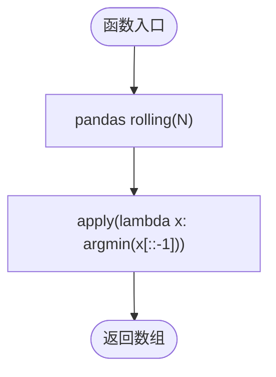

# 极值类函数

<cite>
**本文引用的文件**
- [MyTT.py](file://MyTT.py)
- [README.md](file://README.md)
- [RSI策略.py](file://strategies/RSI策略.py)
- [双均线多股票_使用MA函数.py](file://strategies/双均线多股票_使用MA函数.py)
</cite>

## 目录
1. [简介](#简介)
2. [项目结构](#项目结构)
3. [核心组件](#核心组件)
4. [架构总览](#架构总览)
5. [详细组件分析](#详细组件分析)
6. [依赖分析](#依赖分析)
7. [性能考量](#性能考量)
8. [故障排查指南](#故障排查指南)
9. [结论](#结论)
10. [附录](#附录)

## 简介
本章节聚焦于 MyTT.py 中的极值类函数，包括 HHV（N 日最高价）、LLV（N 日最低价）、HHVBARS（最高价距当前周期数）与 LLVBARS（最低价距当前周期数）。我们将从数学原理、实现方式、性能特征、典型应用与与 BARSLAST 的协同使用等方面进行系统解析，并对比 HHV/LLV 支持“固定周期”与“动态周期”的双重模式。

## 项目结构
MyTT.py 是 khQuant 量化平台中的技术指标与工具函数库，提供大量面向日线数据的序列计算函数，涵盖滚动窗口、动态窗口、条件计数与趋势追踪等能力。极值类函数位于“0级：核心工具函数（适配日线数据字段）”与“0级扩展：支持动态周期的核心函数”两个层次，既可直接使用固定周期的滚动窗口实现，也可通过动态周期序列实现按位置自适应的窗口长度。

**章节来源**
- file://MyTT.py#L1-L120
- file://MyTT.py#L425-L458

## 核心组件
- HHV(S, N)：计算 N 日最高价。支持固定周期（N 为整数）与动态周期（N 为与 S 等长的序列）。
- LLV(S, N)：计算 N 日最低价。支持固定周期与动态周期。
- HHVBARS(S, N)：返回 N 日内最高价到当前的周期数（最近高点距离当前的周期数）。
- LLVBARS(S, N)：返回 N 日内最低价到当前的周期数（最近低点距离当前的周期数）。
- BARSLAST(S)：返回上一次条件成立到当前的周期数，常用于结合极值函数定位最近高/低点出现时间。

这些函数均以 NumPy/Pandas 为基础，通过滚动窗口（rolling）或自定义循环实现动态极值追踪，输出与输入等长的数组，便于在策略中直接参与条件判断与信号生成。

**章节来源**
- file://MyTT.py#L70-L85
- file://MyTT.py#L148-L152

## 架构总览
极值类函数在技术指标与策略中的典型交互路径如下：

**图表来源**
- [MyTT.py](file://MyTT.py#L70-L85)
- [MyTT.py](file://MyTT.py#L148-L152)

**章节来源**
- file://MyTT.py#L70-L85
- file://MyTT.py#L148-L152

## 详细组件分析

### HHV（N 日最高价）
- 数学原理
  - 固定周期：对长度为 N 的滑动窗口取最大值，窗口沿序列右移。
  - 动态周期：对每个位置 i，使用长度为 N[i] 的窗口取最大值，窗口起止位置随 N[i] 变化。
- 实现方式
  - 固定周期：使用 pandas Series.rolling(N).max()。
  - 动态周期：遍历序列，按 N[i] 截取窗口并取 max，期间处理 NaN 与边界条件。
- 时间复杂度
  - 固定周期：O(L)，L 为序列长度（滚动窗口库优化）。
  - 动态周期：O(L·max(N))，最坏情况下每个位置都要扫描对应窗口。
- 边界与健壮性
  - 当 N[i] 为 NaN 或超过当前位置时，跳过或返回 NaN。
- 典型用途
  - 与 LLV 组合计算超买/超卖区间（如 KDJ、WR）。
  - 作为支撑/阻力识别的基础。

**图表来源**
- [MyTT.py](file://MyTT.py#L426-L440)

**章节来源**
- file://MyTT.py#L426-L440

### LLV（N 日最低价）
- 数学原理与实现方式
  - 与 HHV 类似，固定周期使用 rolling(min)，动态周期使用逐点 min。
- 复杂度与边界
  - 固定周期 O(L)，动态周期 O(L·max(N))。
- 典型用途
  - 与 HHV 组合计算波动范围、通道上下轨。
  - 作为支撑识别与多头入场条件的一部分。

**图表来源**
- [MyTT.py](file://MyTT.py#L443-L457)

**章节来源**
- file://MyTT.py#L443-L457

### HHVBARS（最高价距当前周期数）
- 数学原理
  - 对每个位置 i，取最近 N 个周期内的最高值，并返回该最高值距离当前位置的周期数（0 表示当前即最高）。
  - 通过 argmax(x[::-1]) 实现“从窗口末尾向前查找最近最大值”的效果。
- 实现方式
  - 使用 rolling(N).apply(lambda x: argmax(x[::-1]))。
- 复杂度
  - 固定周期 O(L·N)（每步 apply 内部 argmax）。
- 典型用途
  - 识别最近高点是否出现在 X 周期内，用于“近期高点压制”或“突破回踩”策略。

**图表来源**
- [MyTT.py](file://MyTT.py#L78-L81)

**章节来源**
- file://MyTT.py#L78-L81

### LLVBARS（最低价距当前周期数）
- 数学原理与实现
  - 与 HHVBARS 对称，返回最近低点距离当前的周期数。
  - 使用 argmin(x[::-1]) 实现“从窗口末尾向前查找最近最小值”。
- 复杂度
  - 固定周期 O(L·N)。
- 典型用途
  - 识别最近低点是否出现在 X 周期内，用于“近期低点支撑”或“回踩确认”策略。

**图表来源**
- [MyTT.py](file://MyTT.py#L82-L85)

**章节来源**
- file://MyTT.py#L82-L85

### HHV/LLV 的“固定周期 vs 动态周期”对比
- 固定周期
  - 优点：实现简洁、性能稳定、适合大多数技术指标（如 KDJ、WR）。
  - 适用：N 为常数或与时间无关的固定窗口。
- 动态周期
  - 优点：按位置自适应窗口长度，适合“条件驱动的窗口”（如基于波动率、成交量、自定义信号的窗口）。
  - 代价：逐点循环，时间复杂度较高，需注意 NaN 与边界处理。
- 选择建议
  - 若 N 与时间无关，优先固定周期。
  - 若 N 与序列内某条件或变量相关，采用动态周期。

**章节来源**
- file://MyTT.py#L426-L457

### 与 BARSLAST 的协同使用
- BARSLAST(S) 返回“上一次条件成立到当前的周期数”，常用于定位最近高点/低点出现的时间。
- 典型组合
  - “最近高点出现在 X 周期内”：先用 HHVBARS 得到最近高点距离，再用 BARSLAST 判断该高点是否出现在 X 周期内。
  - “最近低点出现在 Y 周期内”：先用 LLVBARS 得到最近低点距离，再用 BARSLAST 判断该低点是否出现在 Y 周期内。
- 应用场景
  - 支撑/阻力识别：结合 HHV/LLV 与 BARSLAST，识别“近期高/低点是否仍在压制/支撑区间内”。
  - 突破策略：确认突破是否发生在近期高/低点附近，避免“假突破”。

**图表来源**
- [MyTT.py](file://MyTT.py#L70-L85)
- [MyTT.py](file://MyTT.py#L148-L152)

**章节来源**
- file://MyTT.py#L70-L85
- file://MyTT.py#L148-L152

### 在支撑阻力识别与突破策略中的典型应用
- 支撑阻力识别
  - 使用 HHV(HIGH, N) 与 LLV(LOW, N) 计算 N 日高/低点，作为静态支撑/阻力位。
  - 使用 HHVBARS/LLVBARS 判断最近高/低点是否出现在 X 周期内，避免“过旧”支撑/阻力失效。
  - 使用 BARSLAST 判断最近高/低点出现时间，辅助确认支撑/阻力有效性。
- 突破策略
  - 突破高点：当价格突破 HHV(HIGH, N) 且最近高点出现在 X 周内，视为有效突破。
  - 回踩确认：回踩至 LLV(LOW, N) 附近时，结合 BARSLAST 确认低点是否为近期形成，提高回踩确认可靠性。
- 指标依赖
  - KDJ：RSV = (CLOSE - LLV(LOW, N)) / (HHV(HIGH, N) - LLV(LOW, N)) * 100。
  - WR：(HHV(HIGH, N) - CLOSE) / (HHV(HIGH, N) - LLV(LOW, N)) * 100。

**图表来源**
- [MyTT.py](file://MyTT.py#L202-L221)
- [MyTT.py](file://MyTT.py#L70-L85)
- [MyTT.py](file://MyTT.py#L148-L152)

**章节来源**
- file://MyTT.py#L202-L221
- file://MyTT.py#L70-L85
- file://MyTT.py#L148-L152

## 依赖分析
- 依赖关系
  - HHV/LLV 依赖 pandas rolling 与 numpy。
  - HHVBARS/LLVBARS 依赖 rolling.apply 与 numpy.argmax/argmin。
  - BARSLAST 依赖 numpy 与布尔序列处理。
  - 指标函数（如 KDJ、WR）依赖 HHV/LLV。
- 外部依赖
  - pandas、numpy。
- 内部耦合
  - 极值函数与指标函数耦合度较低，通过函数调用形成清晰的依赖链。
- 潜在循环依赖
  - 未发现循环依赖，函数调用方向单一。

**图表来源**
- [MyTT.py](file://MyTT.py#L202-L221)
- [MyTT.py](file://MyTT.py#L70-L85)
- [MyTT.py](file://MyTT.py#L148-L152)

**章节来源**
- file://MyTT.py#L202-L221
- file://MyTT.py#L70-L85
- file://MyTT.py#L148-L152

## 性能考量
- 固定周期滚动窗口
  - 通过 pandas rolling 实现，内部优化良好，适合大序列与固定窗口。
  - 时间复杂度 O(L)（滚动窗口），空间复杂度 O(L)。
- 动态周期逐点循环
  - 需要对每个位置按 N[i] 截取窗口并取极值，时间复杂度 O(L·max(N))。
  - 建议：尽量将 N 设为常数或使用向量化逻辑减少循环次数。
- HHVBARS/LLVBARS 的 apply
  - 每步 apply 内部执行 argmax/argmin，时间复杂度 O(L·N)。
  - 建议：在窗口较小或对性能要求较高时，可考虑自定义 Cython/numba 加速。
- 内存与边界
  - 动态周期需处理 NaN 与越界，避免无效窗口导致的异常。
  - 建议：在输入阶段对 N 进行清洗，确保 N[i] 有效且不超过当前位置。

[本节为通用性能建议，不直接分析具体文件，故无“章节来源”]

## 故障排查指南
- 输入类型错误
  - HHV/LLV 的 N 必须为整数或与 S 等长的序列；动态周期时需确保 N[i] 为有效数值。
- NaN 与越界
  - 动态周期中，若 N[i] 为 NaN 或超过当前位置，函数会跳过该位置；请检查数据预处理。
- 窗口长度为 0 或负数
  - 动态周期时，若 N[i] ≤ 0，将无法形成有效窗口；请在上游逻辑中过滤或修正。
- 性能瓶颈
  - 动态周期与 HHVBARS/LLVBARS 的 apply 可能成为性能瓶颈；建议固定周期或减少窗口大小。
- 与 BARSLAST 组合使用
  - 确保条件序列与极值序列在同一时间轴对齐；注意滞后与填充策略。

**章节来源**
- file://MyTT.py#L426-L457
- file://MyTT.py#L78-L85
- file://MyTT.py#L148-L152

## 结论
- HHV/LLV 提供了固定与动态两种窗口模式，既能满足常规技术指标需求，也能应对条件驱动的自适应窗口。
- HHVBARS/LLVBARS 与 BARSLAST 的组合，为支撑/阻力识别与突破策略提供了“时间+幅度”双维判断能力。
- 在实际策略中，建议优先使用固定周期以获得更好的性能，必要时再采用动态周期与自定义循环。

[本节为总结性内容，不直接分析具体文件，故无“章节来源”]

## 附录

### 典型策略参考
- RSI 策略：展示了如何在策略中使用指标函数（如 RSI）与行情数据进行信号生成。
- 双均线策略：展示了如何在策略中使用 MA 函数与行情数据进行信号生成。

**章节来源**
- file://strategies/RSI策略.py#L1-L26
- file://strategies/双均线多股票_使用MA函数.py#L1-L36