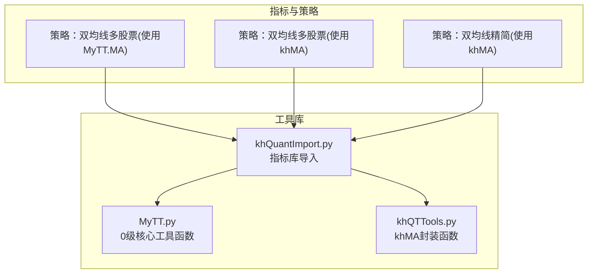
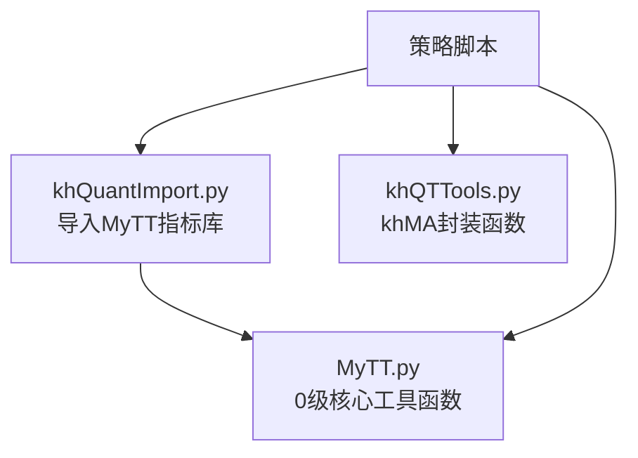
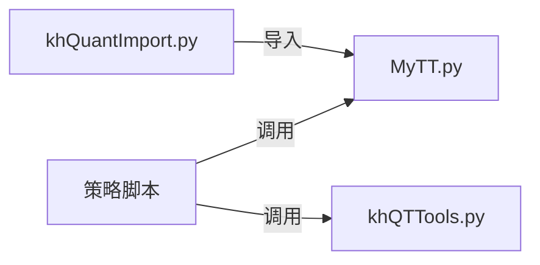

# 核心工具函数

<cite>
**本文引用的文件**
- [MyTT.py](file://MyTT.py)
- [khQTTools.py](file://khQTTools.py)
- [双均线多股票_使用MA函数.py](file://strategies/双均线多股票_使用MA函数.py)
- [双均线多股票_使用khMA函数.py](file://strategies/双均线多股票_使用khMA函数.py)
- [双均线精简_使用khMA函数.py](file://strategies/双均线精简_使用khMA函数.py)
- [khQuantImport.py](file://khQuantImport.py)
</cite>

## 目录
1. [简介](#简介)
2. [项目结构](#项目结构)
3. [核心组件](#核心组件)
4. [架构总览](#架构总览)
5. [详细组件分析](#详细组件分析)
6. [依赖分析](#依赖分析)
7. [性能考虑](#性能考虑)
8. [故障排查指南](#故障排查指南)
9. [结论](#结论)
10. [附录](#附录)

## 简介
本文件聚焦于 MyTT.py 中“0级核心工具函数”的功能与用法，系统性阐述 REF、SUM、HHV、LLV、MA、EMA 等基础函数的数学逻辑、参数含义与数据字段适配（如 CLOSE、HIGH、LOW、VOL）。同时，对比 MyTT.py 的 MA 与 khQTTools.py 的 khMA 在实现逻辑与使用场景上的差异，帮助开发者在策略中正确选择与组合使用这些函数。

## 项目结构
- MyTT.py 提供面向日线数据字段的 0 级核心工具函数，涵盖序列位移、差分、统计、窗口滚动、移动平均族等。
- khQTTools.py 提供 khMA 等封装函数，内部完成行情获取与均线计算，适合策略直接调用。
- 策略示例展示了如何在策略中使用 MyTT.MA 与 khQTTools.khMA 进行双均线交易。

**图表来源**
- [MyTT.py](file://MyTT.py#L1-L120)
- [khQTTools.py](file://khQTTools.py#L491-L541)
- [双均线多股票_使用MA函数.py](file://strategies/双均线多股票_使用MA函数.py#L1-L36)
- [双均线多股票_使用khMA函数.py](file://strategies/双均线多股票_使用khMA函数.py#L1-L33)
- [双均线精简_使用khMA函数.py](file://strategies/双均线精简_使用khMA函数.py#L1-L31)
- [khQuantImport.py](file://khQuantImport.py#L43-L76)

**章节来源**
- [MyTT.py](file://MyTT.py#L1-L120)
- [khQTTools.py](file://khQTTools.py#L491-L541)
- [khQuantImport.py](file://khQuantImport.py#L43-L76)

## 核心组件
- 0级核心工具函数（日线字段适配）
  - REF：获取历史值（如 REF(CLOSE,1) 为昨收价）
  - SUM：N日累计和（N=0为累计求和）
  - HHV/LLV：N日最高价/最低价
  - MA：简单移动平均
  - EMA：指数移动平均
- 0级扩展函数
  - HHV/LLV（动态周期）：支持 N 为固定值或动态序列
  - DSMA：偏差自适应移动平均
  - SUMBARSFAST：累计和达到目标值所需的周期数
- 1级扩展函数
  - 累计周期计算与条件统计（如 BARSLAST、BARSLASTCOUNT、VALUEWHEN 等）

**章节来源**
- [MyTT.py](file://MyTT.py#L51-L120)
- [MyTT.py](file://MyTT.py#L425-L458)
- [MyTT.py](file://MyTT.py#L460-L521)

## 架构总览
MyTT 提供纯函数式的序列计算能力，khMA 则在策略层提供“行情获取 + 计算”的一体化封装。khQuantImport 将 MyTT 指标库导入到策略命名空间，便于策略直接使用。

**图表来源**
- [khQuantImport.py](file://khQuantImport.py#L43-L76)
- [MyTT.py](file://MyTT.py#L1-L120)
- [khQTTools.py](file://khQTTools.py#L491-L541)

## 详细组件分析

### REF（历史值获取）
- 数学与逻辑
  - 将序列向后移动 N 位，返回历史值序列。REF(CLOSE,1) 即为昨日收盘价序列。
- 参数
  - S：序列（如 CLOSE）
  - N：历史偏移步数，默认 1
- 数据字段适配
  - 适用于 CLOSE、OPEN、HIGH、LOW、VOL 等字段
- 复杂度
  - O(n)，基于 pandas Series.shift
- 使用建议
  - 与 DIFF、REF(CLOSE,1) 等配合，构建涨跌幅、昨日复权价等

**章节来源**
- [MyTT.py](file://MyTT.py#L51-L53)

### SUM（累计和）
- 数学与逻辑
  - N>0：滚动窗口累计和（N日滑窗）
  - N=0：累计求和（从序列首项累积到当前位置）
- 参数
  - S：序列（如 CLOSE、VOL）
  - N：窗口大小或累计标志
- 数据字段适配
  - 适用于 CLOSE、VOL 等数值序列
- 复杂度
  - O(n)，基于 pandas rolling 或 cumsum
- 使用建议
  - 与 COUNT、FILTER 等组合，统计窗口内满足条件的天数或屏蔽重复信号

**章节来源**
- [MyTT.py](file://MyTT.py#L63-L65)

### HHV（N日最高价）
- 数学与逻辑
  - 计算 N 日内的最高价序列（滚动窗口最大值）
- 参数
  - S：序列（如 HIGH）
  - N：窗口大小
- 数据字段适配
  - 适用于 HIGH
- 复杂度
  - O(n·k)，k 为窗口大小；滚动实现近似 O(n)
- 使用建议
  - 与 LLV、HHVBARS、LLVBARS 配合，识别关键阻力/支撑与背离

**章节来源**
- [MyTT.py](file://MyTT.py#L71-L72)

### LLV（N日最低价）
- 数学与逻辑
  - 计算 N 日内的最低价序列（滚动窗口最小值）
- 参数
  - S：序列（如 LOW）
  - N：窗口大小
- 数据字段适配
  - 适用于 LOW
- 复杂度
  - O(n·k)，滚动实现近似 O(n)
- 使用建议
  - 与 HHV、HHVBARS、LLVBARS 配合，识别关键支撑/阻力与背离

**章节来源**
- [MyTT.py](file://MyTT.py#L75-L76)

### MA（简单移动平均）
- 数学与逻辑
  - 算术平均：对 N 日窗口求均值
- 参数
  - S：序列（如 CLOSE）
  - N：窗口大小
- 数据字段适配
  - 适用于 CLOSE、OPEN、HIGH、LOW 等
- 复杂度
  - O(n)，基于 pandas rolling mean
- 使用建议
  - 与 EMA、SMA、WMA 等组合，构建多周期均线系统或交叉信号

**章节来源**
- [MyTT.py](file://MyTT.py#L87-L89)

### EMA（指数移动平均）
- 数学与逻辑
  - 指数加权平均：近期权重更大，收敛更快
- 参数
  - S：序列（如 CLOSE）
  - N：平滑跨度（span）
- 数据字段适配
  - 适用于 CLOSE、OPEN、HIGH、LOW 等
- 复杂度
  - O(n)，基于 pandas ewm mean
- 使用建议
  - 与 MA、SMA 配合，构建 MACD、均线金叉死叉等信号

**章节来源**
- [MyTT.py](file://MyTT.py#L91-L93)

### HHV/LLV（动态周期扩展）
- 数学与逻辑
  - 支持 N 为固定值或与 S 等长的动态序列，按每个位置的实际 N 计算窗口内的最高/最低
- 参数
  - S：序列（如 HIGH/LOW）
  - N：整数或与 S 等长的序列
- 数据字段适配
  - 适用于 HIGH、LOW
- 复杂度
  - O(n·k)，k 为平均窗口大小；对每个位置截取子窗口计算
- 使用建议
  - 与 MA、EMA 等组合，动态窗口均线或自适应通道

**章节来源**
- [MyTT.py](file://MyTT.py#L425-L458)

### DSMA（偏差自适应移动平均）
- 数学与逻辑
  - 基于价格二阶差分与RMS估计，自适应调整平滑因子，波动大时更敏感，波动小时更平滑
- 参数
  - X：序列（如 CLOSE）
  - N：基准周期数
- 数据字段适配
  - 适用于 CLOSE
- 复杂度
  - O(n)，包含递推与窗口统计
- 使用建议
  - 作为 MA/EMA 的替代，降低滞后并提升对波动的响应

**章节来源**
- [MyTT.py](file://MyTT.py#L460-L491)

### SUMBARSFAST（累计和周期数）
- 数学与逻辑
  - 计算从当前位置向前累计至目标值所需的周期数；要求输入序列严格为正值
- 参数
  - X：被累计的序列（如 VOL）
  - A：目标累计值（单值或与 X 等长）
- 数据字段适配
  - 适用于 VOL 等正序列
- 复杂度
  - O(n·log n)，基于前缀和与二分查找
- 使用建议
  - 用于换手周期、量能累积等场景

**章节来源**
- [MyTT.py](file://MyTT.py#L495-L521)

### MA 与 khMA 的实现与使用差异
- 实现逻辑
  - MyTT.MA：纯序列函数，输入为已获取的历史序列（如 CLOSE），返回均线序列
  - khMA：封装了行情获取（khHistory）、数据校验、复权与精度处理，直接返回单个数值
- 使用场景
  - 使用 MyTT.MA：策略中先拉取历史数据，再对序列调用 MA，适合需要多字段/多周期组合的复杂策略
  - 使用 khMA：策略直接传入 stock_code、period、end_time 等参数，适合快速构建单均线或多只股票的双均线策略
- 选择建议
  - 若策略需要在同一批数据上反复计算多个指标（如 MA、EMA、RSI、MACD 等），建议先拉取数据再用 MyTT.MA，减少重复数据拉取
  - 若策略仅需单均线数值（如双均线金叉死叉），khMA 更简洁高效

**章节来源**
- [MyTT.py](file://MyTT.py#L87-L89)
- [khQTTools.py](file://khQTTools.py#L491-L541)
- [双均线多股票_使用MA函数.py](file://strategies/双均线多股票_使用MA函数.py#L1-L36)
- [双均线多股票_使用khMA函数.py](file://strategies/双均线多股票_使用khMA函数.py#L1-L33)
- [双均线精简_使用khMA函数.py](file://strategies/双均线精简_使用khMA函数.py#L1-L31)

### 组合使用示例（策略思路）
- 双均线系统（MA5 与 MA20）
  - 使用 MyTT.MA：先拉取 CLOSE 序列，分别计算 MA5 与 MA20，比较两者并生成买卖信号
  - 使用 khMA：直接对 stock_code 计算 khMA5 与 khMA20，比较并生成信号
- 与 REF、SUM、HHV/LLV 的组合
  - 使用 REF(CLOSE,1) 计算涨跌，SUM(VOL,N) 计算量能，HHV/LLV 识别关键位置，构建趋势与背离信号

**章节来源**
- [双均线多股票_使用MA函数.py](file://strategies/双均线多股票_使用MA函数.py#L14-L36)
- [双均线多股票_使用khMA函数.py](file://strategies/双均线多股票_使用khMA函数.py#L12-L31)
- [双均线精简_使用khMA函数.py](file://strategies/双均线精简_使用khMA函数.py#L11-L29)

## 依赖分析
- khQuantImport 将 MyTT 指标库导入策略命名空间，策略可直接使用 MA、EMA、SUM、HHV、LLV 等函数
- 策略与工具库的调用关系如下：

**图表来源**
- [khQuantImport.py](file://khQuantImport.py#L43-L76)
- [MyTT.py](file://MyTT.py#L1-L120)
- [khQTTools.py](file://khQTTools.py#L491-L541)

**章节来源**
- [khQuantImport.py](file://khQuantImport.py#L43-L76)

## 性能考虑
- 滚动窗口 vs 纯序列
  - HHV/LLV、MA、EMA 等基于 pandas rolling/ewm 的实现，时间复杂度近似 O(n)
  - SUM(N=0) 使用 cumsum，O(n)
  - SUMBARSFAST 使用前缀和+二分，O(n log n)
- 动态周期
  - HHV/LLV 动态周期版本对每个位置截取子窗口，复杂度 O(n·k)
- khMA 的数据拉取
  - khMA 内部调用 khHistory 拉取历史数据，建议在批量策略中复用同一份数据，避免重复拉取

[本节为通用性能讨论，不直接分析具体文件]

## 故障排查指南
- khMA 报错“数据量不足”
  - 检查 end_time 与 bar_count 的匹配关系，确保历史数据足够
  - 检查复权参数 fq 与数据可用性
- SUMBARSFAST 报错“数组X的每个元素都必须大于0！”
  - 确保输入序列 X 全为正值（如 VOL）
- REF/SHIFT 导致的 NaN
  - REF 向后移动会引入缺失值，注意在策略中对 NaN 的处理
- MA/EMA 结果异常
  - 确认输入序列无异常值或空值
  - 检查数据频率与字段映射（如 Tick 与 K 线字段差异）

**章节来源**
- [MyTT.py](file://MyTT.py#L495-L521)
- [khQTTools.py](file://khQTTools.py#L491-L541)

## 结论
- MyTT 的 0 级核心工具函数提供了高效的序列计算能力，适合在策略中进行灵活的指标组合与信号构建
- khMA 为策略层封装了“行情获取 + 计算”，简化了调用流程，适合快速实现单均线或多股票策略
- 在策略设计中，应根据是否需要多指标复用与数据复用成本，选择 MyTT.MA 或 khMA；两者可互补使用

[本节为总结性内容，不直接分析具体文件]

## 附录
- 日线字段映射（来自 MyTT.py 注释）
  - CLOSE：收盘价
  - HIGH：最高价
  - LOW：最低价
  - OPEN：开盘价
  - VOL：成交量（手）
  - REF_CLOSE：昨收价（可用 REF(CLOSE,1) 替代）

**章节来源**
- [MyTT.py](file://MyTT.py#L7-L14)