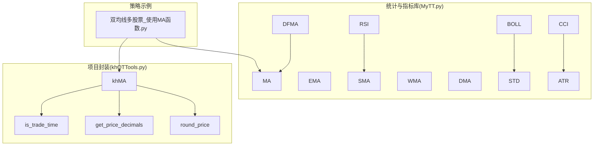
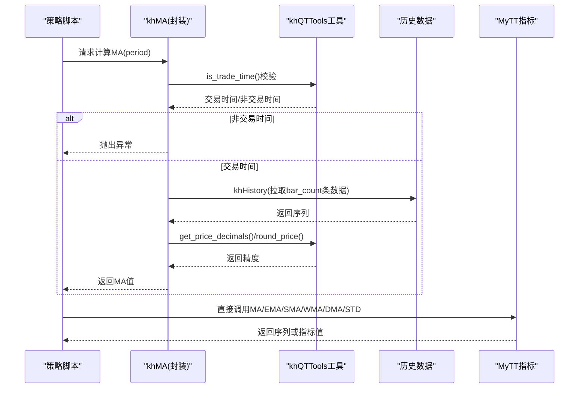
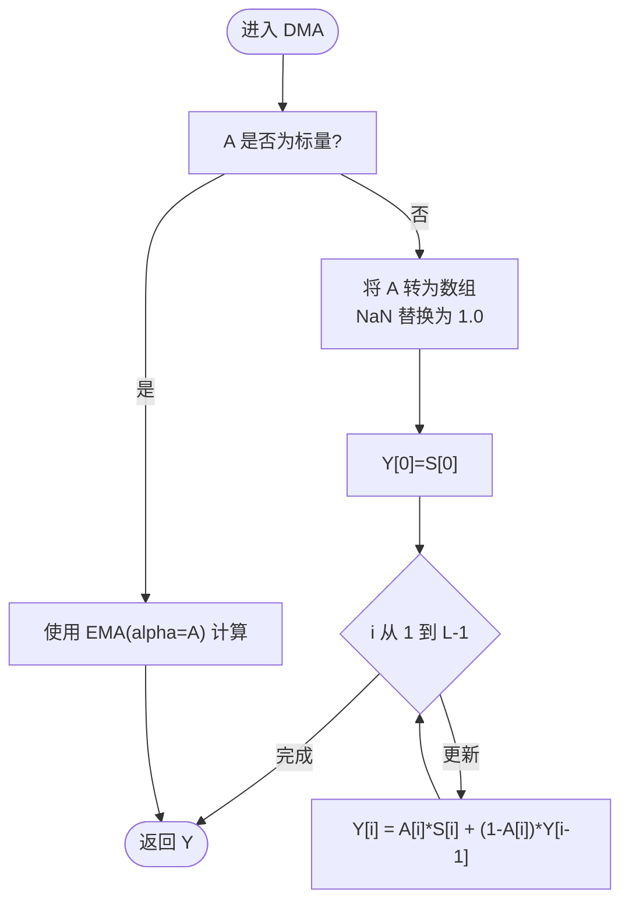
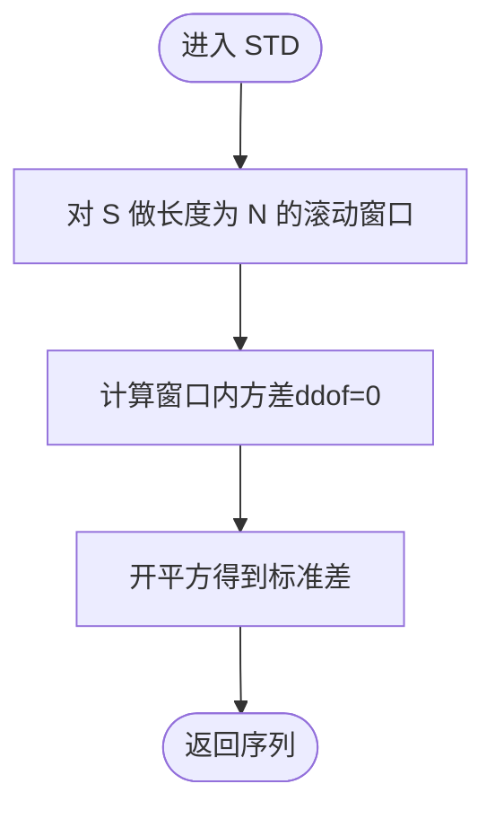
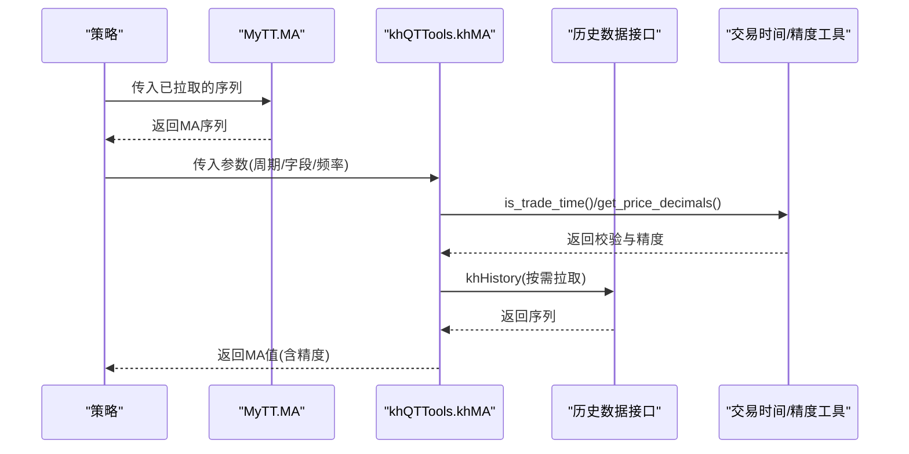
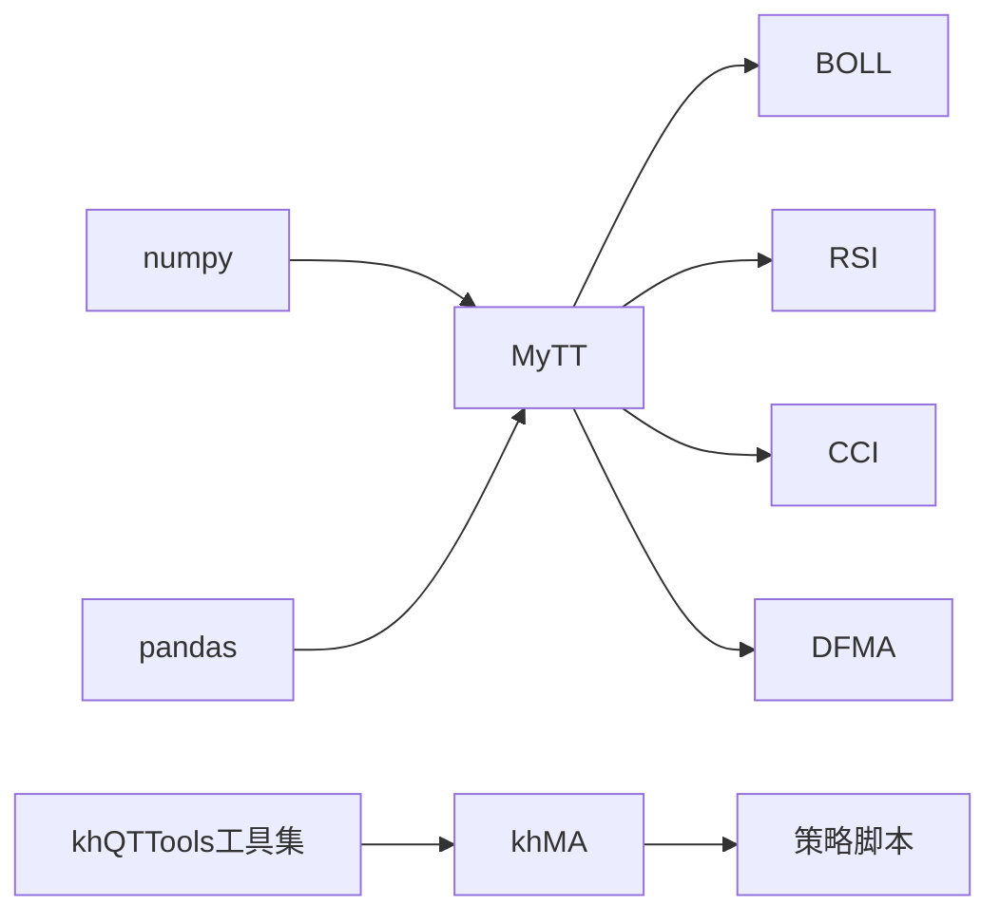

# 统计类函数

<cite>
**本文引用的文件**
- [MyTT.py](file://MyTT.py)
- [khQTTools.py](file://khQTTools.py)
- [双均线多股票_使用MA函数.py](file://strategies/双均线多股票_使用MA函数.py)
</cite>

## 目录
1. [简介](#简介)
2. [项目结构](#项目结构)
3. [核心组件](#核心组件)
4. [架构总览](#架构总览)
5. [详细组件分析](#详细组件分析)
6. [依赖关系分析](#依赖关系分析)
7. [性能考量](#性能考量)
8. [故障排查指南](#故障排查指南)
9. [结论](#结论)

## 简介
本文件聚焦于统计分析函数，系统梳理 MyTT.py 中的 MA（简单移动平均）、EMA（指数移动平均）、SMA（中国式平滑移动平均）、WMA（加权移动平均）、DMA（动态移动平均）与 STD（标准差）的算法逻辑与参数含义，并对比 khQTTools.py 中 khMA 函数与 MyTT.MA 的差异。同时深入解释 DMA 支持序列型平滑因子的高级能力及其在自适应策略中的潜力，以及 STD 在波动率计算与布林带构建中的关键作用。

## 项目结构
- MyTT.py 提供通用统计与技术指标函数，面向日线数据字段（如 CLOSE、HIGH、LOW、OPEN、VOL），并提供基础与高级移动平均、波动率与通道等工具。
- khQTTools.py 提供项目特定封装，包含 khMA 独立函数，负责行情获取、交易时间校验、精度控制与回测效率优化，适合策略直接调用。
- 策略示例双均线多股票_使用MA函数.py 展示了如何在策略中使用 MyTT.MA 进行双均线择时。

图表来源
- [MyTT.py](file://MyTT.py#L87-L111)
- [MyTT.py](file://MyTT.py#L232-L237)
- [MyTT.py](file://MyTT.py#L211-L215)
- [MyTT.py](file://MyTT.py#L247-L250)
- [MyTT.py](file://MyTT.py#L253-L257)
- [MyTT.py](file://MyTT.py#L341-L345)
- [khQTTools.py](file://khQTTools.py#L491-L540)
- [khQTTools.py](file://khQTTools.py#L287-L376)
- [khQTTools.py](file://khQTTools.py#L239-L286)
- [双均线多股票_使用MA函数.py](file://strategies/双均线多股票_使用MA函数.py#L14-L36)

章节来源
- [MyTT.py](file://MyTT.py#L87-L111)
- [MyTT.py](file://MyTT.py#L232-L237)
- [MyTT.py](file://MyTT.py#L211-L215)
- [MyTT.py](file://MyTT.py#L247-L250)
- [MyTT.py](file://MyTT.py#L253-L257)
- [MyTT.py](file://MyTT.py#L341-L345)
- [khQTTools.py](file://khQTTools.py#L491-L540)
- [khQTTools.py](file://khQTTools.py#L287-L376)
- [khQTTools.py](file://khQTTools.py#L239-L286)
- [双均线多股票_使用MA函数.py](file://strategies/双均线多股票_使用MA函数.py#L14-L36)

## 核心组件
- MA（简单移动平均）：对长度为 N 的窗口内序列求算术平均，平滑短期随机扰动，识别趋势方向。
- EMA（指数移动平均）：对近期值赋予更高权重，响应更快，常用于快速趋势跟踪。
- SMA（中国式平滑移动平均）：以 α = M/N 的平滑因子进行指数平滑，广泛用于 KDJ 等指标的内部平滑。
- WMA（加权移动平均）：按时间倒序累积加权，近期权重更大，强调近期趋势变化。
- DMA（动态移动平均）：平滑因子 A 可为标量或与序列等长的向量，支持序列型平滑因子，实现自适应平滑。
- STD（标准差）：衡量序列波动程度，用于波动率估计与布林带上下轨计算。

章节来源
- [MyTT.py](file://MyTT.py#L87-L111)

## 架构总览
MyTT 提供通用统计与指标函数，khQTTools 提供项目封装与运行时保障（交易时间、精度、数据获取）。策略通过 MyTT 或 khMA 调用这些函数，实现从数据到信号的完整流程。

图表来源
- [khQTTools.py](file://khQTTools.py#L491-L540)
- [khQTTools.py](file://khQTTools.py#L287-L376)
- [MyTT.py](file://MyTT.py#L87-L111)

## 详细组件分析

### MA（简单移动平均）
- 算法要点
  - 对长度为 N 的滑动窗口执行算术平均，窗口随时间右移。
  - 对首个 N-1 个缺失值采用滚动窗口的默认填充策略。
- 参数意义
  - S：输入序列（如收盘价）
  - N：窗口长度
- 复杂度
  - 单次计算 O(L)，L 为序列长度；滚动窗口平均通常由高效库实现。
- 边界与注意事项
  - 首 N-1 个值在滚动窗口中可能不完整，取决于具体实现的填充策略。
- 典型用途
  - 趋势识别、交叉信号（金叉/死叉）、布林带中轨。

章节来源
- [MyTT.py](file://MyTT.py#L87-L89)

### EMA（指数移动平均）
- 算法要点
  - 使用指数平滑，权重按几何级数递减，近期权重更高。
  - 通过 pandas 的指数加权窗口实现，span 参数与平滑因子 α 的关系为 α = 2/(span+1)。
- 参数意义
  - S：输入序列
  - N：span（等价于平滑因子的分母形式）
- 复杂度
  - O(L)
- 边界与注意事项
  - adjust=False 表示使用标准指数平滑，而非修正版本。
- 典型用途
  - 快速趋势跟踪、MACD 计算中的快线与慢线。

章节来源
- [MyTT.py](file://MyTT.py#L91-L93)

### SMA（中国式平滑移动平均）
- 算法要点
  - 以 α = M/N 作为平滑因子进行指数平滑，常用于 KDJ 等指标的内部平滑步骤。
- 参数意义
  - S：输入序列
  - N：平滑分母
  - M：平滑分子（默认 1）
- 复杂度
  - O(L)
- 典型用途
  - KDJ 中 RSV 的平滑，以及 RSI 的正负差分的平滑。

章节来源
- [MyTT.py](file://MyTT.py#L95-L97)
- [MyTT.py](file://MyTT.py#L211-L215)

### WMA（加权移动平均）
- 算法要点
  - 对窗口内值按时间倒序分配权重，近期权重更大，典型权重和为 1。
  - 使用滚动窗口自定义聚合函数实现加权求和。
- 参数意义
  - S：输入序列
  - N：窗口长度
- 复杂度
  - O(L·N)（因自定义函数逐窗口计算）
- 典型用途
  - 强调近期趋势变化的平滑，适用于对响应速度有要求的场景。

章节来源
- [MyTT.py](file://MyTT.py#L99-L101)

### DMA（动态移动平均）
- 算法要点
  - 支持两种输入：
    - 标量平滑因子 A：等价于 EMA 的指数平滑。
    - 向量平滑因子 A：长度与序列相同，逐点动态调整平滑强度。
  - 当 A 为向量时，对 NaN 值进行特殊处理（例如替换为 1.0），然后迭代更新平滑值。
- 参数意义
  - S：输入序列
  - A：标量或与 S 等长的序列（平滑因子）
- 复杂度
  - O(L)
- 高级特性与潜力
  - 序列型平滑因子使 DMA 能够在不同位置采用不同的平滑强度，从而在高波动区更平滑，在低波动区更灵敏，具备自适应能力。
  - 可用于构建自适应均线（如 DSMA），或作为通道、动量指标的平滑器。
- 典型用途
  - 自适应均线（DSMA）
  - 薛斯通道 II（XSII）中的动态平滑

图表来源
- [MyTT.py](file://MyTT.py#L103-L111)
- [MyTT.py](file://MyTT.py#L462-L491)
- [MyTT.py](file://MyTT.py#L410-L421)

章节来源
- [MyTT.py](file://MyTT.py#L103-L111)
- [MyTT.py](file://MyTT.py#L462-L491)
- [MyTT.py](file://MyTT.py#L410-L421)

### STD（标准差）
- 算法要点
  - 使用滚动窗口计算样本标准差（ddof=0），衡量序列的离散程度。
- 参数意义
  - S：输入序列
  - N：窗口长度
- 复杂度
  - O(L)
- 关键作用
  - 波动率估计的基础
  - 布林带上轨/下轨：MID ± P × STD(S, N)

图表来源
- [MyTT.py](file://MyTT.py#L59-L61)
- [MyTT.py](file://MyTT.py#L232-L237)

章节来源
- [MyTT.py](file://MyTT.py#L59-L61)
- [MyTT.py](file://MyTT.py#L232-L237)

### MA 与 khMA 的差异对比
- 设计定位
  - MyTT.MA：通用统计函数，面向已获取的历史序列，直接计算均线。
  - khMA：项目封装函数，内置行情获取、交易时间校验、精度控制与回测效率优化。
- 数据来源
  - MyTT.MA：策略自行拉取历史数据后传入。
  - khMA：内部调用历史数据接口，自动拉取所需 bar_count 条数据。
- 交易约束
  - khMA：对日内频率（如 1m/5m/tick）进行交易时间校验，避免非交易时段计算。
- 精度与格式
  - khMA：根据 ETF/股票自动选择价格精度，并进行四舍五入；MyTT.MA 不涉及格式化。
- 错误处理
  - khMA：当数据不足或非交易时间时抛出明确异常；MyTT.MA 一般不包含此类运行时校验。
- 回测效率
  - khMA：默认不强制下载数据，提高回测速度；MyTT.MA 由策略决定数据获取策略。

图表来源
- [MyTT.py](file://MyTT.py#L87-L89)
- [khQTTools.py](file://khQTTools.py#L491-L540)
- [khQTTools.py](file://khQTTools.py#L287-L376)
- [双均线多股票_使用MA函数.py](file://strategies/双均线多股票_使用MA函数.py#L14-L36)

章节来源
- [MyTT.py](file://MyTT.py#L87-L89)
- [khQTTools.py](file://khQTTools.py#L491-L540)
- [khQTTools.py](file://khQTTools.py#L287-L376)
- [双均线多股票_使用MA函数.py](file://strategies/双均线多股票_使用MA函数.py#L14-L36)

### DMA 的自适应潜力与应用
- 自适应平滑因子
  - 通过序列型平滑因子 A，DMA 可在不同位置采用不同平滑强度，实现“波动大更敏感、波动小更平滑”的效果。
- 在 DSMA 中的应用
  - DSMA 基于价格变化率与 RMS 计算自适应平滑因子 alpha1，再以 DMA 生成最终均线，体现偏差自适应思想。
- 在 XSII 中的应用
  - XSII 使用 DMA 对价格进行动态平滑，通道上/下轨基于动态均线的百分比偏移，体现 DMA 在通道构建中的灵活性。

章节来源
- [MyTT.py](file://MyTT.py#L462-L491)
- [MyTT.py](file://MyTT.py#L410-L421)

### STD 在波动率与布林带中的作用
- 波动率估计
  - STD 作为样本标准差，是波动率的直接估计量，可用于风险度量与止损设置。
- 布林带构建
  - 中轨：MA(S, N)
  - 上轨：中轨 + P × STD(S, N)
  - 下轨：中轨 - P × STD(S, N)
  - P 为倍数，常取 2；STD 的窗口 N 决定平滑程度与敏感度。

章节来源
- [MyTT.py](file://MyTT.py#L232-L237)

## 依赖关系分析
- MyTT 内部依赖
  - numpy/pandas 用于向量化与滚动窗口计算。
  - 指标函数相互组合使用 MA/EMA/SMA/STD 等基础函数。
- khQTTools 依赖
  - 交易时间与节假日判断、价格精度控制、历史数据接口等。
- 策略依赖
  - 策略示例通过 MyTT.MA 进行双均线交叉，或通过 khMA 直接获取 MA 值。

图表来源
- [MyTT.py](file://MyTT.py#L87-L111)
- [MyTT.py](file://MyTT.py#L232-L237)
- [MyTT.py](file://MyTT.py#L211-L215)
- [MyTT.py](file://MyTT.py#L247-L250)
- [MyTT.py](file://MyTT.py#L341-L345)
- [khQTTools.py](file://khQTTools.py#L491-L540)

章节来源
- [MyTT.py](file://MyTT.py#L87-L111)
- [MyTT.py](file://MyTT.py#L232-L237)
- [MyTT.py](file://MyTT.py#L211-L215)
- [MyTT.py](file://MyTT.py#L247-L250)
- [MyTT.py](file://MyTT.py#L341-L345)
- [khQTTools.py](file://khQTTools.py#L491-L540)

## 性能考量
- 计算复杂度
  - 基础滚动窗口函数（MA/EMA/STD）通常为 O(L)。
  - 自定义聚合函数（WMA）可能达到 O(L·N)，建议在窗口较短时使用。
- 内存与缓存
  - 滚动窗口计算会缓存窗口内数据，窗口越大内存占用越高。
- 回测效率
  - khMA 默认不强制下载数据，减少网络与 IO 开销，提升回测速度。
- 精度与稳定性
  - khMA 根据 ETF/股票自动选择价格精度，避免浮点误差放大。
  - DMA 对 NaN 平滑因子的处理确保序列稳定。

## 故障排查指南
- khMA 报错“不在交易时间内”
  - 检查频率参数是否为日内频率（1m/5m/tick），并在交易时间内调用。
- khMA 报错“数据量不足”
  - 确认 bar_count 参数与历史数据长度匹配，或适当降低周期。
- DMA 输出异常
  - 若平滑因子 A 为向量，检查是否存在 NaN，必要时进行插值或替换。
- STD 结果为 NaN
  - 确认窗口长度 N 与序列长度的关系，避免窗口过长导致首段缺失。
- 策略中 MA 结果与 khMA 不一致
  - 核对数据拉取的时间点、复权方式与字段，确保两者使用同一数据源。

章节来源
- [khQTTools.py](file://khQTTools.py#L516-L540)
- [khQTTools.py](file://khQTTools.py#L491-L540)
- [MyTT.py](file://MyTT.py#L103-L111)
- [MyTT.py](file://MyTT.py#L59-L61)

## 结论
- MyTT 提供通用、高效的统计与技术指标函数，覆盖 MA/EMA/SMA/WMA/DMA/STD 等核心组件，适合在策略中直接调用。
- khMA 在项目封装层面提供了更稳健的运行时保障（交易时间、精度、数据获取），适合快速落地策略。
- DMA 的序列型平滑因子使其具备强大的自适应能力，可拓展到自适应均线与通道构建等高级策略。
- STD 在波动率估计与布林带构建中扮演关键角色，是风险管理与信号过滤的重要工具。