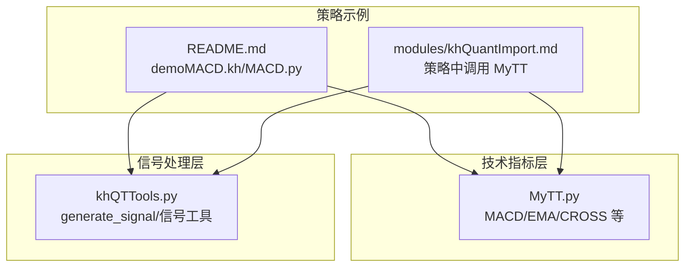
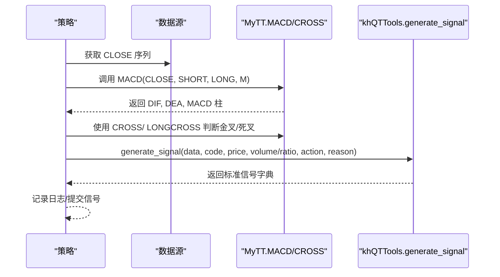
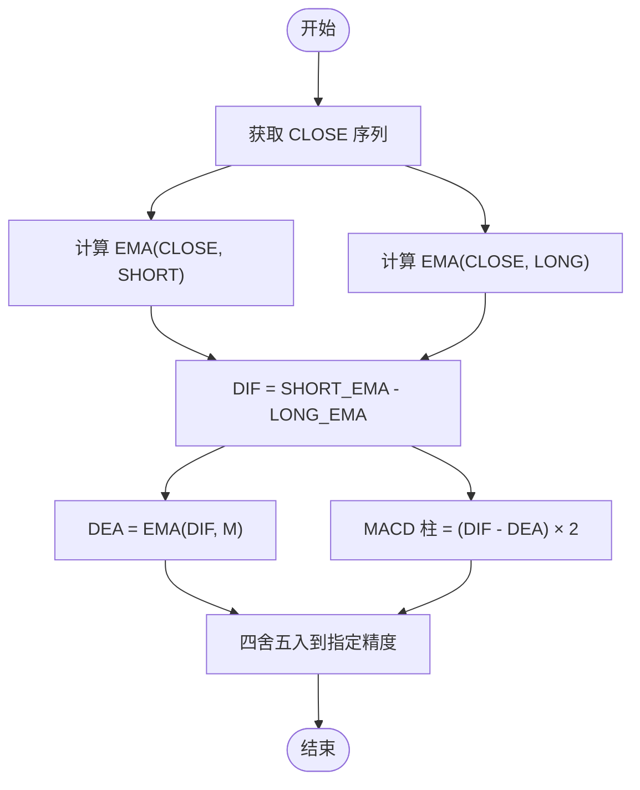
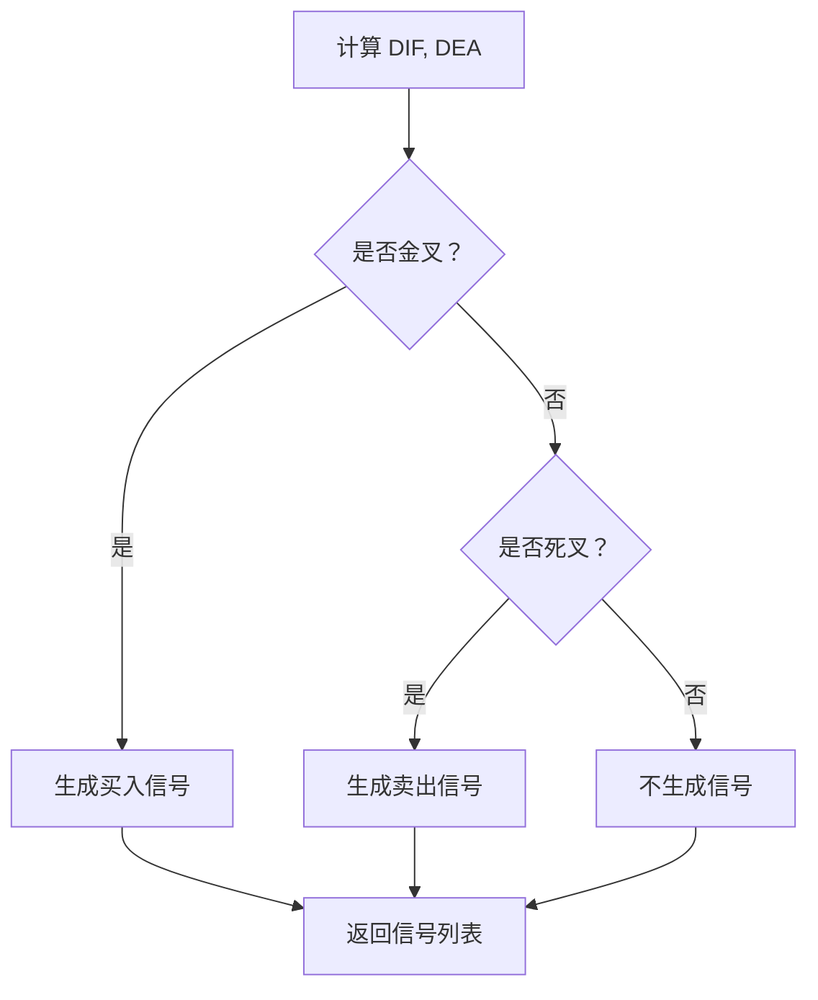
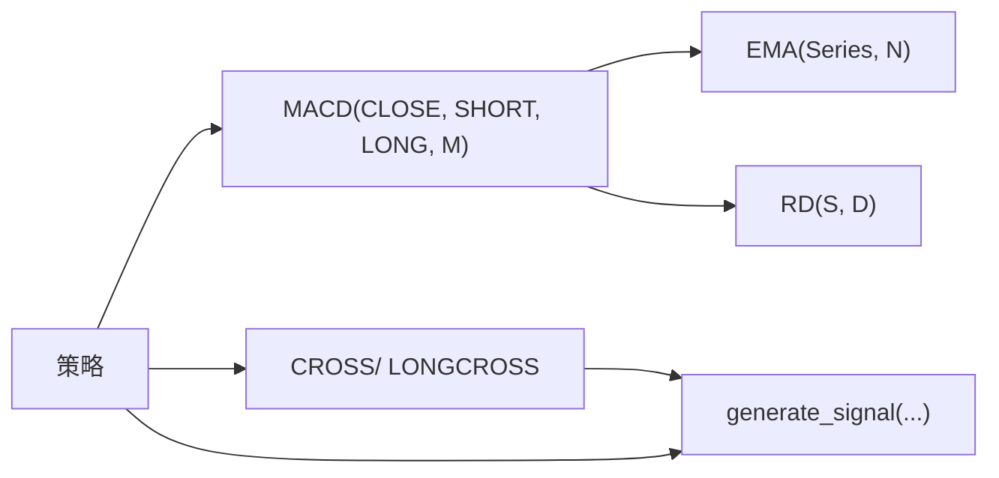

# MACD指标

<cite>
**本文引用的文件**
- [MyTT.py](file://MyTT.py)
- [khQTTools.py](file://khQTTools.py)
- [README.md](file://README.md)
- [modules/khQuantImport.md](file://modules/khQuantImport.md)
</cite>

## 目录
1. [简介](#简介)
2. [项目结构](#项目结构)
3. [核心组件](#核心组件)
4. [架构总览](#架构总览)
5. [详细组件分析](#详细组件分析)
6. [依赖分析](#依赖分析)
7. [性能考虑](#性能考虑)
8. [故障排查指南](#故障排查指南)
9. [结论](#结论)
10. [附录](#附录)

## 简介
本文件围绕 MyTT.py 中的 MACD 指标函数展开，系统性讲解 DIF、DEA、MACD 柱的计算公式与参数含义，剖析 SHORT、LONG、M 对灵敏度的影响，并结合 khQTTools.py 的信号生成工具，说明如何在量化策略中使用 CROSS 函数生成交易信号，最后总结常见问题与参数优化建议。

## 项目结构
- MyTT.py 提供 MACD、EMA、CROSS 等技术指标与信号函数。
- khQTTools.py 提供 generate_signal 等信号生成与交易工具。
- README.md 提供示例工程 demoMACD.kh 与 MACD.py 策略文件的说明。
- modules/khQuantImport.md 展示了如何在策略中调用 MyTT 的 MACD 函数并生成信号。

**图表来源**
- [MyTT.py](file://MyTT.py#L193-L200)
- [khQTTools.py](file://khQTTools.py#L635-L740)
- [README.md](file://README.md#L440-L490)
- [modules/khQuantImport.md](file://modules/khQuantImport.md#L686-L726)

**章节来源**
- [MyTT.py](file://MyTT.py#L193-L200)
- [khQTTools.py](file://khQTTools.py#L635-L740)
- [README.md](file://README.md#L440-L490)
- [modules/khQuantImport.md](file://modules/khQuantImport.md#L686-L726)

## 核心组件
- MACD 函数：计算 DIF、DEA、MACD 柱，返回四舍五入后的结果。
- EMA 函数：指数移动平均，是 MACD 的基础。
- CROSS 函数：向上金叉判断，常用于生成买卖信号。
- generate_signal：将信号字典写入日志并返回，供策略框架消费。

**章节来源**
- [MyTT.py](file://MyTT.py#L91-L93)
- [MyTT.py](file://MyTT.py#L193-L200)
- [MyTT.py](file://MyTT.py#L165-L171)
- [khQTTools.py](file://khQTTools.py#L635-L740)

## 架构总览
MACD 在策略中的典型调用链路如下：
- 策略从数据源获取 CLOSE 序列
- 调用 MyTT.MACD(CLOSE, SHORT, LONG, M) 计算 DIF、DEA、MACD 柱
- 使用 MyTT.CROSS 或 LONGCROSS 生成金叉/死叉信号
- 通过 khQTTools.generate_signal 生成标准信号字典并返回

**图表来源**
- [MyTT.py](file://MyTT.py#L193-L200)
- [MyTT.py](file://MyTT.py#L165-L171)
- [khQTTools.py](file://khQTTools.py#L635-L740)
- [modules/khQuantImport.md](file://modules/khQuantImport.md#L686-L726)

## 详细组件分析

### MACD 函数实现与公式
- 输入：CLOSE（收盘价），SHORT（短期EMA周期，默认12），LONG（长期EMA周期，默认26），M（DEA平滑周期，默认9）
- 计算步骤：
  - DIF = EMA(CLOSE, SHORT) - EMA(CLOSE, LONG)
  - DEA = EMA(DIF, M)
  - MACD 柱 = (DIF - DEA) × 2
  - 结果经四舍五入到小数点后若干位
- 返回：DIF、DEA、MACD 柱（均为等长序列）

**图表来源**
- [MyTT.py](file://MyTT.py#L193-L200)
- [MyTT.py](file://MyTT.py#L91-L93)

**章节来源**
- [MyTT.py](file://MyTT.py#L193-L200)
- [MyTT.py](file://MyTT.py#L91-L93)

### 参数对灵敏度的影响
- SHORT 越小，DIF 对短期价格变化越敏感；LONG 越大，DIF 对长期趋势越平滑。
- M 越小，DEA 越接近 DIF，MACD 柱波动越大；M 越大，DEA 越平滑，柱状线更稳定。
- 典型默认值（SHORT=12、LONG=26、M=9）在 A 股中较为常用，兼顾灵敏度与稳定性。

**章节来源**
- [MyTT.py](file://MyTT.py#L193-L200)

### 信号生成与 CROSS 集成
- 金叉：DIF 从下向上穿过 DEA
- 死叉：DIF 从上向下穿过 DEA
- 使用 CROSS 或 LONGCROSS 可以生成买卖信号，配合 generate_signal 输出标准信号字典

**图表来源**
- [MyTT.py](file://MyTT.py#L165-L171)
- [khQTTools.py](file://khQTTools.py#L635-L740)

**章节来源**
- [MyTT.py](file://MyTT.py#L165-L171)
- [khQTTools.py](file://khQTTools.py#L635-L740)

### 分步计算示例（基于真实股价数据）
以下为“分步计算”的步骤说明，便于理解与复现：
- 步骤1：获取 CLOSE 序列（日线/分钟线）
- 步骤2：计算 SHORT_EMA 与 LONG_EMA（如 SHORT=12，LONG=26）
- 步骤3：计算 DIF = SHORT_EMA - LONG_EMA
- 步骤4：计算 DEA = EMA(DIF, M)（如 M=9）
- 步骤5：计算 MACD 柱 = (DIF - DEA) × 2
- 步骤6：使用 CROSS 判断金叉/死叉，结合 generate_signal 生成信号

为避免直接粘贴代码，建议参考以下路径：
- [MACD 函数定义](file://MyTT.py#L193-L200)
- [EMA 函数定义](file://MyTT.py#L91-L93)
- [CROSS 函数定义](file://MyTT.py#L165-L171)
- [generate_signal 函数定义](file://khQTTools.py#L635-L740)

**章节来源**
- [MyTT.py](file://MyTT.py#L91-L93)
- [MyTT.py](file://MyTT.py#L165-L171)
- [MyTT.py](file://MyTT.py#L193-L200)
- [khQTTools.py](file://khQTTools.py#L635-L740)

### 在量化策略中的典型应用
- 金叉/死叉：DIF 上穿 DEA 为多头信号，DIF 下穿 DEA 为空头信号
- 零轴穿越：MACD 柱由负变正（或相反）可视为趋势转变信号
- 顶背离/底背离：价格创新高（新低）而 MACD 柱不创新高（新低），预示趋势可能反转
- 多周期确认：结合日线/周线 MACD 辅助确认趋势方向

**章节来源**
- [README.md](file://README.md#L440-L490)
- [modules/khQuantImport.md](file://modules/khQuantImport.md#L686-L726)

### 与 khQTTools 的信号处理工具集成
- generate_signal(data, code, price, volume/ratio, action, reason) 生成标准信号字典
- 策略中可直接调用，返回值由框架统一处理与记录

**章节来源**
- [khQTTools.py](file://khQTTools.py#L635-L740)

## 依赖分析
- MyTT.MACD 依赖 EMA、RD（四舍五入）
- 信号生成依赖 CROSS/LONGCROSS 与 generate_signal
- 策略示例通过 khHistory 获取历史数据后调用 MyTT.MACD

**图表来源**
- [MyTT.py](file://MyTT.py#L91-L93)
- [MyTT.py](file://MyTT.py#L165-L171)
- [MyTT.py](file://MyTT.py#L193-L200)
- [khQTTools.py](file://khQTTools.py#L635-L740)

**章节来源**
- [MyTT.py](file://MyTT.py#L91-L93)
- [MyTT.py](file://MyTT.py#L165-L171)
- [MyTT.py](file://MyTT.py#L193-L200)
- [khQTTools.py](file://khQTTools.py#L635-L740)

## 性能考虑
- EMA 使用 pandas 的指数加权移动平均，计算效率高，适合大规模回测
- MACD 柱计算为线性变换，开销较小
- 在策略中尽量避免重复计算相同序列，可缓存中间结果以降低开销

[本节为通用建议，不直接分析具体文件]

## 故障排查指南
- 数据长度不足：确保 CLOSE 序列长度足够，否则 EMA/MACD 计算可能不稳定
- 信号过于频繁：适当增大 M 或使用 LONGCROSS 延迟交叉确认
- 信号滞后：缩短 SHORT 或增大 M 以提升灵敏度，但需权衡噪声
- 价格精度：generate_signal 会按精度四舍五入，注意与交易单位匹配（100 股/手）

**章节来源**
- [khQTTools.py](file://khQTTools.py#L635-L740)

## 结论
MACD 是 A 股中广泛使用的趋势与动量指标。MyTT 的 MACD 实现简洁高效，配合 CROSS/LONGCROSS 与 generate_signal，可在策略中快速构建稳健的金叉/死叉交易信号。通过合理设置 SHORT、LONG、M 参数并结合多周期确认与背离识别，可提升策略的稳定性与胜率。

[本节为总结性内容，不直接分析具体文件]

## 附录
- 示例工程与策略文件：demoMACD.kh 与 MACD.py
- 策略中调用 MyTT.MACD 的示例路径：modules/khQuantImport.md

**章节来源**
- [README.md](file://README.md#L440-L490)
- [modules/khQuantImport.md](file://modules/khQuantImport.md#L686-L726)