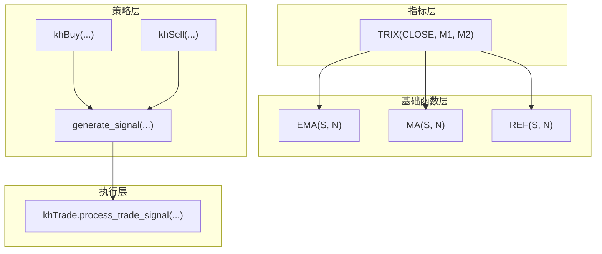
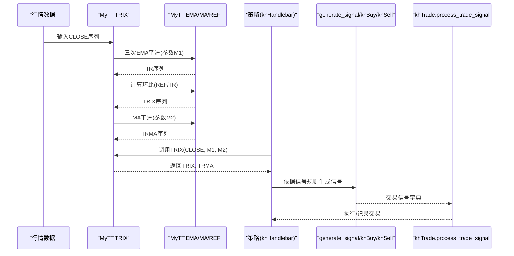
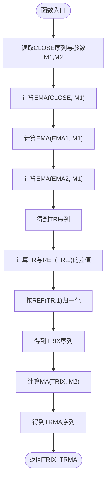
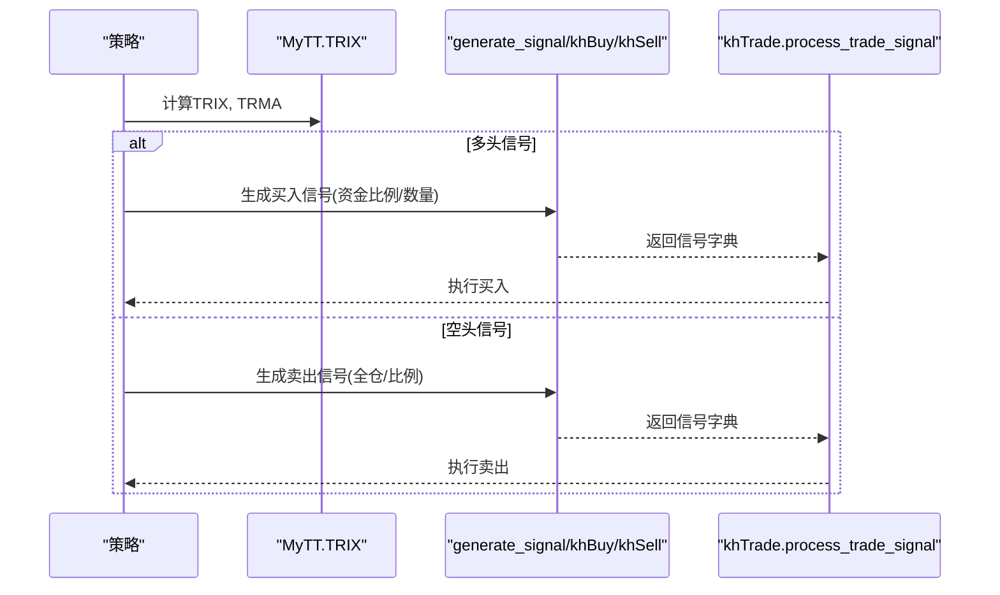
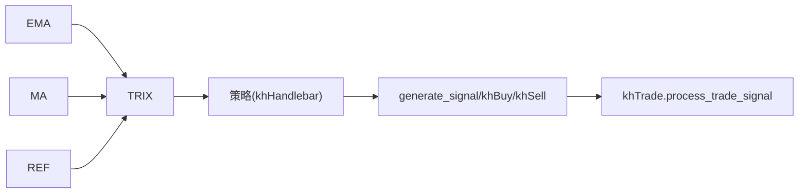

# 三重指数平滑平均线

<cite>
**本文引用的文件**
- [MyTT.py](file://MyTT.py)
- [README.md](file://README.md)
- [khQuantImport.md](file://modules/khQuantImport.md)
- [khQTTools.py](file://khQTTools.py)
- [khTrade.py](file://khTrade.py)
</cite>

## 目录
1. [简介](#简介)
2. [项目结构](#项目结构)
3. [核心组件](#核心组件)
4. [架构总览](#架构总览)
5. [详细组件分析](#详细组件分析)
6. [依赖关系分析](#依赖关系分析)
7. [性能考量](#性能考量)
8. [故障排查指南](#故障排查指南)
9. [结论](#结论)
10. [附录](#附录)

## 简介
本文件围绕 khQuant 量化平台中的 TRIX 指标展开，系统性解析 MyTT.py 中 TRIX(CLOSE, M1=12, M2=20) 的实现机制，重点阐释三重指数平滑（三重EMA嵌套）的计算流程 TR = EMA(EMA(EMA(CLOSE, M1), M1), M1)，以及 TRIX = (TR - REF(TR, 1)) / REF(TR, 1) × 100 的动量转换过程。文档还讨论 M1（三重平滑周期）与 M2（信号线周期）对指标灵敏度的影响，给出基于零轴穿越与 TRIX 与 TRMA（信号线）交叉的交易信号生成方法，并总结 TRIX 在识别长期趋势、过滤短期波动方面的优势，以及在横盘阶段的假信号问题与结合成交量过滤的改进建议。

## 项目结构
TRIX 指标位于 MyTT.py 的“技术指标函数”区域，作为二级指标函数，依赖于底层的 EMA、MA、REF 等一、二级函数。策略侧通过 khQuantImport 提供的 generate_signal 等工具生成交易信号，交易执行由 khTrade 模块负责落地。

**图表来源**
- [MyTT.py](file://MyTT.py#L91-L93)
- [MyTT.py](file://MyTT.py#L295-L300)
- [khQuantImport.md](file://modules/khQuantImport.md#L509-L574)
- [khQTTools.py](file://khQTTools.py#L660-L715)
- [khTrade.py](file://khTrade.py#L535-L567)

**章节来源**
- [MyTT.py](file://MyTT.py#L295-L300)
- [README.md](file://README.md#L1-L200)

## 核心组件
- TRIX 指标函数：接收 CLOSE 序列与平滑参数 M1、M2，返回 TRIX 与 TRMA（信号线）两条序列。
- 基础函数依赖：
  - EMA：指数移动平均，用于三重平滑。
  - MA：简单移动平均，用于信号线平滑。
  - REF：序列滞后（历史值）获取，用于环比计算。
- 策略信号生成：通过 generate_signal 或 khBuy/khSell 生成买入/卖出信号，交由 khTrade 执行。

**章节来源**
- [MyTT.py](file://MyTT.py#L91-L93)
- [MyTT.py](file://MyTT.py#L295-L300)
- [khQuantImport.md](file://modules/khQuantImport.md#L509-L574)
- [khQTTools.py](file://khQTTools.py#L660-L715)
- [khTrade.py](file://khTrade.py#L535-L567)

## 架构总览
下图展示了 TRIX 指标在 khQuant 框架中的位置与调用关系，以及策略侧如何消费指标并生成交易信号。

**图表来源**
- [MyTT.py](file://MyTT.py#L295-L300)
- [khQuantImport.md](file://modules/khQuantImport.md#L509-L574)
- [khQTTools.py](file://khQTTools.py#L660-L715)
- [khTrade.py](file://khTrade.py#L535-L567)

## 详细组件分析

### TRIX 指标实现机制
- 三重EMA嵌套平滑：TR = EMA(EMA(EMA(CLOSE, M1), M1), M1)，通过三次指数平滑显著降低噪声，突出长期趋势。
- 动量转换：TRIX = (TR - REF(TR, 1)) / REF(TR, 1) × 100，将三重平滑后的价格序列转换为百分比动量序列，便于观察趋势强度与方向。
- 信号线：TRMA = MA(TRIX, M2)，对 TRIX 再次平滑，形成信号线，用于交叉判断。

**图表来源**
- [MyTT.py](file://MyTT.py#L295-L300)

**章节来源**
- [MyTT.py](file://MyTT.py#L295-L300)

### 参数 M1 与 M2 的灵敏度影响
- M1（三重平滑周期）：
  - 较小 M1：三重平滑更敏感，TR 更接近原始价格，TRIX 波动较大，容易产生较多信号，但也可能放大噪声。
  - 较大 M1：三重平滑更平滑，TRIX 更平缓，趋势识别更稳健，但对短期启动反应较慢。
- M2（信号线周期）：
  - 较小 M2：TRMA 更敏感，交叉信号更频繁，适合捕捉短期转折，但易受震荡影响。
  - 较大 M2：TRMA 更平滑，交叉信号更可靠，适合中长线趋势跟踪，但可能滞后。

**章节来源**
- [MyTT.py](file://MyTT.py#L295-L300)

### 交易信号生成方法
- 零轴穿越策略：
  - 多头信号：当 TRIX 从负转正时，视为趋势启动初期信号，结合 TRMA 作为确认。
  - 空头信号：当 TRIX 从正转负时，视为趋势反转信号，结合 TRMA 作为确认。
- TRIX 与 TRMA 交叉策略：
  - 金叉（TRIX 上穿 TRMA）：多头信号，适合中长线趋势确认。
  - 死叉（TRIX 下穿 TRMA）：空头信号，适合中长线趋势确认。
- 策略侧信号生成：
  - 使用 generate_signal 或 khBuy/khSell 生成信号字典，包含 code、action、price、volume、reason 等键，交由 khTrade 执行。

**图表来源**
- [MyTT.py](file://MyTT.py#L295-L300)
- [khQuantImport.md](file://modules/khQuantImport.md#L509-L574)
- [khQTTools.py](file://khQTTools.py#L660-L715)
- [khTrade.py](file://khTrade.py#L535-L567)

**章节来源**
- [MyTT.py](file://MyTT.py#L295-L300)
- [khQuantImport.md](file://modules/khQuantImport.md#L509-L574)
- [khQTTools.py](file://khQTTools.py#L660-L715)
- [khTrade.py](file://khTrade.py#L535-L567)

### TRIX 的优势与局限
- 优势：
  - 三重平滑有效抑制短期噪音，更适合中长线趋势识别。
  - 动量转换后的 TRIX 能直观反映趋势强度变化，便于捕捉趋势启动初期信号。
- 局限：
  - 在横盘阶段可能出现频繁的零轴穿越与交叉信号，导致误判。
  - 对于突发性事件或极端波动，TRIX 可能出现滞后或虚假信号。

**章节来源**
- [MyTT.py](file://MyTT.py#L295-L300)

### 结合成交量过滤的改进策略
- 成交量确认：仅在 TRIX 信号伴随放量（如成交量大于 N 日均量）时才确认入场，减少假信号概率。
- 量价配合：结合 OBV、MFI 等量能指标，验证价格突破的有效性。
- 风险控制：设置止损/止盈，结合波动率（如 ATR）动态调整仓位与止损幅度。

**章节来源**
- [MyTT.py](file://MyTT.py#L377-L381)
- [MyTT.py](file://MyTT.py#L383-L389)
- [MyTT.py](file://MyTT.py#L253-L257)

## 依赖关系分析
- 指标依赖：
  - TRIX 依赖 EMA、MA、REF 实现三重平滑、环比计算与信号线平滑。
- 策略依赖：
  - 策略通过 khQuantImport 提供的 khBuy/khSell/generate_signal 生成信号，再由 khTrade 执行。
- 执行依赖：
  - khTrade.process_trade_signal 负责将信号字典转换为委托与成交对象。

**图表来源**
- [MyTT.py](file://MyTT.py#L91-L93)
- [MyTT.py](file://MyTT.py#L295-L300)
- [khQuantImport.md](file://modules/khQuantImport.md#L509-L574)
- [khTrade.py](file://khTrade.py#L535-L567)

**章节来源**
- [MyTT.py](file://MyTT.py#L91-L93)
- [MyTT.py](file://MyTT.py#L295-L300)
- [khQuantImport.md](file://modules/khQuantImport.md#L509-L574)
- [khTrade.py](file://khTrade.py#L535-L567)

## 性能考量
- 计算复杂度：
  - 三次 EMA 的滚动计算与两次 MA 的滚动计算，整体复杂度约为 O(N × (M1 + M2))，其中 N 为序列长度。
- 内存与速度：
  - 使用 pandas rolling 与 numpy 向量化计算，适合批量股票池回测。
  - 对于超长序列或高频数据，建议分批处理或采用更高效的平滑实现（如递推式 EMA）。
- 参数选择：
  - M1 与 M2 的增大将提升平滑效果但增加滞后，需在灵敏度与稳健性之间权衡。

[本节为通用性能讨论，不直接分析具体文件]

## 故障排查指南
- 信号未生成：
  - 检查 generate_signal 的参数（price、ratio/volume、action、reason）是否正确。
  - 确认 khHas 判断持仓状态是否准确。
- 执行异常：
  - 检查 khTrade.process_trade_signal 的回调是否触发，委托与成交对象字段是否完整。
- 数据问题：
  - 确保 CLOSE 序列长度足够，避免 REF(TR, 1) 引发的 NaN 或索引越界。

**章节来源**
- [khQuantImport.md](file://modules/khQuantImport.md#L509-L574)
- [khQTTools.py](file://khQTTools.py#L660-L715)
- [khTrade.py](file://khTrade.py#L535-L567)

## 结论
TRIX 指标通过三重 EMA 平滑与动量转换，有效提升了中长线趋势识别能力，尤其适用于趋势启动初期的信号捕捉。M1 控制三重平滑的敏感度，M2 控制信号线的平滑程度。结合零轴穿越与 TRIX 与 TRMA 交叉的策略，可在多数趋势行情中获得稳健收益。在横盘阶段，建议结合成交量过滤与量价配合，降低假信号风险，并辅以波动率与止损策略提升整体胜率与风险收益比。

[本节为总结性内容，不直接分析具体文件]

## 附录
- 指标函数路径参考：
  - [TRIX 函数定义](file://MyTT.py#L295-L300)
  - [EMA 函数定义](file://MyTT.py#L91-L93)
  - [MA 函数定义](file://MyTT.py#L87-L93)
  - [REF 函数定义](file://MyTT.py#L51-L53)
- 策略信号生成参考：
  - [generate_signal/khBuy/khSell](file://modules/khQuantImport.md#L509-L574)
  - [交易执行流程](file://khTrade.py#L535-L567)